# Introduction to SCADA using Modbus and BACnet

This lab introduces SCADA (Supervisory Control and Data Acquisition) with a focus on Modbus and BACnet (Building Automation and Control Network). These protocols are widely used to monitor and control physical devices, including those that support critical infrastructure such as electrical grids and water supplies. However, many of these systems were not originally designed with security in mind.

In the joint advisory <a href="https://www.cisa.gov/news-events/cybersecurity-advisories/aa22-103a" target="_blank">APT Cyber Tools Targeting ICS/SCADA Devices</a>, CISA, NSA, and the FBI warned that advanced persistent threat (APT) actors had gained full system access to multiple industrial control and SCADA devices.

Similarly, <a href="https://www.securityweek.com/no-patch-for-flaw-exposing-hundreds-of-lg-cameras-to-remote-hacking" target="_blank">No Patch for Flaw Exposing Hundreds of LG Cameras to Remote Hacking</a> shows how other internet-facing devices, though not SCADA, can expose facilities to attack. In some cases, these vulnerabilities could provide a pathway to SCADA systems running protocols with little or no built-in security.

| &#9201; LAB TIME                           |
| ------------------------------------------ |
| This lab is expected to take thirty (30) minutes. |

*Please consider filling out the lab feedback survey at the bottom of your screen. The survey is available to you at any time while conducting the lab.*

| &#9888; CAUTION                                              |
| ------------------------------------------------------------ |
| You must complete *all* phases of the lab to receive your completion certificate. |

## Learning Objectives

- Know what SCADA is and how it is used.
- Recognize how BACnet is used in SCADA systems.
- Use YABE (Yet Another BACnet Explorer) to read and write to a BACnet server.
- Recognize how Modbus is used in SCADA systems.
- Use Wireshark to capture Modbus network traffic.
- Use ctmodbus to read and write to registers and coils on a Modbus server.

## Learner Expectations

- Learners should be comfortable with Linux, web browsers, Wireshark and command-line operations.

## FOCAL and NICE Framework Mappings

This lab maps with <a href="https://www.cisa.gov/resources-tools/resources/federal-civilian-executive-branch-fceb-operational-cybersecurity-alignment-focal-plan" target="_blank">Federal Civilian Executive Branch (FCEB) Operational Cybersecurity Alignment (FOCAL)</a> Area 3 (Defensible Architecture) by isolating different resources from one another through host-based or network-based segmentation, limiting an adversary’s ability to move laterally after a single point of compromise.

**NICE Work Roles**

- <a href="https://niccs.cisa.gov/workforce-development/nice-framework" target="_blank">Defensive Cybersecurity, Exploitation Analysis, Vulnerability Analysis</a>

**NICE Tasks**

- <a href="https://niccs.cisa.gov/workforce-development/nice-framework" target="_blank">T1118</a>: Identify vulnerabilities
- <a href="https://niccs.cisa.gov/workforce-development/nice-framework" target="_blank">T1119</a>: Recommend vulnerability remediation strategies
- <a href="https://niccs.cisa.gov/workforce-development/nice-framework" target="_blank">T1359</a>: Perform penetration testing
- <a href="https://niccs.cisa.gov/workforce-development/nice-framework" target="_blank">T1563</a>: Implement system security measures

<!-- cut -->

## Scenario

A malicious adversary has compromised the nation's electric transmission grids and there are only a few hours until they plunge large swaths of the country into complete darkness. Our only hope is to travel back in time to prevent the initial attack from taking place. Start by discovering the BACnet devices that control the building where the DeLorean is stored. Once you have disarmed the security system and opened the vehicle bay doors, interact with the DeLorean via Modbus to set the target speed to 88 MPH, the fuel percentage to at least 80% and the reactor temperature to more than 900 degrees, but less than 951 degrees. Additional details are explained as you learn more about each of these technologies.

## System Tools and Credentials

| system | OS type/link |  username | password |
|--------|---------|-----------|----------|
| Kali | Kali Linux | user | tartans |
| SCADA web console | `http://10.7.7.10` | admin | admin |
| Ubuntu | Ubuntu | admin | admin |
| pfSense | `https://pfense.merch.codes` | user | tartans |

## What is SCADA?

SCADA is an acronym for Supervisory Control and Data Acquisition. According to Fortinet:

Supervisory control and data acquisition (SCADA) is an architecture that enables industrial organizations to manage, monitor, and control processes, machines, and plants.

SCADA systems use computers, networks, and graphical human-machine interfaces (HMIs) to provide high-level control, management, and supervision of industrial processes. SCADA networks are crucial to industrial operations but are made up of hardware and software that can easily fall prey to hacking, which makes SCADA security increasingly important.

To define SCADA, it is an industrial control system (ICS) that monitors and controls infrastructure processes. SCADA systems communicate and interact with devices and industrial equipment as part of the control system's engineering processes. They gather data, record and log it, and present information through HMIs.

SCADA systems are typically deployed by organizations involved in the provision of electricity, natural gas, waste control, water, and other necessary utility services. SCADA networks are therefore highly valuable but also highly vulnerable. The government agencies and private companies responsible for managing these services must ensure SCADA security is in place to protect them. `[1]`

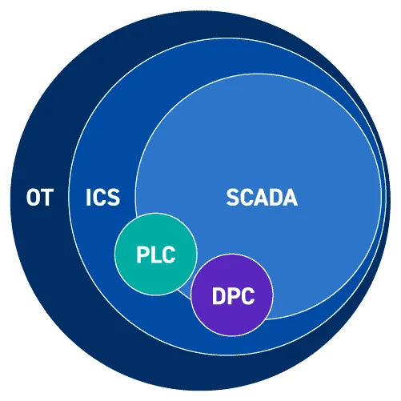
Image credited to <a href="https://h3des.medium.com/understanding-ics-and-scada-what-why-and-how-industrial-control-systems-work-7d704ceaa6d6" target="_blank">h3des.medium.com</a> `[2]`

As shown in the image, SCADA is part of the broader category of Industrial Control Systems (ICS). ICS includes SCADA, Distributed Control Systems (DCS), and Programmable Logic Controllers (PLC). SCADA systems are a subset of ICS used to monitor and control equipment in facilities such as power grids, pipelines, and water distribution. While the distinction between ICS and SCADA can be unclear, the key difference is that ICS emphasizes real-time process control, while SCADA focuses on data acquisition and remote control.

## Phase 1: BACnet

<details>
<summary>
<h3>What is BACnet?</h3>
</summary>
<p>
BACnet stands for Building Automation and Control Network and was developed by the American Society of Heating, Refrigerating, and Air-Conditioning Engineers (ASHRAE). It is now both an ANSI (American National Standards Institute) and ISO (International Organization for Standardization) standard. The standard is maintained by ASHRAE's SSPC-135 committee, which regularly introduces enhancements.

BACnet's primary goal is to enable building managers to use BACnet-compliant equipment from different vendors that can communicate using a common protocol. It is commonly used for HVAC controls, alarm notifications and monitoring, lighting controls, and elevator monitoring.

BACnet uses object modeling, where each object is defined by its properties — such as current temperature, setpoint temperature, system operational mode, and more.

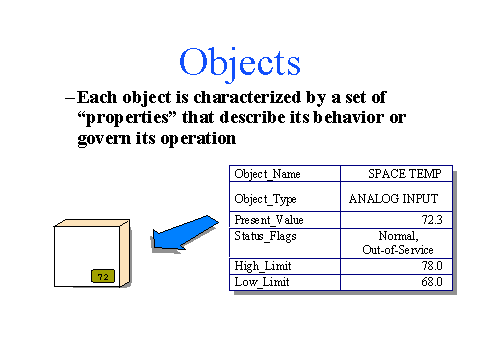

Image credited to <a href="https://BACnet.org" target="_blank">BACnet.org</a> `[3]`

**Knowledge Check Question 1**: *What is the body that controls the BACnet standard?*

**Knowledge Check Question 2**: *True/False: BACnet is an ANSI, but not an ISO standard.*

Next, use BACnet to disarm a security system and open the vehicle bay doors.

</p>
</details>

<details>
<summary>
<h3>BACnet Walk-through</h3>
</summary>
<p>

1. (**Ubuntu**) Log into the **Ubuntu** server, open Firefox, and browse to `http://10.7.7.10`.

2. (**Ubuntu, Firefox**) Log into the Scada Portal with:

 - **username:** `admin`
 - **password:** `admin`

3. Click **Hangar** to view the status of the BACnet server. Take note of the various values and statuses.

4. (**Ubuntu**) Next, use YABE (Yet Another BACnet Explorer). Open the **Yabe_v2.1.0** folder on the Desktop and double-click the **Yabe.exe** file.

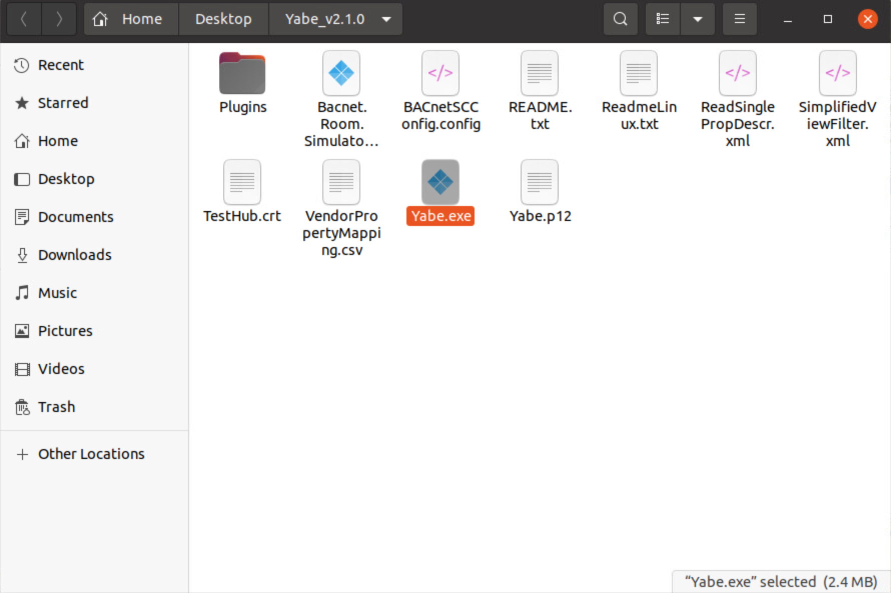

This opens the **YABE** window and the **BACnet Communication Channel** window.

5. (**Ubuntu, YABE**) Click **Start** under the **BACnet/IP V4 & V6 over UDP** section.

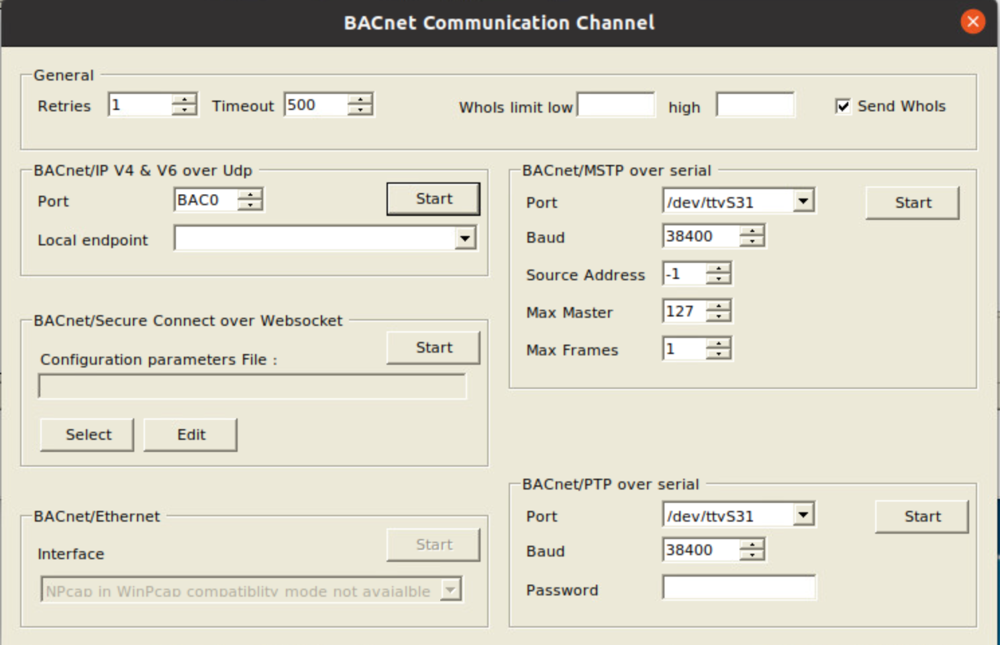

The communication window closes and you see devices **1001**, **2002**, and **3003** in the upper-left panel.

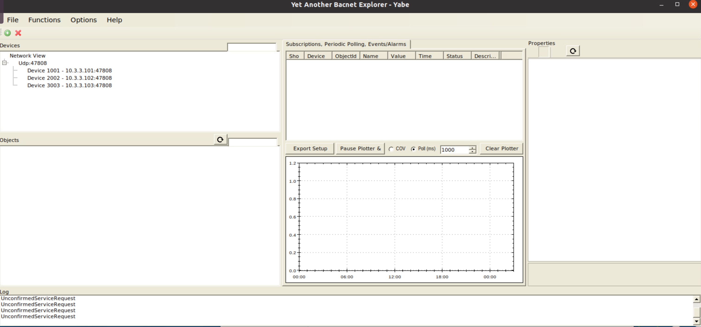

6. (**Ubuntu, YABE**) Explore the devices by clicking on their various *objects* to find controls for the alarm, garage door, and thermostat functions in this environment.

7. (**Ubuntu, YABE**) Under device **3003**, locate the **AlarmState** and **DisarmCode** objects in the lower-left panel. The **Present Value** of **Disarm Code** is `0` (look at **Properties** in the upper-right).

 - Replace the `0` in **Present Value** in the **DisarmCode** with the correct alarm code: `1985`.
 - Press **Enter**.
 - Check the new value of **Alarm State**. Its **Present Value** should now be `0`, which indicates the system is disarmed (as noted in the Description field above).

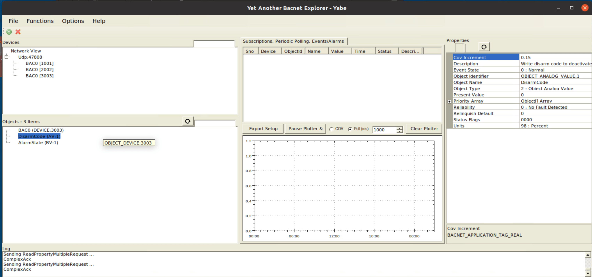

8. (**Ubuntu, YABE**) Open the bay doors to access the DeLorean (under device `1001`).

 - Change the **GarageDoorState**'s **Present Value** (upper-right panel) from `0` to `1` (`1` means "Open").
 - Press **Enter**.

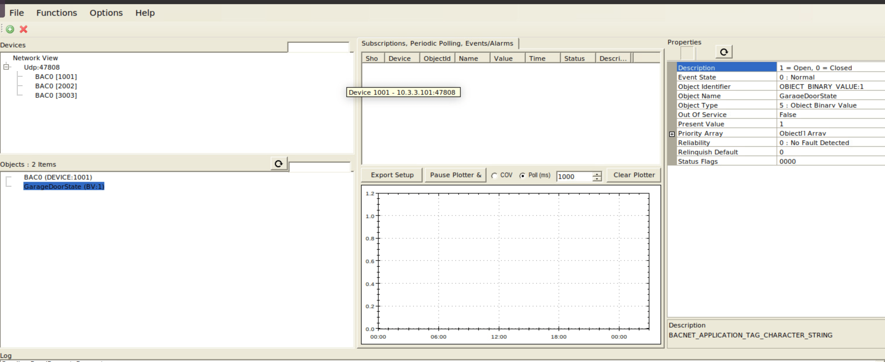

9. (**Ubuntu, Firefox**) On the SCADA Portal click **Hangar** to refresh the page and retrieve your token. Your token will be different than the one shown here.

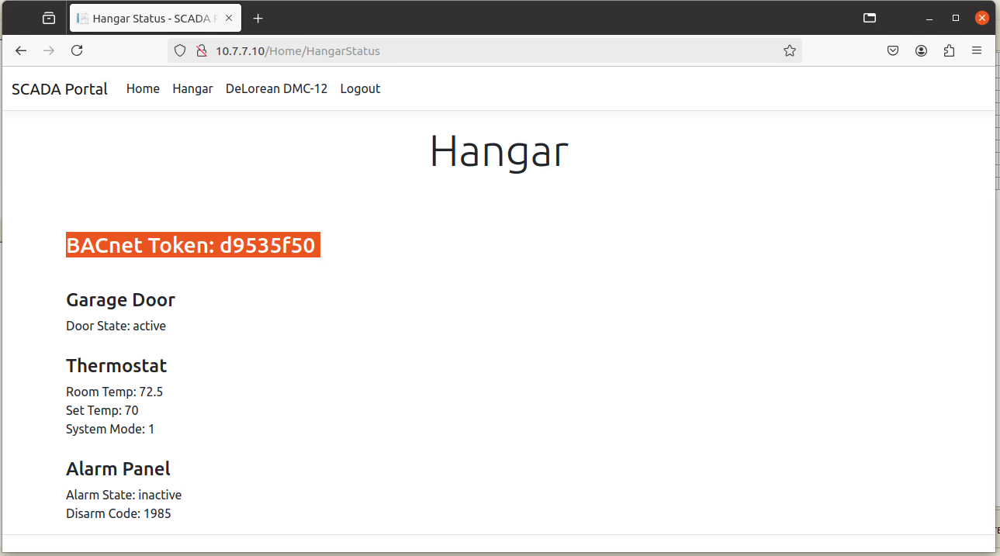

The updated values and statuses of the alarm and door indicate that the hangar door is open. You can take control of the DeLorean.

#### Grading Check

**Grading Check 1**: *What is the value of the BACnet token that is displayed on the Hangar web page?*

Copy the token or flag strings to the corresponding question submission field to receive credit. Complete all Phase 1 tasks before moving on to Phase 2.

</p>
</details>

## Phase 2: Modbus

<details>
<summary>
<h3>What is the Modbus Protocol?
</h3>
</summary>
<p>

According to the Modbus organization's web site (`modbus.org`): 

Modbus Protocol is a messaging structure developed by Modicon in 1979. It is used to establish client-server communication between intelligent devices. It is a de facto standard, truly open and the most widely used network protocol in the industrial manufacturing environment. It has been implemented by hundreds of vendors on thousands of different devices to transfer discrete/analog I/O and register data between control devices. It's a lingua franca or common denominator between different manufacturers. One report called it the "de facto standard in multi-vendor integration". Industry analysts have reported over 7 million Modbus nodes in North America and Europe alone. `[4]`

#### Where is Modbus used?

Modbus is used in multiple client-server applications to monitor and program devices; to communicate between intelligent devices and sensors and instruments; to monitor field devices using PCs and HMIs. Modbus is also an ideal protocol for RTU applications where wireless communication is required. For this reason, it is used in innumerable gas and oil and substation applications. But Modbus is not only an industrial protocol. Building, infrastructure, transportation and energy applications also make use of its benefits. `[4]`

#### What is the difference between BACnet and Modbus?

BACnet is a communication protocol typically used in commercial buildings' HVAC, lighting, and access control systems where devices are treated as objects with defined properties.

Modbus (originally Modicon Bus), on the other hand, is commonly used in industrial settings to communicate with equipment like Programmable Logic Controllers (PLCs).

BACnet is more object-oriented, organizing devices with higher-level properties. Modbus works at a lower level, directly reading and writing to registers and coils. You can think of Modbus like a low-level programming language (such as assembly) that interacts directly with memory, while BACnet is more like a high-level language (such as C# or Java) that organizes information into structured objects.

**Knowledge Check Question 3**: *While BACnet is typically used for building automation, Modbus is commonly utilized in ___________ settings. (Hint: It's the "I" in "ICS")*

**Knowledge Check Question 4**: *Modbus values are stored in ___________ and coils.*

Next, let's work with Modbus TCP traffic to operate the DeLorean.

</p>
</details>

<details>
<summary>
<h3>Modbus Walk-through</h3>
</summary>
<p>

#### Working with Modbus

In this section, we focus on Modbus TCP (also called Modbus TCP/IP), which transmits data over TCP/IP networks. This part of the lab uses the Kali terminal.

1. **(Kali, Terminal)** Run an `nmap` scan on the `10.3.3.0/24` network to look for common Modbus ports, such as `502`:

```bash
sudo nmap -sV 10.3.3.0/24 -p 1-1000
```

 - `-sV` detects the service version
 - `-p 1-1000` scans the first 1000 ports

From the results, note host `10.3.3.56`, which shows the well-known Modbus port `502` as open:

```bash
Nmap scan report for 10.3.3.56
Host is up (0.00072s latency).
Not shown: 997 filtered tcp ports (no-response)
PORT    STATE SERVICE   VERSION
502/tcp open  mbap?
503/tcp open  intrinsa?
504/tcp open  citadel?
```

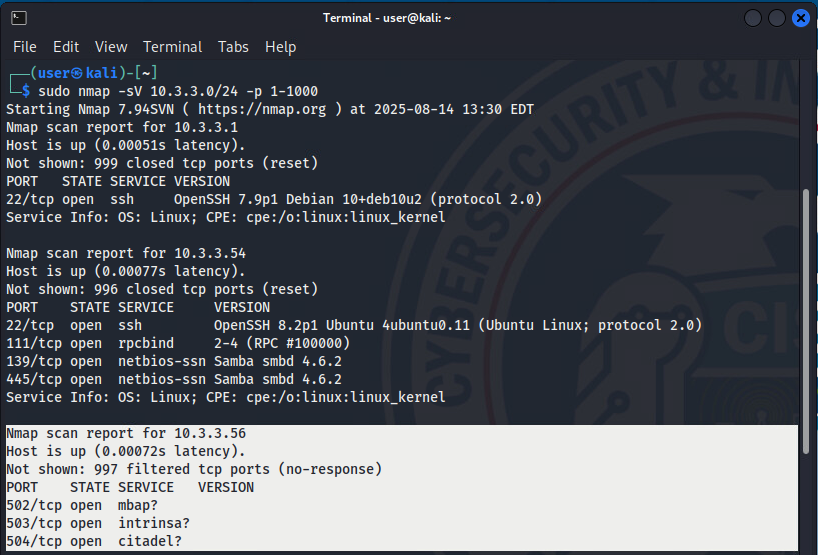

2. **(Kali, Terminal)** Use the `modbus-discover` script in `nmap` to gather details such as slave IDs, vendor name, and firmware information. Documentation for the script is available [here](https://nmap.org/nsedoc/scripts/modbus-discover.html).

Run the following command against `10.3.3.56`:

```bash
nmap -Pn -p 502 --script modbus-discover 10.3.3.56
```

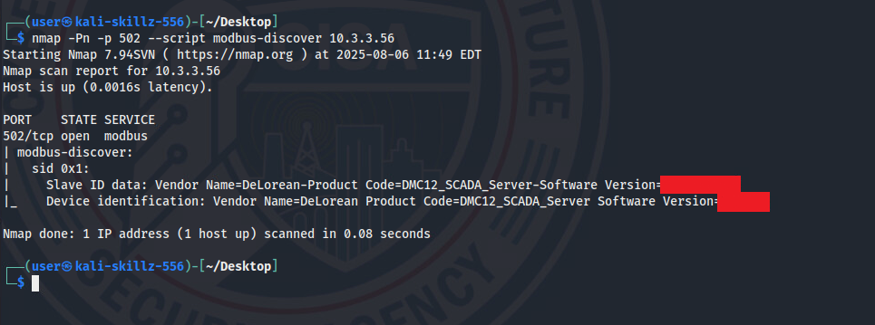

| &#128204; REMEMBER |
|---|
| Record the version number for the grading check at the end of this phase! |

3. **(Kali, Firefox)** Now that you have identified a Modbus server, capture network traffic by logging into pfSense: `https://pfsense.skills.hub`.

 - **username:** user
 - **password:** tartans

4. **(Kali, Firefox, pfSense)** Navigate to **Diagnostics**, **Packet Capture**.

5. **(Kali, Firefox, pfSense)** Select **LAN (em1)** from the **Captions Options** dropdown, set **Max number of packets to capture** to `0` (no limit), and click **Start**.

6. **(Kali, Firefox)** Open a new browser tab and navigate to `http://10.7.7.10` to view the SCADA Portal. Click **Login** and log in with:

 - **username:** admin
 - **password:** admin

7. **(Kali, Firefox)** Navigate to the **DeLorean DMC-12** tab and use the controls to manipulate the reactor temperature. Raise it until it exceeds 900; the Power value should reach 1.21 Gigawatts.

8. **(Kali, Firefox, pfSense)** Return to pfSense and click **Stop** to stop the packet capture.

9. **(Kali, Firefox, pfSense)** Click **Download** to save the captured pcap file to your local system (default is the **Downloads** folder).

10. **(Kali, Wireshark)** Double-click the downloaded pcap file to open it in Wireshark. View the Modbus traffic by entering `modbus` in the filter field.

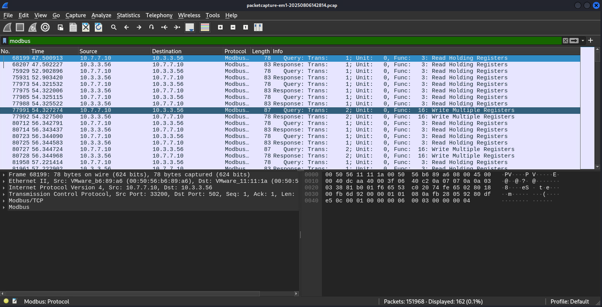

11. **(Kali, Wireshark)** Identify the relevant packets:
 - **Source IP:** 10.7.7.10
 - **Destination IP:** 10.3.3.56
 - **Info column:** `Write Multiple Registers`
 - Select one of the records that match these details for closer inspection.

12. **(Kali, Wireshark)** Expand the `Modbus` section of the packet details to examine Register 0 – Register 3. Compare these with the values on the DeLorean DMC-12 tab in the SCADA Portal:
 - **Register 1 = 75** is the remaining **Fuel** percentage
 - **Register 2 = 55** is the Speed (55 MPH)

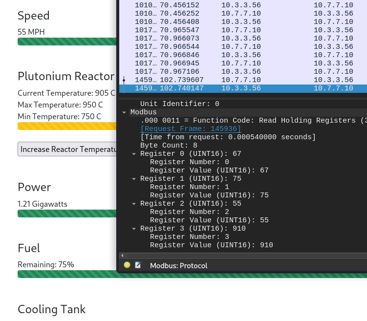

13. **(Kali, Terminal)** At the Kali terminal, use `ctmodbus` to interact with the Modbus server. Enter `ctmodbus`.

14. **(Kali, Terminal, ctmodbus)** In the `ctmodbus` window, enter `connect tcp 10.3.3.56:502` (use `Tab` to autocomplete).

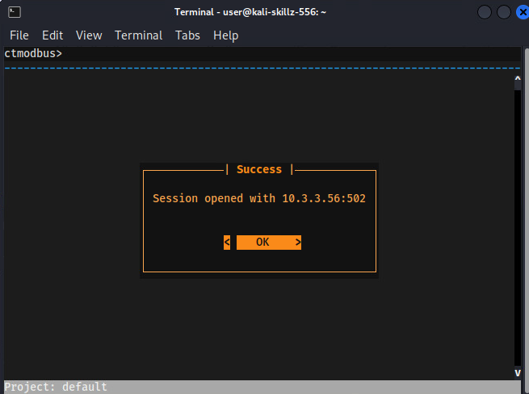

 - Press **Enter** to acknowledge the **OK** message.
 - **(Kali, Terminal, ctmodbus)** Enter `read holdingRegisters 0-3`. This corresponds to the registers seen in Wireshark.

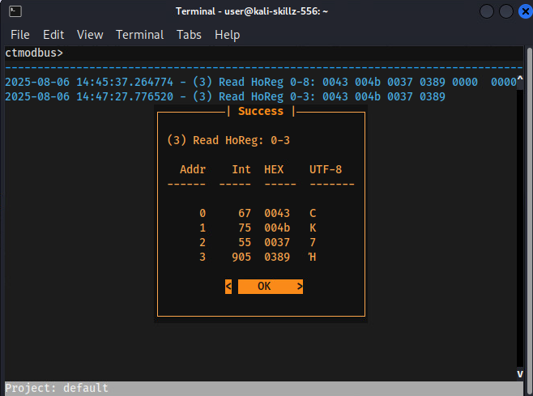

 - Press **Enter** to acknowledge the **OK** message and return to the `ctmodbus` command prompt.

15. **(Kali, Terminal, ctmodbus)** In the `ctmodbus` window, update the DeLorean registers to send the DeLorean back in time to prevent the APT's attack on critical infrastructure.

 - **Register 1 (fuel percentage):** Change the fuel percentage to a value greater than **80**. Enter `write register 1 85`, then press **Enter**.
 - **Register 2 (speed):** Change the speed to **88mph**. Enter `write register 2 88`, then press **Enter**.

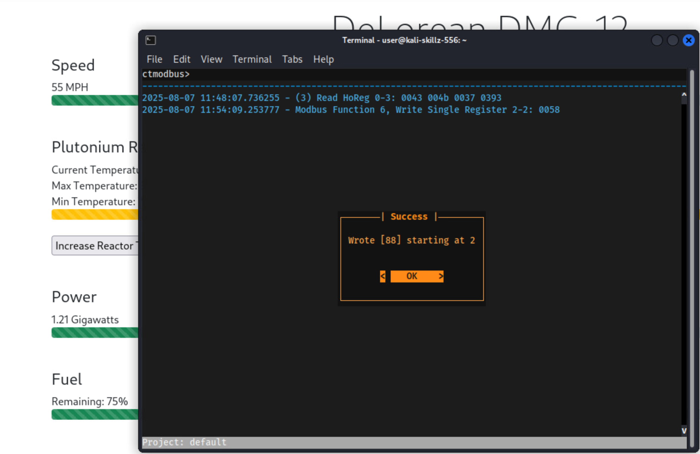

16. **(Kali, Firefox)** Verify values and obtain the token! Refresh the **DeLorean DMC-12** tab on the SCADA Portal web page and confirm the following values:
 - Speed = 88 MPH
 - Plutonium Reactor temperature = 901–950
 - Fuel percentage = 80–100

| &#128493; Recall |
|---|
| Please keep in mind that your token will be different than the one shown here. |

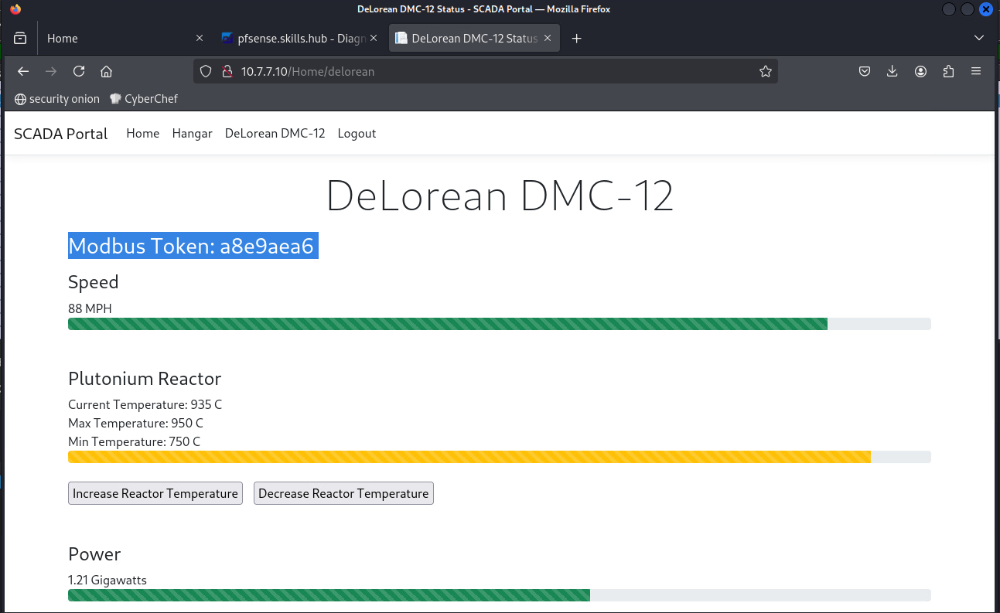

#### Grading Check

**Grading Check 2**: *Use Nmap to identify the software version of the Modbus server running on port 502 of the machine with an IP address of 10.3.3.56.*

**Grading Check 3**: *What is the value of the Modbus token that is displayed on the DeLorean web page?*

Copy and submit the token in the corresponding question submission field to receive credit.

| &#9888; WARNING |
|---|
| The lab concludes after you submit the final token. Please finish reading the Lab Wrap-up and Conclusion sections below before submitting the final token. |

</p>
</details>

## Lab Wrap-up

<details>
<summary>
<h3>Conclusion</h3>
</summary>
<p>

This lab provided hands-on experience with simulated SCADA systems. You were introduced to BACnet and Modbus, two different but related protocols used to interact with physical systems.

CISA provides additional <a href="https://www.cisa.gov/topics/industrial-control-systems" target="_blank">tools and guidance related to Industrial Control Systems</a>.

You are also encouraged to read about <a href="https://www.cisa.gov/resources-tools/resources/ics-recommended-practices" target="_blank">ICS Recommended Practices</a> and <a href="https://www.cisa.gov/resources-tools/programs/ics-training-available-through-cisa" target="_blank">ICS Training Available Through CISA</a>.

Be sure to check out the related lab titled *Network Segmentation with ICS/HMI* for more practice with network segmentation.

Skills exercised:

S0248: Skill in performing target system analysis
S0440: Skill in identifying target vulnerabilities
S0504: Skill in identifying vulnerabilities
S0544: Skill in recognizing vulnerabilities
S0667: Skill in assessing security controls

### References

- [1] <a href="https://www.fortinet.com/resources/cyberglossary/scada-and-scada-systems" target="_blank">Fortinet SCADA Definition</a>

- [2] <a href="https://h3des.medium.com/understanding-ics-and-scada-what-why-and-how-industrial-control-systems-work-7d704ceaa6d6" target="_blank">Understanding ICS and SCADA: What, Why, and How Industrial Control Systems Work</a>

- [3] <a href="https://BACnet.org" target="_blank">BACnet.org</a>

- [4] <a href="https://www.modbus.org/" target="_blank">modbus.org</a>

- [5] <a href="https://www.cisa.gov/news-events/cybersecurity-advisories/aa22-103a" target="_blank">APT Cyber Tools Targeting ICS/SCADA Devices</a>

- [6] <a href="https://www.securityweek.com/no-patch-for-flaw-exposing-hundreds-of-lg-cameras-to-remote-hacking" target="_blank">No Patch for Flaw Exposing Hundreds of LG Cameras to Remote Hacking</a>

- [7] <a href="https://www.cisa.gov/topics/industrial-control-systems" target="_blank">Industrial Control Systems</a>

- [8] <a href="https://www.cisa.gov/resources-tools/resources/guidance-and-strategies-protect-network-edge-devices" target="_blank">Guidance and Strategies to Protect Network Edge Devices</a>

- [9] <a href="https://www.cisa.gov/resources-tools/resources/primary-mitigations-reduce-cyber-threats-operational-technology" target="_blank">Primary Mitigations to Reduce Cyber Threats to Operational Technology</a>

- [10] <a href="https://www.cisa.gov/resources-tools/resources/ics-recommended-practices" target="_blank">ICS Recommended Practices</a>

- [11] <a href="https://www.cisa.gov/sites/default/files/documents/TSWG_Securing_SCADA_V1_Short.pdf" target="_blank">Securing Your SCADA and Industrial Control Systems</a>

- [12] <a href="https://www.cisa.gov/resources-tools/programs/ics-training-available-through-cisa" target="_blank">ICS Training Available Through CISA</a>

- [13] <a href="https://www.cisa.gov/resources-tools/resources/secure-demand-guide" target="_blank">Secure by Demand Guide: How Software Customers Can Drive a Secure Technology Ecosystem</a>

- [14] <a href="https://inl.gov/national-security/ics-celr/" target="_blank">IDAHO NATIONAL LABS: Controls Laboratory</a>

- [15] <a href="https://www.cisa.gov/news-events/cybersecurity-advisories" target="_blank">Cybersecurity Alerts & Advisories</a>

- [16] <a href="https://www.cisa.gov/resources-tools/resources/federal-civilian-executive-branch-fceb-operational-cybersecurity-alignment-focal-plan" target="_blank">Federal Civilian Executive Branch (FCEB) Operational Cybersecurity Alignment (FOCAL)</a>

- [17] <a href="https://niccs.cisa.gov/workforce-development/nice-framework" target="_blank">NICE Framework</a>

</p>
</details>

<details>
<summary>
<h3>Answer Key</h3>
</summary>
<p>

**Knowledge Check Question 1**: *What is the body that controls the BACnet standard? (Acronym)*

- *ASHRAE*

**Knowledge Check Question 2**: *True/False: BACnet is an ANSI, but not an ISO standard.*

- *F/false*

**Knowledge Check Question 3**: *While BACnet is typically used for building automation, Modbus is commonly utilized in ___________ settings. (Hint: It's the "I" in "ICS")*

- *industrial*

**Knowledge Check Question 4**: *Modbus value are stored in ___________ and coils.*

- *registers*

</p>
</details>

