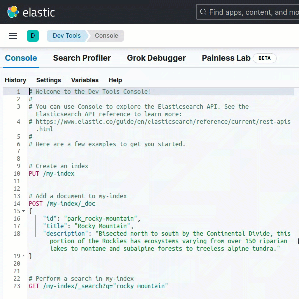
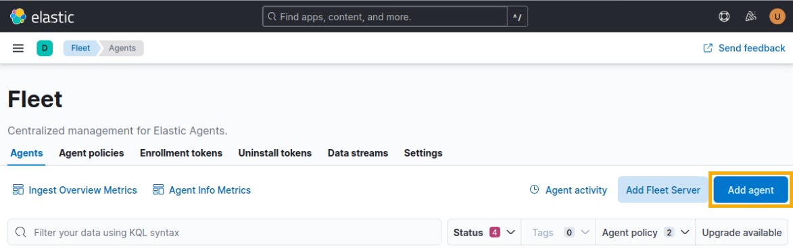
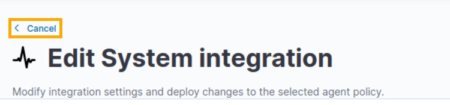
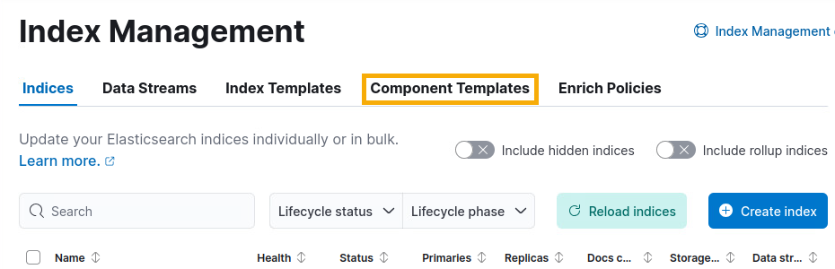

# Log Management Using Logging Made Easy

This lab introduces core concepts in log management, focusing on inventorying log sources and logging infrastructure, identifying gaps in logging, and creating Elastic policies to remediate the gaps. <a href="https://www.cisa.gov/resources-tools/services/logging-made-easy" target="_blank">CISA's Logging Made Easy (LME)</a> solution is used to provide the <a href="https://www.elastic.co/" target="_blank">Elastic</a> logging infrastructure.

| &#9201; LAB TIME |
|---|
| This lab is expected to take one (1) hour. |

*Please consider filling out the lab feedback survey at the bottom of your screen. The survey is available to you at any time while conducting the lab.*

| &#9888; CAUTION |
|---|
| You must complete _all_ phases of the lab and mini-challenge to receive your completion certificate. We encourage you to attempt the mini-challenge on your own, but a link to the solution guide is available in the Mini-Challenge section of the lab document if you need it. |

## Learning Objectives
- Identify log sources on an Ubuntu operating system
- Examine default configurations on an Elastic server
- Identify gaps between existing and required logging state
- Implement a logging strategy to mitigate gaps in log collection

## Learner Expectations
- Be comfortable with command-line operations
- Have familiarity with log generation and log sources

## FOCAL and NICE Framework Mappings
This lab maps with <a href="https://www.cisa.gov/resources-tools/resources/federal-civilian-executive-branch-fceb-operational-cybersecurity-alignment-focal-plan" target="_blank">Federal Civilian Executive Branch (FCEB) Operational Cybersecurity Alignment (FOCAL)</a> area 5 (incident detection and response) by enabling an organization to detect and respond to threats through log collection and correlation.

**NICE Work Role**
- <a href="https://niccs.cisa.gov/workforce-development/nice-framework" target="_blank">Systems Security Analysis</a>

**NICE Tasks**
- <a href="https://niccs.cisa.gov/workforce-development/nice-framework" target="_blank">T1077</a>: Assess the organization's cybersecurity architecture.
- <a href="https://niccs.cisa.gov/workforce-development/nice-framework" target="_blank">T1264</a>: Identify gaps in security architecture.

<!-- cut -->

## Scenario
In this lab you examine log sources and logging infrastructure to identify gaps between what is currently being logged and what is required to be logged. You implement configuration changes to resolve these gaps and meet the logging requirements of the organization.

| &#9888; NOTE |
|---|
| Every organization has different logging needs and requirements. The intent of this lab is not to offer a "one size fits all" method but rather give actionable guidance to establish or enhance log management. |

## System Tools and Credentials

| system | IP address | operating system |  username | password |
|--------|---------|-----------|----------| ----- |
| webserver | 10.1.1.10 | Ubuntu | user | tartans|
| mini-challenge-ubuntu | 10.2.2.10 | Ubuntu | user | tartans |
| lme-server | 10.4.4.10 | Ubuntu | user | tartans |

## Applications
| Application | URL | Username | Password |
| --- | --- | --- | --- |
| Elastic | `https://elastic.skills.lab` | user | tartans |

| &#8987; IT CAN TAKE UP TO FIVE (5) MINUTES FOR ELASTIC TO FULLY START. |
| --- |
| If you see a "502 Bad Gateway" or "Timeout" page when accessing Elastic, please wait a few minutes and then refresh the page. |

## Phase 1

<details>
<summary>
<h3>Definitions</h3>
</summary>
<p>

- **Log** - a record of events occurring within an organization's computing assets, including physical and virtual platforms, networks, services, and cloud environments. [3]
- **Log Management** - a process for generating, transmitting, storing, accessing, and disposing of log data. [3]
- **Log Source** - a computing asset, such as an operating system, container, application, etc., capable of generating cybersecurity log entries. [3]
- **Log Type** - a description of the purpose and format of the log data.

</p>
</details>

<details>
<summary>
<h3>Inventorying Systems</h3>
</summary>
<p>

1. Open the `webserver` console.

2. (**Webserver**) Open a Terminal by clicking on the Terminal shortcut in the left launcher.

    

3. (**Webserver**, **Terminal**) Since nothing beyond the operating system (Ubuntu) is known, gather some preliminary information to learn more about the system. Do this by typing the following commands and pressing <kbd>Enter</kbd>, one at a time:

    ```bash
    hostname

    hostname -I | awk '{print $1}'

    lsb_release -d

    uname -r
    ```

    Command Breakdown:
    - `hostname` - Prints (displays) the name of the system in the Terminal.
    - `hostname -I | awk '{print $1}'` - The first part of the command, `hostname -I`, returns all IP addresses assigned to the system. The output of that command is sent to the second part of the command using `|`. The command `awk '{print $1}'` prints (displays) to the Terminal the first field from the previous command.
    - `lsb_release -d` - Prints (displays) to the Terminal specific information about the Linux distribution. The `-d` option provides a description of the currently installed distribution.
    - `uname -r` - The `uname` command is used to print (display) system information. Using the `-r` option shows specifically the current kernel release.


    | &#128204; Leave the terminal open. We use it again in a later step. |
    | ---|

4. (**Webserver**) Open Visual Studio Code by clicking on the Visual Studio Code shortcut in the left launcher.

    

5. (**Webserver**, **Visual Studio Code**) In the Menu bar, click **File** > **New Text File** to open a blank text file. Use this text file to record information about the system.

6. (**Webserver**, **Visual Studio Code**) In the file, click **Select a language**.

    

7. (**Webserver**, **Visual Studio Code**) In the Search box, locate **Markdown** and click on it to select.

    

| &#128736; WHAT IS MARKDOWN? |
|---|
| Markdown is a lightweight markup language used for formatting text. It is widely used for writing documentation because it is easy to read and easy to write. In fact, this guide is written in Markdown! By using symbols to define formatting it provides a simple way to structure text without the need for formatting tools. |

8. (**Webserver**, **Visual Studio Code**)  Create a log source inventory document by copying the outputs from the Terminal into the Markdown file. This is the start of your documentation of the `webserver` system.

    ```markdown
    # System Information
    - **Hostname**: webserver
    - **IP Address**: 10.1.1.10
    - **OS Version**: Ubuntu 20.04.6 LTS
    - **Kernel Version**: 5.15.0-122-generic
    ```

9. (**Webserver**, **Terminal**) Return to the Terminal window. With basic information about the system documented, begin to examine installed services using `systemctl`. Identify active service units by entering the below command. Enter the sudo password `tartans` when prompted.

    ```bash
    sudo systemctl list-unit-files --type=service
    ```

| &#128736; WHAT IS `systemctl`? |
| --- |
| `systemctl` controls `systemd`. Systemd is a system and service manager for Linux operating systems. |

10. (**Webserver**, **Terminal**) Exit the service units display by pressing <kbd>Ctrl</kbd>+<kbd>c</kbd>.

11. (**Webserver**, **Terminal**) What services are part of a base Ubuntu Desktop installation and which are added? To make the installed services easier to review, run the same `systemctl` command. This time use `>` to redirect the output to a text file named "current-services.txt":

    ```bash
    sudo systemctl list-unit-files --type=service > /home/user/Desktop/current-services.txt
    ```

12. (**Webserver**) Open Firefox by clicking on the Firefox shortcut in the left launcher.

    

13. (**Webserver**, **Firefox**) Browse to `https://skills.hub/lab/files` or click **Hosted Files** from the Skills Hub landing page.

    

14. (**Webserver**, **Firefox**) Download the file "fresh-os-services.txt" by clicking the file name.

    | &#129513; The "fresh-os-services.txt" file was created by running the same `systemctl` command on an system that just had Ubuntu installed on it. This provides a baseline of services expected as part of a normal installation. In the following steps, we compare these two files. The differences between the two files highlight what services have been added to the `webserver` system. |
    | --- |

15. (**Webserver**, **Terminal**) Return to the Terminal. Use `mv` to move the downloaded file to the Desktop by entering the command:

    ```bash
    mv /home/user/Downloads/fresh-os-services.txt /home/user/Desktop/
    ```

16. (**Webserver**, **Terminal**) Use `diff` to compare the two files by entering the command:

    ```bash
    diff /home/user/Desktop/fresh-os-services.txt /home/user/Desktop/current-services.txt
    ```

| &#128270; WHAT DOES *THAT* COMMAND DO? |
|---|
| Encountered a command you are not familiar with? Linux systems have a built-in reference manual you can access from the Terminal. Simply type `man` followed by the name of the program, utility, or function you want to look up. For example, `man diff` will open the manual page for `diff` and give you information about the command and available options. Not everything has a manual page, but it is a good place to start whenever you have a question about a command. |

17. (**Webserver**, **Terminal**) Review the output. The `<` and `>` operators show if differing content is in the first file or second file. Here a majority of the differing content is present in the "current-services.txt" file and shows what services have been added. They are Apache, Auditd, and Elastic.

    ```bash
    user@webserver:~$ diff /home/user/Desktop/fresh-os-services.txt /home/user/Desktop/current-services.txt
    7a8,11
    > apache-htcacheclean.service                disabled        enabled
    > apache-htcacheclean@.service               disabled        enabled
    > apache2.service                            enabled         enabled
    > apache2@.service                           disabled        enabled
    14a19
    > auditd.service                             enabled         enabled
    52a58,59
    > elastic-agent.service                      enabled         enabled
    > ElasticEndpoint.service                    enabled         enabled
    242c249
    < 239 unit files listed.
    ---
    > 246 unit files listed.
    ```

18. (**Webserver**, **Visual Studio Code** ) Return to your log source inventory document in Visual Studio Code and add:

    ```markdown
    - **Services**: Apache, Auditd, Elastic Agent
    ```

</p>
</details>

<details>
<summary>
<h3>Local System Logging Configurations</h3>
</summary>
<p>

1. (**Webserver**, **Terminal**) Ubuntu uses `rsyslog` for local system logging. Return to the Terminal window and examine the current logging configuration by entering the command:

    ```bash
    cat -n /etc/rsyslog.conf
    ```

| &#128270; INFORMATION |
| --- |
| The `cat` command is short for concatenate. It is a Linux command used for displaying the contents of a file. Adding `-n` or `--number` to the `cat` command will number all output lines. We use it here to make any referenced configurations easier to locate. |

2. (**Webserver**, **Terminal**) Examining the output, take note of the following:
    - There are no configurations in the file for sending the logs to a remote syslog server.
    - On line 6 the comment directs us to `/etc/rsyslog.d/50-default.conf` for the default logging configurations.
    - On line 59 the configuration tells us that the files in `/etc/rsyslog.d/` are included in the `rsyslog` configuration.

    ```conf
    1	# /etc/rsyslog.conf configuration file for rsyslog
    2	#
    3	# For more information install rsyslog-doc and see
    4	# /usr/share/doc/rsyslog-doc/html/configuration/index.html
    5	#
    6	# Default logging rules can be found in /etc/rsyslog.d/50-default.conf
    7
    8
    9	#################
    10	#### MODULES ####
    11	#################
    12
    13	module(load="imuxsock") # provides support for local system logging
    14	#module(load="immark")  # provides --MARK-- message capability
    15
    16	# provides UDP syslog reception
    17	#module(load="imudp")
    18	#input(type="imudp" port="514")
    19
    20	# provides TCP syslog reception
    21	#module(load="imtcp")
    22	#input(type="imtcp" port="514")
    23
    24	# provides kernel logging support and enable non-kernel klog messages
    25	module(load="imklog" permitnonkernelfacility="on")
    26
    27	###########################
    28	#### GLOBAL DIRECTIVES ####
    29	###########################
    30
    31	#
    32	# Use traditional timestamp format.
    33	# To enable high precision timestamps, comment out the following line.
    34	#
    35	$ActionFileDefaultTemplate RSYSLOG_TraditionalFileFormat
    36
    37	# Filter duplicated messages
    38	$RepeatedMsgReduction on
    39
    40	#
    41	# Set the default permissions for all log files.
    42	#
    43	$FileOwner syslog
    44	$FileGroup adm
    45	$FileCreateMode 0640
    46	$DirCreateMode 0755
    47	$Umask 0022
    48	$PrivDropToUser syslog
    49	$PrivDropToGroup syslog
    50
    51	#
    52	# Where to place spool and state files
    53	#
    54	$WorkDirectory /var/spool/rsyslog
    55
    56	#
    57	# Include all config files in /etc/rsyslog.d/
    58	#
    59	$IncludeConfig /etc/rsyslog.d/*.conf
    ```

3. (**Webserver**, **Terminal**) Examine the default logging configuration file by entering the command:

    ```bash
    cat -n /etc/rsyslog.d/50-default.conf
    ```

4. (**Webserver**, **Terminal**) Examining the output, take note of:
    - Line 8, 9, 12, 14, and 23: For the logging enabled, the logs are sending to `/var/log/`. This is the default logging location for Ubuntu. Logs are not stored in another directory based on this configuration.
    - Lines that begin with `#` are commented out meaning those configurations are not currently active in this configuration file.

    ```conf
    1	#  Default rules for rsyslog.
    2	#
    3	#			For more information see rsyslog.conf(5) and /etc/rsyslog.conf
    4
    5	#
    6	# First some standard log files.  Log by facility.
    7	#
    8	auth,authpriv.*			/var/log/auth.log
    9	*.*;auth,authpriv.none		-/var/log/syslog
    10	#cron.*				/var/log/cron.log
    11	#daemon.*			-/var/log/daemon.log
    12	kern.*				-/var/log/kern.log
    13	#lpr.*				-/var/log/lpr.log
    14	mail.*				-/var/log/mail.log
    15	#user.*				-/var/log/user.log
    16
    17	#
    18	# Logging for the mail system.  Split it up so that
    19	# it is easy to write scripts to parse these files.
    20	#
    21	#mail.info			-/var/log/mail.info
    22	#mail.warn			-/var/log/mail.warn
    23	mail.err			/var/log/mail.err
    24
    25	#
    26	# Some "catch-all" log files.
    27	#
    28	#*.=debug;\
    29	#	auth,authpriv.none;\
    30	#	news.none;mail.none	-/var/log/debug
    31	#*.=info;*.=notice;*.=warn;\
    32	#	auth,authpriv.none;\
    33	#	cron,daemon.none;\
    34	#	mail,news.none		-/var/log/messages
    35
    36	#
    37	# Emergencies are sent to everybody logged in.
    38	#
    39	*.emerg				:omusrmsg:*
    40
    41	#
    42	# I like to have messages displayed on the console, but only on a virtual
    43	# console I usually leave idle.
    44	#
    45	#daemon,mail.*;\
    46	#	news.=crit;news.=err;news.=notice;\
    47	#	*.=debug;*.=info;\
    48	#	*.=notice;*.=warn	/dev/tty8
    ```

5. (**Webserver**, **Terminal**) Navigate to the `rsyslog.d` directory by entering the command:

    ```bash
    cd /etc/rsyslog.d/
    ```

6. (**Webserver**, **Terminal**) Check for additional syslog configuration files by using `ls` to list the contents of the directory.

    ```bash
    user@webserver:/etc/rsyslog.d$ ls
    20-ufw.conf  50-default.conf
    ```

7. (**Webserver**, **Terminal**) There are two configuration files in the directory. You examined `50-default.conf`. Now, open the `20-ufw.conf` configuration file by entering the command:

    ```bash
    cat -n 20-ufw.conf
    ```

8. (**Webserver**, **Terminal**) Only line 2 is uncommented. Any kernel messages that contain "UFW" are sent to `/var/log/ufw.log`.

    ```conf
    1	# Log kernel generated UFW log messages to file
    2	:msg,contains,"[UFW " /var/log/ufw.log
    3
    4	# Uncomment the following to stop logging anything that matches the last rule.
    5	# Doing this will stop logging kernel generated UFW log messages to the file
    6	# normally containing kern.* messages (eg, /var/log/kern.log)
    7	#& stop
    ```

| &#128270; WHAT IS UFW? |
|---|
| Uncomplicated Firewall (UFW) is a user-friendly command-line interface for managing iptables firewall rules on Linux systems. It simplifies the process of configuring a system firewall to manage network traffic, enhancing system security. |

9. (**Webserver**, **Terminal**) Navigate to the default Ubuntu logs directory by entering the command:

    ```bash
    cd /var/log/
    ```

10. (**Webserver**, **Terminal**) Use the `ls` command to list the directories and files present in the `/var/log/` directory. Multiple logs are listed. Below is a list of notable logs. Take a few minutes to research logs you are not familiar with. Focus on what process creates the logs and what information the logs contain.

| Name | Description |
| --- | --- |
| apache2 directory | Contains Apache web server logs |
| audit directory | Contains Auditd logs |
| auth.log | Tracks authentication events (logins, `sudo` usage, SSH authentication attempts) |
| kern.log | Detailed messages from the Ubuntu Linux kernel |
| syslog | The system log containing messages on system services and daemons |

</p>
</details>

<details>
<summary>
<h3>Local System Log Management</h3>
</summary>
<p>

Log files consume disk space. To prevent storage from filling to capacity, local system logs must be managed. Logrotate is a utility that automates the local management of log files by rotating, compressing, and deleting log files. We will be examining the configurations that control these actions to understand the log management taking place on the local system.

1. (**Webserver**, **Terminal**) Check the global log rotation configuration using the command:

    ```bash
    cat -n /etc/logrotate.conf
    ```

2. (**Webserver**, **Terminal**) Examining the output, take note of the following:
    - Line 3: Log files are rotated weekly.
    - Line 10: Keep four (4) rotated log files. Since rotation is weekly, this keeps about four (4) weeks' worth of logs.
    - Line 22: Package log rotation configuration files are placed in `/etc/logrotate.d`.

    ```conf
    1	# see "man logrotate" for details
    2	# rotate log files weekly
    3	weekly
    4
    5	# use the adm group by default, since this is the owning group
    6	# of /var/log/syslog.
    7	su root adm
    8
    9	# keep 4 weeks worth of backlogs
    10	rotate 4
    11
    12	# create new (empty) log files after rotating old ones
    13	create
    14
    15	# use date as a suffix of the rotated file
    16	#dateext
    17
    18	# uncomment this if you want your log files compressed
    19	#compress
    20
    21	# packages drop log rotation information into this directory
    22	include /etc/logrotate.d
    23
    24	# system-specific logs may be also be configured here.
    ```

3. (**Webserver**, **Terminal**) Change to the logrotate configuration directory (`logrotate.d`) using the command:

    ```bash
    cd /etc/logrotate.d
    ```

4. (**Webserver**, **Terminal**) List the directory contents using the `ls` command. These are configuration files used by logrotate to manage the rotation of specific log files for individual services or packages.

    ```bash
    user@webserver:/etc/logrotate.d$ ls
    alternatives  bootlog      ppp                ubuntu-pro-client
    apache2       btmp         rsyslog            ufw
    apport        cups-daemon  samba              unattended-upgrades
    apt           dpkg         speech-dispatcher  wtmp
    ```

5. (**Webserver**, **Terminal**) Check the log rotation configurations of `apache` by entering the command:

    ```bash
    cat -n apache2
    ```

6. (**Webserver**, **Terminal**) These are the configurations specific to `apache`. Examining the output, take note of the following:
    - Line 1: This configuration file handles any files that end in ".log" in the `/var/log/apache2/` directory.
    - Line 2: Rotate logs once per day.
    - Line 4: Keep 14 log files. After 14, the oldest log file(s) are deleted.
    - Line 5: Compress logs files after they are rotated.
    - Line 6: The compression is delayed meaning the current active log and the most recently rotated log both remain uncompressed. Logs after this are compressed.

    ```conf
    1	/var/log/apache2/*.log {
    2		daily
    3		missingok
    4		rotate 14
    5		compress
    6		delaycompress
    7		notifempty
    8		create 640 root adm
    9		sharedscripts
    10		postrotate
    11	                if invoke-rc.d apache2 status > /dev/null 2>&1; then \
    12	                    invoke-rc.d apache2 reload > /dev/null 2>&1; \
    13	                fi;
    14		endscript
    15		prerotate
    16			if [ -d /etc/logrotate.d/httpd-prerotate ]; then \
    17				run-parts /etc/logrotate.d/httpd-prerotate; \
    18			fi; \
    19		endscript
    20	}
    ```

7. (**Webserver**, **Terminal**) Check the log rotation configurations of `rsyslog` by entering the command:

    ```bash
    cat -n /etc/logrotate.d/rsyslog
    ```

8. (**Webserver**, **Terminal**) These are the configurations specific to `rsyslog`. Examine the output and take note of the following:
    - The configuration on lines 2-12 applies to `/var/log/syslog`.
        - Some notable differences from the global logrotate configuration are that the logs are rotated daily and 7 rotated log files are kept.
    - The configurations on lines 26-37 apply to the other logs managed by `rsyslog`.

    ```conf
    1	/var/log/syslog
    2	{
    3		rotate 7
    4		daily
    5		missingok
    6		notifempty
    7		delaycompress
    8		compress
    9		postrotate
    10			/usr/lib/rsyslog/rsyslog-rotate
    11		endscript
    12	}
    13
    14	/var/log/mail.info
    15	/var/log/mail.warn
    16	/var/log/mail.err
    17	/var/log/mail.log
    18	/var/log/daemon.log
    19	/var/log/kern.log
    20	/var/log/auth.log
    21	/var/log/user.log
    22	/var/log/lpr.log
    23	/var/log/cron.log
    24	/var/log/debug
    25	/var/log/messages
    26	{
    27		rotate 4
    28		weekly
    29		missingok
    30		notifempty
    31		compress
    32		delaycompress
    33		sharedscripts
    34		postrotate
    35			/usr/lib/rsyslog/rsyslog-rotate
    36		endscript
    37	}
    ```

9. (**Webserver**, **Terminal**) Recall that Auditd is installed on the system, but there is not a log rotation configuration file for it. This is because Auditd log rotation is handled by the agent. Open the `auditd.conf` file by entering the below command. Enter the sudo password `tartans` when prompted.

    ```bash
    sudo cat -n /etc/audit/auditd.conf
    ```

10. (**Webserver**, **Terminal**) Examine the output and take note of the following:
    - Line 7: The Log file for Auditd is located at `/var/log/audit/audit.log`
    - Line 12: The `max_log_file` is eight (8) megabytes. When a log file reaches this maximum, `max_log_file_action` is triggered.
    - Line 19: The `max_log_file_action` is set to "ROTATE". When the action is triggered, the logs will be rotated.
    - Line 13: The `num_logs` is set to five (5). This is the number of log files to keep when the `max_log_file_action` is triggered.

    ```conf
    1	#
    2	# This file controls the configuration of the audit daemon
    3	#
    4
    5	local_events = yes
    6	write_logs = yes
    7	log_file = /var/log/audit/audit.log
    8	log_group = adm
    9	log_format = RAW
    10	flush = INCREMENTAL_ASYNC
    11	freq = 50
    12	max_log_file = 8
    13	num_logs = 5
    14	priority_boost = 4
    15	disp_qos = lossy
    16	dispatcher = /sbin/audispd
    17	name_format = NONE
    18	##name = mydomain
    19	max_log_file_action = ROTATE
    20	space_left = 75
    21	space_left_action = SYSLOG
    22	verify_email = yes
    23	action_mail_acct = root
    24	admin_space_left = 50
    25	admin_space_left_action = SUSPEND
    26	disk_full_action = SUSPEND
    27	disk_error_action = SUSPEND
    28	use_libwrap = yes
    29	##tcp_listen_port = 60
    30	tcp_listen_queue = 5
    31	tcp_max_per_addr = 1
    32	##tcp_client_ports = 1024-65535
    33	tcp_client_max_idle = 0
    34	enable_krb5 = no
    35	krb5_principal = auditd
    36	##krb5_key_file = /etc/audit/audit.key
    37	distribute_network = no
    ```

| &#9888; WHAT ABOUT THE ELASTIC AGENT? |
| --- |
| The Elastic Agent was installed using Fleet. This allowed it to have immediate access to the Elastic server. Log files from the Elastic Agent are sent to the Fleet Server where they can be viewed. The log files also provide information about the health of the agent allowing agents in an unhealthy state to be quickly identified. While log files for the Elastic Agent do exist locally, the recommended way to view Elastic Agent logs is within Fleet. |

</p>
</details>

<details>
<summary>
<h3>Log Source Inventory Documentation</h3>
</summary>
<p>

(**Webserver**, **Visual Studio Code** ) Return to your log source inventory document in Visual Studio Code and add the log sources information:

```markdown
## Log Sources:

| Log Source | Log Type | Log File Location | Local Retention Policy |
| --- | --- | --- | --- |
| Application Logs | Access Logs | `/var/log/apache2/access.log` | 14 days |
| Application Logs | Error Logs | `/var/log/apache2/error.log` | 14 days |
| Security Logs | Audit Logs | `/var/log/audit/audit.log` | Variable |
| Authentication Logs | Authentication logs | `var/log/auth.log` | 28 days |
| Kernel Logs | Kernel Events | `/var/log/kern.log` | 28 days |
| System Logs | Syslog | ` /var/log/syslog` | 7 days |
```

Documenting information you identified about the `webserver` system makes it easier to reference later when you meet with stakeholders to discuss logging requirements. Your log source inventory document should now look like the following:

```markdown
# System Information
- **Hostname**: webserver
- **IP Address**: 10.1.1.10
- **OS Version**: Ubuntu 20.04.6 LTS
- **Kernel Version**: 5.15.0-122-generic
- **Services**: Apache, Auditd, Elastic Agent

## Log Sources:

| Log Source | Log Type | Log File Location | Local Retention Policy |
| --- | --- | --- | --- |
| Application Logs | Access Logs | `/var/log/apache2/access.log` | 14 days |
| Application Logs | Error Logs | `/var/log/apache2/error.log` | 14 days |
| Security Logs | Audit Logs | `/var/log/audit/audit.log` | Variable |
| Authentication Logs | Authentication logs | `var/log/auth.log` | 28 days |
| Kernel Logs | Kernel Events | `/var/log/kern.log` | 28 days |
| System Logs | Syslog | ` /var/log/syslog` | 7 days |
```

</p>
</details>

<details>
<summary>
<h3>Grading Check</h3>
</summary>
<p>

1. (**Webserver**, **Firefox**) Browse to `https://skills.hub/lab/tasks` or click **Tasks** from the Skills Hub landing page.

2. (**Webserver**, **Firefox**, **Skills Hub Tasks**) Review the two (2) task knowledge check questions.
    - **Knowledge Check 1**: Which log file tracks logins, SSH authentication attempts, and use of sudo?
    - **Knowledge Check 2**: Multiple Choice - What is log management?

3. (**Webserver**, **Firefox**, **Skills Hub Tasks**) Type your answers in the submission fields and click **Submit** to check your answers.

4. (**Webserver**, **Firefox**, **Skills Hub Grading Results**) A correct answer provides a "Result" token. Copy this eight (8) character hex token into the corresponding question submission field to receive credit.

*Complete all Phase 1 tasks before moving on to Phase 2.*

</p>
</details>

## Phase 2

<details>
<summary>
<h3>Update Logging Infrastructure Inventory</h3>
</summary>
<p>

Logging infrastructure encompasses the hardware, software, systems, services, and networks used to receive, store, analyze, and dispose of log data generated by the log sources. The core of the logging infrastructure in this environment is <a href="https://www.cisa.gov/resources-tools/services/logging-made-easy" target="_blank">CISA's Logging Made Easy (LME)</a> platform. It is a no cost, open source platform designed to help small to medium-sized organizations secure their infrastructure. It does this by centralizing log collection, enhancing threat detection, and enabling real-time alerting. At its core LME runs Elastic. During installation, Ansible is used to install Elasticsearch, Kibana, ElastAlert, and Wazuh as containers on an Ubuntu server. This automation reduces the amount of user interaction required to get the service running.

Document the logging infrastructure by finding the same system information you found for the log sources. This has already been completed so you can focus on additional inventory tasks. Open a new Markdown file in Visual Studio Code and copy the content below to start your logging infrastructure inventory document.

```markdown
# System Information
- **Hostname**: lme-server
- **IP Address**: 10.4.4.10
- **OS Version**: Ubuntu 22.04.5 LTS
- **Kernel Version**: 5.15.0-131-generic
- **Services**: Elastic Agent, Elasticsearch, Elastalert, Wazuh, Kibana, FleetServer
```

</p>
</details>

<details>
<summary>
<h3>Elastic Infrastructure</h3>
</summary>
<p>

1. If not still open, connect to the `webserver` console.

2. (**Webserver**) Open Firefox by clicking on the Firefox shortcut in the left launcher.

    

3. (**Webserver**, **Firefox**) Enter the URL `https://elastic.skills.hub`.

4. (**Webserver**, **Firefox**) Enter the username `user` and password `tartans` to connect to Elastic.

    

5. (**Webserver**, **Firefox**, **Elastic**) In the upper left, click &#9776; to open a menu.

    

6. (**Webserver**, **Firefox**, **Elastic**) In the left menu, expand **Management** and click **Dev Tools**.

    

7. (**Webserver**, **Firefox**, **Elastic**) If not selected, click **Console**.

    

8. (**Webserver**, **Firefox**, **Elastic**, **Console**) Delete the welcome text and example commands from the Console.

    

9. (**Webserver**, **Firefox**, **Elastic**, **Console**) Gather more information about the Elastic node by entering the command:

    ```bash
    GET /_nodes
    ```

10. (**Webserver**, **Firefox**, **Elastic**, **Console**) Click &#9655; to send the request and run the command.

    

11. (**Webserver**, **Firefox**, **Elastic**, **Console**) This command returns all attributes and settings for the Elastic cluster nodes. Some key points to focus on are:
    - Line 3: There is only a single node in this cluster.
    - Line 7: "LME" is the cluster name.
    - Line 10: "lme-elasticsearch" is the node name.

    ```text
    1  {
    2    "_nodes": {
    3      "total": 1,
    4      "successful": 1,
    5      "failed": 0
    6    },
    7    "cluster_name": "LME",
    8    "nodes": {
    9      "dAEWTsESQiGUV0480LkdWg": {
    10       "name": "lme-elasticsearch",
    ...
    ```

12. (**Webserver**, **Visual Studio Code**) Add the Elastic infrastructure information to your Markdown file.

    ```markdown
    ## Elastic Information
    - **Cluster Name**: LME
    - **Number of Nodes**: 1
    - **Node Name(s)**: lme-elasticsearch
    ```

</p>
</details>

<details>
<summary>
<h3>The Elastic Agent</h3>
</summary>
<p>

The preferred method of ingesting logs into Elastic is using the Elastic Agent. One of the advantages of this method is the ability to manage multiple agents by using Elastic Fleet. This provides a single place to quickly check agent status and push updates.

1. (**Webserver**) If still connected to the Elastic interface, proceed to Step 4. If not, Open Firefox by clicking on the Firefox shortcut in the left launcher.

    

2. (**Webserver**, **Firefox**) Enter the URL `https://elastic.skills.hub`.

3. (**Webserver**, **Firefox**) Enter the username `user` and password `tartans` to connect to Elastic.

    

4. (**Webserver**, **Firefox**, **Elastic**) In the upper left, click &#9776; to open a menu.

    

5. (**Webserver**, **Firefox**, **Elastic**) In the left menu, expand **Management** and click **Fleet**.

    

6. (**Webserver**, **Firefox**, **Elastic**, **Fleet**) Click **Add agent**.

    

7. (**Webserver**, **Firefox**, **Elastic**, **Fleet**) In the "Add agent" menu, scroll down to Step 3 "Install Elastic Agent on your host." Examine the configurations for installing the Elastic Agent on a Linux Tar system.

    ```bash
    curl -L -O https://artifacts.elastic.co/downloads/beats/elastic-agent/elastic-agent-8.15.3-linux-x86_64.tar.gz
    tar xzvf elastic-agent-8.15.3-linux-x86_64.tar.gz
    cd elastic-agent-8.15.3-linux-x86_64
    sudo ./elastic-agent install --url=https://10.4.4.10:8220 --enrollment-token=NlRENzY1VUJVenhjWUVGOXBNYkc6NG5IOHVmSXhTZ09QVlJJdWF5RGpCUQ==
    ```

    Elastic uses a short-term enrollment token to allow an agent to communicate with Kibana as it installs. After establishing communication, an API key is exchanged allowing the agent to communicate with the Fleet Server, Elasticsearch, and Kibana. These API keys can be revoked at any time. Communication between the Elastic Agent and logging infrastructure is encrypted using Transport Layer Security (TLS). Recall when completing the log source inventory that the Elastic Agent had already been installed on the `webserver` system.

8. (**Webserver**, **Firefox**, **Elastic**, **Fleet**) Click **Close** to exit the "Add agent" menu.

    

9. (**Webserver**, **Firefox**, **Elastic**, **Fleet**) If not currently selected, click **Agents** to view currently installed Elastic Agents.

10. (**Webserver**, **Firefox**, **Elastic**, **Fleet**) Click **webserver**.

    

11. (**Webserver**, **Firefox**, **Elastic**, **Fleet**, **webserver**) In the "Overview" column, key information about the Elastic Agent installed on `webserver` is displayed. In the "Integrations" column, the integrations currently added to the Elastic Agent are displayed.

    

| &#128736; WHAT ARE ELASTIC INTEGRATIONS? |
| --- |
| Elastic Integrations are pre-built packages that can be added to the Elastic Agent. Integrations are often targeted at particular software or tools. Adding Integrations to the Elastic Agent allows for logs from different sources and even different log formats to be easily forwarded to Elastic. |

12. (**Webserver**, **Firefox**, **Elastic**, **Fleet**, **websever**) Click the **system-1** integration. (Click the text directly)

    

13. (**Webserver**, **Firefox**, **Elastic**, **Fleet**, **webserver**, **System integration**) Scroll down to the "Collect logs from System instances" section.

    

14. (**Webserver**, **Firefox**, **Elastic**, **Fleet**, **webserver**, **System integration**) Currently the system integration is collecting the following logs:
    - `/var/log/auth.log*`
    - `/var/log/secure*`
    - `/var/log/messages*`
    - `/var/log/syslog*`
    - `/var/log/system*`

    Recall from your log source inventory that additional notable log sources (Apache and Auditd) are present on the system. These logs, not being captured by the Elastic Agent, identify a gap. We address this gap in Phase 3 of the lab.

    | &#128270; WAIT, I DON'T SEE SOME OF THOSE LOGS ON MY SYSTEM? |
    | --- |
    | You might have noted `/var/log/system*` and `/var/log/secure*` as collection paths configured in the Elastic agent, but not present on your system. The Elastic system integration is configured to capture system logs from a variety of different Linux systems by default. In this lab the system you are examining is Ubuntu, a Debian-based Linux distribution. Another popular Linux distribution is Red Hat. These two log source paths are specific to Red Hat Linux distributions, which is why they are not present on your system. <br><br>Ubuntu had previously used `/var/log/messages*` but now those logs are sent to the syslog log file by default. |

</p>
</details>

<details>
<summary>
<h3>Index Lifecycle Management (ILM)</h3>
</summary>
<p>

The Elastic Agent uses data streams to send data to Elastic. Data streams used for log data follow a naming pattern of `logs-*-*`. These data streams are sent to one or more automatically created indices that hold the log data. Index Lifecycle Management (ILM) is used to manage the indices. This includes maximum size or age for an index and how long data is kept. Elastic automatically creates an Index Lifecycle Management policy named `logs@lifecycle` to manage indices containing log data.

Elastic's Index Lifecycle Management defines five (5) lifecycle phases.

- Hot: The most recent data, which is being actively updated and searched.
- Warm: Data is no longer updated, but the data is still searched.
- Cold: Data is no longer updated and is rarely searched, but needs to be accessible to searches.
- Frozen: Data that is occasionally searched. Often it is data retained as a compliance or policy requirement.
- Delete: The data is no longer required and can be deleted.

ILM controls the flow of indices through these phases. Data does not have to pass through all phases; some ILM policies can be configured to only keep data in the hot tier before deleting. The advantage of these phases is data can be moved from higher performance nodes to those optimized for storage, giving a potential cost savings when logs are required to be retained for a set period of time.

1. (**Webserver**) If still connected to the Elastic interface, proceed to Step 4. If not, Open Firefox by clicking on the Firefox shortcut in the left launcher.

    

2. (**Webserver**, **Firefox**) Enter the URL `https://elastic.skills.hub`.

3. (**Webserver**, **Firefox**) Enter the username `user` and password `tartans` to connect to Elastic.

    

4. (**Webserver**, **Firefox**, **Elastic**) In the upper left, click &#9776; to open a menu.

    

5. (**Webserver**, **Firefox**, **Elastic**) In the left menu expand **Management** and click **Dev Tools**.

    

6. (**Webserver**, **Firefox**, **Elastic**) If not selected, click **Console**.

7. (**Webserver**, **Firefox**, **Elastic**, **Console**) View all of the current ILM policies by entering the command:

    ```bash
    GET /_ilm/policy?pretty
    ```

8. (**Webserver**, **Firefox**, **Elastic**, **Console**) Click &#9655; to send the request and run the command.

    

9. (**Webserver**, **Firefox**, **Elastic**, **Console**) Over 1600 lines of configuration are returned! Recall that data streams transmit log data from the Elastic Agent to Elastic. Examine the current data streams by entering the command:

    ```bash
    GET /_data_stream?pretty
    ```

10. (**Webserver**, **Firefox**, **Elastic**, **Console**) Click &#9655; to send the request and run the command.

    

11. (**Webserver**, **Firefox**, **Elastic**, **Console**) In the results data streams containing "logs" in their name are associated with an ILM policy named "logs". Examine this policy by entering the command:

    ```bash
    GET /_ilm/policy/logs?pretty
    ```

12. (**Webserver**, **Firefox**, **Elastic**, **Console**) Click &#9655; to send the request and run the command.

    

13. (**Webserver**, **Firefox**, **Elastic**, **Console**) In the results, the "logs" ILM policy holds log data in the Hot phase (Line 7). It does not cycle to any other phase and is not deleted. Indices "rollover" (a new index is created) when an index is older than 30 days or has reached a size of 50 GB (Lines 10-12).

    ```json
    1  {
    2  "logs": {
    3      "version": 1,
    4      "modified_date": "2025-02-17T19:57:41.007Z",
    5      "policy": {
    6      "phases": {
    7          "hot": {
    8          "min_age": "0ms",
    9          "actions": {
    10             "rollover": {
    11             "max_age": "30d",
    12             "max_primary_shard_size": "50gb"
    ```

14. (**Webserver**, **Visual Studio Code**) Add the Elastic index retention information to your Markdown file.

    ```markdown
    ## Index Retention

    | ILM Policy Name | Applies to Index Templates | Phase(s) Defined | Retention Period | Notes |
    | --- | --- | --- | --- | --- |
    | logs | logs-*    | hot | Indefinite | Rolled at 30 days or size 50GB |
    ```

</p>
</details>

<details>
<summary>
<h3>Grading Check</h3>
</summary>
<p>

1. (**Webserver**, **Firefox**) Browse to `https://skills.hub/lab/tasks` or click **Tasks** from the Skills Hub landing page.

2. (**Webserver**, **Firefox**, **Skills Hub Tasks**) Review the two (2) task knowledge check questions.
    - **Knowledge Check 3**: How many Elastic agents are installed and enrolled in Fleet?
    - **Knowledge Check 4**: Which ILM phase typically holds data that is occasionally searched and is often retained for compliance or policy reasons?

3. (**Webserver**, **Firefox**, **Skills Hub Tasks**) Type your answers in the submission fields and click **Submit** to check your answers.

4. (**Webserver**, **Firefox**, **Skills Hub Grading Results**)  A successful configuration check will provide a "Result" token. Copy this eight (8) character hex token into the corresponding question submission field to receive credit.

*Complete all Phase 2 tasks before moving on to Phase 3.*

</p>
</details>

## Phase 3: Logging Use Cases

<details>
<summary>
<h3>Logging Use Cases</h3>
</summary>
<p>

You identified log sources and how logs are captured by the logging infrastructure. Now you must review why you are collecting logs. Some common reasons for collecting logs are compliance requirements and to enable threat detection and threat hunting.

Working with stakeholders and system owners, review log sources and determine which logs need to be captured and how long they should be retained. Collaboratively create a plan to mitigate identified gaps.

| &#129513; WHY NOT CAPTURE IT ALL? |
| --- |
| There is a temptation to capture everything in `/var/log/` so nothing is missed. Consider the implications of this; not every log generated has significant troubleshooting or security value. Sending these logs to a central logging platform means more processing required to handle the number of events per second, requiring more storage, and more events that have to be reviewed. This last point can have serious consequences; more alerts can lead to alert fatigue, increasing the possibility of missing a significant alert. |

**Required End Logging State**
After meeting with stakeholders, the following requirements were identified:
- Logs from Apache and Auditd need to be captured by Elastic.
- Additional web servers are going to be added in the future. Logging needs to be the same on each one.
- Logs should be kept for 90 days before being deleted.
- Logs that are newer than 30 days are accessed frequently.

</p>
</details>

<details>
<summary>
<h3>Capturing Apache and Audited Logs</h3>
</summary>
<p>

1. (**Webserver**) If still connected to the Elastic interface, proceed to Step 4. If not, Open Firefox by clicking on the Firefox shortcut in the left launcher.

    

2. (**Webserver**, **Firefox**) Enter the URL `https://elastic.skills.hub`

3. (**Webserver**, **Firefox**) Enter the username `user` and password `tartans` to connect to Elastic.

    

4. (**Webserver**, **Firefox**, **Elastic**) In the upper left, click &#9776; to open a menu.

    

5. (**Webserver**, **Firefox**, **Elastic**) In the left menu, expand **Management** and click **Integrations**.

    

6. (**Webserver**, **Firefox**, **Elastic**, **Integrations**) Use the search bar to locate the "Apache HTTP Server" integration.

7. (**Webserver**, **Firefox**, **Elastic**, **Integrations**) Click the "Apache HTTP Server" integration to open it.

    

8. (**Webserver**, **Firefox**, **Elastic**, **Integrations**) Click **Configs** to open a sample configuration.

    

9. (**Webserver**, **Firefox**, **Elastic**, **Integrations**, **Apache HTTP Server**, **Configs**) In the configuration, locate the "paths:" key to see what log files will be captured (Lines 10-12 and 24-25).

    ```yaml
    1  inputs:
    2  - id: logfile-apache
    3      type: logfile
    4      streams:
    5      - id: logfile-apache.access
    6          data_stream:
    7          dataset: apache.access
    8          type: logs
    9          paths:
    10         - /var/log/apache2/access.log*
    11         - /var/log/apache2/other_vhosts_access.log*
    12         - /var/log/httpd/access_log*
    13         ignore_older: 72h
    14         tags:
    15         - apache-access
    16         allow_deprecated_use: true
    17         exclude_files:
    18         - .gz$
    19     - id: logfile-apache.error
    20         data_stream:
    21         dataset: apache.error
    22         type: logs
    23         paths:
    24         - /var/log/apache2/error.log*
    25         - /var/log/httpd/error_log*
    26         exclude_files:
    27         - .gz$
    28         tags:
    29         - apache-error
    30         allow_deprecated_use: true
    31         processors:
    32         - add_locale: null
    ...
    ```

10. (**Webserver**, **Firefox**, **Elastic**, **Integrations**, **Apache HTTP Server**, **Configs**) Comparing the logs to be captured versus the logs that need to be captured, adding the Apache HTTP Server integration will capture the desired logs and address that gap.

11. (**Webserver**, **Firefox**, **Elastic**, **Integrations**) Click **Back to Integrations**.

12. (**Webserver**, **Firefox**, **Elastic**, **Integrations**) Use the search bar to locate the "Auditd Logs" integration.

13. (**Webserver**, **Firefox**, **Elastic**, **Integrations**) Click the "Auditd Logs" integration to open it.

    

14. (**Webserver**, **Firefox**, **Elastic**, **Integrations**) Click **Configs** to open a sample configuration.

    

15. (**Webserver**, **Firefox**, **Elastic**, **Integrations**, **Auditd Logs**, **Configs**) In the configuration, locate the "paths:" key to see what log files will be captured (Line 10).

    ```yaml
    1  inputs:
    2  - id: logfile-auditd
    3      type: logfile
    4      streams:
    5      - id: logfile-auditd.log
    6          data_stream:
    7          dataset: auditd.log
    8          type: logs
    9          paths:
    10         - /var/log/audit/audit.log*
    11         tags:
    12         - auditd-log
    13         allow_deprecated_use: true
    14         exclude_files:
    15         - \.gz$
    ```

16. (**Webserver**, **Firefox**, **Elastic**, **Integrations**, **Auditd Logs**, **Configs**) Comparing the logs to be captured versus the logs that need to be captured, adding the Auditd Logs integration will capture the desired logs and address that gap.

</p>
</details>

<details>
<summary>
<h3>Create a New Elastic Agent Policy</h3>
</summary>
<p>

Making modifications to multiple Elastic Agent instances is time consuming and increases the possibility of a misconfiguration occurring. Using Fleet you can create an Elastic Agent Policy that contains the configurations you need to implement. This policy can be applied to multiple agents ensuring the configuration is applied consistently.

1. (**Webserver**) If still connected to the Elastic interface, proceed to Step 4. If not, Open Firefox by clicking on the Firefox shortcut in the left launcher.

    

2. (**Webserver**, **Firefox**) Enter the URL `https://elastic.skills.hub`

3. (**Webserver**, **Firefox**) Enter the username `user` and password `tartans` to connect to Elastic.

    

4. (**Webserver**, **Firefox**, **Elastic**) In the upper left, click &#9776; to open a menu.

    

5. (**Webserver**, **Firefox**, **Elastic**) In the left menu, expand **Management** and click **Fleet**.

    

6. (**Webserver**, **Firefox**, **Elastic**) Click **Agent policies**.

    

7. (**Webserver**, **Firefox**, **Elastic**) Click **&#8853; Create agent policy**.

    

8. (**Webserver**, **Firefox**, **Elastic**) Type the name: "Webserver Policy".

9. (**Webserver**, **Firefox**, **Elastic**) Leave the "Collect system logs and metrics" box checked and click **Create agent policy**.

    

10. (**Webserver**, **Firefox**, **Elastic**) Click the **Webserver Policy** text.

    

11. (**Webserver**, **Firefox**, **Elastic**) Click the **system-2** text.

    

12. (**Webserver**, **Firefox**, **Elastic**) Under "Collect logs from System instances", review the logs being captured to verify the required system logs are being captured.

    System Auth Logs:
    - `/var/log/auth.log*`
    - `/var/log/secure*`

    System syslog logs:
    - `/var/log/messages*`
    - `/var/log/syslog*`
    - `/var/log/system*`

13. (**Webserver**, **Firefox**, **Elastic**) Click **Cancel** to return to the policy menu.

    

14. (**Webserver**, **Firefox**, **Elastic**) Click **&#8853; Add integration**.

    

15. (**Webserver**, **Firefox**, **Elastic**) Use the search bar to locate the "Apache HTTP Server" integration.

16. (**Webserver**, **Firefox**, **Elastic**) Click **Apache HTTP Server** integration to select it.

17. (**Webserver**, **Firefox**, **Elastic**) Click **&#8853; Add Apache HTTP Server**.

    

18. (**Webserver**, **Firefox**, **Elastic**) Scroll to the bottom of the "Add Apache HTTP Server integration" page. In the "Agent Policy" dropdown select "Webserver Policy" if it is not already selected.

    

19. (**Webserver**, **Firefox**, **Elastic**) Click **&#128427; Save and continue**.

    

20. (**Webserver**, **Firefox**, **Elastic**) In the pop-up window, click **Add Elastic Agent later**.

    

21. (**Webserver**, **Firefox**, **Elastic**) Click **&#8853; Add integration**.

    

22. (**Webserver**, **Firefox**, **Elastic**) Use the search bar to locate the "Auditd Logs" integration.

23. (**Webserver**, **Firefox**, **Elastic**) Click the "Auditd Logs" integration to select it.

24. (**Webserver**, **Firefox**, **Elastic**) Click **&#8853; Add Auditd Logs**.

    

25. (**Webserver**, **Firefox**, **Elastic**) Scroll to the bottom of the "Add Auditd Logs integration" page. In the "Agent Policy" dropdown, select "Webserver Policy" if it is not already selected.

26. (**Webserver**, **Firefox**, **Elastic**) Click **&#128427; Save and continue**.

27. (**Webserver**, **Firefox**, **Elastic**) In the pop-up window, click **Add Elastic Agent later**.

    

28. (**Webserver**, **Firefox**, **Elastic**) Click **View all agent policies** to return to the Agent policies page.

    

29. (**Webserver**, **Firefox**, **Elastic**) Click **Agents** from the menu bar.

    

30. (**Webserver**, **Firefox**, **Elastic**) In the "Actions" column, click &#8943; on the webserver agent row.

    

31. (**Webserver**, **Firefox**, **Elastic**) From the "Actions" dropdown menu, select **&#x1F589;Assign to new policy**.

    

32. (**Webserver**, **Firefox**, **Elastic**) In the "Agent policy" dropdown menu, select "Webserver Policy".

    

33. (**Webserver**, **Firefox**, **Elastic**) Click **Assign policy**.

34. (**Webserver**, **Firefox**, **Elastic**) Click "webserver" under the **Host** column.

    

35. (**Webserver**, **Firefox**, **Elastic**) Verify that the system, apache, and auditd integrations are all present.

    

</p>
</details>

<details>
<summary>
<h3>Create New Lifecycle Policy</h3>
</summary>
<p>

| &#128204; RECALL THE LOG RETENTION REQUIREMENTS |
| --- |
| - Logs that are newer than 30 days are accessed frequently.<br> - Logs need to be kept for 90 days before being deleted. |

1. (**Webserver**, **Firefox**, **Elastic**) In the upper left, click &#9776; to open a menu.

    

2. (**Webserver**, **Firefox**, **Elastic**) Under Management, click **Stack Management**.

    

3. (**Webserver**, **Firefox**, **Elastic**) Click **Index Lifecycle Policies**.

    

4. (**Webserver**, **Firefox**, **Elastic**) If not already, slide the toggle to "Include managed system policies".

    

5. (**Webserver**, **Firefox**, **Elastic**) In the search bar, type "logs@lifecycle".

6. (**Webserver**, **Firefox**, **Elastic**) Click **logs@lifecycle**.

7. (**Webserver**, **Firefox**, **Elastic**) Slide the toggle to enable **Save as new policy**.

8. (**Webserver**, **Firefox**, **Elastic**) Change the policy name to "log-lme".

    

9. (**Webserver**, **Firefox**, **Elastic**) Slide the toggle to enable "Warm phase".

10. (**Webserver**, **Firefox**, **Elastic**) In the box following "Move data into phase when:", type "30" and make sure days is selected.

    

11. (**Webserver**, **Firefox**, **Elastic**) Click the trash icon. The text will change to "Delete data after this phase".

    

12. (**Webserver**, **Firefox**, **Elastic**) Scroll down to the "Delete Phase".

13. (**Webserver**, **Firefox**, **Elastic**) In the box following "Move data into phase when:", type "90" and make sure days is selected.

14. (**Webserver**, **Firefox**, **Elastic**) Click **Save as new policy**.

</p>
</details>

<details>
<summary>
<h3>Apply Index Lifecycle Management Policy to Logs</h3>
</summary>
<p>

1. (**Webserver**, **Firefox**, **Elastic**) In the upper left, click &#9776; to open a menu.

    

2. (**Webserver**, **Firefox**, **Elastic**) In the left menu, click **Management**.

    

3. (**Webserver**, **Firefox**, **Elastic**) Click **Index Management**.

    

4. (**Webserver**, **Firefox**, **Elastic**) Click **Component Templates**.

    

5. (**Webserver**, **Firefox**, **Elastic**) Click **Create component template**.

    

6. (**Webserver**, **Firefox**, **Elastic**) Type the name "logs@custom".

    

| &#129513; The logs@custom component template is used to customize Elasticsearch indices by overriding and extending default mappings or settings. |
| --- |

7. (**Webserver**, **Firefox**, **Elastic**) Click **Next**.

8. (**Webserver**, **Firefox**, **Elastic**) Apply the ILM Policy to the lifecycle policy by pasting the configuration below into the Index settings box.

    ```json
    {
        "index": {
            "lifecycle": {
                "name": "log-lme"
            }
        }
    }
    ```

| &#9888; NOTE |
|---|
| When copying into the virtual machine console, extra spaces or tabs can be inserted. Make sure to remove these spaces so your configuration matches. |

9. (**Webserver**, **Firefox**, **Elastic**) Click **Next** until you reach the final "Review" page.

10. (**Webserver**, **Firefox**, **Elastic**) Click **Create component template**.

    

11. (**Webserver**, **Firefox**, **Elastic**) In the summary, verify that "logs@custom" is being used by "logs".

    

12. (**Webserver**, **Firefox**, **Elastic**) Close the summary.

    

13. (**Webserver**, **Firefox**, **Elastic**) Click **Index Templates**.

    

14. (**Webserver**, **Firefox**, **Elastic**) Use the search bar to locate the "logs" index template.

15. (**Webserver**, **Firefox**, **Elastic**) Click **logs**.

    

16. (**Webserver**, **Firefox**, **Elastic**) Click **Preview**.

    

17. (**Webserver**, **Firefox**, **Elastic**) Verify the "log-lme" index lifecycle is applied.

    

</p>
</details>

<details>
<summary>
<h3>Grading Check</h3>
</summary>
<p>

1. (**Webserver**, **Firefox**) Browse to `https://skills.hub/lab/tasks` or click **Tasks** from the Skills Hub landing page.

2. (**Webserver**, **Firefox**, **Skills Hub Tasks**) The following two (2) grading checks will be performed:
    - Grading Check 1 will perform a check of the Elastic Agent policy "Webserver Policy" to verify it was created and the correct integrations were added.
    - Grading Check 2 will perform a check of the Index Lifecycle Management (ILM) policy "log-lme" to verify it was created and that the retentions are set correctly.

3. (**Webserver**, **Firefox**, **Skills Hub Tasks**) Click **Submit** to check if your configurations are correct.

4. (**Webserver**, **Firefox**, **Skills Hub Grading Results**) A successful configuration check provides a "Result" token. Copy this eight (8) character hex token into the corresponding question submission field to receive credit.

*Complete all Phase 3 tasks before moving on to the mini-challenge.*

</p>
</details>

## Mini-Challenge

<details>
<summary>
<h3>Mini-Challenge Scenario</h3>
</summary>
<p>

An additional server, `mini-challenge-ubuntu` exists in the lab environment. Complete an inventory of the system and compare against the required logging state outlined in the objectives below.

NOTE: You will be using the same Elastic environment to complete these changes. Please treat the mini-challenge as an entirely new environment. Changes you made previously during the lab can be overwritten without impacting your final score in the lab **as long as you have successfully completed the previous grading checks**.

### Mini-Challenge Objectives

Your objectives for the mini-challenge are as follows:
- Identify what services have been added to the `mini-challenge-ubuntu` system.
- Add integrations to the already installed Elastic Agent to collect logs from those identified services.
- Create a new Elastic Agent policy named "mini-challenge" and assign it to `mini-challenge-ubuntu`.
- Create a new Index Lifecycle Policy named "mc-ilm" that manages data as follows:
    - Data is kept in the hot phase for fourteen (14) days
    - After fourteen (14) days, data moves to the warm phase
    - Data is deleted after 120 days

Remember to draw upon and apply examples used in the lab to complete the mini-challenge.

### Mini-Challenge Grading Check

1. (**Webserver**, **Firefox**) Browse to `https://skills.hub/lab/tasks` or click **Tasks** from the Skills Hub landing page.

2. (**Webserver**, **Firefox**, **Skills Hub Tasks**) Grading Check 3 and Grading Check 4 will perform checks of the Elastic Agent policy and ILM policy to verify they were created and follow the parameters from the mini-challenge objectives.

3. (**Webserver**, **Firefox**, **Skills Hub Tasks**) Click **Submit** to check if your configurations are correct.

4. (**Webserver**, **Firefox**, **Skills Hub Grading Results**) A successful configuration check provides a "Result" token. Copy this eight (8) character hex token into the corresponding question submission field to receive credit.

*Please attempt the mini-challenge as best you can, but if you get stuck you can reference the solution guide by using the link below*

</p>
</details>

## Lab Wrap Up

<details>
<summary>
<h3>Conclusion</h3>
</summary>
<p>

By completing this lab, were able to practice log management including identifying log sources and implementing solutions to ensure those logs were being properly captured and retained. This lab also provided an introduction to CISA's Logging Made Easy log management tool.

During this lab, you:
- Identified log sources and local log rotation configuration on an Ubuntu system
- Identified additional services installed on the Ubuntu system
- Created an Elastic Agent policy and added integrations to capture those additional services
- Implemented an Index Lifecycle Management policy to meet the log retention requirements

Skills exercised:
- S0451: Skill in deploying continuous monitoring technologies
- S0141: Skill in assessing security systems designs

</p>
</details>

<details>
<summary>
<h3>References</h3>
</summary>
<p>

- [1] <a href="https://www.cisa.gov/resources-tools/services/logging-made-easy" target="_blank">Webpage: CISA Logging Made Easy</a>
- [2] <a href="https://github.com/cisagov/LME" target="_blank">GitHub Repository: CISA Logging Made Easy</a>
- [3] <a href="https://nvlpubs.nist.gov/nistpubs/SpecialPublications/NIST.SP.800-92r1.ipd.pdf" target="_blank">PDF Document: NIST SP800-92r1 - Cybersecurity Log Management Planning Guide PDF Document</a>
- [4] <a href="https://nvlpubs.nist.gov/nistpubs/Legacy/SP/nistspecialpublication800-92.pdf" target="_blank">PDF Document: NIST SP800-92 - Guide to Computer Security Log Management PDF Document</a>

</p>
</details>