# Network Segmentation with ICS/HMI

Effective network segmentation is vital for improving cybersecurity by protecting high-value assets and sensitive data, making it easier to detect and contain malicious traffic, and requiring intruders to navigate multiple barriers to access critical systems. This approach supports CISA's mission to manage and reduce risks to national cyber and physical infrastructure, as detailed in their guidance on <a href="https://www.cisa.gov/news-events/news/securing-network-infrastructure-devices" target="_blank">Layering Network Security Through Segmentation</a>.

Additional guidance on securing Industrial Control Systems (ICS) and other Supervisory Control and Data Acquisition (SCADA) systems can be found in this <a href="https://www.cisa.gov/news-events/alerts/2024/09/25/threat-actors-continue-exploit-otics-through-unsophisticated-means" target="_blank">CISA Alert</a> from September of 2024. 

You will implement and enact many of the security principles found in these articles during this lab.

- This lab is expected to take 1 (one) hour

## Learning Objectives

 - Explain the principles of network segmentation
 - Explain and apply recommended password policy configuration updates 
 - Implement firewall and access control list rules
 - Demonstrate proficiency in network segmentation and network access control procedures by completing an unguided mini-challenge at the end of the lab

## Learner Expectations

 - Learners should be comfortable with command line operations
 - Learners should be comfortable with remote desktop application usage
 - Learners should be familiar with computer networking concepts at the networking layer (Internet Protocol) and transport layer (Transmission Control Protocol)

## FOCAL and NICE Framework Mappings

This lab maps with <a href="https://www.cisa.gov/resources-tools/resources/federal-civilian-executive-branch-fceb-operational-cybersecurity-alignment-focal-plan" target="_blank">Federal Civilian Executive Branch (FCEB) Operational Cybersecurity Alignment (FOCAL)</a> area 2 (Vulnerability Management), by managing the attack surface of assets, and area 3 (Defensible Architecture), by segmenting critical systems and hardening. More information on the FOCAL Plan can be found here.

**NICE Work Role**

- <a href="https://niccs.cisa.gov/workforce-development/nice-framework" target="_blank">Network Operations, Infrastructure Support, Systems Security Analysis, and Systems Administration</a>.

**NICE Tasks**

- <a href="https://niccs.cisa.gov/workforce-development/nice-framework" target="_blank">T0129</a>: Integrate new systems into existing network architecture
- <a href="https://niccs.cisa.gov/workforce-development/nice-framework" target="_blank">T1100</a>: Configure network hubs, routers, and switches
- <a href="https://niccs.cisa.gov/workforce-development/nice-framework" target="_blank">T1515</a>: Manage network access control lists on specialized cyber defense systems
- <a href="https://niccs.cisa.gov/workforce-development/nice-framework" target="_blank">T1557</a>: Implement security measures for systems and system components
- <a href="https://niccs.cisa.gov/workforce-development/nice-framework" target="_blank">T1569</a>: Administer system and network user accounts

<!-- cut -->

## Scenario

Currently, your environment exists on a flat network. A flat network is one that is not segmented in any way. This can be less secure as it becomes harder to write effective access control list (ACL) and firewall rules when all your systems are comingled. It also increases the likelihood that a compromise of one system could laterally spread to others.

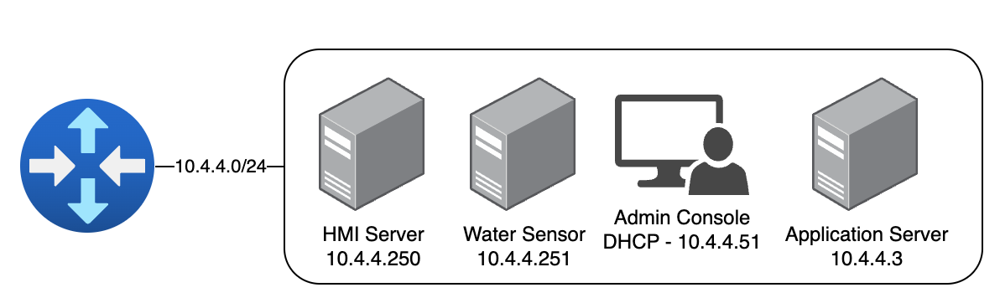

An Industrial Control System (ICS) is a system used for operations and maintenance in industrial sectors including critical infrastructure sectors such as energy, water, and communications. A Human Machine Interface (HMI) is the interface for monitoring and controlling an ICS. In this lab, the ICS is represented by a water station sensor and the HMI is a server that controls the water station sensor.

You will begin the lab by configuring the HMI-Server for stronger password requirements and add stricter local firewall rules.

Your next goal will be to segment the network, placing systems in separate subnets to write more effective network ACL rules and reduce the risk to each system. You will achieve this by moving the Application Server to its own network and then further restrict the ACLs on the router to allow ONLY what is necessary in and out of the network containing the critical ICS/HMI systems.

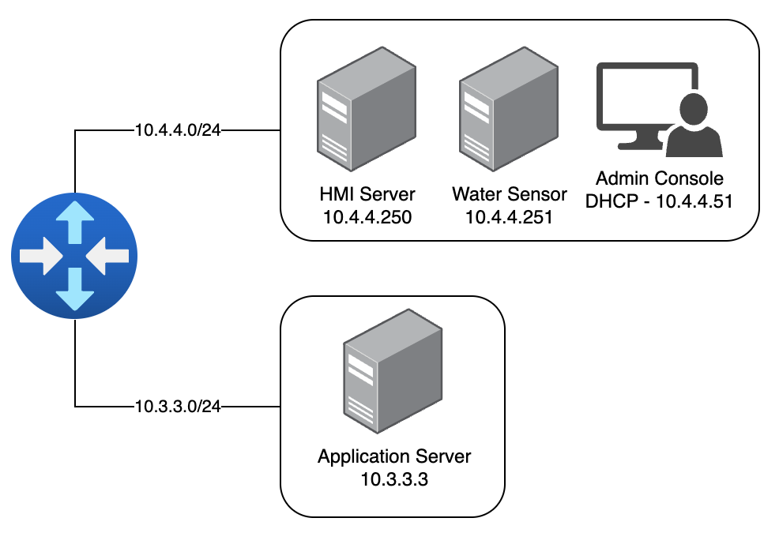

Each phase of the lab will be graded separately. Once you submit all parts of the lab successfully, a mini-challenge will be revealed at the end of the guide. The mini-challenge will test your ability to apply the lessons learned within the lab without explicit guidance.

## System Tools and Credentials

| system | OS type/link |  username | password |
|--------|---------|-----------|----------|
| HMI-Admin-Console | Ubuntu | user | tartans|
| Application-Server | Ubuntu |user | tartans|
| VyOS-Router | VyOS | user | tartans |
| HMI Status WebGUI | `http://10.3.3.3:8080` | none | none |
| HMI-Remote-Client | Ubuntu | user | tartans|

## Phase 1: Hardening the HMI and VNC


<details>
<summary>
<h3>Update local password policies to enforce strong passwords</h3>
</summary>
<p>

| &#128270; INFORMATION |
|---|
|_Based on recent <a href="https://pages.nist.gov/800-63-3/sp800-63b.html" target="_blank">National Institute for Standards and Technology guidance</a> on passwords, longer passwords are preferred to more complex passwords. Complexity can make passwords harder to remember, but longer passwords still add additional protection against brute force password-guessing._ |

For this lab, you will be implementing a new password policy using Pluggable Authentication Modules (PAM). For the sake of simplicity, the new policy will require that all passwords are at least 8 characters long and disallow passwords that use consecutively repeating characters, e.g. `aaaa` (which is also a recommendation by NIST).

1. Open the `HMI-Admin-Console` and open the Terminal:


| &#128270; INFORMATION |
|---|
|_VNC, or Virtual Network Computing, is often used to interact with remote systems through a desktop-like environment. VNC is the primary method for remotely logging in to a Linux system, and many ISC and HMI systems are based on Unix or Linux operating systems. Since some ICS and HMI systems do not have physical terminals, VNC is an alternate and commonly used method to interact with them._|

2. (**HMI-Admin-Console**) Open a VNC connection to the HMI Server with the command `vncviewer 10.4.4.250:5902`, where 10.4.4.250 is the IP address of the HMI-Server and 5902 is the port.

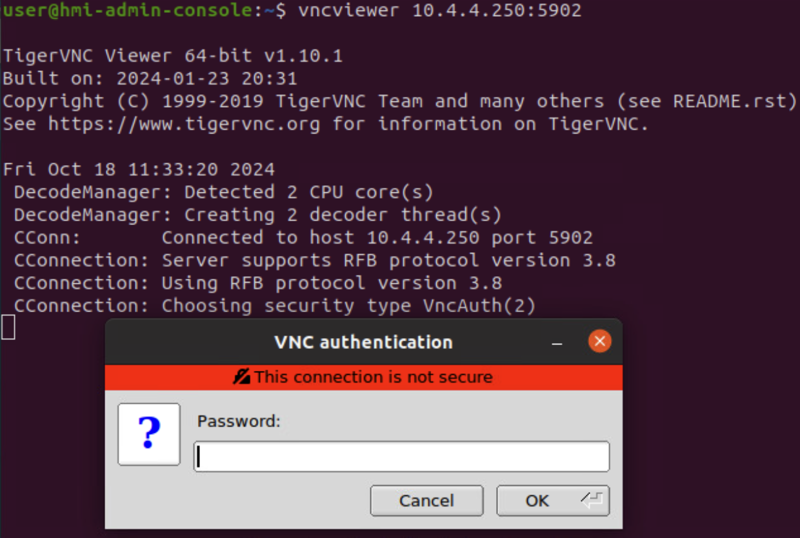

3. (**HMI-Admin-Console**) Enter the password of `tartans` and click OK to connect. You will then be presented with a pseudo-desktop connection to the HMI-Server.

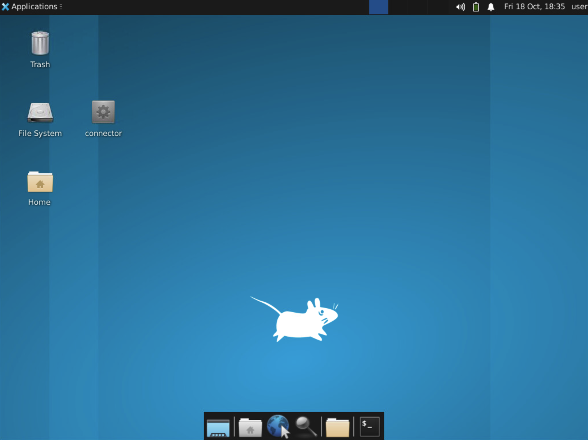

If you close this window at any time, you will need to repeat steps 2 and 3 to reconnect.

4. (**HMI-Admin-Console, VNC Connection**) From within the VNC connection viewer, open the HMI-Server's Terminal with the icon found in the bottom center of the window.

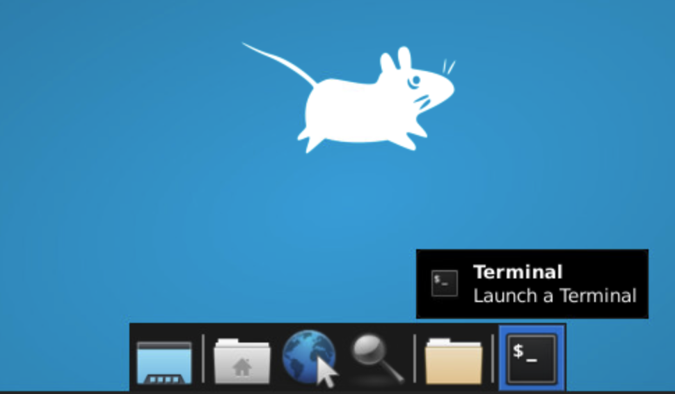

| &#128270; INFORMATION |
|---|
|_Sometimes, elevated permissions are needed when viewing and modifying files or when running certain commands. In Linux, the `sudo` command (which stands for "superuser *do*") can be used to elevate your permissions temporarily for the single command. This follows the security concept of least-privilege, as you would not want to operate at the system administrator or root user level at all times._|

5. (**HMI-Admin-Console, VNC Connection, Terminal**) Enter the following command in the terminal to open the PAM common password file for editing. Use the sudo password of `tartans` if prompted.

```
sudo nano /etc/pam.d/common-password
```

6. (**HMI-Admin-Console, VNC Connection, Terminal**) Change the line that reads as `password requisite pam_pwquality.so retry=3` to `password requisite pam_pwquality.so retry=3 maxrepeat=3 minlen=8 `.

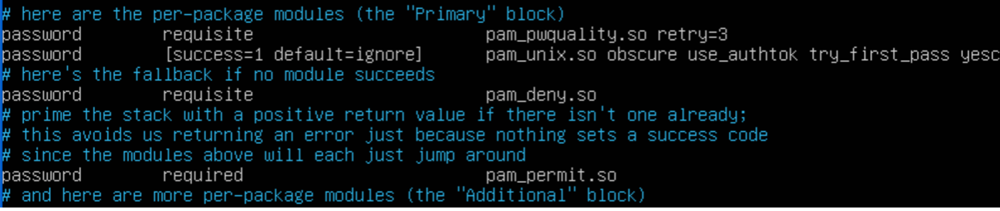

The `minlen=8` option will require the password to be 8 characters long while the `maxrepeat=3` option will enforce that characters cannot consecutively repeat more than three times.

| &#128270; INFORMATION |
|---|
|_In reality, you would want to use a minimum length greater than 8, but for the lab, this would add complexity each time you need to use the account password. You could also add additional complexity features such as requiring uppercase and lowercase letters, numbers, and special characters and disallow dictionary words._|

Your file should look like the image below.

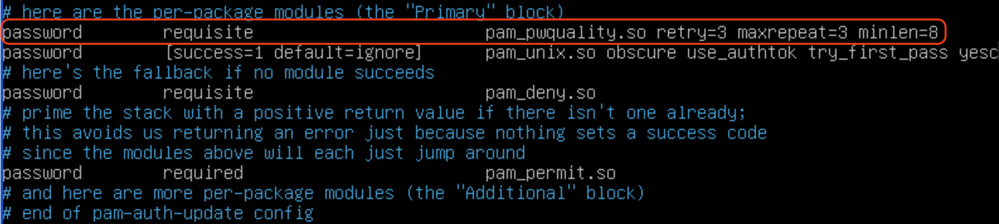


7. (**HMI-Admin-Console, VNC Connection, Terminal**) Save the common-password file by pressing `CTRL+X` and then type and enter `Y` to confirm saving the changes.

The changes take effect immediately and you should update the current password.

8. (**HMI-Admin-Console, VNC Connection, Terminal**) Type and enter the `passwd` command to update the user account password.

9. (**HMI-Admin-Console, VNC Connection, Terminal**) First, enter the current password of `tartans`.

10. (**HMI-Admin-Console, VNC Connection, Terminal**) At the new password prompt, try to enter the password `passwd` - this should fail because it is not long enough.

11. (**HMI-Admin-Console, VNC Connection, Terminal**) Try to enter the password `aaaabbbbcccc` - this should fail also, because while it is 12 characters long, it has multiple repeating characters.

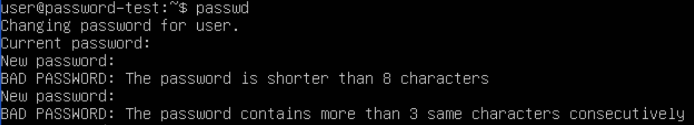

12. (**HMI-Admin-Console, VNC Connection, Terminal**) Finally, enter and then retype/confirm the following password, which should succeed: `tartans1`

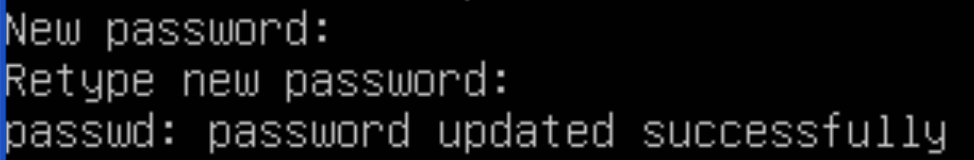

*Note that future instructions will assume the password has been changed to `tartans1` from this point forward.*

To update the vncpasswd, you must specifically update it as it uses its own authentication file for password checking.

13. (**HMI-Admin-Console, VNC Connection, Terminal**) Run the command `vncpasswd` and enter and confirm the same password as above: `tartans1`. When asked if you would like to enter a view-only password, select option `n` and press Enter.

This will update the VNC password the next time you attempt to connect, though there is no reason to disconnect your VNC session to the HMI Server at this time.

| &#128270; INFORMATION |
|---|
|_This process creates or updates a `passwd` file on the HMI-Server that is unique to the account of `user`. This file is located at /home/user/.vnc/ and the VNC service running on port 5902 is specifically tied to this user account as well. In operational instances where VNC is in use, Multi-Factor Authentication should be leveraged whenever possible._|

#### Grading Check

(**HMI-Admin-Console, Firefox**) To check your work, browse to the grading page at `https://skills.hub/lab/tasks` or `(https://10.5.5.5/lab/tasks)` from the HMI-Admin-Console desktop (not from within the VNC connection). Click the `Submit/Re-Grade Tasks` button to trigger the grading checks. Refresh the results after a few moments to see your results.


 
Grading Check 1: Update the HMI Server's password policy
 - Update the local password policy correctly

Grading Check 2: Update the password for user's local account and VNC account
 - Update the local user account password to `tartans1`
 - Update the VNC account password to match (`tartans1`)

`Copy the token or flag strings to the corresponding question submission field to receive credit.`

`You should complete the first two grading checks before moving on to the next section.`

</p>
</details>

<details>
<summary>
<h3>Add local UFW rules to allow only required traffic</h3>
</summary>
</p>

Next, you will create local Ubuntu uncomplicated firewall (ufw) rules to restrict the network access to the HMI-Server to only what is required:
 - Allow VNC requests from the HMI-Admin-Console at 10.4.4.51 over port 5902
 - Allow control communications to and from the water station sensor system at 10.4.4.251 over port 5000
 - Allow communications to the Application Server at 10.3.3.3 over port 5000 to post status updates
 - Deny all other incoming or outgoing traffic to/from the HMI-Server

*For the purpose of this lab, you will only update the HMI-Server's local firewall rules, assuming that the water station sensor is already configured approriately.*

You do this to better protect the critical HMI-Server system and water station sensors. With these new rules in place the ONLY system that can access the HMI-Server will be the HMI-Admin-Console over VNC. You can think of the HMI-Admin-Console as a quasi-air-gapped system for the purpose of interacting with the HMI-Server.

The water station sensor can only communicate with the controller service on the HMI-Server over port 5000 and only when sent an update command from the HMI-Server. This allows the HMI-Server and the water station sensor to update each other.

The HMI-Server can then post the status of the station sensors to the Application Server. This moves the visibility of the station sensor statuses to something outside of the HMI network, reducing the traffic that is required within the HMI network and minimizing the footprint of the systems within.

Lastly, you will deny or block all other traffic to or from the HMI-Server, which is the standard final rule in any good firewall or ACL ruleset. This rule enacts the zero trust principle of deny by default.

1. (**HMI-Admin-Console, VNC Connection, Terminal**) Still connected to the HMI Server via VNC, in the terminal session, add the following ufw rule to allow VNC connections inbound from only the HMI-Admin-Console system and then allow those established connections as long as they remain active:

```
sudo ufw allow from 10.4.4.51 to any port 5902 proto tcp
```

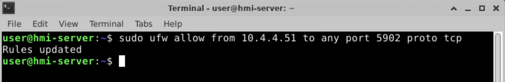

2. (**HMI-Admin-Console, VNC Connection, Terminal**) Still in the terminal session, add the following ufw rule to allow the HMI Server to send status updates to the web management system and allow those established connections as long as they remain active.:

```
sudo ufw allow out to 10.3.3.3 port 8080 proto tcp
```

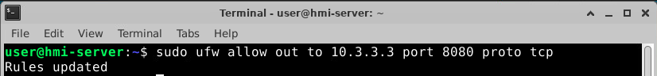

3. (**HMI-Admin-Console, VNC Connection, Terminal**) Still in the terminal session, add the following ufw rules to allow communications between the HMI Server and the water station sensor over port 5000 for control and status updates.:

```
sudo ufw allow out to 10.4.4.251 port 5000 proto tcp
sudo ufw allow in from 10.4.4.251 to any port 5000 proto tcp
```

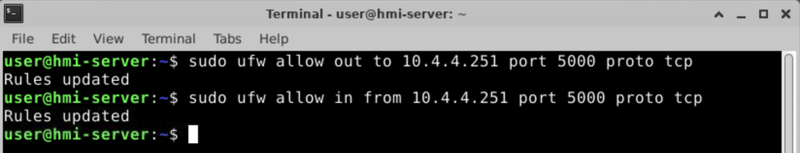

4. (**HMI-Admin-Console, VNC Connection, Terminal**) Still in the terminal session, add the following ufw rules to block any other types of traffic, ingoing or outgoing, to or from the HMI Server to better minimize its surface area on the network.:

```
sudo ufw default deny incoming
sudo ufw default deny outgoing
```

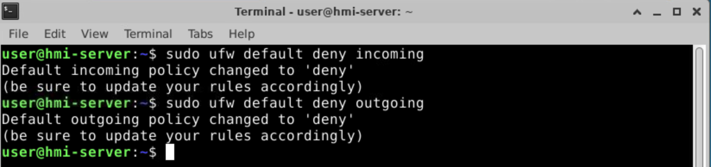

5. (**HMI-Admin-Console, VNC Connection, Terminal**)Lastly, in the terminal session, enter the following commands to enable the ufw firewall.

```
sudo ufw enable
```

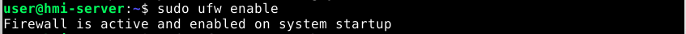

You can check the status of the current rules by entering the command:

```
sudo ufw status verbose
```

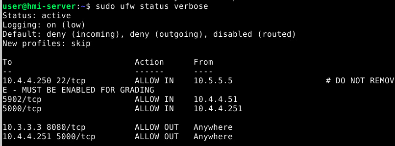

**NOTE: There is a rule in the HMI Server's UFW to allow SSH connections from the Skills Hub (10.5.5.5) for grading purposes only. This is accounted for in any grading checks that validate the state of your lab environment. You should not remove or disable this rule at any time.**

If all has gone according to plan, you should still be connected to the HMI-Server and be able to reconnect at will, as long as you use the new password of `tartans1`.

6. (**HMI-Admin-Console, VNC Connection**) To test whether the HMI-Server can still talk to the water station sensor, open the `Connector` application on the HMI-Server Desktop.


If you simply type the command `get` in the connector terminal you will see a list of the water station sensors and their current statuses. The fact that this connecion worked means your UFW rules did not accidentally break connectivity.

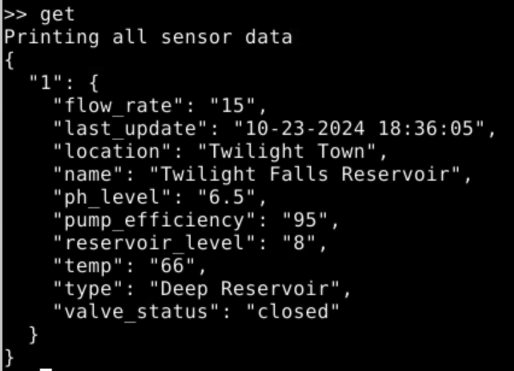

7. (**HMI-Admin-Console, VNC Connection, Connector**)Update the current temperature of the reservoir behind station sensor 1 (Twlight Falls) with the following command:

```
update {"id":"1","temp":"75"}
```

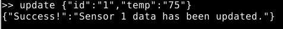

You will use this value to validate the staus updates on the status web site in a later step.

This concludes our work on the HMI-Server.

#### Grading Check

(**HMI-Admin-Console, Firefox**) To check your work, browse to the grading page at `https://skills.hub/lab/tasks` or `(https://10.5.5.5/lab/tasks)` from the HMI-Admin-Console desktop (not from within the VNC connection). Click the `Submit/Re-Grade Tasks` button to trigger the grading checks. Refresh the results after a few moments to see your results.

The grading page should show the results of the following items as now being passed successfully.

Grading Check 3: Update and apply the HMI Server's local UFW rules.
 - The HMI Server can still communicate with the water station sensor and vice versa
 - Only the Admin Console can connect over VNC to the HMI Server
 - The HMI Server accepts no other connections locally on the 10.4.4.0/24 network

`Copy the token or flag strings to the corresponding question submission fields to receive credit.`

`You should complete all phase 1 tasks before moving on to phase 2. Successfully submitting the correct answers for phase 1 will unlock the question set for phase 2.`

**Will update this if/when we know auto-submissions will not affect the releasing of question sets prematurely.**

</p>
</details>

## Phase 2: Move the Application Server to the Services Network

<details>
<summary>
<h3>Reconfigure the Application Server IP and gateway settings</h3>
</summary>
</p>

In preparation to change the network for the Application Server, it has been connected to the new network on its first networking interface `ens32`. You can effectively move the system in the lab by disabling the interface connected to the HMI network and enabling the interface connected to the Services network, where it belongs.

1. Open the `Application-Server` console and login with the username `user` and the password `tartans`.

2. (**Application Server**) At the command prompt, type and enter the following command, using the sudo password of `tartans` if prompted. This will allow you to modify the existing network configuration file for the system.

```
sudo nano /etc/netplan/01-netcfg.yaml
```

The current netplan configuration file consists of the following:

```
network:
  version: 2
  renderer: networkd
  ethernets:
    ens32:
      dhcp4: no
      dhcp6: no
      optional: true
    ens33:
      dhcp4: no
      addresses:
        - 10.4.4.3/24
      gateway4: 10.4.4.1
      nameservers:
        addresses:
          - 10.5.5.5
          - 10.0.0.1
```

In this configuration the first interface (connected to the new services network) is effectively disabled and the second interface (connected to the HMI network) uses the address of 10.4.4.3 and points to the gateway of 10.4.4.1.

3. (**Application Server**) Edit the netplan configuration file to match the following and note that the interface order has been swapped intentionally to save on typing (the order of interfaces does not matter when creating netplan configuration files). These changes will instead disable the second interface connected to the HMI network and enable the first interface connected to the new services network. It also applies a new address of 10.3.3.3 and a gateway of 10.3.3.1 to this new interface.

```
network:
  version: 2
  renderer: networkd
  ethernets:
    ens33:
      dhcp4: no
      dhcp6: no
      optional: true
    ens32:
      dhcp4: no
      addresses:
        - 10.3.3.3/24
      gateway4: 10.3.3.1
      nameservers:
        addresses:
          - 10.5.5.5
          - 10.0.0.1
```

4. (**Application Server**) Save the file by pressing `CTRL+X` and then type and enter `Y` to confirm saving the changes.

5. (**Application Server**) Apply the new changes with the command:

```
sudo netplan apply
```

6. (**Application Server**) Verify the changes are correct with the command `ip a`. You should see something similar to the image below.

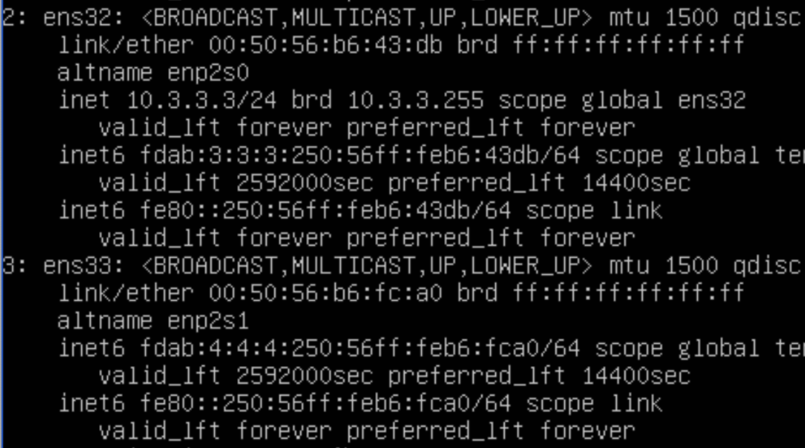

The new address of `10.3.3.3/24` should be applied to interface `ens32` and there should be no IPv4 address applied to interface `ens33`.

Recall the updated network diagram now that the application server has been moved successfully.


7. (**Application Server**) Restart the status page service with the following command:

```
sudo systemctl restart hmi.service
```

If successful, you should see no additional output.

You can now verify that the status page on the Application Server recieved the previous update to sensor 1's temperature, and that the site is accessible at the new address of 10.3.3.3 over port 8080.

8. (**HMI-Admin-Console, Firefox**) Open Firefox from the HMI-Admin-Console Desktop (not within the VNC session) and browse to `http://10.3.3.3:8080`.

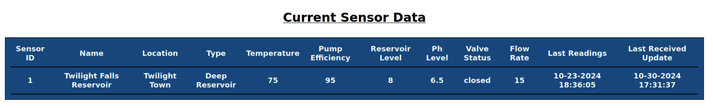

You should see the updated temperature value of 75 reflected in the displayed status.

#### Grading Check
(**HMI-Admin-Console, Firefox**) To check your work, browse to the grading page at `https://skills.hub/lab/tasks` or `(https://10.5.5.5/lab/tasks)` from the HMI-Admin-Console desktop (not from within the VNC connection). Click the `Submit/Re-Grade Tasks` button to trigger the grading checks. Refresh the results after a few moments to see your results.


Grading Check 4: Move the Application Server to the Services network at IP address 10.3.3.3
 - The Application Server has the correct IP address of `10.3.3.3/24` and its website can be reached at `http://10.3.3.3:8080`
 - The HMI Server can now successfully POST to the Application Server site at its new address

`Copy the token or flag strings to the corresponding question submission fields to receive credit.`

`You should complete all phase 2 tasks before moving on to phase 3. Successfully submitting the correct answers for phase 2 will unlock the question set for phase 3.`

</p>
</details>

## Phase 3: Configure Access Control Lists on the Router

<details>
<summary>
<h3>Add Access Control Lists to the Router's Firewall Module</h3>
</summary>
<p>

Next, you will access the router `vyos-router` and create access control list (ACL) rules to further protect and segment off the critical HMI systems from the rest of the network.
 - Allow communications to the Application Server at 10.3.3.3 over port 5000 to post status updates from the HMI-Server
 - Allow communications to the Application Server at 10.3.3.3 over port 8080 to post status updates from the HMI-Admin-Console
 - Deny all other incoming or outgoing traffic to/from the HMI network

You do this to continue to allow the HMI-Server to post the status of the station sensors to Application Server over port 5000.

You must also allow the HMI-Admin-Console to access the status page to confirm the status of the station sensors, but only allow access to the site itself over port 8080.

Lastly, you will deny or block all other traffic to or from the HMI network; not even ICMP pings will be allowed through. This further prevents any type of enumeration or scanning from systems external to the HMI network, reducing the visibility into the network to near zero.

Even if the status update messages were intercepted, there would be no way to push changes back to the HMI-Server or the station sensors from anywhere other than the HMI-Admin-Console, and the only way to interact with the HMI-Admin-Console is to walk up to directly (or in this case, virtually).

1. Click on the Vyos-Router console and login with the username `user` and the password `tartans`.

2. (**VyOS Router**) At the prompt, type and enter `configure` to enter the router's configuration mode.

| &#128270; INFORMATION |
|---|
|_This is a common practice on routers, where you make configurations changes by interacting directly with a special mode of the router and not within the operating system itself. At any time you can discard your modifications by typing and entering `exit discard` if you make a mistake._|

First, you will create the ACL rule that allows the HMI-Server to post status updates to the application server at 10.3.3.3 over port 5000. Note that the lab environment uses a prebuilt ruleset named `LAB`. As each rule is added you must specify the target ruleset by name. Devices could leverage multiple rulesets organizaed with different names. Since your additions will be small, you will use only the default ruleset of `LAB`.

3. (**VyOS Router**) Enter each of the following lines, one line at a time, or copy the lines into the virtual machine clipboard and then paste them into the router's console. If doing the latter, all six lines will be processed immediately.

```
set firewall name LAB rule 10 action accept
set firewall name LAB rule 10 source address 10.4.4.250
set firewall name LAB rule 10 destination address 10.3.3.3
set firewall name LAB rule 10 destination port 8080
set firewall name LAB rule 10 protocol tcp
set firewall name LAB rule 10 state new enable
```

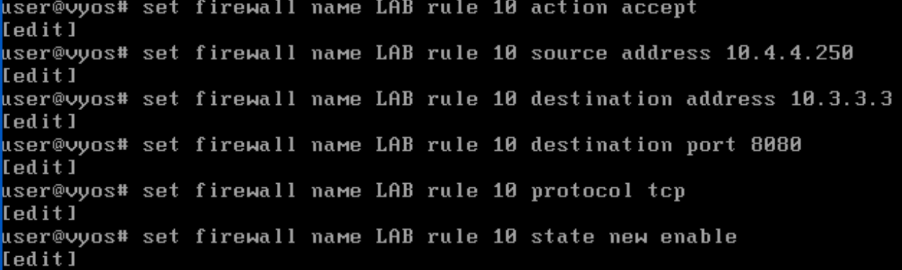

Second, you will create the ACL rule that allows the HMI-Admin-Console to talk to the application server at 10.3.3.3 over port 8080 to view the status page.

4. (**VyOS Router**) Enter each of the following lines, one line at a time, or copy the lines into the virtual machine clipboard and then paste them into the router's console. If doing the latter, all six lines will be processed immediately.

```
set firewall name LAB rule 11 action accept
set firewall name LAB rule 11 source address 10.4.4.51
set firewall name LAB rule 11 destination address 10.3.3.3
set firewall name LAB rule 11 destination port 8080
set firewall name LAB rule 11 protocol tcp
set firewall name LAB rule 11 state new enable
```

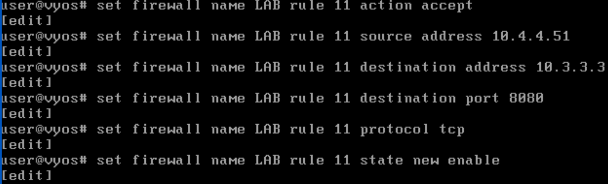

Third, you will create the ACL rule that ensures established connections continue to be allowed until closed. This ensures that you can connect to the legitimate ports and services and also remain connected.

5. (**VyOS Router**) Enter each of the following lines, one line at a time, or copy the lines into the virtual machine clipboard and then paste them into the router's console. If doing the latter, all three lines will be processed immediately.

```
set firewall name LAB rule 20 action accept
set firewall name LAB rule 20 state established enable
set firewall name LAB rule 20 state related enable
```

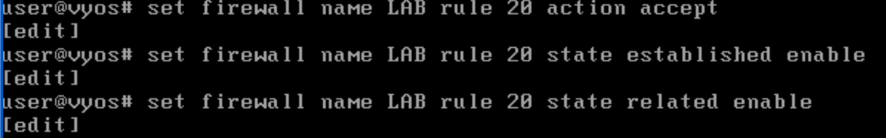

Fourth, you will create the ACL rule that will block all other traffic not otherwise specified in our ACL ruleset at the interface that connects the HMI subnet to the rest of the network. 

This will prevent unwanted traffic from entering and leaving the HMI network as well as prevent any enumeration or scanning attempts into the network and its systems. The latter three lines will apply the ruleset `LAB` to the interface `eth4` in all directions, `in` `out` and `local`.

6. (**VyOS Router**) Enter each of the following lines, one line at a time, or copy the lines into the virtual machine clipboard and then paste them into the router's console. If doing the latter, all four lines will be processed immediately.

```
set firewall name LAB default-action drop
set interfaces ethernet eth4 firewall in name LAB
set interfaces ethernet eth4 firewall out name LAB
set interfaces ethernet eth4 firewall local name LAB
```

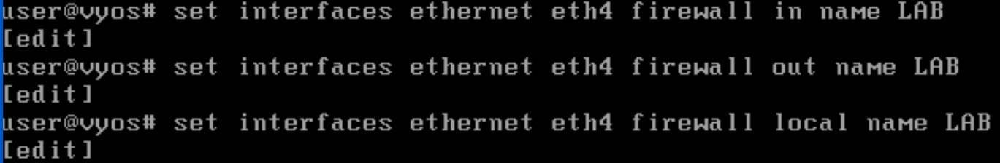

The only system that can now make an inbound connection to the HMI-Server is the HMI-Admin-Console. Scan results from outside the HMI network would result in no systems being found.

Finally, you can commit the changes.

7. (**VyOS Router**) Type and enter `commit` and then type and enter `save`. This will write the changes to the running configuration and apply them.

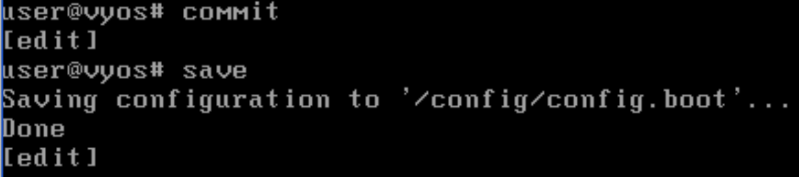

8. (**VyOS Router**) You can now type and enter `exit` to leave configuration mode.

If curious, you can visualize the ACL rules in the config by entering the command `sh conf` at the router's command prompt.

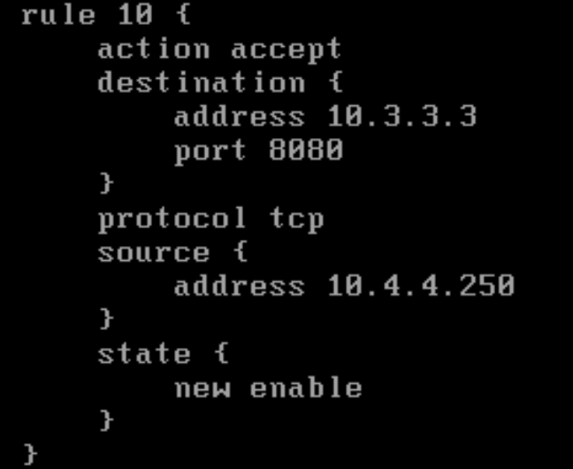

**NOTE: There is a rule in the Router's ACL to allow SSH and HTTPS connections to/from the Skills Hub (10.5.5.5) for grading purposes only. This is accounted for in any grading checks that validate the state of your lab environment. You should not remove or disable these rules at any time.**

#### Grading Check

(**HMI-Admin-Console, Firefox**) To check your work, browse to the grading page at `https://skills.hub/lab/tasks` or `(https://10.5.5.5/lab/tasks)` from the HMI-Admin-Console desktop (not from within the VNC connection). Click the `Submit/Re-Grade Tasks` button to trigger the grading checks. Refresh the results after a few moments to see your results.


The grading page should show the results of the following items as now being passed successfully.

Grading Check 5: Update and apply the router firewall ACL rules
 - The HMI Server can still successfully POST to the Application Server site
 - The Admin Console can successfully check the Application Server status page
 - All other inbound and outbound traffic is blocked to the 10.4.4.0/24 network, including ICMP ping requests

`Copy the token or flag strings to the corresponding question submission fields to receive credit.`

`You should complete all phase 3 tasks before moving on to the mini-challenge. Successfully submitting the correct answers for phase 3 will unlock the question set for the mini-challenge.`

</p>
</details>

## Mini-Challenge

<details>
<summary>
<h3>Mini-Challenge Scenario</h3>
</summary>
<p>

The new remote client resides in user network of 10.1.1.0/24.

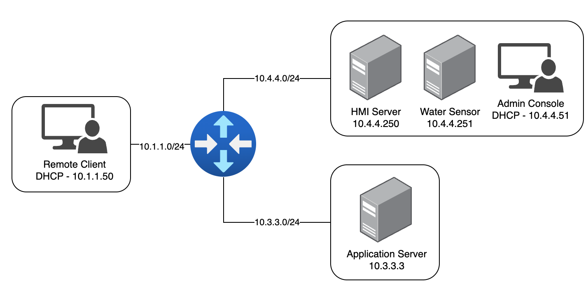

A new requirement has been added that this remote client system must also be able to interact with the HMI-Server through a VNC connection and access the web status page on the aplpciation server. While this does add a minor security concern, you will continue to operate under the rule of least-privilege by adding **only** this new exception to the previous rulesets. For the purpose of the lab, assume that this client is compliant with all security requirements and safe to add to the network. You do not need to protect the remote client or the user network beyond the stated objectives below.

### Mini-Challenge Objectives

Your objectives for the mini-challenge are as follows:
 - Configure the new remote client system by configuring its `ens32` interface on the user network with an IP address of 10.1.1.151/24 and a gateway of 10.1.1.1. You will need to create a new `01-netcfg.yaml` netplan file to achieve this.
 - Configure the required ACLs on the router to support the new traffic:
   - The remote client must be able to access the status page on the application server at 10.3.3.3 over port 8080.
   - The remote client must be able to connect to the HMI via VNC over port 5903. *Note that this is a different port assigned specifically to this client.*
- Adjust the HMI Server's local UFW rules to allow this new exception for the inbound connection from the remote client on port 5903.
 - Your updates must not enable any previously disallowed traffic or break previously allowed communications.

Remember to draw upon and apply the examples used previously in the lab. All tasks can be completed by following the same processes and procedures as before. 

#### Grading Check

(**HMI-Admin-Console, Firefox**) To check your work, browse to the grading page at `https://skills.hub/lab/tasks` or `(https://10.5.5.5/lab/tasks)` from either the HMI-Admin-Console or Remote-Client desktop (not from within the VNC connection). Click the `Submit/Re-Grade Tasks` button to trigger the grading checks. Refresh the results after a few moments to see your results.

Grading Check 6: Add the remote client to the new user network (10.1.1.0/24)
 - The Remote Client is configured with an IP address of 10.1.1.151/24 and the proper gateway address of 10.1.1.1.

Grading Check 7: Update and apply the router firewall ACL rules and the HMI Server's UFW rules
 - The Remote Client can access the status page at 10.3.3.3 over port 8080
 - The Remote Client can connect via VNC to the HMI Server over port 5903
 - Your changes did not allow any previously disallowed traffic to/from the HMI network or the HMI-Server or break previously allowed communications

`Copy any token or flag strings to the corresponding question submission field to receive credit.`

</p>
</details>

<details>
<summary>
<h2>Lab Wrap Up</h2>
</summary>
<p>

### Conclusion

By completing this lab you have become more familiar with the best practices of having strong password policies, network segmentation, and implementing strong firewall and access control list rulesets.

To recap:
 - You implemented a password policy to enforce longer passwords that disallow consecutive repeating characters and then updated your local and vnc accounts accordingly.
 - You added local Ubuntu firewall rules to a critical system to reduce its footprint on the network and to secure it from unwanted network traffic.
 - You moved a necessary system out of the critical network to reduce the traffic flow in and out of the critical network. This allowed you to better secure the critical systems while making a necessary feature accessible in it's own network.
 - You added router access control list rules to further restrict all unwanted network traffic in and out of the critical network, again decreasing the visibility of the systems in this network and denying unwanted bad traffic.

With these new security additions in place, your critical HMI systems are much better protected and the ability for an intruder to gain access has been reduced to a near-zero possibility without physical access to the air-gapped HMI-Admin-Console.

### References
- <a href="https://www.cisa.gov/news-events/news/securing-network-infrastructure-devices" target="_blank">Layering Network Security Through Segmentation</a>.
- <a href="https://www.cisa.gov/news-events/alerts/2024/09/25/threat-actors-continue-exploit-otics-through-unsophisticated-means" target="_blank">Threat Actors Continue to Exploit OT/ICS through Unsophisticated Means</a>
 - <a href="https://pages.nist.gov/800-63-3/sp800-63b.html" target="_blank">NIST Special Publication 800-63B: Digital Identity Guidelines - </a>
 - <a href="https://ubuntu.com/server/docs/firewalls" target="_blank">Ubuntu Uncomplicated Firewall (ufw) Guide</a>
 - <a href="https://docs.vyos.io/en/latest/" target="_blank">VyOS 1.5 User Guide</a>
 - <a href="https://www.cisa.gov/resources-tools/resources/federal-civilian-executive-branch-fceb-operational-cybersecurity-alignment-focal-plan" target="_blank">Federal Civilian Executive Branch (FCEB) Operational Cybersecurity Alignment (FOCAL) Plan</a>
 - <a href="https://niccs.cisa.gov/workforce-development/nice-framework" target="_blank">NICE Framework</a>

### Appendix

In the case that changes made to the HMI-Server's local UFW rules or the Vyos-Router's configuration prevent you from completing the lab (i.e. you made an irrecoverable mistake), follow these steps to restore to a known good state and try again.

On the `HMI-Server` run the following commands to overwrite the existing UFW rules file with the known good "clean slate" file and re-enable the UFW service:

```
sudo ufw disable
sudo cp /etc/ufw/user.rules.bck /etc/ufw/user.rules
sudo ufw enable
```

On the `Vyos-Router`, at the command line (not in configuration mode), run the following commands to overwrite the existing configuration file with the known good "clean slate" file and reboot the system:

```
sudo cp /config/config.boot.back /config/config.boot
sudo reboot
```

</p>
</details>