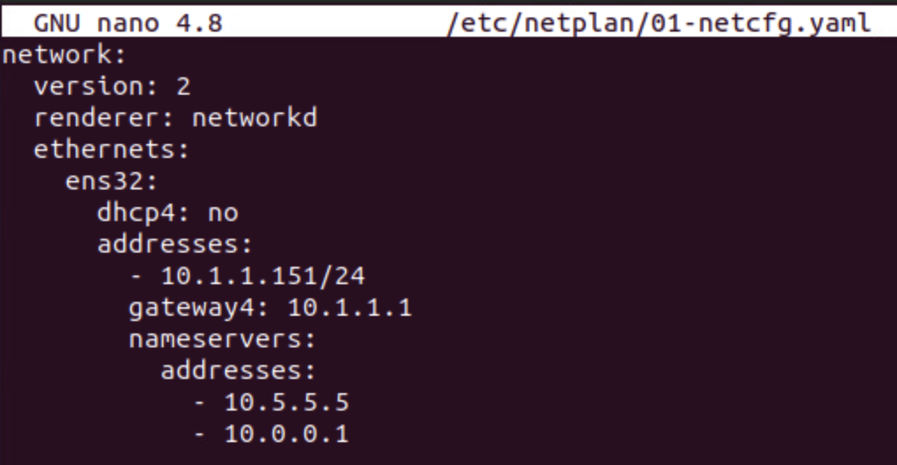
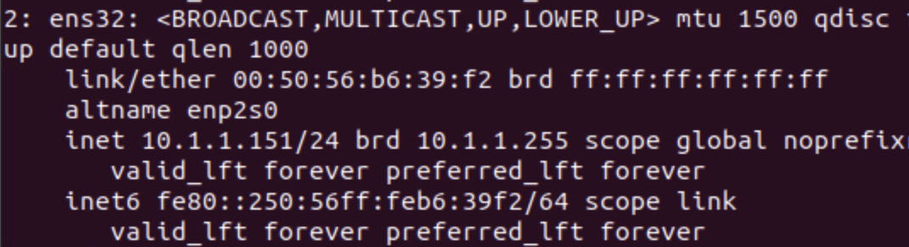
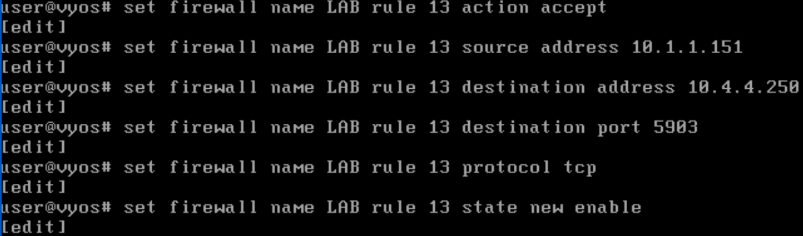
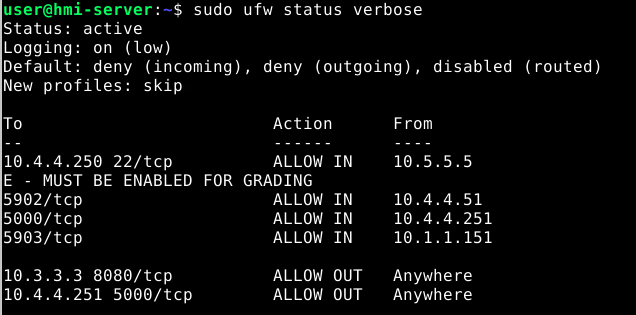

# Network Segmentation with ICS/HMI

## Mini-challenge Solution

### Configure the Remote Client's Network Interface

1. Open the console for the `Remote-Client` and then open the Terminal.

2. (**Remote Client, Terminal**) Similar to the process for the application server, create the netplan configuration file with the following command:

```
sudo nano /etc/netplan/01-netcfg.yaml
```

Modify the file to match the following:

```
network:
  version: 2
  renderer: networkd
  ethernets:
    ens32:
      dhcp4: no
      addresses:
        - 10.1.1.151/24
      gateway4: 10.1.1.1
      nameservers:             # You don't need to add these, but it doesn't hurt
        addresses:          
          - 10.5.5.5
          - 10.0.0.1
```



3. (**Remote Client, Terminal**) Save the file by pressing `CTRL+X` and type and enter `Y` to confirm saving the changes.

4. (**Remote Client, Terminal**) Apply the new changes with the command:

```
sudo netplan apply
```

5. (**Remote Client, Terminal**) Test that your IP address has been applied correctly with `ip a`.



6. (**Remote Client, Firefox**) Open Firefox and test that you can access the status page by browsing to `http://10.3.3.3:8080`. The page should load normally.

### Add the new Router's ACLs to allow the Remote Client to connect to the HMI Server over port 5903

1. Click on the Vyos-Router console and login with the username `user` and the password `tartans`, if not already logged in.

2. (**VyOS Router**) At the prompt, type and enter `configure` to enter the router's configuration mode.

3. (**VyOS Router**) Enter each of the following lines, one line at a time, or copy the lines into the virtual machine clipboard and then paste them into the router's console. If doing the latter, all six lines will be processed immediately.

```
set firewall name LAB rule 13 action accept
set firewall name LAB rule 13 source address 10.1.1.151
set firewall name LAB rule 13 destination address 10.4.4.250
set firewall name LAB rule 13 destination port 5903
set firewall name LAB rule 13 protocol tcp
set firewall name LAB rule 13 state new enable
```



Finally, commit the new changes.

4. (**VyOS Router**) Type and enter `commit` and then type and enter `save`. This will write the changes to the running configuration and apply them.

5. (**VyOS Router**) You can now type and enter `exit` to leave configuration mode.

You can verify the ACL rules were added to the config by entering the command `sh conf` at the router's command prompt.

### Update the HMI Server's UFW rules to allow the Remote Client to connect over VNC port 5903

*If you still have a VNC connection open to the HMI Server from the HMI Admin Console, you can skip to step 4.*

1. Open the `HMI-Admin-Console` and open the Terminal.

2. (**HMI-Admin-Console, Terminal**) Open a VNC connection to the HMI Server with the command `vncviewer 10.4.4.250:5902`, where 10.4.4.250 is the IP address of the HMI-Server and 5902 is the port.

3. (**HMI-Admin-Console, VNC Viewer Client Popup**) Enter the password of `tartans1` and click `Connect`. You will then be presented with a pseudo-desktop connection to the HMI-Server.

4. (**HMI-Admin-Console, VNC Connection, Terminal**) Still connected to the HMI Server via VNC, in the terminal session, enter the following command:

```
sudo ufw allow from 10.1.1.151 to any port 5903 proto tcp
```

The rule will take effect immediately. You can check the status of the current rules by entering the command:

```
sudo ufw status
```



5. Return to the `Remote Client` and the Terminal.

6. (**HMI-Remote-Client, Terminal**) Open a VNC connection to the HMI Server with the command `vncviewer 10.4.4.250:5903`, where 10.4.4.250 is the IP address of the HMI-Server and 5903 is the port.

7. (**HMI-Remote-Client, VNC Viewer Client Popup**) Enter the password of `tartans1` and click `Connect`. You will then be presented with a pseudo-desktop connection to the HMI-Server.

If successful, then you have completed the mini-challenge. Remember to check your grading status in-game at `https://skills.hub (https://10.5.5.5)`.
