# Phishing Mitigation with Multifactor Authentication

Multifactor authentication (MFA), also referred to as two-factor authentication (2FA), is a security mechanism that typically combines something you know, such as a password, with something you have, like a mobile device. Cybersecurity practitioners everywhere highly recommend the use of MFA when accessing any organizational resource. CISA's guidelines on the use of MFA can be found as a part of their <a href="https://www.cisa.gov/secure-our-world/require-multifactor-authentication" target="_blank">Secure Our World</a> campaign and MFA continues to be one of CISA's foundational <a href="https://www.cisa.gov/MFA" target="_blank">Cybersecurity Best Practices</a>.

MFA core benefits include additional protections against phishing. Phishing-resistant MFA provides additional benefits over standard MFA and should be incorporated whenever possible. CISA recommends the use of phishing-resistant MFA in their <a href="https://www.cisa.gov/sites/default/files/publications/fact-sheet-implementing-phishing-resistant-mfa-508c.pdf" target="_blank">Implementing Phishing-Resistant MFA fact sheet</a>.

- This lab is expected to take 30 minutes.

*Please consider filling out the lab feedback survey at the bottom of your screen. The survey is available to you at any time while conducting the lab.*

## Learning Objectives
- Understand phishing attacks
- Identify common indicators of a phishing attack
- Understand multifactor authentication and its benefits

## Learner Expectations
- Learners should be comfortable using an internet browser

## FOCAL and NICE Framework Mappings

This lab maps with <a href="https://www.cisa.gov/resources-tools/resources/federal-civilian-executive-branch-fceb-operational-cybersecurity-alignment-focal-plan" target="_blank">Federal Civilian Executive Branch (FCEB) Operational Cybersecurity Alignment (FOCAL)</a> area 3 (Defensible Architecture), by improving resilience and security to mitigate incidents.

**NICE Work Role**

- <a href="https://niccs.cisa.gov/workforce-development/nice-framework" target="_blank">Defensive Cybersecurity, Systems Security Analysis</a>

**NICE Tasks**

- <a href="https://niccs.cisa.gov/workforce-development/nice-framework" target="_blank">T1177</a>: Determine if security control technologies reduce identified risk to acceptable levels
- <a href="https://niccs.cisa.gov/workforce-development/nice-framework" target="_blank"> T1212</a>: Implement cybersecurity countermeasures for systems and applications
- <a href="https://niccs.cisa.gov/workforce-development/nice-framework" target="_blank">T1560</a>: Mitigate risks in systems and system components
- <a href="https://niccs.cisa.gov/workforce-development/nice-framework" target="_blank">T1548</a>: Determine adequacy of access controls

## Scenario

In this lab, you will intentionally fall for a phishing email attack associated with a fictional bank account and email address. You will review the results of the attack when the target account lacks proper MFA protections. You will then configure the target account for MFA and retrigger the phishing attack. The lab will demonstrate how MFA mitigates phishing attacks and helps to prevent threat actors from accessing accounts. 

## System Tools and Credentials

| System | OS type/link |  Username | Password |
|--------|---------|-----------|----------|
| Ubuntu-Desktop | Ubuntu-Desktop | user | tartans|

<!-- cut -->

## Understanding Multifactor Authentication

The following section will explain what phishing attacks are, how MFA works, and how MFA improves the security posture of organizations by preventing unauthorized access and mitigating the risks of phishing. This initial section exploring phishing and multifactor authentication is a 6-minute read.

<details> 
<summary> 
<h3>Phishing Explained</h3> 
</summary> 
<p> 

| &#128270; INFORMATION |
|---|

#### What is a Phishing attack?

Let's explore phishing attacks a bit further and how they relate to social engineering. More information can be found in this CISA article on <a href="https://www.cisa.gov/news-events/news/avoiding-social-engineering-and-phishing-attacks" target="_blank">Avoiding Social Engineering and Phishing Attacks </a>. 

In a social engineering attack, an attacker uses human interaction (i.e. social skills) to obtain or compromise information about an organization, its people or its computer systems. An attacker may seem unassuming and respectable, possibly claiming to be a new employee, repair person, or researcher. They may even offer authentic or forged credentials to support that identity. However, by simply asking questions, he or she may be able to piece together enough information to infiltrate an organization or its network.

An example of social engineering might be posing as an electrician and asking an unassuming employee for access to a data closet or server room to conduct repairs. Once inside, the attacker could plant a malicious device to aid in further compromises of the network systems.

A phishing attack is a form of social engineering. Phishing attacks use emails, text messages, or malicious websites to solicit personal information by posing as a trustworthy organization. For example, an attacker may send email seemingly from a reputable credit card company or financial institution that requests account information, often suggesting that there is a problem that requires urgent attention. When users respond with the requested information, attackers can use it to gain access to the victim's accounts.

While user training and awareness are always a crucial component of cybersecurity, technical controls like MFA add an additional layer of defense-in-depth to mitigate phishing attacks.

#### Indicators of a Phishing Attack 

Configuring your accounts with MFA may be helpful with the mitigation of phishing attacks, but it's not a panacea. User awareness and training is important to understand the indicators of phishing attempts so they can avoid providing personal information that will put them at risk.

Some of the most common indicators of a phishing attack are:

1. The address of the sender is suspicious or unknown. 

 - The account that sent you the message may initially appear legitimate or related to a business you use. But, upon closer inspection, you can see that it has some odd differences than other correspondence you've received from them. For example, a username of jennifersmith@group.com does not appear suspicious. However, an email address of jen.s.xyz@orgxyz.456123abc.org does. 

2. The greeting and/or signature in the message is generic.

 - The message may start with something like `Hello Sir/Ma'am` and not include any information that is specific to the receiver. This can be a strong indicator as malicious actors may be sending these attacks to many users and so they will not include personalized information specific to you. Salutations that address you incorrectly should also rouse suspicion.

3. Spoofed links and/or websites.

 - The message may provide a link to a website that looks real, but if you hover over it, you can see that the link is actually going to a website that looks similar. For example, www.bank0fus.org or www.bankofus.payme.com. One of these URLs uses a '0' instead of an 'o', while the other is masquerading as "bankofus", but actually belongs to the "payme.com" domain. If you suspect that a link in an email looks suspicious, never click the link provided and instead go directly to the well-known URL for the resource, e.g. www.bankofus.com, or contact that organization's support personnel for further assistance.

4. Spelling and Grammar

 - Real correspondence from a business/website normally contains little to no grammatical errors at all. Phishing emails often include bad grammar, misspellings, bad formatting, and/or poor sentence structure, depending on the primary language of the sender and the language of the intended target.

5. A Sense of Urgency

 - In many scenarios, phishing attacks will try to portray a sense of urgency or criticality to make the user worry or panic, which can often lead to following the messages recommendations hastily without doing their due diligence.

6. Suspicious attachments

 - Unexpected messages can contain odd or unrequested attachments. These attachments are often malicious in nature and having the user download and open them is a common way attackers attempt to get malware on the targets system.

These are the most common indicators of a phishing attack but are not an exhaustive list. To mitigate phishing attacks, it is vital that users always analyze any message that seems out of place. Always be wary of providing any sensitive information, clicking links, or downloading any files from senders or organizations you don't know.

More information can be found in this CISA article on <a href="https://www.cisa.gov/news-events/news/avoiding-social-engineering-and-phishing-attacks" target="_blank">Avoiding Social Engineering and Phishing Attacks </a>. 

#### Artificial Intelligence's Effect on Phishing

With the rise of Artificial Intelligence (AI) and Large Language Models (LLM), phishing indicators may not be as obvious or easy to spot. 

Prior to AI, spelling, grammar, and syntax were well-known indicators of an attempted phishing attack. However, with the widespread availability of AI and LLM, threat actors now have the ability to craft more realistic and compelling messages, as well as perform proof reading and grammar checks. AI can even produce realistic looking images and logos to further provide the appearance of legitimacy in phishing correspondence. Because of this, it is even more important that the user always put all correspondence they receive under the most critical scrutiny as phishing attacks are becoming even more realistic and less noticeable.

</details>
</p>

<details> 
<summary> 
<h3>Multifactor Authentication Explained</h3> 
</summary> 
<p> 


#### Multifactor Authentication

When accessing a resource that uses MFA, you must first provide the correct username and password credentials. Afterwards, you are asked for a second authentication token. Typically, this second authentication token is sent to either a mobile device application or email account. You must either approve and accept a prompt or enter the token into an additional logon field.


Only the holder of the mobile device, token, or account can retrieve the correct code and then pass it into the second authentication field.

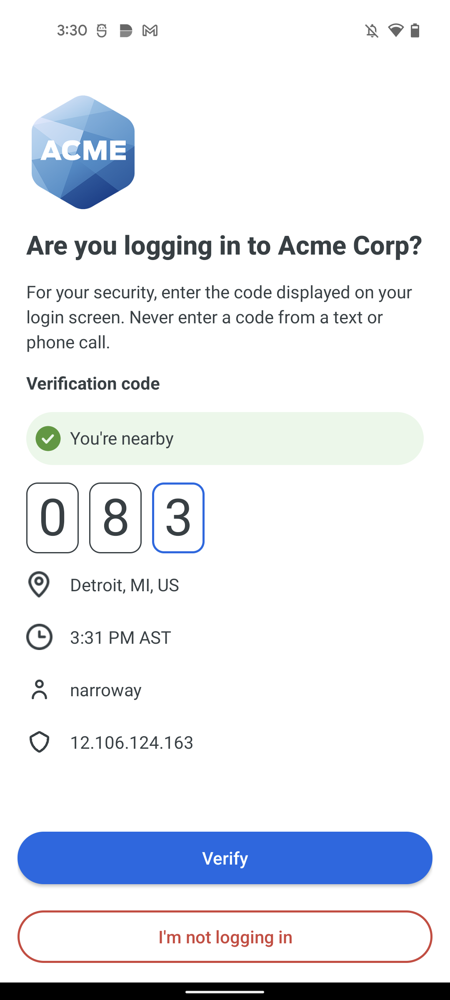

*Retrieved from Duo's <a href="https://guide.duo.com/" target="_blank">Guide to Two-Factor Authentication</a>*

MFA tokens expire after a certain period, when a new token is requested, or when that token is successfully used to authenticate with the resource. Once a token is expired, it cannot be used again.

Mobile device applications like Duo or Google Authenticator provide in-app mechanisms for providing MFA tokens, but one of the most common methods of transmitting these tokens is via text message. In the case of MFA apps such as Duo or Google Authenticator an under-the-hood algorithm predetermines the codes to be used at specific times. For this to work, both the MFA service and the MFA application have to be synchronized with each other. However, this means that you do not have to explicitly request an MFA code be sent to you, you only need to enter the current code displayed in your MFA application.

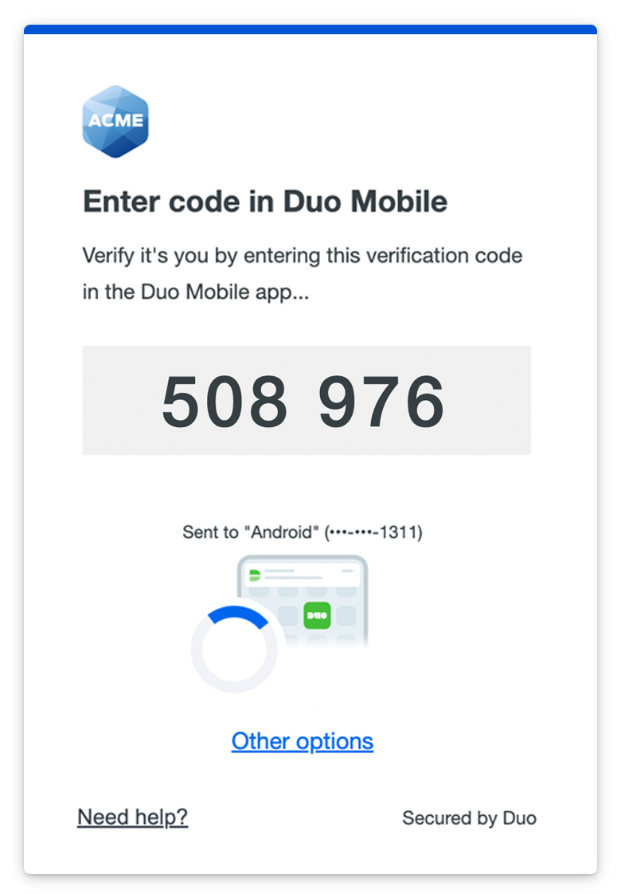

*Retrieved from Duo's <a href="https://guide.duo.com/" target="_blank">Guide to Two-Factor Authentication</a>*

#### How does MFA improve security?

While the use of MFA adds an extra layer of authentication security, it also provides protections against the compromise of accounts. If a user's credentials were compromised for a specific resource, the malicious actor would still not be able to access the resource because they would not have access to the user's MFA device or email account. This of course presumes that the user's leaked credentials were not the same for both the target service and the email account in question. This is why password re-use across services is highly discouraged.

Additionally, users should never act upon unsolicited MFA requests. For example, when email addresses are leaked in a data breach, malicious actors will try to login to various services by using those email addresses. In the case of in-app MFA authentication prompts, the user might receive an unsolicited MFA prompt on their device and should ignore them.

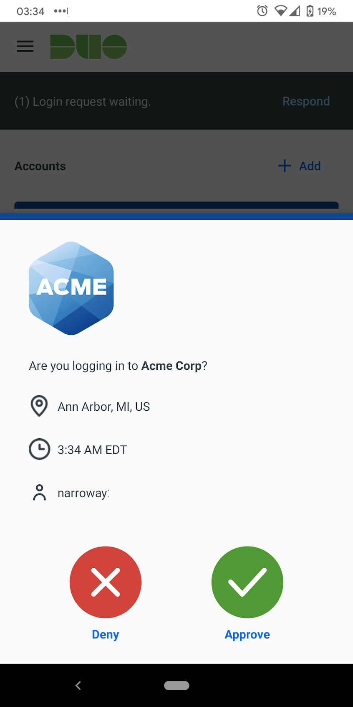

*Retrieved from Duo's <a href="https://guide.duo.com/" target="_blank">Guide to Two-Factor Authentication</a>*

A final threat with regards to phishing are well-crafted malicious sites that appear and function like the real thing. Phishing emails provide a link to a website that looks legitimate and will ask for the user's credentials and MFA code, only for this information to be captured and then used by the malicious actor.

A recent example of just this type of attack is outlined in <a href="https://www.troyhunt.com/a-sneaky-phish-just-grabbed-my-mailchimp-mailing-list/" target="_blank">Troy Hunt's blog</a>. Troy is well known for his outreach in cybersecurity education and awareness and runs the "Have I Been Pwned" site that allows individuals to query whether their accounts have been found in past public data breaches. Troy's case is an excellent example of how even the best and most well-versed cybersecurity experts can still be fooled by well-crafted phishing attacks. 

Phishing continues to pose a cybersecurity risk to users and their organization. This lab will demonstrate MFA when accessing a fictional banking website and how the use of MFA can help mitigate the risks of phishing attempts by ensuring users use MFA when accessing these resources.

</p>
</details>

## Phase 1: Trigger a Phishing Attack

| &#128204; Pin |
|---|
|_The bank website you will be interacting with has an auto-logout feature similar to a real banking website where if there is no action performed within 1 minute, it will trigger._|

<details>
<summary>
<h3>Manage and Review Your Bank Account</h3>
</summary>
<p>

1. Open the `Ubuntu-Desktop` system console and login with the username `user` and the password `tartans`. Once logged in, double-click the Firefox icon from the Desktop.

2. (**Ubuntu-Desktop**, **Firefox**) In Firefox, open a second tab (leaving the home page of `https://skills.hub` open) and browse to the URL `https://steelbankofbravos.skills.hub`. When prompted with the certificate warning page, click `Advanced`, and then `Accept the Risk and Continue`. You should then be presented with the bank's welcome page.

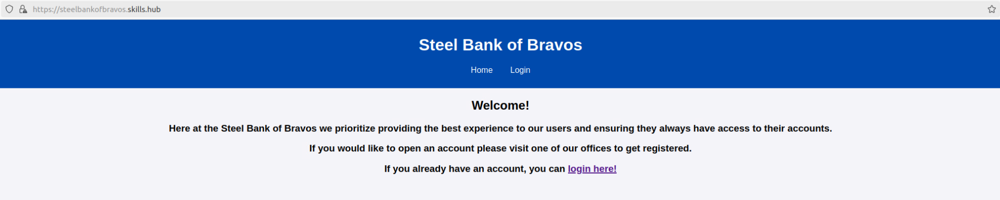

3. (**Ubuntu-Desktop**, **Firefox**) Click on the `Login` tab, and then login to the website with the following credentials:

Username: `the_hand`
Password: `noDebts`

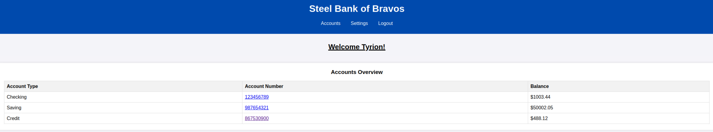

*Note: You can ignore any popups that ask if you would like to save your password in the browser.*

You will have access to a few different bank accounts with unique types and balances. Let's interact with one of them to review the types of information these accounts contain.

4. (**Ubuntu-Desktop**, **Firefox**) Click on the first account number `123456789`. 
 
Just like a normal bank account, each account's page lists the previous transactions. 

5. (**Ubuntu-Desktop**, **Firefox**) Click on the browser's back button to go back to the `Accounts` page or click on the 'Accounts' tab directly.

| &#128204; NOTE |
|---|
|Take note of the current balances of your accounts. It will be important to keep track of these as you continue the lab.|

**Knowledge Check Question 1:** *Which account has the highest starting balance - Savings, Checking, or Credit?*

6. (**Ubuntu-Desktop**, **Firefox**) Click on the `Settings` tab at the top. 

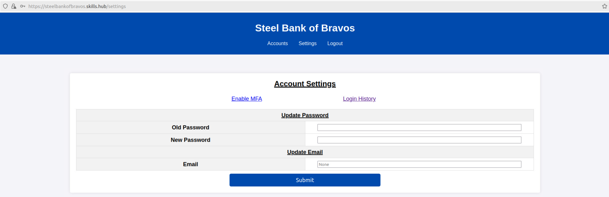

On this page you can configure the various details of your account, such as resetting your password and the associated email account. Additionally, you can view a record of all logins that have occurred for your account and enable multifactor authentication.

You'll revisit this page shortly.

</p>
</details>

<details>
<summary>
<h3>Create an Email Account for Use with MFA</h3>
</summary>
<p>

Our next step will be to create an account on the email server so we can connect it with our bank account.

1. (**Ubuntu-Desktop**, **Firefox**) Open a new tab and browse to the URL `https://box.skills.hub`. When prompted with the warning page, click `Advanced`, and then `Accept the Risk and Continue`.

2. (**Ubuntu-Desktop**, **Firefox**) On the welcome page, click on the `Register` button.

3. (**Ubuntu-Desktop**, **Firefox**) We will now create your email account. 

*All new account names will automatically be created with the domain `@skills.hub` appended to them. Only the name component of the address is needed.*

4. (**Ubuntu-Desktop**, **Firefox**) Create an account with the following credentials and click `Submit`: 

Username:   `tlannister`
Password:   `tartans@1`

You will see a successful creation message for the email account `tlannister@skills.hub`.

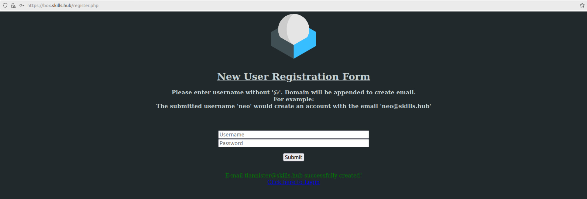

5. (**Ubuntu-Desktop**, **Firefox**) Once completed, click on the link that says `Click here to Login`.

6. (**Ubuntu-Desktop**, **Firefox**) Login to the email server using the credentials we just used to create your account.

Email:  `tlannister@skills.hub`
Password:   `tartans@1`

*Note: The login process may take a moment to complete. You can ignore any popups that ask if you would like to save your password in the browser.*

Ensure you are able to access the account's inbox and then leave this page open for use in the next section of the lab.

</p>
</details>

<details>
<summary>
<h3>Add the New Email Account to the Bank Account</h3>
</summary>
<p>

Now that we have an email address, we'll be updating your bank account with this information. 

1. (**Ubuntu-Desktop**, **Firefox**) Go back to the open tab with the bank's webpage and refresh the page to login once more. Re-login to your account with your bank account credentials: 

Username: `the_hand`
Password: `noDebts`

2. (**Ubuntu-Desktop**, **Firefox**) Browse to the `Settings` page. Click on the `Email` text field, enter the email address `tlannister@skills.hub` and then click `Submit`. The process may take a second as it is verifying the authenticity of the email address provided. Once complete, you should see the following message at the top of the page:

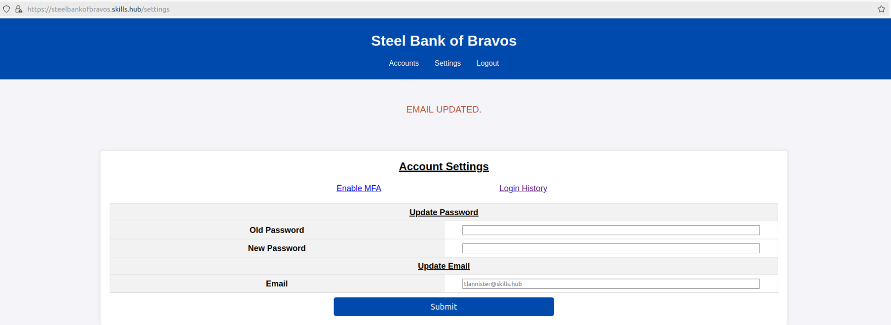

You should also see that the pre-populated value of the Email field now shows your email address. This means it has been configured correctly.

</p>
</details>

<details>
<summary>
<h3>Trigger the Phishing Attack</h3>
</summary>
<p>

1. (**Ubuntu-Desktop**, **Firefox**) Go back to the third tab that is logged into our email account. You should see that you have received a confirmation email that states your email address has been linked to your bank account. 

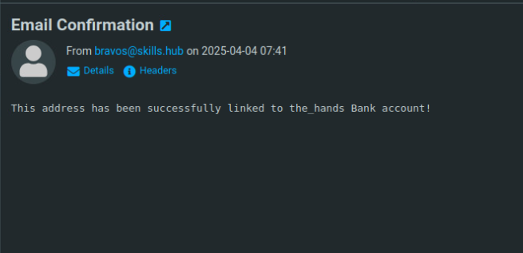

| &#9888; ALERT |
|---|
|If the email has not appeared in your inbox, you may need to refresh the inbox. This can be done with the following methods.

 - Click the `Refresh` button at the top of the page.
 
 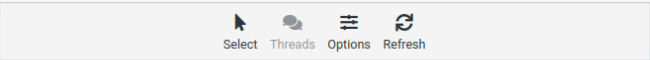

 - Click on `Inbox` on the panel present on the left side of the screen.
 
 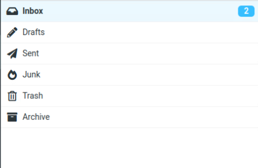

2. (**Ubuntu-Desktop**, **Firefox**) Around the same time you should receive another email with the headline reading `CRITICAL: MUST UPDATE ACCOUNT`. 

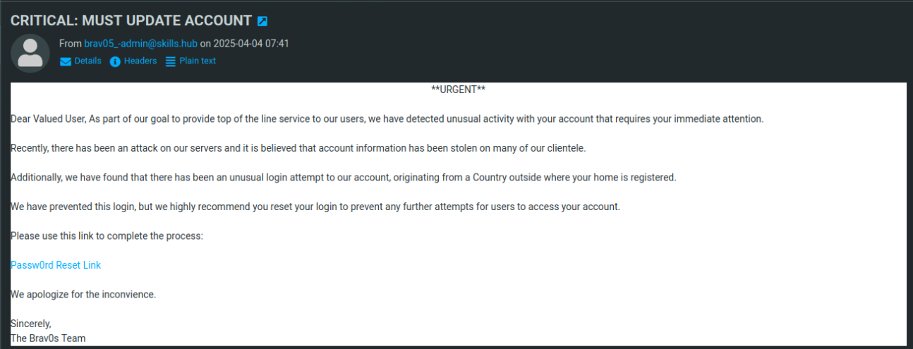

This email will explain that your account is at risk of being accessed by malicious actors and that you should update your password immediately using the provided link.

3. (**Ubuntu-Desktop**, **Firefox**) Click on the link and you will be directed to a page that appears to allow you to update your account password.  

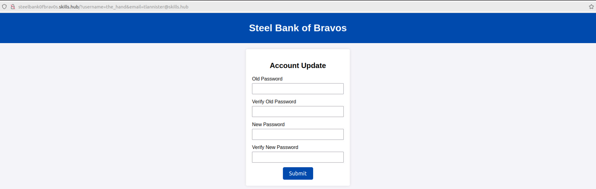

4. (**Ubuntu-Desktop**, **Firefox**) Enter the bank account's password, `noDebts`, in the first two 'Old Password' fields. For the 'New Password' fields, enter any matching password you like. Once completed, click `Submit`.

#### Grading Check

(**Ubuntu-Desktop**, **Firefox**) Browse to the grading page (if not already open) at `https://skills.hub/lab/tasks` or `(https://10.5.5.5/lab/tasks)`. Click the `Submit/Re-Grade Tasks` button to trigger the grading check.

This check will verify that you successfully triggered the phishing attack and that it has completed properly.

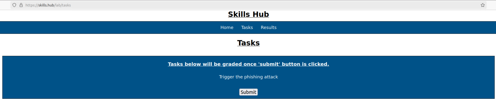

Grading Check 1: Trigger the phishing attack
 - Email link was clicked
 - Updated password was submitted
 - Phishing attack is complete

`Copy the token or flag strings to the corresponding question submission field to receive credit.`

`You should complete all phase 1 tasks before moving on to phase 2.`

5.  (**Ubuntu-Desktop**, **Firefox**) If done correctly, you should be re-directed the bank's main page, or the login page. A bit odd, but maybe it's just a security measure. Logout of the site (if not already) and attempt to login to your account with the new password you entered in the password reset form.

Username: `the_hand`  
Password: **the password you used on the password reset form we just submitted**

6.  (**Ubuntu-Desktop**, **Firefox**) You should see that the login will fail, which is unexpected. Let's try to login with our old password.

Username: `the_hand`
Password: `noDebts`

7. (**Ubuntu-Desktop**, **Firefox**) The login will succeed, and you'll be presented with your accounts page. 

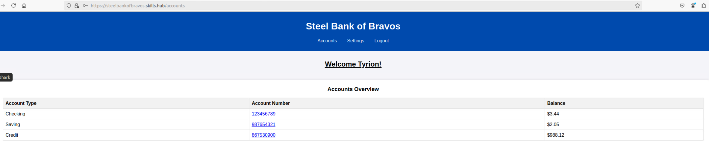

If you look at the balances of your accounts, you should see that they have been altered and no longer have the same values as before. Open each of the accounts to view their transactions.

8. (**Ubuntu-Desktop**, **Firefox**) Go to the `Settings` page and click on `Login History`. 
 
You should see that most of the logins have occurred from a single IP address, but there is one login that is from a different address.

**Knowledge Check Question 2:** What is the unique IP address that recently logged in to your bank account?

9.  (**Ubuntu-Desktop**) Open a terminal and enter the following command:
    
```bash
ip a
```

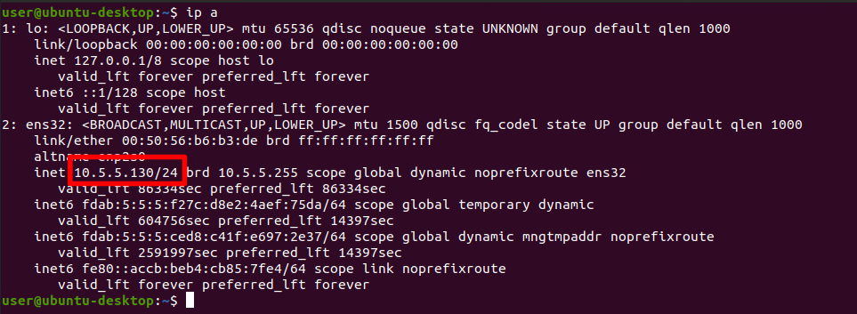

This command will tell you the IP address of your machine. In the above example, the IP of the host is `10.5.5.130`. **Please note**: Your IP may not match the example in the image.

If you look at your IP and then the records on the login history page, you can verify that your machine is the one that made most of the logins. 

This also confirms that your account was accessed by someone on a different machine. Between your password not being reset, your account being accessed from another location, and your account funds being drained, it is safe to say that you have fallen victim to a phishing attack!

</p>
</details>

## Phase 2: Implementing MFA

<details> 
<summary> 
<h3>Indicators</h3> 
</summary> 
<p> 

### Phishing Indicators in the Email Message

Before continuing with the lab, lets rewind a bit and review which phishing indicators mentioned previously were present in the phishing email we received.

1. (**Ubuntu-Desktop**, **Firefox**) Open the tab that has your email account and re-open the email that has the subject `CRITICAL: MUST UPDATE ACCOUNT` in it.


 - The header of the email includes the word "CRITICAL" and the body includes the words "IMMEDIATELY" and "URGENT", which are intended to convey a sense of immediate need or urgency. 
 - If you read the email in full, you should gather that the grammar of some of the writing is off or is not syntactically correct. 
 - Looking at the content of the email, it is a bit generic. It doesn't seem to be directed to you personally, but to "Dear Valued User".
 - Look at the sender of the email, you should see it was sent from the address `brav05_-admin@skills.hub`. This is not a legit sender, and you can verify this by comparing this address to the email you received previously when updating your account with the email address.

2. (**Ubuntu-Desktop**, **Firefox**) Hover over the link in the email and you should see a pop-up in the browser's lower left corner showing what the link actually points to.

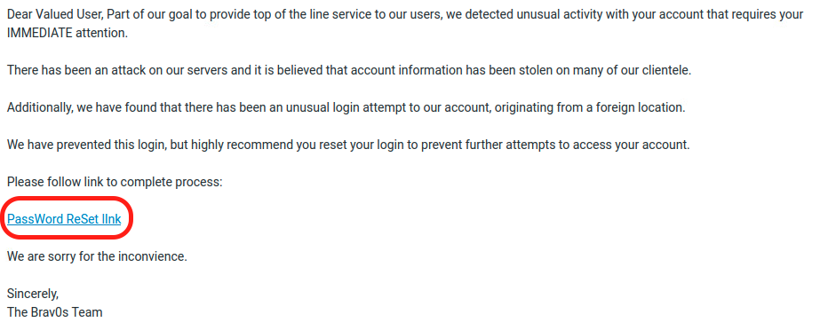

This URL looks like the real one, but if you look closely there are some differences, with the most noticeable one being that it uses zeroes - `0` instead of the letter `O`. 

**Knowledge Check 3**: What is the domain/host name in the URL link of the phishing email (ignore anything after skills.hub)?

</p>
</details>

<details> 
<summary> 
<h3>Configure MFA</h3> 
</summary> 
<p> 

1. (**Ubuntu-Desktop**, **Firefox**) Go back to the real bank website and login again if needed.

Username: `the_hand`
Password: `noDebts`

2. (**Ubuntu-Desktop**, **Firefox**) Go to the `Settings` page, and then click on `Enable MFA`.

You should be directed to a new page that states that an email with a code has been sent to your email and that you need to submit it to verify the email. 

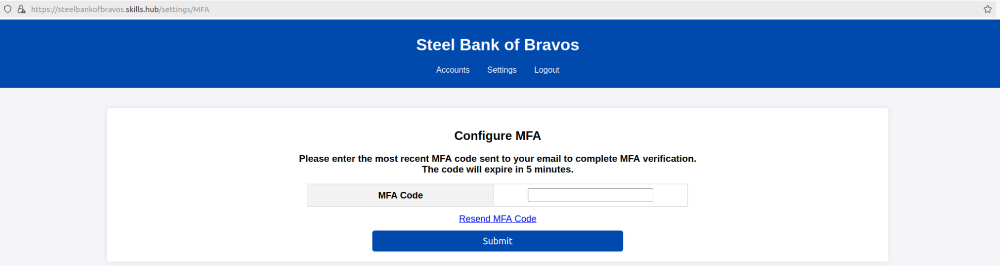

3. (**Ubuntu-Desktop**, **Firefox**) Open the tab that has your email inbox open. You should see a new email with the MFA code in it. If the email isn't there, make sure to refresh the inbox.

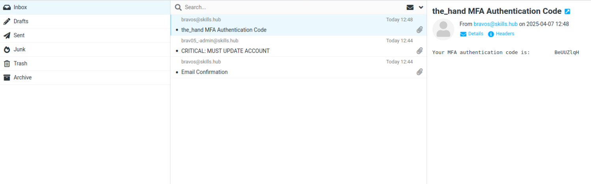

4. (**Ubuntu-Desktop**, **Firefox**) Copy the code and then go back to the banking website that's asking for the MFA code and submit it. You should see a message that MFA has been configured successfully.

We will now test it by re-logging in.

5. (**Ubuntu-Desktop**, **Firefox**) Click the `Logout` button, and then submit your credentials on the `Login` page.

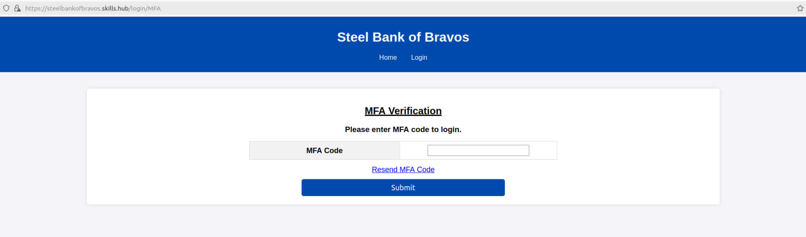

6. (**Ubuntu-Desktop**, **Firefox**) You should be presented with a new page saying an MFA code has been sent to your email and that you will need it to login.

7. (**Ubuntu-Desktop**, **Firefox**) Go back to your email inbox and you should see a new email with a new MFA code. Copy it and submit it to the MFA form on the bank website.

8. (**Ubuntu-Desktop**, **Firefox**) Upon doing this, you will be logged in and be able to view your accounts again.

#### Grading Check

(**Ubuntu-Desktop**, **Firefox**) Browse to the grading page at `https://skills.hub/lab/tasks` or `(https://10.5.5.5/lab/tasks)`. Click the `Submit/Re-Grade Tasks` button to trigger the grading check. Refresh the results after a few moments to see your results.

This check will verify that you successfully configured MFA on your bank account.

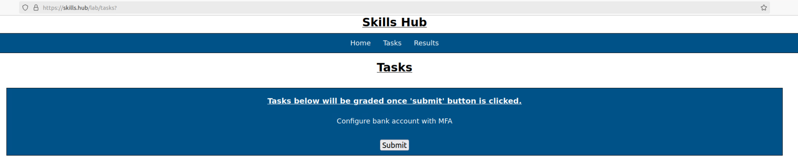

Grading Check 1: Configure bank account with MFA
 - Completed login using MFA code.

`Copy the token or flag strings to the corresponding question submission field to receive credit.`

`You should complete all phase 2 tasks before moving on to phase 3.`

</p>
</details>


## Phase 3: Re-trigger the Phishing Attack with MFA Enforced

<details> 
<summary> 
<h3>Re-trigger the Phishing Attack</h3> 
</summary> 
<p> 

Now that you have MFA configured on your account, let's re-trigger the phishing attack and see what happens.

1. (**Ubuntu-Desktop**, **Firefox**) Open the tab that has your email and open the `CRITICAL` email.

2. (**Ubuntu-Desktop**, **Firefox**) Click on the link and fill out the password reset form same as you did before. The old password is `noDebts`. The new password can be anything.

3. (**Ubuntu-Desktop**, **Firefox**) This time, you should get a response stating that the form couldn't be submitted.

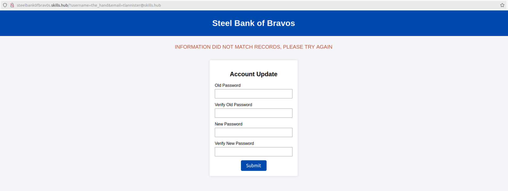

The form now fails with the same information due to the account not requiring an MFA code.

1. (**Ubuntu-Desktop**, **Firefox**) Go to your email inbox and you should see that you have received a new email with an unsolicited MFA code, meaning one that you did not ask for. This confirms that an unknown login attempt was made.

2. (**Ubuntu-Desktop**, **Firefox**) Go to the real banking website and login once more. 

3. (**Ubuntu-Desktop**, **Firefox**) Go to the `Settings` page and click on `Login History`. 

You should see that a new login attempt occurred, but that the login was unsuccessful. This is because MFA prevented the user from completing the authentication process and prevented the attacker from accessing your accounts.

**Knowledge Check Question 4**: What is the unique IP address that recently *failed to* login to your bank account?

#### Grading Check

(**Ubuntu-Desktop**, **Firefox**) Browse to the grading page at `https://skills.hub/lab/tasks` or `(https://10.5.5.5/lab/tasks)`. Click the `Submit/Re-Grade Tasks` button to trigger the grading check. Refresh the results after a few moments to see your results.

This check will verify that you mitigated the phishing attack by configuring MFA.

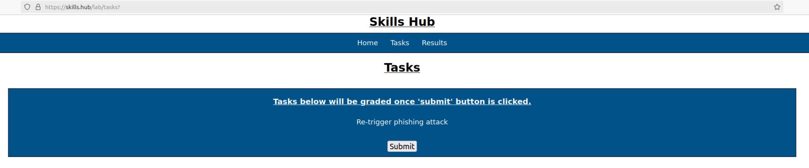

Grading Check 3: Re-trigger phishing attack
 - Email link was clicked
 - Updated password was submitted
 - Phishing attack is complete

`Copy the token or flag strings to the corresponding question submission field to receive credit.`

</p>
</details>

<details>
<summary>
<h2>Lab Wrap Up</h2>
</summary>
<p>

### Conclusion

By completing this lab, you have become more familiar with phishing and how it can be mitigated by implementing multifactor authentication.

To recap:
 - You viewed how phishing attacks occur and the potential consequences, such as stolen credentials.
 - You configured an account to use multifactor authentication.
 - You mitigated a phishing attack and identified the failed login by having multifactor authentication enabled

Skills exercised:
 - S0544: Skill in recognizing vulnerabilities
 - S0667: Skill in assessing security controls
 - S0840: Skill in identifying misuse activities
 
Phishing attacks continue to be a cybersecurity risk, targeting individuals and organizations alike. While implementing multifactor authentication (MFA) is a valuable security measure, it does not completely eliminate the risk of phishing. However, it can significantly mitigate the risks of phishing attempts being successful. Proper awareness and training on how to identify phishing attempts is crucial knowledge that every user should possess. This awareness, combined with a robust security posture, is essential for organizations to effectively prevent the execution of malicious phishing attacks.

### Answer Key

**Knowledge Check Question 1**: Which account has the highest starting balance?
 - *Savings*

**Knowledge Check Question 2**: What is the unique IP address that recently logged in to your bank account?
 - *10.7.7.100*

**Knowledge Check 3**: What is the domain/host name in the URL link of the phishing email (ignore anything after skills.hub)?
 - *steelbank0fbrav0s.skills.hub*

**Knowledge Check Question 4**: What is the unique IP address that recently *failed to* login to your bank account?
 - *10.7.7.137*

### References
 - <a href="https://www.cisa.gov/news-events/news/avoiding-social-engineering-and-phishing-attacks" target="_blank">Avoiding Social Engineering and Phishing Attacks</a>
 - <a href="https://www.cisa.gov/MFA" target="_blank">Cybersecurity Best Practices</a>
 - <a href="https://www.cisa.gov/resources-tools/resources/federal-civilian-executive-branch-fceb-operational-cybersecurity-alignment-focal-plan" target="_blank">Federal Civilian Executive Branch (FCEB) Operational Cybersecurity Alignment (FOCAL)</a>
 - <a href="https://guide.duo.com/" target="_blank">Guide to Two-Factor Authentication</a>
 - <a href="https://www.cisa.gov/sites/default/files/publications/fact-sheet-implementing-phishing-resistant-mfa-508c.pdf" target="_blank">Implementing Phishing-Resistant MFA fact sheet</a>
 - <a href="https://www.cisa.gov/topics/cyber-threats-and-advisories/malware-phishing-and-ransomware" target="_blank">Malware, Phishing, and Ransomware</a>
 - <a href="https://www.cisa.gov/resources-tools/resources/phishing-guidance-stopping-attack-cycle-phase-one" target="_blank">Phishing Guidance</a>
 - <a href="https://www.cisa.gov/secure-our-world/require-multifactor-authentication" target="_blank">Secure Our World</a> 
 - <a href="https://www.troyhunt.com/a-sneaky-phish-just-grabbed-my-mailchimp-mailing-list/" target="_blank">Troy Hunt's blog</a>
