# Secure Programming: Dependency Supply Chain Attacks

In this lab, we explore several attacks that target third-party packages software developers depend on. Because we're in a closed lab environment, the package registries contain only a few tiny example packages for demonstration purposes. In the real world, public registries host *millions* of packages, each maintained by its own development team. This scale helps explain why these attacks can sometimes succeed. Even if these attacks are only effective 1% of the time, more developers aware of the possibilities can help drive that number down.

CISA reminds us of many of these risks in the <a href="https://www.cisa.gov/sites/default/files/2023-09/CISA-Open-Source-Software-Security-Roadmap-508c.pdf" target="_blank">CISA Open Source Software Security Roadmap</a>.

| &#9201; LAB TIME                         |
| ---------------------------------------- |
| This lab is expected to take 90 minutes. |

*Please consider filling out the lab feedback survey at the bottom of your screen. The survey is available to you at any time while conducting the lab.*

| &#9888; CAUTION                                              |
| ------------------------------------------------------------ |
| You must complete *all* phases of the lab to receive your completion certificate. |

## Learning Objectives

- Identify similarities between dependency managers for Java, JavaScript, and Rust.
- Recognize types of dependency supply chain attacks and their potential impact.
- Learn how to mitigate these attacks.
- Use tools to audit packages for dependencies with known vulnerabilities.

## Learner Expectations

- Comfortable using an Internet browser.
- Comfortable with command-line operations.
- Comfortable using a text editor. The lab guide suggests `nano` , but you may use any of the editors available on the system, including VS Code.

## FOCAL and NICE Framework Mappings

This lab maps with <a href="https://www.cisa.gov/resources-tools/resources/federal-civilian-executive-branch-fceb-operational-cybersecurity-alignment-focal-plan" target="_blank">Federal Civilian Executive Branch (FCEB) Operational Cybersecurity Alignment (FOCAL)</a> Area 4 (Cyber Supply Chain Risk Management), by demonstrating attacks on the software development supply chain and how to mitigate such attacks.

**NICE Work Role**

- <a href="https://niccs.cisa.gov/workforce-development/nice-framework" target="_blank">Secure Software Development and Software Security Assessment</a>

**NICE Tasks**

- <a href="https://niccs.cisa.gov/workforce-development/nice-framework" target="_blank">T1261</a>: Mitigate programming vulnerabilities
- <a href="https://niccs.cisa.gov/workforce-development/nice-framework" target="_blank">T1400</a>: Design and develop secure applications
- <a href="https://niccs.cisa.gov/workforce-development/nice-framework" target="_blank">T1197</a>: Identify common coding flaws
- <a href="https://niccs.cisa.gov/workforce-development/nice-framework" target="_blank">T1319</a>: Document software attack surface elements

<!-- cut -->

## Scenario

This lab guides you through using different dependency management tools for Java, JavaScript, and Rust. Throughout the lab you perform basic versions of common software dependency attacks, see how they appear from a developer's perspective, and learn how to mitigate them. 

An Ubuntu Linux machine is provided to complete the lab.

## System Tools and Credentials

| System | OS type/link |  Username | Password |
|--------|---------|-----------|----------|
| ubuntu-desktop | Ubuntu-Desktop | user | tartans |

## Phase 1: Typosquatting

Typosquatting is a supply chain attack where an attacker uploads a package to a registry with a name very similar to a real package, hoping to trick users into installing the fake one.

<details>
<summary>
<h3>Publishing a Malicious Package</h3>
</summary>
<p>

First, we look at the package website in the lab. Because we're in a closed lab environment and the official `npm` (Node Package Manager) registry isn't available for private use here, we're using an open-source alternative called `verdaccio`. For this lab, the software behind the site doesn't affect how typosquatting works.

1. Open the `ubuntu-desktop` system console and login with the username `user` and the password `tartans`. Once logged in, click on the Firefox icon in the upper-left of the Desktop.

2. (**ubuntu-desktop**, **Firefox**) The browser opens the `skills.hub` site by default. In a new browser tab, browse to the Verdaccio package site at `http://10.5.5.5:4873`. You see only a few packages available.

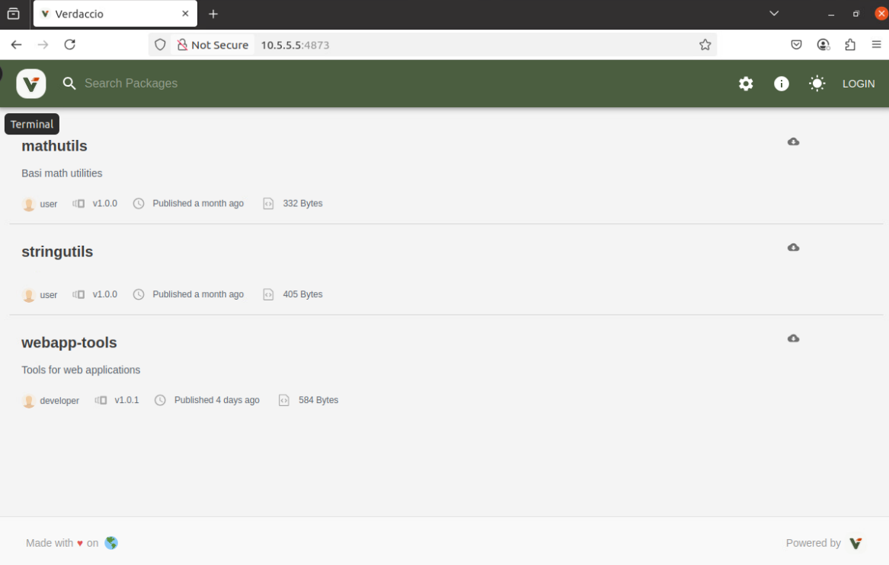

The lab uses the `webapp-tools` package as an example. The lab VM already has a copy of this package, so you do not need to download it at his time. While this attack doesn't require the original package, the example in the lab demonstrates how a malicious package can be modified to do harmful things. First, inspect the original package, note what to change for the attack to succeed, and then run the attack.

3. (**ubuntu-desktop**, **Terminal**) Open the terminal from the dock menu on the lefthand side (third icon from the top).

4. (**ubuntu-desktop**, **Terminal**) Run the following command to change directories to where the webapp resides: 

```bash
cd /home/user/Documents/JavaScript/packages/original-webapp-tools
```

5. (**ubuntu-desktop**, **Terminal**) Run the `ls` command to view the contents of the directory. 

Two files are present: `index.js` and `package.json`.

6. (**ubuntu-desktop**, **Terminal**) Run the following command to print the contents of `index.js`: 

```bash
cat index.js
``` 

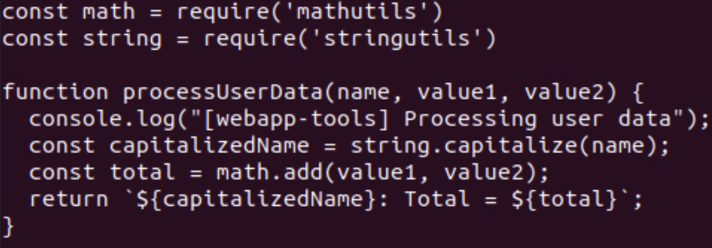

This is the main JavaScript (.js) code. It imports two other packages, `mathutils` and `stringutils`, both served on the Verdaccio site. It also defines and exports the `processUserData` function.

7. (**ubuntu-desktop**, **Terminal**) Run the following command to print the contents of `package.json`:

```bash
cat package.json
```

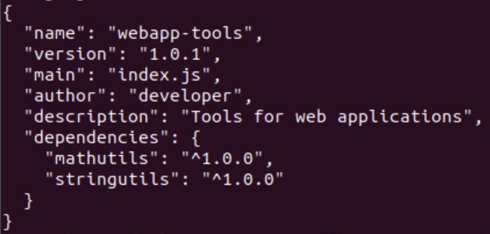

The filetype, .json, stands for JavaScript Object Notation. This file gives `npm` information about the package, including its dependencies. The `^` symbol is special in Java/JavaScript and is covered later in the lab. [Here](https://docs.npmjs.com/cli/v6/using-npm/semver) is a reference for other JavaScript symbols. We explain this more in the next section, especially for Java.

8. (**ubuntu-desktop**, **Terminal**) Run the following command to copy the original package files into the attack directory and move there:

```bash
cp * ../webapptools && cd ../webapptools
```

9. (**ubuntu-desktop**, **Terminal**)  Open `package.json` for editing with the following command:

```bash
nano package.json
```

10. (**ubuntu-desktop**, **Terminal**) Rename the package in the metadata by changing the text string of `webapp-tools` to `webapptools`.

The updated code should look like this:

```json
{
  "name": "webapptools",
  "version": "1.0.1",
  "main": "index.js",
  "author": "developer",
  "description": "Tools for web applications",
  "dependencies": {
    "mathutils": "^1.0.0",
    "stringutils": "^1.0.0"
  }
}
```

This subtle name change may trick inattentive developers into using this package instead of the real one.

11. (**ubuntu-desktop**, **Terminal**)  Once complete, save the file by pressing **Ctrl+s** to save and **Ctrl+x** to exit. 

12. (**ubuntu-desktop**, **Terminal**) Open `index.js` for editing with the following command:

```bash
nano index.js
```

13. (**ubuntu-desktop**, **Terminal**) Add a new line **after** the line that contains the text `console.log`, maintaining the same indentation:

```js
console.log("[webapp-tools] Stole user data:", name, value1, value2);
```

Your file should look like this:

```js
const math = require('mathutils')
const string = require('stringutils')

function processUserData(name, value1, value2) {
  console.log("[webapp-tools] Processing user data");
  console.log("[webapp-tools] Stolen user data:", name, value1, value2);
  const capitalizedName = string.capitalize(name);
  const total = math.add(value1, value2);
  return `${capitalizedName}: Total = ${total}`;
}

module.exports = { processUserData };
```

14. (**ubuntu-desktop**, **Terminal**)  Once complete, save the file by pressing **Ctrl+s** to save and **Ctrl+x** to exit. 

This added line makes the change easy to spot for the purposes of the lab. In real attacks, malicious code is often hidden within normal code.

| &#128736; TOOL TIP: npm |
|---|
| Recall that `npm` stands for **Node Package Manager**. It's the default package manager for JavaScript and Node.js projects. `npm` helps developers install, manage, and share reusable code packages (called modules or packages) from a large online registry. |

15. (**ubuntu-desktop**, **Terminal**) Login to the npm registry with the following command:

```bash
npm login
```

In the prompts that follow, you can enter any username, password, and email as the lab registry doesn't require real authentication, making these values inconsequential.

16. (**ubuntu-desktop**, **Terminal**) Publish your updates with the following command:

```bash
npm publish
```

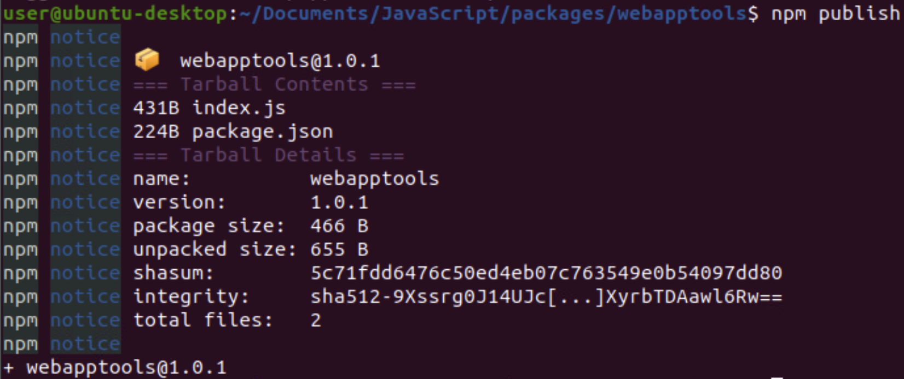

17. (**ubuntu-desktop**, **Firefox**) Return to the registry website `http://10.5.5.5:4873` and refresh it to see the package is now listed.

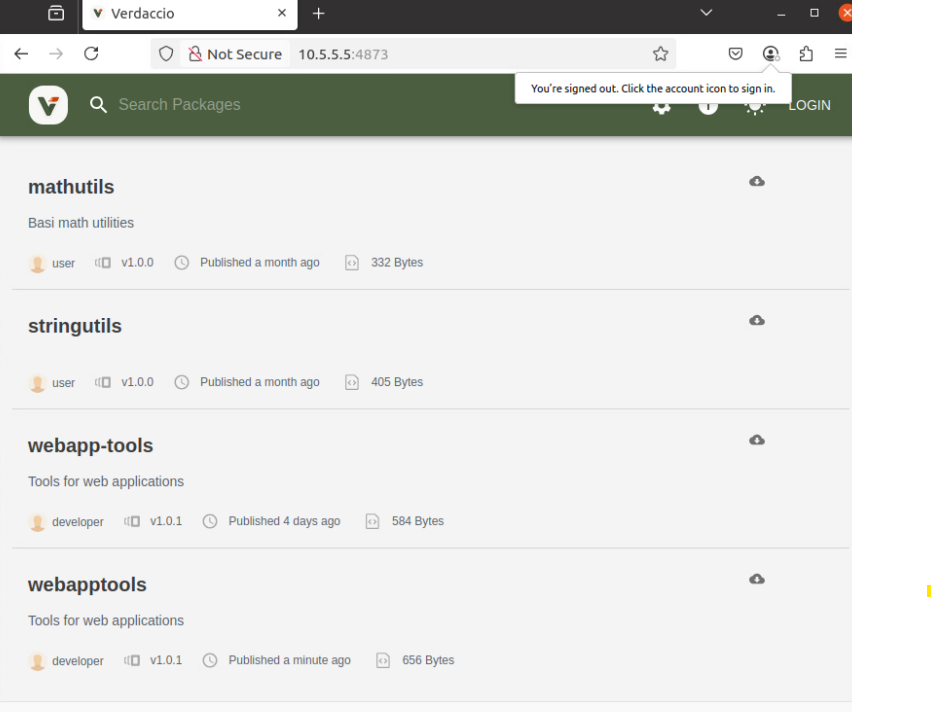

</p>
</details>

<details>
<summary>
<h3>Using the Package</h3>
</summary>
<p>

Now that the malicious package is published, investigate what happens from the developer's perspective as they use the malicious package instead of the safe one.

1. (**ubuntu-desktop**, **Terminal**) In the terminal, move into the demo app directory that uses the original `webapp-tools` package with the following command:

```bash
cd /home/user/Documents/JavaScript/apps/clean_app
```

2. (**ubuntu-desktop**, **Terminal**) Print the application code using the following command:

```bash
cat app.js
```

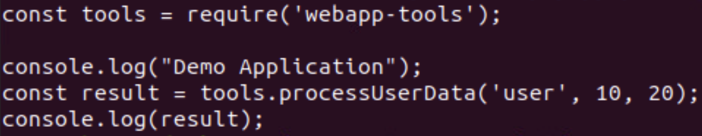

* The first line imports the `webapp-tools` package so the app can use its exported function.
* After the first `console.log`, the app executes the following code:

```javascript
tools.processUserData('user', 10, 20);
```

This line performs addition of the two numbers in the parenthesis: `10` and `20`.

3. (**ubuntu-desktop**, **Terminal**) Run the demo app with the following command:

```bash
node app.js
```

In the output, notice that it states that it is `Adding numbers` and in the final line, it states `Total = 30`.

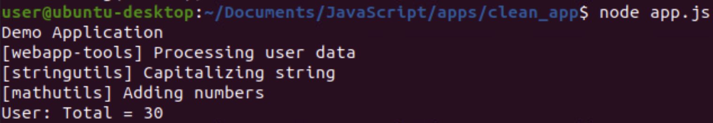

4. (**ubuntu-desktop**, **Terminal**) Switch to the demo app that uses the altered package with the following command:

```bash
cd /home/user/Documents/JavaScript/apps/typo_app
```

* This folder only contains one file: `app.js`.
* The only difference from the clean app is that it imports `webapptools` instead of `webapp-tools`.
* While this could alert a careful developer, it relies on knowing the real name includes a dash (`-`) and spotting this minor difference. Some development tools may auto-import based on the name of what is already installed, removing this safeguard.

5. (**ubuntu-desktop**, **Terminal**) Install the malicious package with `npm` using the following command:

```bash
npm install webapptools
```

6. (**ubuntu-desktop**, **Terminal**) Run the app like before using the following command:

```bash
node app.js
```

The only difference in the output is the extra line that is being printed from the malicious code you added earlier. Of course, the change could be far more substantial than what is presented in the lab and would also be obfuscated to hide itself from the user.

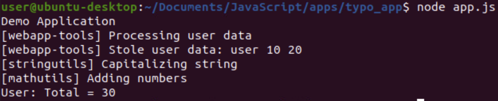

**Knowledge Check Question 1:** *What is the command-line program used to manage JavaScript dependencies? (three letters)*

</p>
</details>

<details>
<summary>
<h3>Mitigation</h3>
</summary>
<p>

The best way to prevent typosquatting attacks is to incorporate a review process for adding new dependencies. Being aware of typosquatting attacks and specifically checking for them during reviews thwarts most attempts.

As a sanity check, official registries often show download statistics. If a new dependency  has a similar name to a well-known and often-used dependency, but has very few downloads, it might not be the real package. Package registries also usually offer copyable install commands to help avoid mistyping package names.

Finally, be cautious when installing dependencies. It's tempting to add third-party packages when coding, but often you can use the language's standard library instead. This can reduce the need to add external dependencies altogether.

</p>
</details>

<details>
<summary>
<h3>Phase 1 Grading Check<h3>
</summary>
<p>

1. (**ubuntu-desktop**, **Firefox**) To check your work, browse to the grading page at `https://skills.hub/lab/tasks` or `(https://10.5.5.5/lab/tasks)`. Click the `Submit/Re-Grade Tasks` button to trigger the grading checks. Refresh the results after a few moments to see your results.

These two checks verify the successful creation and publication of the malicious package. 

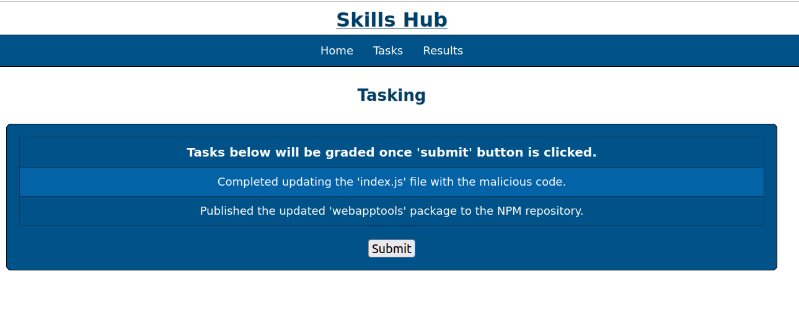

**Grading Check 1:** Completed updating the "index.js" file with the malicious code.
   - The "index.js" file was edited and the malicious code was inserted into it.

**Grading Check 2:** Published the updated "webapptools" package to the NPM repository.
   - The malicious package "webapptool" was published.

`Copy the token or flag strings to the corresponding question submission field to receive credit.`

`You should complete all phase 1 tasks before moving on to phase 2.`

</p>
</details>

## Phase 2: Package Hijacking

Package hijacking happens when a legitimate package is compromised and a new version with malicious code is released. How the compromise occurs can vary, but in this lab, we assume the package developer's credentials were leaked.

<details>
<summary>
<h3>Application Demo</h3>
</summary>
<p>

This section introduces the Maven repository, which is used for the Java programming language.

1. (**ubuntu-desktop**, **Terminal**) Navigate to the demo app directory and list its files:

```bash
cd /home/user/Documents/Java/apps/clean_app && ls
```

This is the app we use to demonstrate the hijacked package by imitating basic credential authentication.

2. (**ubuntu-desktop**, **Terminal**) Open `pom.xml` to review dependencies:

```bash
nano pom.xml
```

Locate the `<dependencies>` section. You see `secure-utils` listed as the only dependency, with the version set to `LATEST`. Note that `LATEST` pulls the newest version but causes warnings when running Maven commands. Press **Ctrl+x** to exit

3. (**ubuntu-desktop**, **Terminal**) Resolve dependencies using Maven with the following command (this may take a moment to download):

```bash
mvn dependency:resolve
```

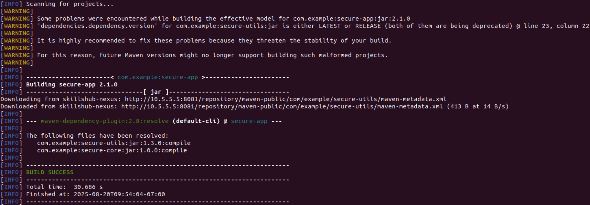

4. (**ubuntu-desktop**, **Terminal**) Clean and compile the app with the following command:

```bash
mvn clean compile
```

Note the line that reads "[INFO] BUILD SUCCESS" near the end of the output, which indicates the command was successful.

5. (**ubuntu-desktop**, **Terminal**) Run the app, specifying a Java type, with the following command:

```bash
mvn exec:java
```

In the output, see that the first authentication check succeeded while the second check with the "wrong password" failed. This is the expected behavior.

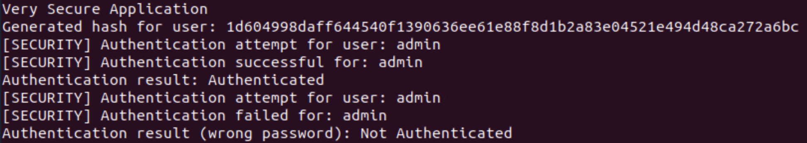

In the next section, you publish a malicious version of the package.

</p>
</details>

<details>
<summary>
<h3>Publishing a New Version of a Package</h3>
</summary>
<p>

1. (**ubuntu-desktop**, **Firefox**) Open Firefox and in a new tab browse to `http://10.5.5.5:8081`, which is the **SonaType Nexus Repository Community Edition** page. The site may take a moment to load.

| &#8505; NOTE |
|---|
| This software is like the real Maven Central registry server. In this lab, we use a simplified setup. |

2. (**ubuntu-desktop**, **Firefox**) Click the **Browse** button to view the list of registries, then click on the `maven-public` entry.

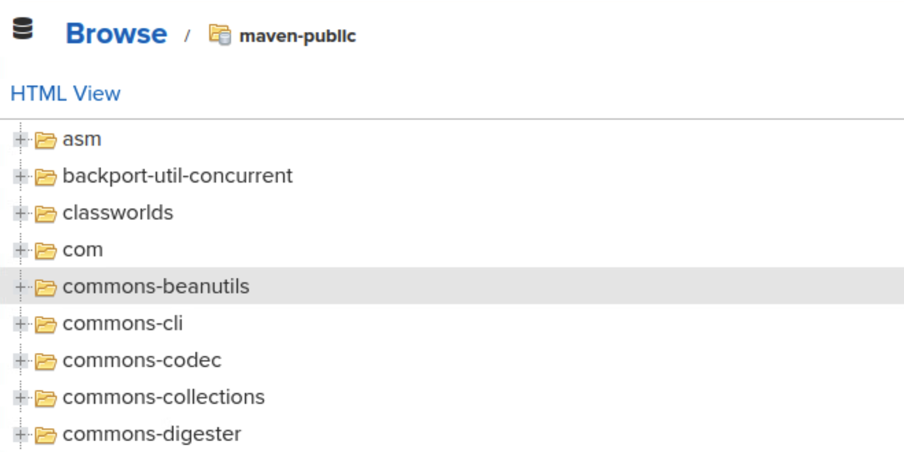

This registry contains the packages necessary for the lab.

3. (**ubuntu-desktop**, **Firefox**) Navigate through the packages to the folder `com/example/secure-utils/1.3.0`

This is the package version used currently in the lab environment.

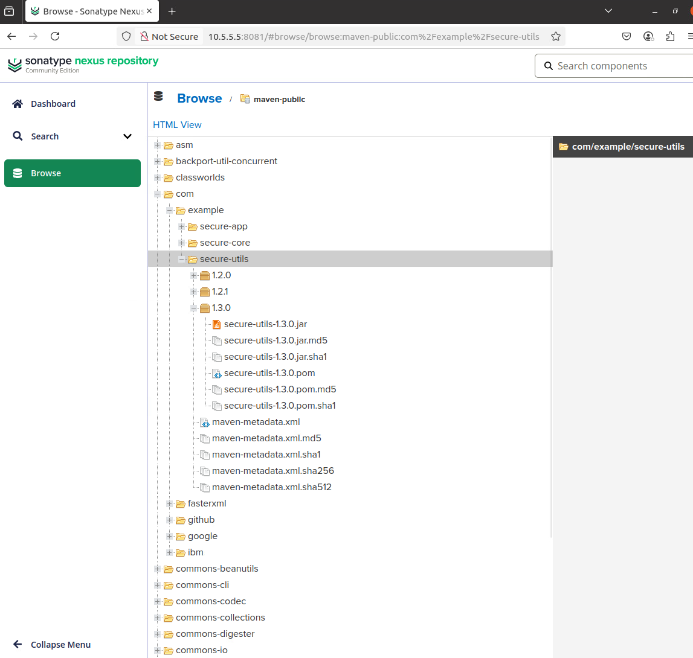

4. (**ubuntu-desktop**, **Terminal**) Back in the terminal, change directories to the package source and list files with the following command:

```bash
cd /home/user/Documents/Java/packages/secure-utils && ls
```

You see a `pom.xml` file and a `src` directory.

5. (**ubuntu-desktop**, **Terminal**) Print the package metadata with the `cat` command:

```bash
cat pom.xml
```

The `pom.xml` file is like the `package.json` file in `npm`; it contains important metadata, including the package version.

6. (**ubuntu-desktop**, **Terminal**) Print the package source code with the `cat` command:

```bash
cat src/main/java/com/example/utils/AuthenticationHelper.java
```

| &#128736; TIP! |
|---|
| Type `cat src` and then press Tab several times to autocomplete the path, as there is only one file in this directory structure. |

Notice the commented line indicating this is a hijacked package (for demonstration purposes).

**Knowledge Check Question 2:** *Which file contains project metadata, such as project dependencies, for Java's third-party dependency management tool, Maven? (with or without the file extension)*

7. (**ubuntu-desktop**, **Terminal**) Copy the entire package to a working directory and switch to it with the following command:

```bash
cp -r * ../hijacked-secure-utils/ && cd ../hijacked-secure-utils/
```

8. (**ubuntu-desktop**, **Terminal**) Open `pom.xml` for editing using `nano`:

```bash
nano pom.xml
```

9. (**ubuntu-desktop**, **Terminal**) Change the line `<version>1.3.0</version>` to the following:

```xml
<version>1.3.1</version>
```

Then save the file and exit (**Ctrl+s**, **Ctrl+x**).

10. (**ubuntu-desktop**, **Terminal**) Next, edit the source code to activate the malicious code. Start by opening the file with the following command (Tab complete helps here as well):

```bash
nano src/main/java/com/example/utils/AuthenticationHelper.java
```

11. (**ubuntu-desktop**, **Terminal**) In the `nano` text editor, remove the text `// ` (double slash and space) to uncomment the indicated line inside the `authenticateUser` method. The line that begins with "System.out.println" should match the indentation of the line above that starts with "String.passwordHash".

Then save and exit (**Ctrl+s**, **Ctrl+x**).

12. (**ubuntu-desktop**, **Terminal**) Compile the package with Maven using the following command:

```bash
mvn clean compile
```

Note the line that reads "[INFO] BUILD SUCCESS" near the end of the output, which indicates the command was successful.

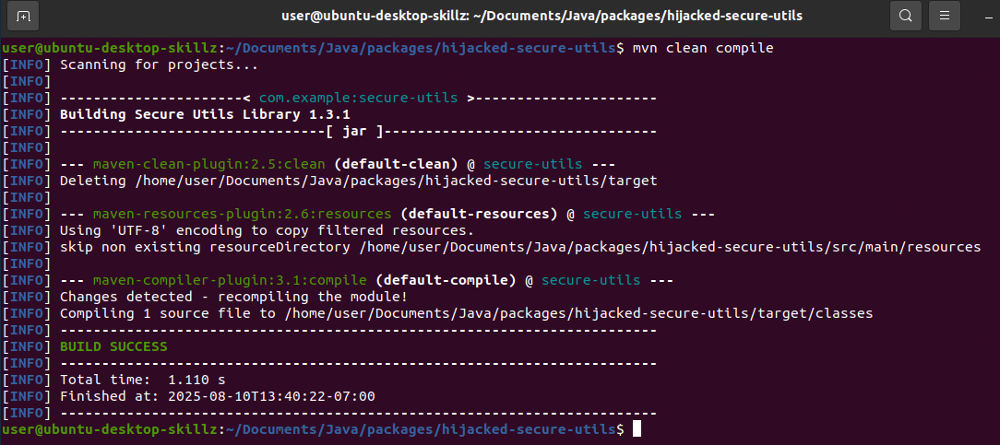

13. (**ubuntu-desktop**, **Terminal**) Deploy the new version to the Nexus repository with the following command:

```bash
mvn deploy
```

**NOTE:** This process may take a few minutes.

Note the line that reads "[INFO] BUILD SUCCESS" near the end of the output, which indicates the command was successful.

| &#128270; INFORMATION |
|---|
|Normally, deployment requires developer credentials, but this lab's Maven setup uses static credentials stored on your machine.|
    
14. (**ubuntu-desktop**, **Firefox**) Return to Firefox tab displaying the Nexus web page and refresh it. The page may take a moment to load.

Under the folder `com/example/secure-utils` notice the new version of `1.3.1` for `secure-utils` is listed.

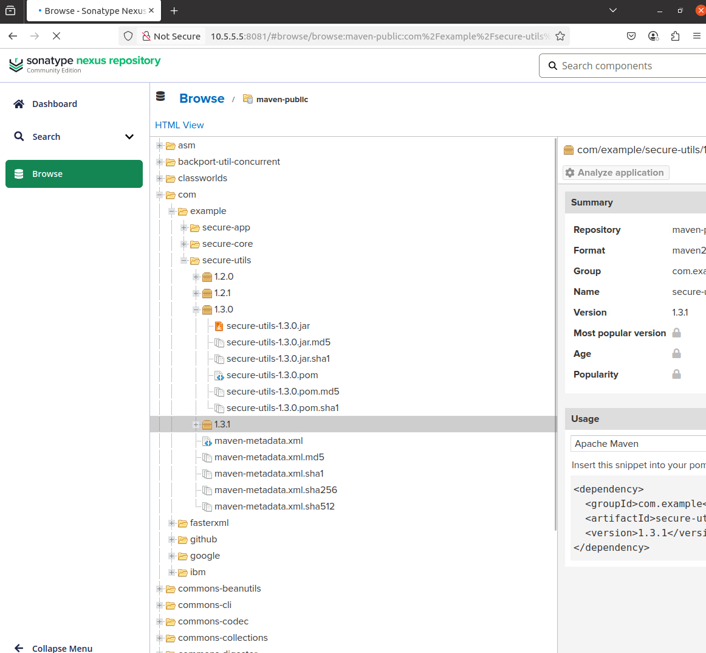

Now that the malicious package is published, see what happens whan a developer uses it without reviewing the code changes.

</p>
</details>

<details>
<summary>
<h3>Using the Package</h3>
</summary>
<p>

With the malicious new package in place, let's see how it works.

1. (**ubuntu-desktop**, **Terminal**) Navigate to the application directory with the following command:

```bash
cd /home/user/Documents/Java/apps/clean_app
```
   
2. (**ubuntu-desktop**, **Terminal**) Run the following commands to resolve dependencies, compile, and run the app:

```bash
mvn dependency:resolve
mvn clean compile
mvn exec:java
```

In the output, additional lines are printed by the updated package version, exposing the passwords that were used during the authentication checks. This would be a bad vulnerability to have and demonstrates the severity of the types of vulnerabilities that can be introduced by a malicious update.

</p>
</details>

<details>
<summary>
<h3>Mitigation</h3>
</summary>
<p>

Resolve the vulnerability by reverting to the last known secure version of the package.

1. (**ubuntu-desktop**, **Terminal**) Open the terminal and run `nano pom.xml`. Change the version of the dependency back to `1.3.0` by replacing the string `LATEST` with `1.3.0` in the `dependency` tag for `secure-utils`. 

2. (**ubuntu-desktop**, **Terminal**) Save the file by pressing the keys **CTRL+s** followed by **CTRL+x**.

3. (**ubuntu-desktop**, **Terminal**) Run the following commands in order and observe the output:

```bash
mvn dependency:resolve
mvn clean compile
mvn exec:java
```

Once again, the application behaves normally and does not output the plaintext passwords.

#### Takeaways

Always pin or lock applications to a specific version of a dependency. This prevents your project from automatically using the latest version of a package, giving the developer control over updates and allows time for review before accepting the use of updated packages.

Using `LATEST` is not recommended. Maven allows other syntax to specify required dependency versions in `pom.xml`. You can read about version ranges [here](https://maven.apache.org/pom.html#Dependency_Version_Requirement_Specification). Be careful: poorly-specified ranges can behave like `LATEST`.

Use a lock file to secure all dependencies. A lock file lists the exact versions of all dependencies and sub-dependencies for the project. Many dependency managers create this file automatically. Lock files help ensure that anyone installing the project gets the same versions the developer used, which can prevent unexpected changes or vulnerabilities.

</p>
</details>

<details>
<summary>
<h3>Phase 2 Grading Check<h3>
</summary>
<p>

1. (**ubuntu-desktop**, **Firefox**) To check your work, browse to the grading page at `https://skills.hub/lab/tasks` or `(https://10.5.5.5/lab/tasks)`. Click the `Submit/Re-Grade Tasks` button to trigger the grading checks. Refresh the results after a few moments to see your results.

These two checks verify that you were able to successfully create the malicious package and publish it. 


**Grading Check 3:** Completed updating the "AuthenticationHelper.java" file with the malicious code.
   - The "index.js" file was edited and the malicious code was inserted into it.

**Grading Check 4:** Published version 1.3.1 of the package "secure-utils" to the Nexus repository.
   - The malicious package "secure-utils" was published.

`Copy the token or flag strings to the corresponding question submission field to receive credit.`

`You should complete all phase 2 tasks before moving on to phase 3.`

</p>
</details>


## Phase 3: Malicious Build Scripts in Dependencies

This phase is not a direct attack on the dependency supply chain. Instead, it shows what can happen if a dependency has a **build script** that runs before the actual program is compiled. An example of this occurred with the vulnerable XZ Utils version released in April of 2024.

*Be sure to check out the lab on the XZ Utils vulnerability in the Practice Area*

<details>
<summary>
<h3>Application Demo</h3>
</summary>
<p>

**Rust** is perfect for this example because Rust packages can include a special file called `build.rs` that runs automatically during the build process.

The example uses **typosquatting** (making a fake package with a similar name), but the same technique could be used in a **package hijacking** attack.

A fake version of the **Crates.io** package registry is available at: `http://10.5.5.5:4200`.

1. (**ubuntu-desktop**, **Firefox**) Open a new Firefox tab and browse to  `http://10.5.5.5:4200`. 

| &#9888; WARNING                                              |
| ------------------------------------------------------------ |
| This may load slowly because it initially tries to reach the Internet, which is not accessible within the lab environment. |

Our target is the `binproto` package. You can search for it to show more detail. We will return to this page shortly.

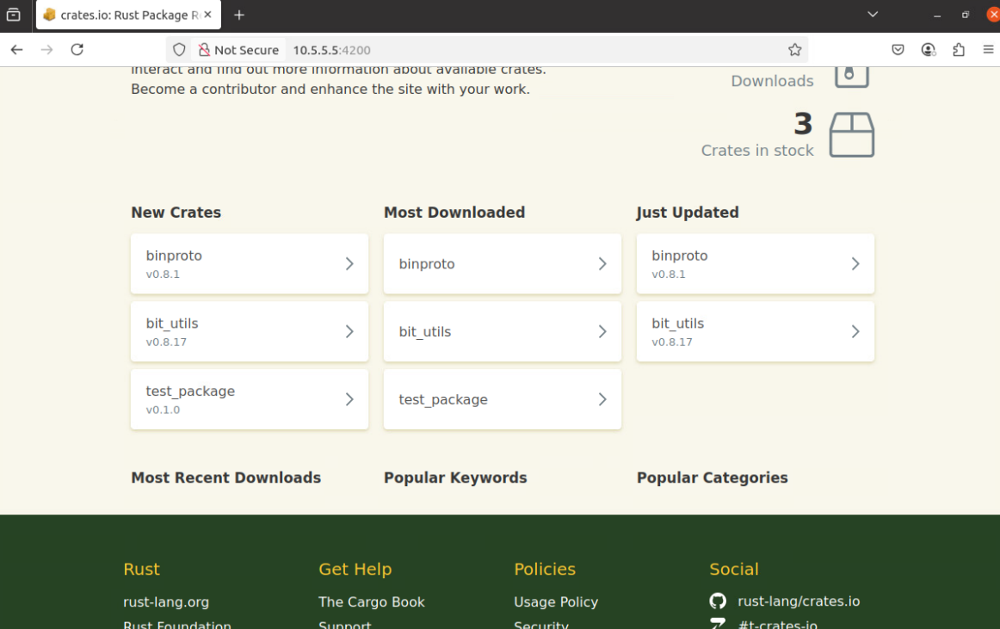

2. (**ubuntu-desktop**, **Terminal**) In your terminal, run the command:

```bash
cd /home/user/Documents/Rust/apps/clean_app && ls
```

The contents include:

* `Cargo.lock` (dependency version lock file)
* `Cargo.toml` (project metadata file, like `package.json` or `pom.xml`)
* `src/` folder with `main.rs`

3. (**ubuntu-desktop**, **Terminal**) Print the contents of the `src/main.rs` file with the `cat` command:

```bash
cat src/main.rs
```

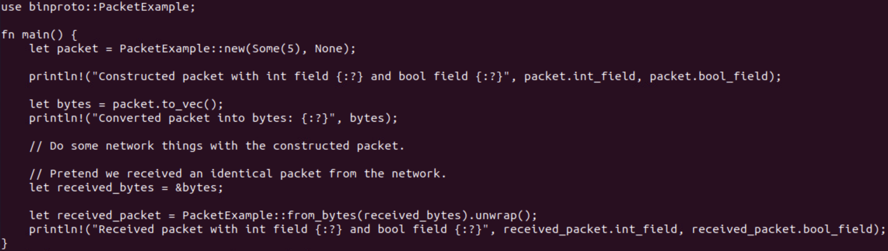

The file `main.rs` contains the Rust code to execute. The first line in the script performs an import of the library `binproto` where it is used inside the function `main`. 
   
4. (**ubuntu-desktop**, **Terminal**) Compile and run the current version of the Rust package with the following command:

```bash
cargo run
```

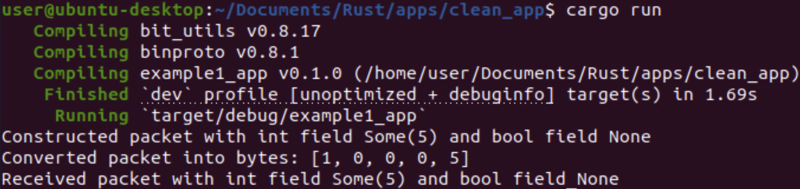

You should see three lines at the end of the output that explains some of what is occurring in the script, but the content is not important in the context of this lab and can be ignored. After manipulating the `binproto` library, we will revisit this Rust package.

</p>
</details>

<details>
<summary>
<h3>Attacking binproto</h3>
</summary>
<p>

Begin by manipulating the binproto library.

1. (**ubuntu-desktop**, **Terminal**) Run the command:

```bash
cd /home/user/Documents/Rust/packages && ls
```

You see two directories: `binproto` (original) and `bin-proto` (typosquatting version).

2. (**ubuntu-desktop**, **Terminal**) View the contents of both directories with the following command:

```bash
ls *
```

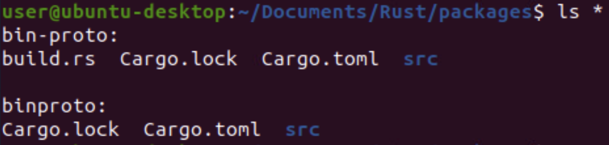

The only difference is that `bin-proto` contains a file named `build.rs`.

3. (**ubuntu-desktop**, **Terminal**) Compare the Cargo files using `diff` with the following commands:

```bash
diff */Cargo.toml
diff */Cargo.lock
```

This compares the `Cargo.toml` and `Cargo.lock` files in both directories. The only difference is the package name (`binproto` vs `bin-proto`), where one is the original and one has the typosquatted new name.

4. (**ubuntu-desktop**, **Terminal**) Compare the library code in both directories using `diff` with the following command:

```bash
diff */src/lib.rs
```

A lack of output means the files and code within are identical. This is the expected outcome in this case.

5. (**ubuntu-desktop**, **Terminal**) Print the contents of the `build.rs` script with the `cat` command:

```bash
cat bin-proto/build.rs
```

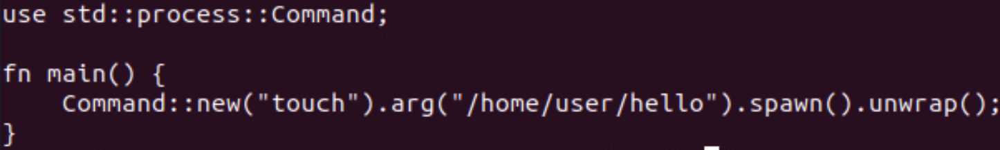

This shows the pre-build script. The script runs automatically during `cargo build` and creates a file named `hello` in your home directory (`/home/user/`). 

**Knowledge Check Question 3:** *What cargo command that is run during the build process actually executes the file `build.rs`?*

6. (**ubuntu-desktop**, **Terminal**) Run the following command to get the contents of the user home directory:

```bash
ls ~
```

You see the file `hello` has not yet been created.

7. (**ubuntu-desktop**, **Terminal**) Build the Rust package with the following commands:

```bash
cd bin-proto
cargo build 
ls ~
```

This time, the `hello` file was created by the Rust script after it ran with `cargo build`.

In this example the action is fairly benign but imagine what else an attacker could do or add to the system, such as startup scripts, reverse shells, or additional malware.

8. (**ubuntu-desktop**, **Terminal**) Run the following command to remove the `hello` file:

```bash
rm ~/hello
```

This is vital for resetting the environment for the next demonstration.

9. (**ubuntu-desktop**, **Terminal**) Publish the Rust package with the following command:

```bash
cargo publish --index http://10.5.5.5:8889/git/index --token cio_lab_api_token
```

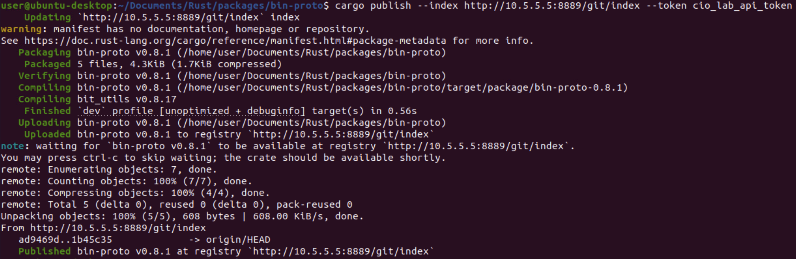

This publishes the library `bin-proto` to the labs local `Crates.io` server using a hard-coded API token that was preloaded into the lab environment.

10. (**ubuntu-desktop**, **Firefox**) Return to the tab that displays the `crates.io` site (10.5.5.5:4200) in Firefox. A new package named `bin-proto` is now listed by clicking on the "Browse All Crates" link at the top.

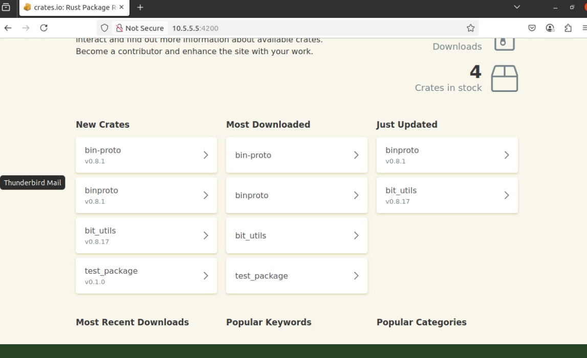

11. (**ubuntu-desktop**, **Terminal**) Return to the terminal and run the following commands to create a new Rust environment for the project `demo_app`:

```bash
cd /home/user/Documents/Rust/apps
cargo new demo_app
cd demo_app
cargo build
```

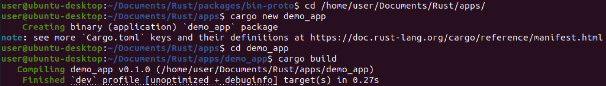

These commands set up a new Rust environment in the folder `/home/user/Documents/Rust/apps` for the project named `demo_app` and then move you into that project directory. The final command initializes the `build.rs` file that contains the code to run. 

12. (**ubuntu-desktop**, **Terminal**) Confirm that the `hello` file is not present with the following command:

```bash
ls ~
```

13. (**ubuntu-desktop**, **Terminal**) Test the new Rust build process with the following commands:

```bash
cargo add bin-proto
cargo build
ls ~
```

The first command adds the library `bin-proto` to the project and imports it. The second command compiles and executes the program.

Lastly, the `hello` file was created again, showing that the pre-build script still runs when the dependency is built.

| &#8505; NOTE |
|---|
| Other dependency managers have similar vulnerabilities. For example, `npm` can run pre-install and post-install scripts when installing a package. |

</p>
</details>

<details>
<summary>
<h3>Mitigation</h3>
</summary>
<p>

The main defense against this type of attack is to avoid installing bad dependencies in the first place. Pre-build scripts can have legitimate uses, but it's wise to be extra careful if the dependency you want to use includes a build script. It is imperative if you must use a dependency with a build script that you review what the build script will do before using the package.

</p>
</details>

<details>
<summary>
<h3>Phase 3 Grading Check<h3>
</summary>
<p>

1. (**ubuntu-desktop, **Firefox**) To check your work, browse to the grading page at `https://skills.hub/lab/tasks` or `(https://10.5.5.5/lab/tasks)`. Click the `Submit/Re-Grade Tasks` button to trigger the grading checks. Refresh the results after a few moments to see your results.

These two checks verify that you were able to successfully publish the malicious package and add it to a working project. 

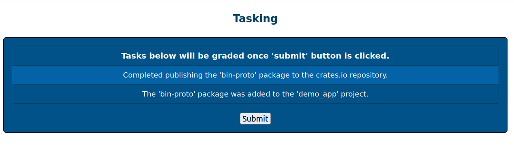

**Grading Check 5:** Completed publishing the "bin-proto" package to the crates.io repository.
   - The package "bin-proto" was published.

**Grading Check 6:** The "bin-proto" package was added to the "demo_app" project.
   - The configuration of the "demo_app" project uses the "bin-proto" package.

`Copy the token or flag strings to the corresponding question submission field to receive credit.`

</p>
</details>

<details>
<summary>
<h3>Extra Info on Auditing Tools</h3>
</summary>
<p>

Modern software projects often have large, sprawling dependency trees. Installing one package may pull in many others, including dependencies of dependencies. This makes manually checking every package unmanageable — and so we need auditing tools.

Dependency managers provide tools to scan installed packages for known vulnerabilities. These tools need external services to function, so we can't demonstrate them fully in this lab. However, here are some popular options you can read more about:


### npm audit

`npm audit` is a built-in subcommand for the Node.js package manager.

[Official docs here](https://docs.npmjs.com/cli/v11/commands/npm-audit)

### cargo audit

`cargo audit` is a tool for auditing Rust project dependencies, installable via Cargo.

[docs.rs documentation](https://docs.rs/cargo-audit/latest/cargo_audit/)

### OWASP DependencyCheck (Java)

**OWASP DependencyCheck** is plugin for Maven that detects vulnerable dependencies.

[OWASP Overview](https://owasp.org/www-project-dependency-check/)

</p>
</details>


## Conclusion

<details>
<summary>
<h3>Lab Wrap-up</h3>
</summary>
<p>

By completing this lab you were able to observe and practice mitigating some common software supply chain attacks, specifically in the context of writing software.

To recap:
 - You read about and performed a typosquatting attack against a JavaScript package registry (NPM).
 - You read about and performed a package version hijacking attack against a Java package registry (Nexus).
 - You read about build-time attacks and then implemented one against a Rust package registry (crates.io).
 - In each scenario, you saw the attack from the software developer's point of view.
 - A list of online resources for various dependency chain auditing tools was provided.


Skills exercised:
 - S0172: Skill in applying secure coding techniques.
 - S0544: Skill in recognizing vulnerabilities.
 - S0619: Skill in auditing technical systems.

Such attacks are attempted frequently, and they can only be defended against through vigilance.

### References
 - <a href="https://docs.rs/cargo-audit/latest/cargo_audit/" target="_blank">Cargo Audit</a>
 - <a href="https://www.cisa.gov/sites/default/files/2023-09/CISA-Open-Source-Software-Security-Roadmap-508c.pdf" target="_blank">CISA Open Source Software Security Roadmap</a>
 - <a href="https://blog.npmjs.org/post/180565383195/details-about-the-event-stream-incident" target="_blank">Details About the Event-stream Incident</a>
 - <a href="https://www.cisa.gov/resources-tools/resources/federal-civilian-executive-branch-fceb-operational-cybersecurity-alignment-focal-plan" target="_blank">Federal Civilian Executive Branch (FCEB) Operational Cybersecurity Alignment (FOCAL)</a>
 - <a href="https://www.docker.com/blog/the-impacts-of-an-insecure-software-supply-chain/" target="_blank">The Impacts of an Insecure Software Supply Chain</a>
 - <a href="https://niccs.cisa.gov/workforce-development/nice-framework" target="_blank">NICE Framework</a>
 - <a href="https://docs.npmjs.com/cli/v11/commands/npm-audit" target="_blank">NPM Audit</a>
 - <a href="https://owasp.org/www-project-dependency-check/" target="_blank">OWASP Dependency Check</a>
 - <a href="https://rust-secure-code.github.io/rust-supply-chain-security/build.html#BUILD-ISOLATED" target="_blank">Rust Supply Chain Security Guide</a>

</p>
</details>

<details>
<summary>
<h3>Answer Key</h3>
</summary>
<p>

**Knowledge Check Question 1:** *What is the command-line program used to manage JavaScript dependencies?*

`npm`

**Knowledge Check Question 2:** *Which file contains project metadata, such as project dependencies, for Java's third-party dependency management tool, Maven?*

`pom.xml`

**Knowledge Check Question 3:** *What cargo command that is run during the build process actually executes the file `build.rs`?*

`cargo build`

</p>
</details>
