# Secure Programming with Rust

There are numerous ways in which vulnerabilities can be introduced during code development and it's up to the developer to ensure their programs are vulnerability-free. There are a variety of programming languages that can be used. Each offers varying degrees of safeguards to help prevent implementation of unsafe code, although no language is 100% safe. Rust is an improvement on most languages as it was created with security in mind. Rust has stronger built-in protections and it offers more safeguards than the average language, making it harder for developers to implement unintended vulnerabilities. The programming language used is often based on the requirements, restrictions, and the environment it's intended for. Therefore, using Rust may not always be viable, so it is imperative that developers have a solid understanding of secure programming concepts that can be implemented regardless of the language. 

This lab is a continuation of the first Secure Programming lab and will discuss the vital importance of implementing safe and secure code. The lab will reference code samples and concepts used in the first Secure Programming lab, doing a deeper dive into buffer overflows and integer overflows, while also covering a new bug that developers commonly face. You will be introduced to the programming language Rust and how it handles these memory-related errors. It is recommended that the user complete the first lab prior to attempting this one, although it is not required.

The first secure programming lab can be found here: <a href="https://presidentscup.cisa.gov/gb/practice/f0a60d7ce2774da58337cc11f2b56637/secure-programming?practiceSearchTerm=secure" target="_blank">Secure Programming</a>.

Additional guidance on secure programming and the **Secure by Design** mission statement can be found here: <a href="https://www.cisa.gov/securebydesign" target="_blank">Secure by Design</a>.

Throughout this lab, you will examine examples of both secure and insecure code, gain insights into how certain vulnerabilities are introduced, and explore how insecure code can be exploited by threat actors to gain access to sensitive information. The security principles discussed in this course are further detailed in the linked articles provided.

| &#9201; LAB TIME                           |
| ------------------------------------------ |
| This lab is expected to take 90 minutes. |

*Please consider filling out the lab feedback survey at the bottom of your screen. The survey is available to you at any time while conducting the lab.*

| &#9888; CAUTION                                              |
| ------------------------------------------------------------ |
| You must complete *all* phases of the lab and complete the mini-challenge to receive your completion certificate. We encourage you to attempt mini-challenges on your own, but links to the solution guides are available in the Mini-Challenge section of the lab document if you need them. |


## Learning Objectives
- Understand buffer overflow vulnerabilities and how Rust can provide additional security against them
- Understand integer overflow vulnerabilities and how Rust can provide additional security against them
- Understand "Use After Free" memory-related bugs and how Rust helps mitigate them 
- Understand how Rust provides more options and mitigations for developers to write and execute safe code. 

## FOCAL and NICE Framework Mappings

This lab maps with <a href="https://www.cisa.gov/resources-tools/resources/federal-civilian-executive-branch-fceb-operational-cybersecurity-alignment-focal-plan" target="_blank">Federal Civilian Executive Branch (FCEB) Operational Cybersecurity Alignment (FOCAL)</a> area 2 (Vulnerability Management) by managing the attack surface of internet-accessible assets and implementation of secure software, and area 3 (Defensible Architecture) by hardening critical systems.


**NICE Work Role**

- <a href="https://niccs.cisa.gov/workforce-development/nice-framework" target="_blank">Secure Software Development</a>
- <a href="https://niccs.cisa.gov/workforce-development/nice-framework" target="_blank">Software Security Assessment</a>

**NICE Tasks**

- <a href="https://niccs.cisa.gov/workforce-development/nice-framework" target="_blank">T0077</a>: Develop secure code and error handling.
- <a href="https://niccs.cisa.gov/workforce-development/nice-framework" target="_blank">T1073</a>: Perform code reviews
- <a href="https://niccs.cisa.gov/workforce-development/nice-framework" target="_blank">T1197</a>: Identify common coding flaws.
- <a href="https://niccs.cisa.gov/workforce-development/nice-framework" target="_blank">T1202</a>: Determine software development security implications within centralized and decentralized environments across the enterprise.
- <a href="https://niccs.cisa.gov/workforce-development/nice-framework" target="_blank">T1624</a>: Conduct vulnerability analysis of software patches and updates.


<!-- cut -->

## Scenario

Secure programming is a vital component of cybersecurity as software is only as secure as the safeguards implemented by the developer. This lab will broach Secure Programming topics, growing on concepts taught in the first Secure Programming lab. You will be interacting with scripts that are written in C and Rust. You will review scripts in each language to examine how they handle the same functionality and also view the security measures in place.

The lab environment consists of two client machines (Ubuntu and Kali Linux) and the server used for grading. 

---

- _For this lab we will be using the C and Rust programming languages to present examples of insecure and vulnerable code. Please note that the vulnerabilities discussed are not isolated to these languages; the concepts and risks presented can occur in other scenarios/languages._

---

## System Tools and Credentials

| system | OS type/link |  username | password |
|--------|---------|-----------|----------|
| ubuntu-desktop | Ubuntu-Desktop | user | tartans |
| kali | Kali | user | tartans |


<details>
<summary>
<h3>Background Information: Rust </h3>
</summary>
<p>

The programming language Rust began development in 2006 as a side project, but by 2009 it had gained traction and was sponsored by Mozilla. The goal was to create a language that "split the difference" between high-level languages like Python and low-level languages like C. The authors wanted to create a language that was fast and offered low, granular control like C, but without requiring tedious manual memory management. Previously, only high-level languages provided automatic memory management with the implementation of "garbage collector".

| &#128270; INFORMATION |
|---|

Garbage collection is a mechanism used in high-level languages that automatically handles memory management by identifying and removing objects from memory that are no longer needed during program execution. 

Garbage collection provides a secure way to manage memory in high-level languages, like Python. There are a handful of trade-offs from using a high-level language versus a low-level, but two of the major ones are:

1. Garbage collection slows down execution time:
   - If an application uses many unique variables throughout its execution, it creates more work for the garbage collector as it has to handle tracking and cleaning up those variables.
   - Garbage collection tends to be handled in bulk (all at once), which can cause unpredictable delays for programs that depend on predictable timing - often in embedded systems - which makes the use of it unsuitable for embedded work.
2. Increases memory usage:
   - The overhead of simply implementing and using the garbage collector requires more memory for the code to function.

This is why when a program is required to execute quickly or without much memory, developers often opt for writing in a language like C. But if these factors aren't as critical, a high-level language like Python would also work. 

The creators of Rust came up with an implementation that doesn't require the developer to manually track memory and also prevents unsafe code from being written and executed. Rust has more requirements and may be more difficult to write, which may not sound appetizing to new developers. But by having these higher requirements, Rust helps the developer create more memory-safe programs that are resistant to common memory-related bugs.

Rust provides a means for developers to create "bare metal" code that can be run and be memory-safe.

| &#128270; INFORMATION |
|---|
|_The term "bare metal" refers to code that interacts directly with the hardware it's on without requiring a full operating system like Windows or Linux to function._|

</p>
</details>

<details>
<summary>
<h3>Background Information: Architecture, Distributions, and Operating Systems</h3>
</summary>
<p>

By definition, low-level programming languages operate and execute code at the closest level possible to a computer's hardware. The language offers minimal abstraction, which is part of the reason why it's able to execute code so quickly. 

| &#128493; RECALL |
|---|
|_In the first Secure Programming lab, we explained that 'abstraction' described how close the language resembles assembly or machine code. High abstraction means it's more human readable while low abstraction is harder to read and closer to machine code._|


| &#128493; DEFINITION |
|---|
|_Distribution is a term that is often used to reference Linux-based machines. It refers to a complete operating system that is built around a specific kernel that contains a curated collection of software, libraries, utilities, and other tools to provide a functional computing environment for the user. A kernel is a core component of a computer that manages things like system resources and communication between hardware and software._|

Because these languages are closer to the machine's language and can directly interact with the computer's hardware, the programs are created to work on a specific piece of hardware/architecture/distribution. Due to this, some tools have multiple versions where each version was created for a specific distribution. 

In the first Secure Programming lab, you compiled and executed code primarily on a Kali Linux machine. Kali is an operating system that is a Debian-based distribution. Kali was created and is advertised as an operating system to be used to support penetration testing.

| &#128493; DEFINITION |
|---|
|_Penetration testing is a security practice where ethical hackers are authorized to perform cyberattacks against a piece of hardware or software. The goal is to determine if there are vulnerabilities so that they can be patched and prevent real malicious actors from taking advantage of the same vulnerability._|

In this lab you will also have access to an Ubuntu machine. Ubuntu was created as an operating system that was intended for use by the average user, somewhat similar to Windows. They are both Debian-based distributions, but due to their intended use and policies, the same tools/software can produce different behaviors.

During this lab, you will view how the operating system of a machine can play a part in the security of a program.

</p>
</details>

## Phase 1: Buffer Overflows and Rust

<details>
<summary>
<h3>Buffer Overflow Refresher</h3>
</summary>
<p>

In the first `Secure Programming` lab, we covered buffer overflows; what they were, how they were implemented, and the repercussions that could occur. In this lab we will dive deeper and learn how Rust handles the buffer overflow vulnerability. 

A buffer overflow vulnerability takes advantage of how a program's memory allocation is handled during execution to generate unexpected behavior. It is common in low-level languages like C, where a buffer is used to temporarily store data during execution. When data is stored in the buffer it is stored with a specific size that is declared in the program.

A buffer overflow vulnerability occurs when the data being stored in the buffer is larger than the size allocated to it and so it overwrites the data in memory next to it to create unpredictable behavior. Remember the modern-day analogy we used in the previous lab:

> Think of a buffer like a cup and data as water. The cup can hold water, but if you try to pour more water into the cup than it can hold, the water will overflow and spill onto the table. In C, when data "spills" out of a buffer, it can overwrite other important data in memory. 

Some of the unpredictable behaviors that buffer overflows can cause are:
- A program crash.
- A vulnerability that provides a method for exploitation or exposes sensitive data.

The severity of the vulnerability depends on the program, so it's important that developers work to prevent them.

1. Open the `kali` system console and login with the username `user` and the password `tartans`. Once logged in, double-click the Firefox icon from the Desktop.

2. (**kali**, **Firefox**) The home page should be the `https://skills.hub/lab` landing page. NOTE: If you see the page stating that the server is starting up, please wait a minute or two for the site to initialize and refresh the page. 

3. (**kali**, **Firefox**) In the navigation bar at the top, you will see a tab labeled `Hosted Files`. You should see a folder labeled `buffer overflows` - click it. Inside should be the files: `buffer_overflow.c`, `bypass_canary.c`, `rs_safe.rs`, and `rs_unsafe.rs`. Click and download each of the to the default location. 

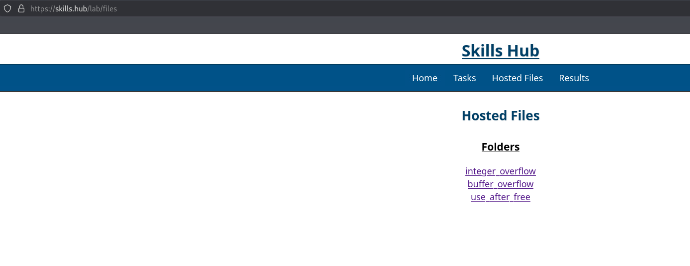

4. (**kali**) Back on the Desktop, double-click the Terminal icon.

5. (**kali**, **Terminal**) In the terminal, run the following commands:

```bash
mkdir -p ~/Desktop/buffer_overflow/c_overflow
mv ~/Downloads/buffer_overflow.c ~/Desktop/buffer_overflow/c_overflow
cd ~/Desktop/buffer_overflow/c_overflow
```

This will move the downloaded files into the newly created `c_overflow` directory and then move you into that folder.

6. (**kali**) Open VS Code by double-clicking the Visual Studio Code icon from the Desktop.

7. (**kali**, **VS Code**) We will be opening the directory `Desktop` in VS Code, as that is where the lab files are located. Ensure you have this folder open in VS Code. You can do this by clicking on the `Open Folder` link currently showing on the open page, selecting the `Desktop`, and clicking `Select`. You could also click on the `File` tab in the taskbar at the top, selecting `Open Folder`, and then choosing the `Desktop` folder.


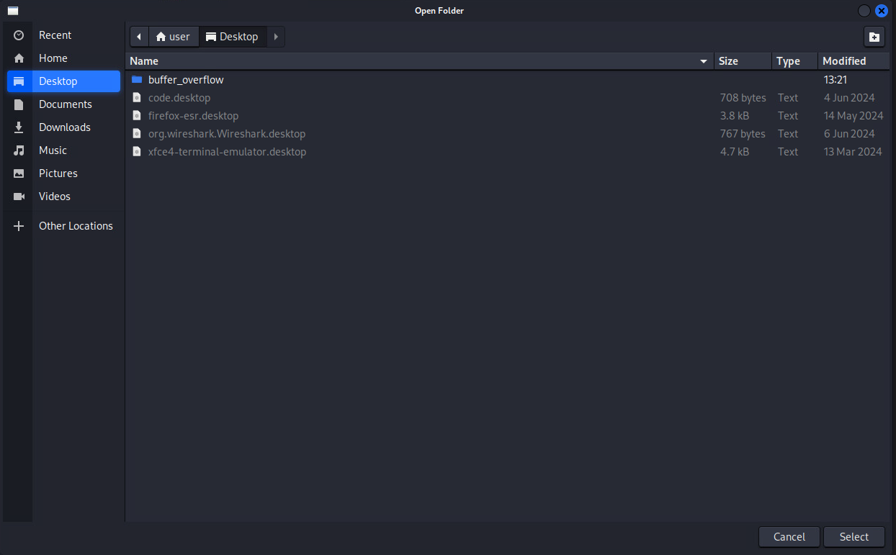

*Note: If prompted whether or not to trust the authors of the files, choose "Yes, I trust the authors"*

8. (**kali**, **VS Code**) There will be a panel on the left side of VS Code that shows all the files and directories nested within the `Desktop` directory. Click the `buffer_overflow` folder to open it, then click `c_overflow`, and finally click the file `buffer_overflow.c` file to view it.

*Note that the directory structure is visible in the pane on the left, while the specific file being viewed is visible on the right. You can switch between files using the Explorer pane and each file viewed will receive its own tab on the right.*

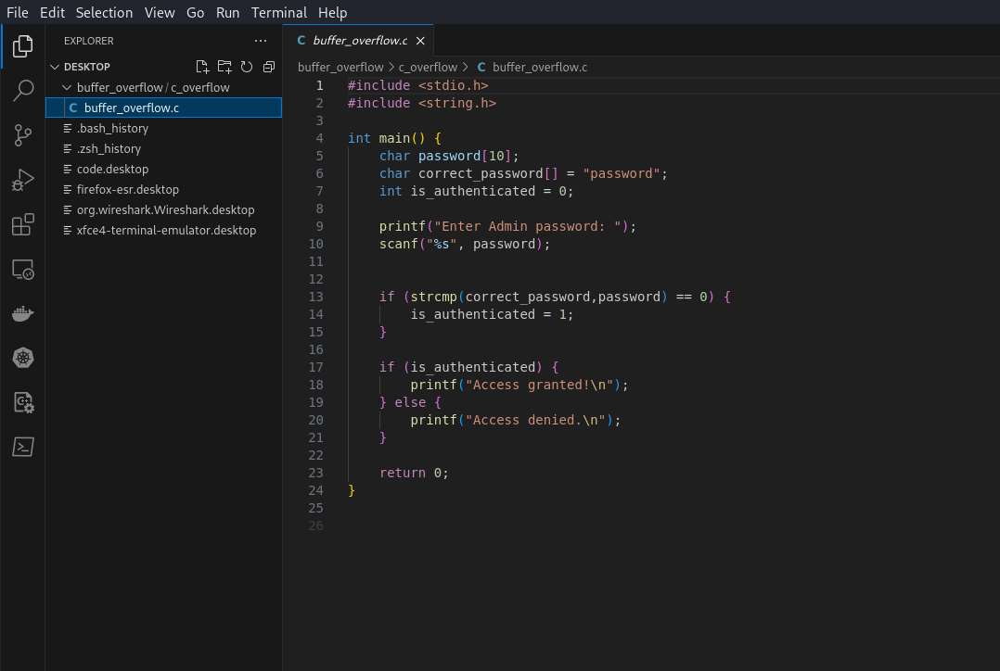

In the previous lab we went over the following example of a buffer overflow in C and the same code should be visible in the opened file. It should look like this:

```c
#include <stdio.h>
#include <string.h>

int main() {
    char password[10];
    char correct_password[] = "password";
    int is_authenticated = 0;

    printf("Enter Admin password: ");
    scanf("%s", password);

    if (strcmp(correct_password,password) == 0) {
        is_authenticated = 1;
    }

    if (is_authenticated) {
        printf("Access granted!\n");
    } else {
        printf("Access denied.\n");
    }

    return 0;
}
```

9. (**kali**, **Terminal**) Back in the open Terminal, you should still be located in the `c_overflow` directory. Let's compile the script. Run the command:

```bash
gcc -o old_buffer_overflow buffer_overflow.c
```

| &#128493; RECALL |
|---|
|_The gcc (GNU Compiler Collection) tool compiles .c files by transforming the written C code into machine code. This process includes multiple stages, including preprocessing, compilation, assembly, and linking, which ultimately ends with the production of an executable file that can be run on the target system. This process allows programmers to convert source code into a format that the computer's hardware can understand and execute._|


10. (**kali**, **Terminal**) To run the program, execute the command:

```bash
./old_buffer_overflow
```

You should see the familiar prompt asking for the admin password. The correct password is `password`, but we are just getting reacquainted with the buffer overflow vulnerability present.

11. (**kali**, **Terminal**) Enter the string: `aaaaaaaaaaa` (11 `a` characters).

You should see that it responds saying that it succeeded. 

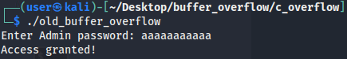

**NOTE:** The program was executed, and the buffer overflow vulnerability was successfully triggered without any message or response. 

</p>
</details>

<details>
<summary>
<h3>Modern Security Implementation</h3>
</summary>
<p>

Now, let's use the same script and process, but on the `ubuntu` machine.

1.   Open the `ubuntu` system console and login with the username `user` and the password `tartans`. Once logged in, double-click the Firefox icon from the Desktop.

2.   (**ubuntu-desktop**, **Firefox**) Repeat steps 2 and 3 by browsing to the `Hosted Files` page on `https://skills.hub` and downloading the files `buffer_overflow.c`, and `bypass_canary.c` in the `buffer overflow` folder.

3.   (**ubuntu-desktop**) Back on the Desktop, double-click the Terminal icon.

4.   (**ubuntu-desktop**, **Terminal**) Recreate the same directory structure by running these commands:

```bash
mkdir -p ~/Desktop/buffer_overflow/c_overflow
mv ~/Downloads/buffer_overflow.c ~/Desktop/buffer_overflow/c_overflow
cd ~/Desktop/buffer_overflow/c_overflow
```

5. (**ubuntu-desktop**, **Terminal**) Compile the script with the command:

```bash
gcc -o old_buffer_overflow buffer_overflow.c
```

6. (**ubuntu-desktop**, **Terminal**) Run the executable with the command:

```bash
./old_buffer_overflow
```

7.  (**ubuntu-desktop**, **Terminal**) Trigger the buffer overflow by entering the string: `aaaaaaaaaaa` (11 `a` characters).

You should see that the program responds differently despite it being the same exact code we ran on the kali machine. 

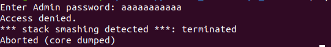

It is able to identify that a buffer overflow attack has been triggered and terminates the programs execution to prevent the vulnerability from being taken advantage of. This is possible thanks to the implementation of something called the `Stack Canary`.

### The Stack Canary

The Stack Canary is a security mechanism that was created to help prevent buffer overflow attacks from succeeding in C programs. The concept was created and implemented within the C compiler `GCC`. 

During compilation of a C program, it inserts a value (also referenced as a 'canary') into the stack frame of a function.

| &#128493; DEFINITION |
|---|
|_A stack frame is a section of memory that is allocated whenever a function is called. It contains all the data needed to execute and return a value from a function. During execution, each function creates its own stack frame, and these frames are stacked on top of each other in something called a call stack. When a function finishes, its stack frame is removed from the call stack._|

In a normal stack frame it will contain (in this order): 
  1. The local variables, also known as the buffer
  2. The canary (when the Stack Canary is enabled)
  3. The control data 
   
The value inserted as the canary is inserted after the local variables (buffer) and before the control data (which is the `Saved Frame Pointer` and `Return Pointer`), in that order. The canary acts as a guard so that if data is attempted to be written outside the buffer, it will overwrite the canary before attempting to alter the control data.

| &#128493; DEFINITION |
|---|
|_The Saved Frame Pointer is used to restore the previous stack frame's base address when a function returns, allowing the program to navigate back to the caller's stack frame. The Return Pointer stores the memory address of the instruction immediately following the function call, so the program knows where to resume execution after the function finishes. This control data is critical to the programs execution and if it can be manipulated, it can give attackers the ability to gain total control over the program at worst, or cause unexpected behavior in other scenarios._|


During the stack frame's execution before attempting to return, it will perform a check on the Stack Canary. If the value of the canary has been altered, then the program will know that a buffer overflow has been attempted and terminate execution of the program to prevent further exploitation.

That is why during the execution of the program on the Ubuntu machine, it exited and did not complete. The Stack Canary was doing its job by attempting to prevent exploitation.

But why did the Stack Canary trigger on the Ubuntu machine but not on Kali? We used the same process and software. Remember above we discussed differences between distributions? This is an example of how the behavior can be different despite performing identical operations. 

### GCC Defaults

Previously we stated that Kali was created and curated to be used by those performing penetration testing while Ubuntu was created to be more for the average user. The intended use of the machine plays a vital role as to why the GCC programs default behavior is different between these two machines.

Due to the intended use of Kali and its audience, it is catered towards users who are considered more advanced and have a solid understanding of cybersecurity. That is why GCC has the Stack Canary disabled by default. The user developing and executing code is expected to have knowledge of this and so the implementation of security features are left up to them. 

Developers can choose to enable or disable the Stack Canary during the compilation of the script by adding flags. Below are examples using the command we ran previously to enable or disable it. You do not need to run these commands now.

Disable Stack Canary
```bash
gcc -fno-stack-protector -o old_buffer_overflow buffer_overflow.c 
```

Enable Stack Canary
```bash
gcc -fstack-protector -o old_buffer_overflow buffer_overflow.c 
```

There are additional flags that can be utilized to alter the behavior of the Stack Canary, but for this lab we will only cover those listed above.

### Not Guaranteed

Although the Stack Canary does provide additional protections to buffer overflows, it is not 100% foolproof. It can help with creating secure code, but if the developer doesn't implement the correct safety measures, their programs can still be exploited. Below is more information on methods where stack canaries can be bypassed.

#### Stack Canary Types

The value of the canary inserted into the stack isn't always random. There are different types of canaries that can be used, and implementation of the canary can be customized by the developer. Even if the Stack Canary value is randomized at the time of execution, that value stays the same while the program is running. 

Therefore, a smart attacker could perform trial & error to analyze the canary and find a way to bypass it. For example: if the attacker was able to deduce how the canary value was generated, they could perform a buffer overflow attack where the data that overwrites the canary is the *same value* of the expected canary so that they could still overwrite the control data without tripping the Stack Canary.


#### Large Buffers

Previously we stated that the canary is inserted in a frame stack after the buffer (containing all the local variables) and before the control data (`Saved Frame Pointer` and `Return Pointer`). 

In a smaller function that doesn't have many variables the Stack Canary would likely see the buffer overflow due to the small buffer size. But what if the function is large and stores and uses several local variables? It would be possible to perform a buffer overflow on the variables in the buffer and have the function finish without overwriting the canary.

8. (**ubuntu-desktop**, **Terminal**) Run the following commands to setup the directory structure and compile the bypass script:

```bash
mkdir -p ~/Desktop/buffer_overflow/c_bypass
mv ~/Downloads/bypass_canary.c ~/Desktop/buffer_overflow/c_bypass
cd ~/Desktop/buffer_overflow/c_bypass
gcc -o bypass bypass_canary.c
```

9. (**ubuntu-desktop**, **Terminal**) Run the executable with the command:

```bash
./bypass
```

10. (**ubuntu-desktop**, **Terminal**) When prompted, enter the string: `aaaaaaaaaaa` (11 `a` characters).

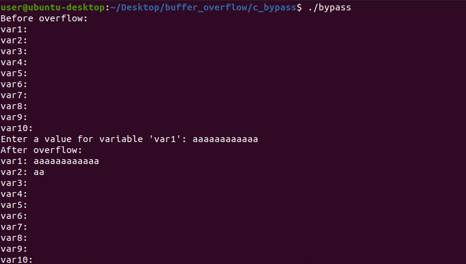

In the output, you should see that it printed the values of each of the variables prior to submitting the value. Then after submitting each value, you should see that the buffer overflow did succeed with the extra character written to the variable `var2`. 

This is a basic example of how larger programs could be at risk of a buffer overflow attack and the behavior of the program can still be altered.

These are only a couple of the methods in which a program could be manipulated so that the Stack Canary isn't able to protect against a buffer overflow attack. That is why it is important for the developer to have an understanding of how buffer overflows occur and be able to implement the right safeguards to prevent them.

### Address Space Layout Randomization (ASLR)

Another modern security feature in code execution is Address Space Layout Randomization (ASLR). It has been implemented in both Linux and Windows machines alike and was originally created in 2001. It is a security feature implemented in the kernel of a machine, but its scope goes far beyond it. ASLR randomizes the location in memory where key data (like a processes stack or heap) is stored during a process's execution. The randomization is handled by the kernels memory management subsystem and is applied to all processes running on the system. 

Attacks performed by malicious actors are typicaly able to succeed due to the ability to know or guess the location of processes and functions in memory. The randomization of the location of that data is intended to help generate better protections against memory-based attacks like buffer overflows.

ASLR has improved memory security, but like the Stack Canary, it does not fully prevent memory-based attacks from succeeding. As you can see from the recent code execution, memory-based attacks can still occur despite ASLR safeguards. 

If you would like to read more about it, <a href="https://www.cs.ucr.edu/~nael/pubs/micro16.pdf">this research paper</a> discusses a vulnerability that allows attackers to get around ASLR.

</p>
</details>

<details>
<summary>
<h3>Rust and Cargo</h3>
</summary>
<p>

When Rust is installed, it comes with an additional program called `cargo`. Cargo acts as Rust's build system and package manager. It is not a requirement to use cargo to compile and execute Rust code, but there are many advantages to doing so. 

Cargo can handle building the executable from code, downloading and building libraries to be used in the program. We will be utilizing the cargo command to interact with our Rust code. Below we'll cover the various commands that you will be using throughout this lab.

- `cargo init` 
  - This command will initialize an environment within the working directory to create files that cargo uses when working on a Rust project.
  - It will create the following:
    - `Cargo.lock` -- keeps track of the exact versions of dependencies used in the project. You will not need to interact with it.
    - `Cargo.toml` -- contains configurations for cargo to use for this project. You will not need to interact with it.
    - The directory `src` -- contains the file `main.rs`.
    - `main.rs`, inside the `src` directory -- contains the Rust code you will be interacting with to create and run executables.
- `cargo check`
  - This command will perform a check on the code located in the `main.rs` file and looks for any syntax or logic errors that would be caught during the code's compilation.
  - This ONLY performs the check. It does not compile the code.
- `cargo build` 
  - This command will attempt to compile the code in the `main.rs` file to create an executable.
  - If the compilation completes, it will create the directory `target`, where within it will have the directory `debug`. That folder will contain the created executable.
  - This only compiles and creates the executable, it does not run it.
- `cargo run`
  - This command is the equivalent of running `cargo build` and then running the executable that was created.
  - This will be one of the main commands you'll be using to execute Rust code.


This covers the basic information you will need to know for Rust for this lab. If you would like to read more about it, please check out the official <a href="https://doc.rust-lang.org/book/ch01-03-hello-cargo.html?highlight=cargo#hello-cargo">Rust cargo guide.</a>

</p>
</details>

<details>
<summary>
<h3>Rust Buffer Overflow Protection</h3>
</summary>
<p>

Previously we stated that the programming language Rust has a higher requirement on the developer when creating code, but the result of this is that the code created is more memory-safe and mitigates memory-related vulnerabilities. We are going to go over a Rust script that provides the same functionality as the C script we just used, but without the buffer overflow vulnerability.

1. (**kali**, **Terminal**) Back on the Kali machine, run the following commands to set up the folder where we will interact with our code:

```bash
mkdir -p ~/Desktop/buffer_overflow/rs_safe/
cd ~/Desktop/buffer_overflow/rs_safe/
cargo init
mv ~/Downloads/rs_safe.rs src/main.rs
```

2. (**kali**, **VS Code**) VS Code should still have the Desktop directory open. In the file navigation bar on the left, click the following folders to open them: `buffer_overflow` -> `rs_safe` -> `src`. Finally click on the file `main.rs`. 
 
You will be writing Rust code to finish this program. The goal of the program is the same as the C program, to prompt the user to enter the password for the user `Admin`.

In VS Code, you should see this code:

```rust
use std::{
    error::Error,
    io::{self, Write},
};

fn safe_equivalent_clean() -> Result<(), Box<dyn Error>> {
    let mut password = String::new();


    if password.trim() == expected_password {
        println!("Access granted!");
    } else {
        println!("Access denied!");
    }

    Ok(())
}

fn main() {
    _ = safe_equivalent_clean();
}
```

**NOTE: After writing each line, make sure to hit `enter` to insert a new line after it.**

3. (**kali**, **VS Code**) On line 8, after the `let mut password` line, add the following code in order to declare the variable `expected_password` with the string `password`.

```Rust
let expected_password = "password";
```

4. (**kali**, **VS Code**) On line 10, insert a print statement to prompt the user to enter the password for `Admin`.

```Rust
println!("Enter Admin password: ");
```

5. (**kali**, **VS Code**) On line 11, utilize one of Rust built-in libraries as a method of ensuring the previous prompt is output (visble) to the user.

```Rust
io::stdout().flush()?;
```

6. (**kali**, **VS Code**) On line 12, insert the line of code that will handle prompting and storing the input received from the user.

```Rust
let _ = io::stdin().read_line(&mut password)?;
```

Once you've completed these steps, save the file (hit `File`-> `Save`, or `ctrl`+`s`). Your code should now look like this:

```Rust
use std::{
  error::Error,
  io::{self, Write},
};

fn safe_equivalent_clean() -> Result<(), Box<dyn Error>> {
  let mut password = String::new();
  let expected_password = "password";

  println!("Enter Admin password: ");
  io::stdout().flush()?;
  let _ = io::stdin().read_line(&mut password)?;

  if password.trim() == expected_password {
      println!("Access granted!");
  } else {
      println!("Access denied!");
  }

  Ok(())
}

fn main() {
  _ = safe_equivalent_clean();
}
```

In order to fully understand how this Rust code is operating, let's go over this line by line:

- `use std:: { ... };`
  - `use`
    - The `use` keyword is used to add Rust libraries to a script, similar to how Python uses `import`.
  - `std` module
    - This is Rust's standard library which contains essential functionality like input and output and error handling.
  - `std:: { .. }`
    - This is a format used so the developer can specify importing multiple libraries from the `std` module in one `use` statement, rather than having to create multiple `use` statements.
  - `error::Error`
    - This tells the script to import the `Error` trait from the `std::error` module. 
    - It allows the developer to define custom error types or interact with existing error types in a consistent way. It provides a way for developers to define or handle errors in a program.
  - `io::{self,Write}`
    - This tells the script to import the `io` module.
    - This module provides functionality for operations with input and output.
    - The `self` keyword allows for the script to directly reference the `std:::io` library as just `io` in the code.
    - The `write` trait is also imported. This provides functionality to support writing data. (e.g: to a file or standard output, which is just the terminal)
- `fn safe_equivalent_clean() -> Results<(), Box<dyn Error>> {`
  - `fn safe_equivalent_clean()`
    - The keyword `fn` is used to declare a function, similar to how Python uses `def`.
    - The string `safe_equivalent_clean()` is the name of the function.
    - Notice how the parenthesis are empty (`()`) meaning that this function does not expect/require any data to be passed to it when called.
  - `-> Result<(), Box<dyn Error>>`
    - `->`
      - This symbol is used in Rust to indicate what the return type of the function will be.
    - `Result`
      - `Result` is one of the most common enums in Rust standard library and it is used to support error handling.
      - It can return either a success, `Ok(())`, or a failure, `Err(())`.
      - A value can be returned by passing a value in the `(())`. 
        - Empty parenthesis means that there is no meaningful value that needs to be returned to the calling function.
    - `Box<dyn Error>`
      - `Box` is a pointer that allocates data on the heal and is used to store an error object.
      - `dyn Error` is a trait object created from the `error::Error` import.
      - This also makes it so if an error does occur, this function can return the error to the calling function, where it will contain information on the error.
    - This line declares the function and the function's expected return type. Additionally, it is configured to return information on an error if one occurs.

| &#128493; DEFINITION |
|---|
|_In Rust, an `enum` object provides a way of saying that a value is one of a possible set of values. For example, say we had an enum called `Intersection_Stoplight`. We would then define it as having three possible values, `red`, `yellow`, and `green`. We can use this object to list the possible status of a stoplight. If you want to read more about this, check out <a href="https://doc.rust-lang.org/book/ch06-01-defining-an-enum.html?highlight=enum#defining-an-enum">this Rust page.</a>_|

- `let mut password = String::new();`
  - The `let` keyword is used in Rust to indicate that a new variable is being created.
  - The `mut` keyword is used to declare the variable as `mutable`.
  - `password` is the name of the variable being created.
  - `String::new()` declares the variable as a string object and assigns an empty string as the value.
  - Similar to C, the `;` character is used to indicate the end of the line of code. 

| &#128493; DEFINITION |
|---|
|_When discussing immutability of variables or objects, they can be classified as either mutable or immutable. An immutable variable means that once a value is assigned to a name/variable, you cannot change that value. A mutable object is the opposite, meaning that the value can be changed at will. By default, all variables in Rust are declared as immutable. In order to make a variable mutable, you must use the keyword `mut` at its declaration._|

- `let expected_password = "password";`
  - Creates the variable `expected_password` and assigns it the string `password`.
- `println!("Enter Admin password: ");`
  - Prints the string `Enter Admin password: ` to terminal.
- `io::stdout().flush()?;`
  - This line is used following the `println!` command to force the buffered data in the print statement to be written out to the terminal immediately. 
  - It ensures that any and all data that might be in the buffer is written to the terminal, effectively clearing out the buffer.
  - Additionally, it makes sure that the prompt is provided to the user before the program waits for the user to enter any input. It is especially useful in interactive scripts like this one.
- `let _ = io::stdin().read_line(&mut password)?;`
  - `let _` 
    - This is syntax used when you want to ignore the result of the `read_line` method.
  - `io::stdin().read_line`
    - `io::stdin()`
      - Accesses the standard input stream using `io::stdin()` which allows for reading input from the user.
    - `read_line`
      - The `read_line` method is used to read a full line of input from the user (up to and including a new line character) and append it to the string variable passed to it.
      - Because it is trying to read and append data to a variable, this is why we do not care what the method call returns.
        - It will return success (`Ok(())`) if it works, or it will return failure (`err(())`) if it fails.
    - `&mut password`
      - This is a mutable reference to the original variable `password` that was created.
      - This allows for the method to modify the password variable by appending the users input to it.
    - `?`
      - This operator is used to control error propagation.
      - What that means is that if the `read_line` method returns an error, that error will be sent to the calling function.
      - This will effectively stop the execution of the current function and return the error. (Remember in the functions declaration above, the Result object was created using the `Error` trait which allows for the function to return the error.)
- `if` statement
  - `if password.trim() == expected_password {`
    - The `if` keyword declares the start of an if statement.
    - The `.trim()` method called on the `password` to remove all leading and trailing whitespace, including the newline character `\n`.
    - `==` is used to compare the first variable with the value of the second variable following it.
    - This if statement is checking if the string created from `password.trim()` is equal to the string in the variable `expected_password`.
    - If it is, run the code that is within the code block directly following the if statement.
      - That would be this line: `println!("Access granted!");`
  - `else`
    - If the two strings are not equal, run the code in the code block following the `else` keyword.
      - That would be this line: `println!("Access denied!");`
- `Ok(())`
  - This tells the function to return a successful `Result` type meaning that it completed successfully.

Now that you have a basic understanding of what this script is doing, let's compile and execute it.

7. (**kali**, **Terminal**) Inside the `rs_safe` directory, Run the following command to compile and execute the Rust code:

```bash
cargo run
```

You should see the familiar prompt appear asking for the admin password. 

8. (**kali**, **Terminal**) Enter the correct password, `password`, at the prompt. 

It should respond correctly. Let's see what happens when we attempt a buffer overflow attack against it.

9. (**kali**, **Terminal**) Run the executable again using the same command, and when prompted, enter any string of any length.

You can repeat this process as many times as you'd like, but you should see that regardless of the string length, no buffer overflow occurs. 

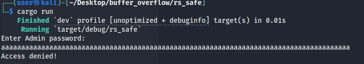

Rust was designed in a way that makes implementing insecure code significantly more difficult than writing memory-safe code, as demonstrated by the example we just reviewed.

Just for teaching purposes, let's go over an example of the same functionality, but this time *WITH* the buffer overflow vulnerability present in Rust.

10. (**kali**, **Terminal**) Run the following commands to setup and execute the unsafe Rust program:

```bash
mkdir -p ~/Desktop/buffer_overflow/rs_unsafe/
cd ~/Desktop/buffer_overflow/rs_unsafe/
cargo init
mv ~/Downloads/rs_unsafe.rs src/main.rs
cargo run
```

11. (**kali**, **Terminal**) When prompted, enter the string: `aaaaaaaaaaaa` (12 a characters).

You can ignore the printed list of random integers. Afterwards, you should see the message `Access granted!`. Lets view the Rust code that makes this possible. 

12.  (**kali**, **VS Code**) In the file navigation bar on the left, open the file `rs_unsafe.rs` which can be found by clicking the folders `buffer_overflow` -> `rs_unsafe` -> `src`. Finally click on the file `main.rs`. You should see this code:

```rust
use std::{
    error::Error,
    io::{self, Read, Write},
};

fn unsafe_equivalent() -> Result<(), Box<dyn Error>> {
    let mut password = [0; 10];
    let expected_password = "password".as_bytes();
    let mut is_authenticated = 0;

    println!("Enter Admin password: ");
    io::stdout().flush()?;
    let mut input_vec = vec![0; 20];
    let _ = io::stdin().read(&mut input_vec)?;
    println!("{input_vec:?}");

    let raw_ptr_password = password.as_mut_ptr();
    for (index, element) in input_vec.iter().enumerate() {
        unsafe {
            *raw_ptr_password.add(index) = *element;
        }
    }
    println!("{password:?}");

    if (0..expected_password.len()).all(|index| password[index] == expected_password[index]) {
        is_authenticated = 1;
    }

    if is_authenticated == 0 {
        println!("Access denied!");
    } else {
        println!("Access granted!");
    }

    Ok(())
}

fn main() {
    _ = unsafe_equivalent();
}
```

You should see immediately that this vulnerable script has more code in it than the safe version. This is because Rust is set to run safely by default, so in order to execute insecure code, it requires extra configurations and function calls. Below we'll go over some of the key differences in the above code to the safe code we ran previously.

```rust
    println!("Enter Admin password: ");
    io::stdout().flush()?;
    let mut input_vec = vec![0; 20];
    let _ = io::stdin().read(&mut input_vec)?;
```

In the original safe code, we utilized the `read_line` method to read in data and assign it to a variable. The `read` method used above will never read more bytes than the target buffer has available. In order to introduce the same vulnerability present in the C version of the program, we have to intentionally introduce extra vulnerable steps. 

```rust
let raw_ptr_password = password.as_mut_ptr();
for (index, element) in input_vec.iter().enumerate() {
  unsafe {
    *raw_ptr_password.add(index) = *element;
  }
}
```

Additionally, Rust cannot transfer all the data from `input_vec` (The data input by the user) to the variable `password` without triggering a Rust panic as it would be trying to assign a value to a variable that goes on its declared size. 

| &#128493; DEFINITION |
|---|
|_A Rust panic is when a bug, error, or some other scenario occurs which causes the program to get into an unrecoverable state. Due to this, a panic will cause the program to terminate it's execution immediately. Upon triggering a panic, it will return feedback to the caller of the program information on why the panic occurred._|

Because of this, we have to use a raw pointer to circumvent the built-in protection. 

| &#128493; DEFINITION |
|---|
|_A raw pointer can be created to point to a valid memory location. These are Variables created and referenced with a "&", they can point to null, unaligned, or incorrect memory locations._|

Additionally, Rust doesn't normally allow reading of memory locations associated with a raw pointer. In order to achieve this, the developer would have to implement an `unsafe` code block. 

| &#128493; Unsafe Code Block |
|---|

Because Rust provides a good degree of memory-safety during development and execution, there are a few actions that are not generally allowed within a script. They are:

- Dereference a raw pointer
  - Accessing the data at the memory address the pointer points to.
- Call an unsafe function or method
- Access or modify a mutable static variable
  - `mut` (mutable) variables are opt-in in Rust. To be able to alter the value of a variable in-place, it needs to be declared with the keyword `mut`. Without it, you can only change a bound variables value by re-declaring it. This may or may not reuse the old value's memory address, but even when it does, the new variable is re-initialized.
  - Static in Rust is similar to static in C where it's only accessible within a particular scope, but the specific scope is not the same.
- Implement an unsafe trait
  - Traits are very similar to interfaces in other languages, but the Rust version only defines behaviors, not data.
- Access fields of a union
  - A union is a data structure which can essentially masquerade as multiple data types, depending on which field is used. All of the fields share one memory location. This means that improper use of a union can cause undefined behavior, which is why it requires unsafe. The Rust implementation of the union is primarily for interacting with C code, because Rust provides enums that fill the same role as a union but have their type embedded into the data structure, meaning that the compiler can provide safe abstractions around their use.

But there are situations when the developer will know what they're doing and will want to perform one of these actions. In order to do so, they will have to use the keyword `unsafe` and create a code block to complete it.

In the example code above, we had to implement the unsafe code block as well as other measures in order to introduce the buffer overflow vulnerability. Rust's default behavior provides many protection to buffer overflow vulnerabilities.

</p>
</details>

<details>
<summary>
<h3>Phase 1 Grading Check<h3>
</summary>
<p>

1. (**kali**, **Firefox**) To check your work, browse to the grading page at `https://skills.hub/lab/tasks` or `(https://10.5.5.5/lab/tasks)`. Click the `Submit/Re-Grade Tasks` button to trigger the grading checks. Refresh the results after a few moments to see your results.

These two checks will verify that you were able to successfully complete the C programs and compile them with the vulnerabilities present.

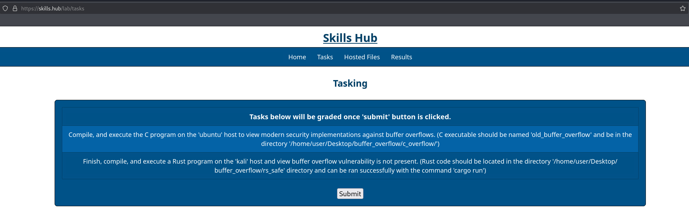

Grading Check 1: Compile, and execute the C program on the `ubuntu` host to view modern security implementations against buffer overflows. (C executable should be named `old_buffer_overflow` and be in the directory `/home/user/Desktop/buffer_overflow/`)
   - Script was compiled and written as "old_buffer_overflow" and is present in `buffer_overflow` directory.

Grading Check 2: Finish, compile, and execute a Rust program on the `kali` host and view buffer overflow vulnerability is not present. (Rust code should be located in the directory `/home/user/Desktop/buffer_overflow/rs_safe` directory and can be ran successfully with the command `cargo run`)
   - Provided code was inserted correctly to finish the script.
   - Script was compiled in the `rs_safe` directory and runs with the command `cargo run`.

`Copy the token or flag strings to the corresponding question submission field to receive credit.`

`You should complete all phase 1 tasks before moving on to phase 2.`

</p>
</details>

## Phase 2: Integer Overflows and Rust

<details>
<summary>
<h3>Integer Overflow Refresher</h3>
</summary>
<p>

In the first `Secure Programming` lab, we covered integer overflows; what they were, how they were implemented, and how they could be manipulated. We will cover some old concepts taught and learn how Rust can handle integer overflows.

When variables are initialized, they are declared with a specific data type which tells the program what kind of data it can store. There are different data types that can be utilized, and each data type has a size associated as well as a range of values that it can hold.
When a developer is creating their program, they can help optimize it by assigning the lowest-sized data type to hold a value during a programs execution.

| &#128493; RECALL |
|---|
|_In the first Secure Programming lab we used this analogy to help explain optimization of a program: "If you had a program that acted as a calculator and another that acted as a clock, you wouldn’t want to use the same datatypes to store each type of data. A calculator could create an infinite set of small and large numbers, both positive and negative. A digital clock has a finite set of possible time values of maximum known sizes. Even if the current time was stored and calculated as seconds, the maximum size number the clock would need to be able to store is 86,400 for any given day."._|

An integer overflow vulnerability occurs when a variable is assigned a value that is outside the range of accepted values. When that happens, the value of the variable "rolls over". 

| &#128493; RECALL |
|---|
|_In the first Secure Programming lab, we presented this image of an int data type to help explain the "roll-over" concept._|

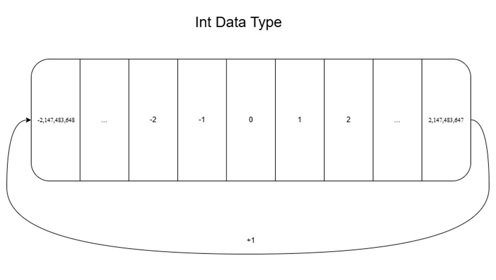

The int data type has an accepted range of -2,147,483,648 to 2,147,483,647, meaning that it can hold any value in that range without an issue. But say an int variable has the value 2,147,483,647 and we attempt to add to it, that is when the roll-over would occur. 

1. (**kali**, **Firefox**) On the Skills Hub site, click on the tab `Hosted Files`. You should see a folder labeled `Integer Overflow`, click it. Inside should be the files `unchecked_int_overflow.c`, `checked_int_overflow.c`, `checked.rs`, `pointers.c`, and `overflow.rs`. Click and download all of them.

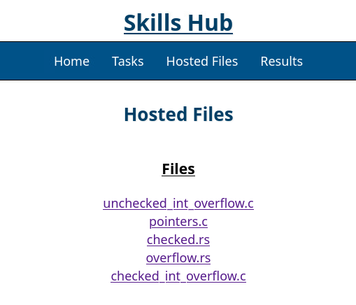

2. (**kali**, **Terminal**) In the terminal, run the following commands:

```bash
mkdir -p ~/Desktop/integer_overflow/c_overflow
mv ~/Downloads/*.c ~/Desktop/integer_overflow/c_overflow
cd ~/Desktop/integer_overflow/c_overflow
```

3. (**kali**, **VS Code**) In the file navigation bar on the left, click the following folders to open them: `integer_overflow` -> `c_overflow`. Finally click on the file `unchecked_int_overflow.c`. You should see this code:

```c
#include <stdint.h>
#include <stdio.h>

int main(int argc, char** argv) {
  int max_int = INT32_MAX;

  printf("%d\n", max_int);

  max_int += 1;

  printf("%d\n", max_int);
}
```

This file contains basic code that declares the C variable `max_int` as an int data type and assigns it the max positive value that is valid for an int. 

It then prints the value of `max_int` and afterwards, attempts to add 1 to it to go beyond it.

It will show what occurs when an integer overflow occurs on an int data type by printing the new value of `max_int`.

4. (**kali**, **Terminal**) Run the following command to compile the code:

```bash
gcc -o unchecked_iof unchecked_int_overflow.c
```

5. (**kali**, **Terminal**) Run the following command to run the executable:

```bash
./unchecked_iof
```

In the output, you should see that the integer overflow roll-over was triggered as the value changed from 2,147,483,647 to -2,147,483,648. 

It is also important to note the reason why integer overflow isn't caught by C Stack Canary. The Stack Canary was implemented to catch and help prevent buffer overflows from writing into a memory location that is not intended. Integer overflow vulnerabilities occur due to arithmetic errors within a single variable that do not have the correct safeguards in place.

6. (**kali**, **Terminal**) To view a C program with the correct integer overflow safeguards implemented, follow these steps in the terminal:
   1. Ensure you are in the `c_overflow` directory in the `integer_overflow` folder.
   2. Run the commands:
   ```bash
    gcc -o checked_iof checked_int_overflow.c
    ./checked_iof
   ```

This program will attempt to add values to go outside the accepted range of an int data type and perform checks of the intended end value. If the value is outside the accepted range, it will print a line explaining that integer overflow has been triggered and return either the maximum or minimum value of an int.

Integer overflow vulnerabilities are not inherently a memory-safety bug, but depending on the implementation, memory-related issues can occur if pointer offsets are manipulated. But first, let's cover pointers.

| &#128493; DEFINITION |
|---|
|_In C, a pointer is a variable that stores the memory address of another variable. Instead of holding a value directly, it holds the address of where the value is stored that you want assigned. Pointers can be declared by putting the character `*` in front of the name of the variable being declared. The usage of pointers supports dynamic memory allocation and is one way developers can implement control over memory usage._|

7. (**kali**, **VS Code**) In the same directory in the left panel, open the file `pointers.c`. 

```c
#include <stdio.h>

int main() {
    int example_array[3] = {5, 10, 15};
    int *example_pointer = &example_array[0];

    printf("The value of the first entry in the array 'example_array' is: %d\n", example_array[0]); // Basic use of variable and printing it's value
    printf("The memory address of the first entry in the array 'example_array' is: %p\n", &example_array[0]); // Utilizes the `&` character to print the memory address of the array entry.
    printf("The value of the first entry in the array 'example_array' using the variable 'example_pointer': %d\n", *example_pointer); // Utilizes the `*` character to print the value pointed to in a pointer variable.
    printf("The memory address of the first entry in the array 'example_array' using the variable 'example_pointer': %p\n\n", example_pointer); // Prints the memory address assigned to the example_pointer variable.

    return 0;
}

```

In this script, we create the variable `example_array` as an int array with a size of 3 and with 3 entries.

We then declare the variable `example_pointer` as a pointer, indicated with the use of the character `*`. 

The `example_pointer` pointer is then assigned `&example_array[0]` which contains the address of the entry in the array with the index `0`, which in our code is the value `5`.

The print lines then present how both the value and address of the data can be accessed using the original variable `example_array` or through the use of the pointer `example_pointer`.

8. (**kali**, **Terminal**) In the `c_overflow` directory, run the following commands:

```bash
gcc -o pointer_example pointers.c
./pointer_example
```

In the output, you should see that the value and address of that first entry in the array is printed twice. Now let's go into pointer offsets.

| &#128493; DEFINITION |
|---|
|_A pointer offset refers to the process of manipulating a pointer variable to point to a new memory location relative to the location of the original pointer._|

9. (**kali**, **VS Code**) In the `pointers.c` file, let's add the following lines starting on line 12:

```c
printf("The value of the second entry in the array 'example_array' is: %d\n", example_array[1]);
printf("The memory address of the second entry in the array 'example_array' is: %p\n", &example_array[1]);
printf("The value of the second entry in the array 'example_array' manipulating the 'example_pointer': %d\n", *(example_pointer + 1));
printf("The memory address of the second entry in the array 'example_array' manipulating the 'example_pointer': %p\n", (example_pointer+1));
```

The first two print lines will print the value and address of the *second* entry in the `example_array` variable using the normal methods.

The last two print lines will be manipulating the original `example_pointer` variable utilizing a pointer offset to get the value and address of the second entry in the `example_array` variable. This is done by adding an offset, represented with the value `1`, to get the value in the next memory location. 

It should look like this when completed:

```c
#include <stdio.h>

int main() {
    int example_array[3] = {5, 10, 15};
    int *example_pointer = &example_array[0];

    printf("The value of the first entry in the array 'example_array' is: %d\n", example_array[0]); // Basic use of variable and printing it's value
    printf("The memory address of the first entry in the array 'example_array' is: %p\n", &example_array[0]); // Utilizes the `&` character to print the memory address of the array entry.
    printf("The value of the first entry in the array 'example_array' using the variable 'example_pointer': %d\n", *example_pointer); // Utilizes the `*` character to print the value pointed to in a pointer variable.
    printf("The memory address of the first entry in the array 'example_array' using the variable 'example_pointer': %p\n\n", example_pointer); // Prints the memory address assigned to the example_pointer variable.

    printf("The value of the second entry in the array 'example_array' is: %d\n", example_array[1]);
    printf("The memory address of the second entry in the array 'example_array' is: %p\n", &example_array[1]);
    printf("The value of the second entry in the array 'example_array' manipulating the 'example_pointer': %d\n", *(example_pointer + 1));
    printf("The memory address of the second entry in the array 'example_array' manipulating the 'example_pointer': %p\n", (example_pointer+1));
    
    return 0;
}
```

10. (**kali**, **Terminal**) Re-compile the code and execute it with the commands:

```bash
gcc -o pointer_offset pointers.c
./pointer_offset
```

In the output, you should see that the value and addresses match from the new print lines.

| &#128493; DEFINITION |
|---|
|_An offset refers to a distance (typically represented as a number of bytes) from a base address to a specific location. In the code above, the variable `example_pointer` is assigned the location of the first index of the array `example_array`. We were able to get the second entry in the array by adding an offset of 1 (we assigned the first index at the declaration, so we just need to add 1 to the base prior to accessing it). If we wanted to get the third entry in the array, we could do so with the code `*(example_pointer + 2)`._|

The use of pointers and offsets is a common practice of accessing values and addresses. Our example used a number to represent the offset, but it is just as easily represented with a variable.

Now what if a program was manipulated so an integer overflow occurred on the offset value? In most cases the program will crash with a segmentation fault, but sometimes the new address pointed to is allocated memory - and the data located there.

The standard library in C doesn't provide functions that can perform arithmetic checks, so it is up to the developer to implement safeguards to prevent integer overflows.

Additionally, programmers really need to think about the valid range of integers, since pointer offsets are a common way to access data, and C has no built-in bounds checking. Overflows are absolutely critical in this situation.

</p>
</details>

<details>
<summary>
<h3>Integer Overflow and Rust</h3>
</summary>
<p>

Integer overflows are a more difficult vulnerability to mitigate due to the fact that they're not inherently a bug that can crash a program, they're an arithmetic error that can cause a variable's value to change to an unintended one.

Rust is susceptible to integer overflows, but unlike C, Rust has built-in checks and methods to help prevent them from occurring. Let's go over a basic Rust script that has an integer overflow vulnerability.

1. (**kali**, **Terminal**) Run the following commands to setup the folder where we will interact with our code:

```bash
mkdir -p ~/Desktop/integer_overflow/rs_overflow/
cd ~/Desktop/integer_overflow/rs_overflow/
cargo init
mv ~/Downloads/overflow.rs src/main.rs
```

2. (**kali**, **VS Code**) You should still have the `Desktop` folder open in the left side panel. In the file navigation bar on the left, click the following folders to open them: `integer_overflow` -> `rs_overflow` -> `src`. Finally click on the file `main.rs`, You should see this code:

```rust
fn main() {
    let mut max_int = i32::MAX;

    println!("{max_int}");

    max_int += 1;

    println!("{max_int}");
}
```

This creates a signed 32-bit mutable variable `max_int` (remember, mutable means that the variables value CAN be altered). It then assigns it the max valid value possible for a signed integer. This is done using the notation `i32::MAX` seen above. 

It prints the value of the variable `max_int` to present what it is prior to triggering the integer overflow. It then increases the variable `max_int` value by 1 and then attempts to print it. 

| &#128493; DEFINITION |
|---|
|_When declaring variables, they can be declared as signed or unsigned. A signed variable means that the value stored can represent a positive or a negative. Unsigned variables can only hold non-negative numbers, meaning greater than or equal to 0. The use of signed versus unsigned changes the accepted value of ranges that can be assigned to it._|

| &#128270; INFORMATION |
|---|
|_Rust has notation that can be used in variable declaration statements that state what kind of data the variable will hold. In the example above, `i32` is a 32-bit signed integer data type. If you wish to know more, you can read about data types <a href="https://doc.rust-lang.org/book/ch03-02-data-types.html" target="_blank">here.</a>_|

3. (**kali**, **Terminal**) In the `rs_overflow` directory, run the following commands to check your script, compile, and execute it:

```bash
cargo run
```

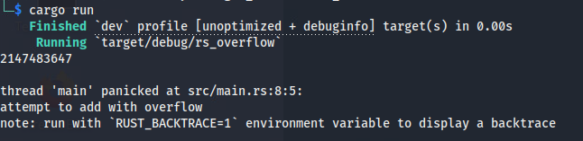

In the response you should see that a `panic` occurred due to an attempted overflow. Also, in the response, you can view what line caused the panic to occur as well as a message describing it. 

Part of the response should look similar to this:

```bash
thread 'main' panicked at src/main.rs:8:5:
```

From this line, we can tell the following:
- The file the panic occurred in. `src/main.rs`
- The panic occurred in the `main` thread of the program, which is where a Rust script begins its execution.
- The line in the program where it occurred, indicated with the `:8` following the file location.
- The column (or number of characters from the start) that contains the first character of the data where the panic occurred, which is indicated with the `:5` following the `:8`.
  - In our case, it is pointing to the character `m` for the `max_int` variable. This is because the code is indented using the `tab` key, which is known to be equal to 4 spaces.

The line following provides a brief description of why the panic occurred.

```bash
attempt to add with overflow
```

The program was able to tell that an integer overflow occurred and caused a panic.

With a C program, triggering an integer overflow resulted in a special response or halted the execution of the code. In Rust, despite there being no checks manually added to the script, it still provides built-in checks that terminate program execution if an integer overflow occurs. 

It's still not great for a program to crash if an integer overflow occurs, but it's an improvement over C where ithe program continues to run.

Let's go over a safe version of the code where Rust is able to perform those checks and prevent an overflow from happening.

4. (**kali**, **Terminal**) Run the following commands to set up the folder where we will interact with the next piece of code:

```bash
mkdir -p ~/Desktop/integer_overflow/rs_checked/
cd ~/Desktop/integer_overflow/rs_checked/
cargo init
mv ~/Downloads/checked.rs src/main.rs
```

5. (**kali**, **VS Code**) You should still have the `Desktop` folder open in the left side panel. In the file navigation bar on the left, click the following folders to open them: `integer_overflow` -> `rs_checked` -> `src`. Finally click on the file `main.rs`, You should see this code:

```rust
fn main() {
  let max_int = i32::MAX;

  println!("{max_int}");


}
```

6. (**kali**, **VS Code**) On line 6, write the following line to declare an if statement that will perform the integer overflow checks. (Make sure to use correct indentation as it can cause errors during compilation.)

```Rust
if max_int.checked_add(1).is_none() {
```

7.  (**kali**, **VS Code**) On line 7, write the following print statement that will be executed as the body of the if statement if it returns `true`.
  
```Rust
  println!("Int overflow detected!\n");
```

8. (**kali**, **VS Code**) On line 8, write a closing bracket, `}`, that will indicate the end of the implemented `if` statement.

```Rust
}
```

Once completed, your script should look like this

```Rust
fn main() {
  let max_int = i32::MAX;

  println!("{max_int}\n");
  
  if max_int.checked_add(1).is_none() {
    println!("Int overflow detected!\n");
  }
}
```

9.  (**kali**, **Terminal**) In the `rs_checked` directory, run the following commands to check your script, compile it, and execute it:

```bash
cargo run
```

In the output, you should see that it prints the max integer value indicated by the first print line `println!("{max_int}");`. This is the same value shown in the previous program, but you should also see that the print line `println!("Int overflow detected!");` was also triggered inside the if statement. This is thanks to the implemented `if` statement:

```rust
if max_int.checked_add(1).is_none() {
  println!("Int overflow detected!");
}
```

Let's break down this `if` statement. 

- It starts with the use of the previously created variable `max_int`, which currently holds the value `2147483647` - the highest valid value an integer can hold. 
- It then calls the method `checked_add` on that integer variable and passes the value `1`. 
  - The `checked_add` method is one of many that are built into Rust, and it is used to check if the passed value ("1" in this case) would cause an overflow if it was added to the initial variable (which is `max_int` in our script). 
- When the method runs, it checks if the value of the variable (`max_int`) plus the value passed (`1`) would cause an integer overflow. If it does, then it returns the value `None`. 
- Lastly, we call the method `is_none`. 
  - The name alludes to its functionality, where if the value is `None`, it returns the boolean `True`, otherwise it returns `False`. 

All together, the statement is checking if adding the value `1` to our variable `max_int` causes an overflow. If it does, it will return `None`. Combined with the `is_none` method, the code block of the if statement will be triggered if an integer overflow occurs as it will return the boolean `True`, and if there is no integer overflow, the if statement will resolve to `False`.

It's that easy in Rust to perform checks for integer overflows, and Rust provides an array of `checked` methods that can be used depending on the arithmetic the user is attempting to implement. Some other methods available that can check for underflow or overflows are `checked_sub()`, which checks values after performing subtraction, and `checked_mul()`, which checks values after performing multiplication.

</p>
</details>

<details>
<summary>
<h3>Rust Release Profiles</h3>
</summary>
<p>

Rust offers the ability to customize how code is compiled with the use of Release Profiles. We will not be covering this in depth, but it is important to understand how the behavior of these profiles are related to integer overflows.

| &#128493; DEFINITION |
|---|
|_The definition of Release Profiles is pulled from Rust documentation: Release profiles are predefined and customizable profiles with different configurations that allow a programmer to have more control over various options for compiling code. Each profile is configured independently of the others._|

The two main profiles we will be discussing are `dev` and `release`. The `dev` profile is the default profile used when the command `cargo build` is run; it's better suited for when the code is still being developed, as it can also be referenced as the debug build. The `release` profile is better suited for final builds to be released.

1. (**kali**, **Terminal**) Run the following command to move back into the `rs_overflow` folder.
  
```bash
cd ~/Desktop/integer_overflow/rs_overflow
```

Previously we compiled and executed the code using the default `dev` profile. We saw that an error was returned from the attempted integer overflow during compilation. Now let's attempt to compile this code again, but this time using the `release` build, and then execute it.

2. (**kali**, **Terminal**) Run the following command to compile the code and run the executable using the `release` profile:

```bash
cargo run --release
```

You should see a different response than before as the integer overflow has occurred and the updated value of `max_int` is now `-2147483648`.

It is important to note that Rust offers these built-in security checks for developers, but they are only performed while the code is being tested and run using the debug (dev) profile. Rust has implemented it this way to support development of code by providing these checks while the program is being created. The intended goal is that the developer would see and fix these bugs prior to completing the program as using the `release` profile is mainly intended for programs that are finished and ready to be released. 

More can be read about Rust Release Profiles in their <a href="https://doc.rust-lang.org/book/ch14-01-release-profiles.html">official documentation</a>

</p>
</details>

<details>
<summary>
<h3>Phase 2 Grading Check<h3>
</summary>
<p>


1. (**kali**, **Firefox**) To check your work, browse to the grading page at `https://skills.hub/lab/tasks` or `(https://10.5.5.5/lab/tasks)`. Click the `Submit/Re-Grade Tasks` button to trigger the grading checks. Refresh the results after a few moments to see your results.

These two checks will verify that you were able to successfully complete the C programs and compile them with the vulnerabilities present.


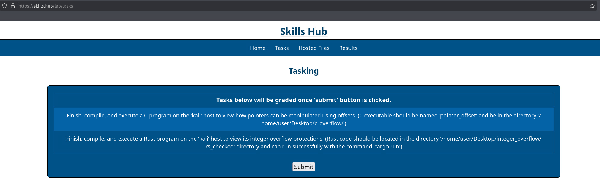

Grading Check 3: Finish, compile, and execute a C program on the `kali` host to view how pointers can be manipulated using offsets. (C executable should be named `pointer_offset` and be in the directory `/home/user/Desktop/c_pointer/`)
   - Provided code was inserted correctly to finish the script.
   - Script was compiled with the executable named `pointer_offset` and is in the `c_pointer` folder.

Grading Check 4: Finish, compile, and execute a Rust program on the `kali` host to view its integer overflow protections. (Rust code should be located in the directory `/home/user/Desktop/integer_overflow/rs_checked` directory and can run successfully with the command `cargo run`)
   - Provided code was inserted correctly to finish the script.
   - Script was compiled in the `rs_checked` directory and runs with the command `cargo run`.

`Copy the token or flag strings to the corresponding question submission field to receive credit.`

`You should complete all phase 2 tasks before moving on to phase 3.`

</p>
</details>


## Phase 3: Use After Free

<details>
<summary>
<h3>Use After Free in C<h3>
</summary>
<p>

The "use after free" vulnerability is one that occurs in programming languages that are not memory-safe. This occurs due to how the developer handles allocating and deallocating Dynamic Memory during a programs execution. 

| &#128493; DEFINITION |
|---|
|_Dynamic Memory Allocation allows for the developer to manipulate memory at runtime rather than statically defining it and compiling it. Memory that is dynamically manipulated during run time is stored in the heap memory instead of the stack. Previously, we stated that the stack is where variables in functions are stored. This gives developers the ability to handle varying sizes of data during a programs execution._|

Dynamic Memory Allocation provides a method for developers to increase or decrease an object's size during runtime depending on what data it is processing to increase optimization and decrease unnecessary memory usage.

In C, the functionality to manipulate dynamic memory is available with the use of specific functions. Below are some, but not all, of the functions that can be utilized:


#### `malloc`

The malloc function is used to allocate a contiguous block of memory on the heap during a programs runtime. The function takes one argument which is the size in bytes that the developer wants allocated. When this function runs, it 
creates a single uninitialized connected block of memory. Uninitialized means that the data in memory will contain garbage data until it is utilized.

After it is executed, it will return a void pointer to the location of the allocated memory. The void pointer is then converted to the pointer of the required type. If allocation fails, it returns NULL pointer.


#### `calloc`

The calloc function is similar to malloc but has a slight difference in behavior. It takes two arguments, with the first being a number to indicate the number of elements it will contain and the second is to set the size of each element in bytes. When the function is executed, it creates a single initialized connected block of memory where the data in memory is allocated with zero values. 

After it is executed, it will return a void pointer to the location of the allocated memory. The void pointer is then converted to the pointer of the required type. If allocation fails, it returns NULL pointer.


#### `realloc`

The realloc function is used to reallocate previously allocated data in order to resize memory blocks. It allows for the developer to change the size of memory previously allocated without needing to allocate a new block of data. The function takes two arguments. The first is the pointer to a previously allocated memory block. The second argument is the size, in bytes, you want the previously allocated memory to be updated to. 

After it is executed, it will return a pointer to the update allocated memory, or NULL if the reallocation fails. Additionally, if the reallocation fails the original memory block that was allocated will remain unchanged.

#### `free`

The essential free function is used to release previously allocated memory, as it is not automatically deallocated. The memory that is deallocated by this function is released back to the operating system. The function only takes one argument - the pointer to a location of memory that was previously allocated. This function plays a key part in managing dynamic memory to ensure there are no memory leaks.

After it is executed, the data in that memory location will be designated as free space to be used in the future. 


| &#128493; DEFINITION |
|---|
|_A memory leak occurs when dynamic memory is allocated but it is not deallocated, and it remains for the rest of the programs execution and is often unused as the pointer to the memory location is not tracked correctly._|


The use after free bug occurs when a program continues to access a location of memory after that memory has been deallocated. When this occurs, it can cause unexpected behavior (similar to what a buffer overflow can cause). 

1. (**kali**, **Firefox**) On the Skills Hub site, click on the tab `Hosted Files`. You should see a folder labeled `Use After Free`, click it. Inside should be the files `use_after_free.c`, `unsafe.rs`, and `safe.rs`. Click and download all files.

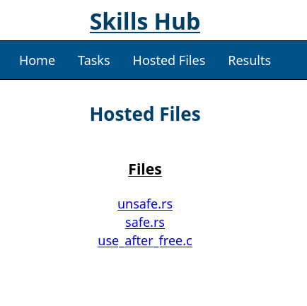

2. (**kali**, **Terminal**) Run the following commands to setup the folder where we will interact with our code:

```bash
mkdir -p ~/Desktop/use_after_free/c_uaf/
mv ~/Downloads/use_after_free.c ~/Desktop/use_after_free/c_uaf/
cd ~/Desktop/use_after_free/c_uaf/
```

3. (**kali**, **VS Code**) In the file navigation bar on the left, click the following folders to open them: `use_after_free` -> `c_uaf`. Finally click on the file `use_after_free.c`, You should see this code:

```c
#include <stdio.h>
#include <stdlib.h>

int main(int argc, char** argv) {
  int* int_arr = malloc(sizeof(int) * 1000);

  for (int i = 0; i < 1000; i++) {
    *(int_arr + i) = i;
  }
  // printf("%d\n", *(int_arr+5));
  free(int_arr);
  printf("%d\n", *(int_arr+5));
}
```

Let's briefly cover it's behavior:

- `int* int_arr = malloc(sizeof(int) * 1000);`
  - This line creates an integer array pointer called `int_arr`.
  - The size allocated is determined by multiplying the size of an integer times 1000. 
    - The `sizeof` operator is used here to determine the size of the data type which allows for better support across different architectures as data type sizes can differ between different architectures.
  - This means that this array can hold 1000 integers.
- `for` loop
  - `(int i = 0; i < 1000; i++`
     - This defines the for loop where `i` starts at 0 and will iterate until `i` is 999.
  - `*(int_arr + i) = i;`
     - In each iteration, this line will assign the value of `i` to the i'th position in the array `int_arr`.
     - For example:
       - int_arr[0] = 0
       - int_arr[1] = 1
       - etc.
- `// printf("%d\n", *(int_arr+5));`
  - This line is commented, but it would print out the value of the data at the 5th index of the array. We will come back to this.
- `free(int_arr);`
  - Here we are using the `free` function to deallocate the memory from the declared array `int_arr`.
- `printf("%d\n", *(int_arr+5));`
  - This line is the same as the previous print line where it will print out the value of the data at the 5th index of the array.


4. (**kali**, **Terminal**) Compile the C code and run the executable using the following commands:

```bash
gcc -o first_uaf use_after_free.c
./first_uaf
```

You should see in the output that the value `5` is being printed. How can this be? We "freed" the previously allocated memory.

When dynamic memory is freed, it is returned to the system. But just because it has been deallocated doesn't mean that the data located in that memory is gone or automatically overwritten. You can see in the programs execution that the pointer array `int_arr` can still be referenced to get the data from an index in the array despite being deallocated.

5. (**kali**, **VS Code**) Uncomment the print line located around line 9 and then save the file.

6. (**kali**, **Terminal**) Re-compile the C code and run the executable with the commands:

```bash
gcc -o second_uaf use_after_free.c
./second_uaf
```

You should see different behavior now in the response.

In the first print line, it will be printing the value `5` again. This is correct and expected as the print line occurs BEFORE the `free` function is called and so the memory is still allocated and storing the array.

But the second print line should be showing the value `0`, although you may see different behavior. This is the unexpected behavior mentioned before that is caused by interacting with memory that has been deallocated. Through the implementation of a new print line, it changed the behavior and output of the second print statement.

When dealing with dynamic memory, it is generally bad practice to *not* clean up sensitive data in allocated memory. It is recommended to overwrite the data before freeing it.

7. (**kali**, **VS Code**) Follow these instructions to clean up the C program.
   1. Re-comment the first print line.
   2. Copy the for loop in the script and paste it right before the `free` function.
   3. Inside the body of the for loop, change the value being assigned from an `i` -> `0`.
   4. Save the file.

Your code should look like this:

```C
#include <stdio.h>
#include <stdlib.h>

int main(int argc, char** argv) {
  int* int_arr = malloc(sizeof(int) * 1000);

  for (int i = 0; i < 1000; i++) {
    *(int_arr + i) = i;
  }

  // printf("Value located at the fifth index of the array is: %d\n", *(int_arr+5));

  for (int i = 0; i < 1000; i++) {
    *(int_arr + i) = 0;
  }
  free(int_arr);

  printf("Value of fifth index after running 'free' function is: %d\n", *(int_arr+5));
}
```

8. (**kali**, **Terminal**) Run the following commands to compile and run the executable:

```bash
gcc -o cleanup_uaf use_after_free.c
./cleanup_uaf
```

Now when you run the program, it will print dummy information rather than sensitive data that was used during the programs execution.

This is a common bug that can occur in C programs but let's see how Rust handles it.

</p>
</details>


<details>
<summary>
<h3>Use After Free in Rust<h3>
</summary>
<p>

1. (**kali**, **Terminal**) Run the following commands to setup the folders where we will interact the Rust code:

```bash
mkdir -p ~/Desktop/use_after_free/rs_safe ~/Desktop/use_after_free/rs_unsafe
cd ~/Desktop/use_after_free/rs_unsafe 
cargo init
mv ~/Downloads/unsafe.rs src/main.rs
cd ~/Desktop/use_after_free/rs_safe 
cargo init
mv ~/Downloads/safe.rs src/main.rs

```

2. (**kali**, **VS Code**) In the file navigation bar on the left, click the following folders to open them: `use_after_free` -> `rs_safe` -> `src`. Finally, click on the file `main.rs`, You should see this code:

```rust
fn main() {


    println!("\nValue located at the tenth index of vector 'values': {}", values[10]);

    drop(values);

    // println!("Value located at the tenth index of vector 'values' after dropping it: {}", values[10]);
}
```

3. (**kali**, **VS Code**) On line 2 as the first line in the main function, insert the following code:

```Rust
let mut values: Vec<i32> = vec![0; 1000];
```

4. (**kali**, **VS Code**) On line 4, insert the following code where we will declare a for loop where we will be iterating values from 0 to 1000:

```Rust
for val in 0..1000 {
```

5. (**kali**, **VS Code**) On line 5 in the body of the for loop, insert the following line where we will assign values to the vector object.

```Rust
values[val] = val as i32;
```

6. (**kali**, **VS Code**) On line 6, write a closing bracket, `}`, that will indicate the end of the implemented for loop.

```Rust
}
```

Once completed, your script should look like this:

```Rust
fn main() {
    let mut values: Vec<i32> = vec![0; 1000];

    for val in 0..1000 {
        values[val] = val as i32;
    }

    println!("\nValue located at the tenth index of vector 'values': {}", values[10]);

    drop(values);

    // println!("Value located at the tenth index of vector 'values' after dropping it: {}", values[10]);
}
```

| &#128270; INFORMATION |
|---|

The data type `Vec`, also known as `vector`, is a data structure that can hold a collection of items, similar to a `list` in other languages. But where it differs from other languages is that it has some unique characteristics.

When a vector is declared, it can be declared with or without a direct reference to a data type. Regardless of its declaration, a vector can only store data of the same type. The compiler has the ability to determine the data type of the vector based on the data it stores if it isn't declared.

Additionally, a vector is unique as it can grow or shrink in size during execution.

Let's cover what this script is doing:

- `let mut values: Vec<i32> = vec![0; 1000];`
  - `let mut values: Vec<i32>`
    - We declared the mutable variable `values` as a vector and specified the type of data it will store as a `i32` (32 bit signed integer). Remember that a mutable variable is one that can have its value changed during a program's execution.
  - `vec![0; 1000]`
    - `vec!` is a macro used to create vectors.
    - The notation `[0; 1000]` is used to assign 1000 elements to the vector, where each element value is set to 0.
      - The syntax can also be read as `[value; count]` in order to "create a vector with *count* number of elements, each initialized to value *value*."
- `for` loop
  - This for loop contains the same functionality as the for loop used in the previous C program.
  - It is iterating from 0 to 1000.
  - Where in each iteration, it is assigning the value of the current iteration, val, to the index val in the vector `values`.
  - The notation `val as i32` is used due to the vector being declared as type `i32`, so this ensures the variable `val` is the matching data type.
- The first print line prints the value of a specific index in the vector.
- `drop(values);`
  - This function is similar to C `free` as it is used to explicitly destroy a value/variable.
  - It will release the resources used by the vector back to the system.

7. (**kali**, **Terminal**) You should still be in the `~/Desktop/use_after_free/rs_safe/` folder. Run the following command to compile and run the code:

```bash
cargo run
```

You should see a response stating the value at index 10 is the value `10`, which is correct. Now let's see what happens when we attempt to trigger the 'use after free' bug by accessing data in the vector object after the `drop` function is executed (which destroys the vector and frees it's resources).

8. (**kali**, **VS Code**) Uncomment the print line located after the `drop` function at the end of the main function, then save the file.

9. (**kali**, **Terminal**) Attempt to compile and execute the code again with the command

```bash
cargo run
```

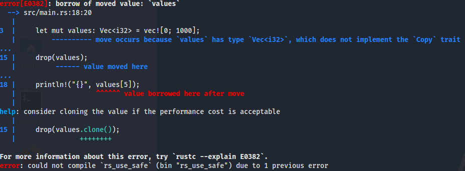

You should now see an error during compilation. Rust recognizes that the code has the "use after free" bug present and that it will attempt to access data at a memory location after it has been released. 

Thanks to Rust's advanced protections, it will not create the executable with the error present and requires the developer to address the issue.

10. (**kali**, **VS Code**) Re-add the comment for the second print line you just removed. 

For teaching purposes, let's see what the code would look like in order to introduce the "use after free" bug.

11. (**kali**, **VS Code**) In the file navigation bar on the left, click the following folders to open them: `use_after_free` -> `rs_unsafe` -> `src`. Finally click on the file `main.rs`, You should see this code:

```rust
use std::alloc::{Layout, alloc, dealloc};

fn main() {
    let mem_layout = Layout::array::<i32>(1000).unwrap();

    let int_arr;
    unsafe {
        int_arr = alloc(mem_layout).cast::<i32>();
    }

    for i in 0..1000 {
        unsafe {
            *int_arr.add(i) = i as i32;
        }
    }

    println!("\nValue located at the tenth index of integer array 'int_arr': {}", unsafe { *int_arr.add(10) });

    unsafe {
        dealloc(int_arr.cast::<u8>(), mem_layout);
    }

    println!("Value located at the tenth index of array after deallocating it: {}", unsafe { *int_arr.add(10) });
}
```

We won't go in depth on what this code is doing, but overall, this code replicates the functionality in the previous C program that contains the "use after free" bug. 

12. (**kali**, **Terminal**) Run the following commands:

```bash
cd ../rs_unsafe
cargo run
```

After the code runs, you should see that the value `10` is printed both before and after attempting to deallocate the memory for the array `int_arr` holding the data.

You should see that it is more difficult to implement unsafe code than safe code. This unsafe Rust program required the developer to go around the security measures in place and even utilize the `unsafe` code blocks to introduce the bug.

This is another example of how Rust makes it more difficult to implement insecure code than safe. 


### Valgrind

There are also tools available that can help with analyzing and detecting vulnerabilities present in programs, and the one we will touch on is the tool `valgrind`. Valgrind is a debugging tool and is intended to be used during the development process to help developers identify bugs.

It offers a variety of functionality to help with debugging programs, but one in particular is a tool called `memcheck` that can be used to help identify memory-related errors in your program. Let's try using it with the previous program that had the use after free bug.

13. (**kali**, **Terminal**) Run the following command to move into the directory that has the `rs_unsafe` folder executable:

```bash
cd ~/Desktop/use_after_free/rs_unsafe/target/debug
```

This folder will contain the executable `rs_unsafe` which we will be testing.

14.  (**kali**, **Terminal**) Run the following command to execute the Rust program

```bash
./rs_unsafe
```

You should see familiar output as it's outputting the same message that it did previously showing that the use after free bug is present. Let's now analyze it with valgrind.

**NOTE:** The program valgrind should be run against the *compiled executable*, not the script.

15. (**kali**, **Terminal**) Run the following command to analyze our executable with valgrind.

```bash
valgrind ./rs_unsafe
```

**NOTE:** It is easier to parse the output if the terminal is full-screened.

The output may seem a bit overwhelming, but it's not as bad as it looks. The first thing we'll look at is the last line in the output that starts with `ERROR SUMMARY`.

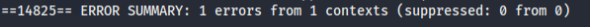

Here it's stating that it found 1 error, so that means we have to look back through the output to see where it is. Look for a block that starts with `Invalid read size of 4`.

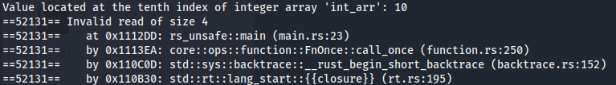

This is where the information will be that is on the error found. If you look at the line under `Invalid read...` line, it will have some information about where it occurred. The important thing to take away is the information inside the parenthesis (`()`) at the end of the line.

It states that the error is inside the file `main.rs` and it is located on line `26`.

16. (**kali**, **VS Code**) You should still have the `main.rs` file open from the `rs_unsafe` directory. If you don't, re-open it and look at the code present on line 26.

The line it is referencing is the line that triggers the use after free bug where we are attempting to print a memory location after it was deallocated. 

**NOTE:** Valgrind is a useful tool, but it is not able to find every bug and error that could occur in a program. It is meant to help the developer with finding some and supplement the development process.

</p>
</details>


<details>
<summary>
<h3>Phase 3 Grading Check<h3>
</summary>
<p>

### Phase 3 Grading Check

(**kali**, **Firefox**) To check your work, browse to the grading page at `https://skills.hub/lab/tasks` or `(https://10.5.5.5/lab/tasks)`. Click the `Submit/Re-Grade Tasks` button to trigger the grading checks. Refresh the results after a few moments to see your results.

These two checks will verify that you were able to successfully complete the C programs and compile them with the vulnerabilities present.

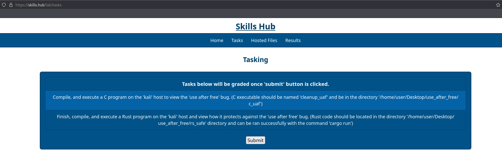

Grading Check 5: Compile and execute a C program on the `kali` host to view the "use after free" bug. (C executable should be named `cleanup_uaf` and be in the directory `/home/user/Desktop/use_after_free/c_uaf`)
    - Script was compiled and written as "cleanup_uaf" and is present in `c_uaf` directory.

Grading Check 6: Finish, compile, and execute a Rust program on the `kali` host and view how it protects against the "use after free" bug. (Rust code should be located in the directory `/home/user/Desktop/use_after_free/rs_safe` directory and can be run successfully with the command `cargo run`)
    - Provided code was inserted correctly to finish the script.
    - Script was compiled in the `rs_safe` directory and runs with the command `cargo run`.

`Copy the token or flag strings to the corresponding question submission field to receive credit.`

`You should complete all phase 3 tasks before moving on to phase 4.`

</p>
</details>


## Mini-Challenge

<details>
<summary>
<h3>Mini-Challenge Scenario</h3>
</summary>
<p>

There are additional files that will be available for download once you complete the lab. Browse to `https://skills.hub` and go to the `Hosted Files` page. You should see there is a new folder named `challenge` that contains various files. Download all files inside this `challenge` folder as they will be required for the objectives.

You should have 5 files in total: `mc_buf.rs`, `mc_int.rs`, `mc_uaf1.rs`, `mc_uaf2.rs`, and `mc_uaf3.rs`.

Draw on the information taught in this lab in order to analyze the scripts provided in order to solve the following mini-challenge questions:

**NOTE:** Remember the steps we used during the lab to initialize an environment to handle building and executing Rust scripts.

- What is the Rust command you can use to compile a script into an executable *BUT* not run it?
- When the code within the file `mc_buf.rs` is executed, does it cause a buffer overflow under any circumstance?
- What is the correct `checked` method that should be implemented in the `mc_int.rs` Rust script to prevent an integer overflow?
  - **Hint:** We discussed some checked methods that Rust has.
  - **NOTE:** The method should replace the string of asterix’s (`*`) located on line 8 in the script.
- Given the files `mc_uaf1.rs`, `mc_uaf2.rs`, and `mc_uaf3.rs`, which one currently has the "use after free" bug present?
  - **Hint:** The tool we discussed during the lab will help with solving this.

These questions can be answered on the `https://skills.hub/lab/tasks` web page.

#### Mini-Challenge Grading Check

(**kali**, **Firefox**) Browse to the grading page at `https://skills.hub/lab/tasks` or `(https://10.5.5.5/lab/tasks)`. Enter your answers for each question in the form that is provided and then click the `Submit/Re-Grade Tasks` button to trigger the grading check. Refresh the page after a few moments to see your results.

Grading Check 7: What is the Rust command you can use to compile a script into an executable *BUT* not run it?

Grading Check 8: When the code within the file `mc_buf.rs` is executed, does it cause a buffer overflow to occur under any circumstance?

Grading Check 9: What is the correct `checked` method that should be implemented in the `mc_int.rs` script to prevent an integer overflow?

Grading Check 10: Given the files `mc_uaf1.rs`, `mc_uaf2.rs`, and `mc_uaf3.rs`, which one currently has the "use after free" bug present?

`Copy the token or flag strings to the corresponding question submission field to receive credit.`

*Please attempt the mini-challenge as best you can, but if you get stuck you can reference the solution guide using the link below*

</p>
</details>


<details>
<summary>
<h2>Lab Wrap Up</h2>
</summary>
<p>

### Conclusion

By completing this lab, you have become more familiar with secure programming and have been introduced to the Rust programming language and how it encourages safe programming. 

To recap:
 - You experienced C programming language memory-related vulnerabilities.
 - You were introduced to Rust and how it encourages secure coding with its syntax and structure.
 - You demonstrated the C "use after free" bug and how Rust mitigates it.
 - You were shown the additional functionality Rust has that can be used by developers to support the secure creation of programs.

Skills exercised:
 - S0097: Skill in applying security controls.
 - S0172: Skill in applying secure coding techniques.
 - S0543: Skill in scanning for vulnerabilities
 - S0544: Skill in recognizing vulnerabilities.
 - S0619: Skill in auditing technical systems.
 - S0656: Skill in assessing application vulnerabilities.
 - S0686: Skill in performing risk assessments.

Memory-safe errors are a common vector that malicious actors are trying to exploit. The Rust programming language offers an improved way to create fast and efficient code that rivals the speed of C, but also greatly enhances its security. Rust inherently supports the priciples of "Secure by Design" by making it more difficult to implement unsafe code, and by having some restrictions in place to help catch and prevent an unwanted operation from occuring. 

In a recent article published by CISA and the NSA, they discussed the importance of using Memory Safe languages and mentioned Rust as a viable option. Additionally, they emphasize how using them can help reduce memory related vulnerabilities during software development. This article can be read <a href="https://www.cisa.gov/resources-tools/resources/memory-safe-languages-reducing-vulnerabilities-modern-software-development">here.</a>

### References
 - <a href="https://www.cisa.gov/resources-tools/resources/secure-demand-guide" target="_blank">Secure by Demand Guide: How Software Customers Can Drive a Secure - Technology Ecosystem</a>
 - <a href="https://www.cisa.gov/securebydesign" target="_blank">Secure by Design</a>
 - <a href="https://www.cisa.gov/resources-tools/resources/federal-civilian-executive-branch-fceb-operational-cybersecurity-alignment-focal-plan" target="_blank">Federal Civilian Executive Branch (FCEB) Operational Cybersecurity Alignment (FOCAL)</a>
 - <a href="https://niccs.cisa.gov/workforce-development/nice-framework" target="_blank">NICE Framework</a>
 - <a href="https://doc.rust-lang.org/book/ch00-00-introduction.html" target="_blank">Rust Guide</a>
 - <a href="https://www.technologyreview.com/2023/02/14/1067869/rust-worlds-fastest-growing-programming-language/" target="_blank">Rust Fast Growth</a>
 - <a href="https://www.sans.org/blog/stack-canaries-gingerly-sidestepping-the-cage/" target="_blank">Sidestepping Stack Canaries</a>
 - <a href="https://www.geeksforgeeks.org/dynamic-memory-allocation-in-c-using-malloc-calloc-free-and-realloc/" target="_blank">Malloc, Calloc, Free, realloc</a>
 - <a href="https://pubs.opengroup.org/onlinepubs/9699919799/basedefs/stdbool.h.html" target="_blank">Standard Header</a>
 - <a href="https://www.cisa.gov/resources-tools/resources/memory-safe-languages-reducing-vulnerabilities-modern-software-development">Memory Safe Languages: Reducing Vulnerabilities in Modern Software Development</a>