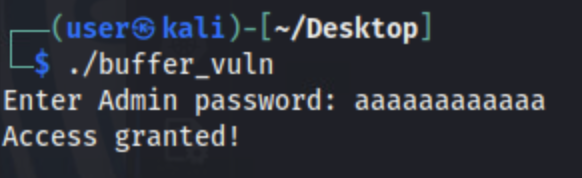

# Secure Programming

Secure programming is a critical component of software development as it emphasizes the importance of writing code that is resistant to attacks such as SQL injection, operating system (OS) command injection, and memory-related vulnerabilities. In today's ever-connected landscape the importance of secure programming cannot be understated. You're only as secure as the software/hardware you depend on. Being able to implement and understand secure coding principles are valuable skills. This approach supports CISA's mission to manage and reduce risks to national cyber and physical infrastructure, as detailed in their guidance on <a href="https://www.cisa.gov/resources-tools/resources/secure-demand-guide" target="_blank">Secure by Demand Guide: How Software Customers Can Drive a Secure Technology Ecosystem</a>.

Additional guidance on secure programming and the **Secure by Design** mission statement can be found here: <a href="https://www.cisa.gov/securebydesign" target="_blank">Secure by Design</a>.

Throughout this lab, you will examine examples of both secure and insecure code, gain insights into how certain vulnerabilities are introduced, and explore how insecure code can be exploited by threat actors to gain access to sensitive information. The security principles discussed in this course are further detailed in the linked articles provided.

- This lab is expected to take 90 minutes.

*Please consider filling out the lab feedback survey at the bottom of your screen. The survey is available to you at any time while conducting the lab.*

**Caution!** You must complete _all_ phases of the lab and complete the mini-challenge to receive your completion certificate. We encourage you to attempt mini-challenges on your own, but links to the solution guides are available in the Mini-Challenge section of the lab document if you need them.

## Learning Objectives

- Explain the principles of memory safety.
- Explain, implement, and patch a buffer overflow vulnerability in the programming language C.
- Explain, implement, and patch an integer overflow vulnerability in the programming language C.
- Explain the principles of the SQL language and the concept behind an SQL injection attack.
- Practice exploiting insecure code using a SQL injection.
- Explain how secure programming can prevent SQL injection attacks.
- Explain the principles behind operating system (OS) command injection attacks.
- Explain how secure programming can help prevent OS command injection attacks.
- Demonstrate knowledge of secure programming implementations by completing an unguided mini-challenge at the end of the lab.

## Learner Expectations

- Learners should be comfortable with command-line operations.
- Learners should be comfortable with using a text editor.
- Learners should have a basic understanding of computer programming but are not required to be knowledgeable of any single language.

## FOCAL and NICE Framework Mappings

This lab maps with <a href="https://www.cisa.gov/resources-tools/resources/federal-civilian-executive-branch-fceb-operational-cybersecurity-alignment-focal-plan" target="_blank">Federal Civilian Executive Branch (FCEB) Operational Cybersecurity Alignment (FOCAL)</a> area 2 (Vulnerability Management), by managing the attack surface of internet-accessible assets and implementation of secure software, and area 3 (Defensible Architecture), by hardening critical systems.

**NICE Work Role**

- <a href="https://niccs.cisa.gov/workforce-development/nice-framework" target="_blank">Secure Software Development</a>
- <a href="https://niccs.cisa.gov/workforce-development/nice-framework" target="_blank">Software Security Assessment</a>

**NICE Tasks**

- <a href="https://niccs.cisa.gov/workforce-development/nice-framework" target="_blank">T0077</a>: Develop secure code and error handling.
- <a href="https://niccs.cisa.gov/workforce-development/nice-framework" target="_blank">T1073</a>: Perform code reviews
- <a href="https://niccs.cisa.gov/workforce-development/nice-framework" target="_blank">T1197</a>: Identify common coding flaws.
- <a href="https://niccs.cisa.gov/workforce-development/nice-framework" target="_blank">T1202</a>: Determine software development security implications within centralized and decentralized environments across the enterprise.
- <a href="https://niccs.cisa.gov/workforce-development/nice-framework" target="_blank">T1624</a>: Conduct vulnerability analysis of software patches and updates.

<!-- cut -->

## Scenario

The concept of secure programming revolves entirely around the development and hosting of secure software. In this lab you will review multiple pieces of code and resolve insecure functions. Additionally, you will interact with software that is actively running with multiple vulnerabilities and view the security implications that can occur when insecure code is implemented.

The lab environment consists of a single server hosting a website with a router and pfSense firewall to serve as networking devices to allow for connectivity. Below is a diagram of the network.


---

- _For this lab we will be using the C programming language to present examples of memory-related vulnerabilities. Please note that the vulnerabilities discussed are not isolated to this language and the concepts and risks presented can occur in other scenarios/languages._</div>

---

## System Tools and Credentials

| system | OS type/link |  username | password |
|--------|---------|-----------|----------|
| kali | kali | user | tartans|


## Phase 1: Create Memory-related Vulnerable C Executables


<details>
<summary>
<h3>Background Information: Introduction to Low-level Languages and Memory-related Overflow Vulnerabilities</h3>
</summary>
<p>

The next few sections will explain the core concepts of programming and the types of memory-related vulnerabilities before beginning the hands-on portion of the lab. You may skip these sections if you are already familiar with low-level programming languages and overflow-type vulnerabilities. The average read time for these sections is 10 minutes or less.

| &#128270; INFORMATION |
|---|

A low-level programming language is a type of programming language that provides `minimal abstraction` from a computer's hardware/architecture. This means that the code is written in a way that is not easily understood when read. This is because the syntax of the language is written in a way that closely resembles assembly or machine code. Commands or functions in low-level languages are structurally similar to the processor's instructions, which helps provide efficient processing. Because of this, some languages offer the ability to control and/or manipulate the underlying computer's hardware and resources during execution.

A key difference between low-level and high-level languages is their innate ability to manage machine memory during execution. Due to how low-level language code is processed and executed, it makes the developer responsible for memory management. This is a major contributing factor to how memory vulnerabilities are created and present in modern-day technologies.

The low-level programming language we will be using is the language of C. It was created in 1972 to support the development of operating systems and embedded systems. Despite it being created over 40 years ago, C is still widely used by developers as it has a rich ecosystem of operators and functions.

Because developers oversee managing an application's memory during execution, memory allocation can be optimized and precise. This also introduces the possibility of "bad code" that mismanages memory and creates vulnerabilities in software.

The two memory-related vulnerabilities covered in this lab are:

1. Buffer Overflow
2. Integer Overflow

<h4>Buffer Overflow Basics</h4>

| &#128270; INFORMATION |
|---|

A buffer overflow vulnerability takes advantage of how a program's buffer allocation is handled during execution to generate unexpected behavior.

In C, the buffer can be expressed as a continuous block of temporary storage for data that is processed by the program or script. During execution, various data types can be put into the buffer for temporary storage before being moved elsewhere.

In most programming languages, you will declare and use variables. Variables can hold a vast array of datatypes including, but not limited to, integers, strings, and lists.

To help explain it, here is a modern-day analogy:

Think of a buffer like a cup and data as water. The cup can hold water, but if you try to pour more water into the cup than it can hold, the water will overflow and spill onto the table. In C, when data "spills" out of a buffer, it can overwrite other important data in memory. 

Often the data that's being written is a variable used in the program and stored in the buffer. When variables are declared in C, they are usually declared with a value that declares its intended size and therefore how much data it should store in the buffer.

For example, the code `char name[10];` would create a variable named `name` with a `string` data type with an allocated size of 10 characters as indicated by the `[10]`. 

If you were to enter a string for the name variable that is greater than 10 characters, without any checks or protections in place, this would cause a buffer overflow due to the program trying to store more data than was allocated when initialized.

We mentioned briefly before that the buffer is a continuous block of data and it stores data during execution. Because of this, when a variable attempts to store more data than it is allocated, the data overflows and is attempted to be stored in the variable/location next to the one it was originally allocated. This is how a buffer overflow is performed.  

The structure of the buffer is unknown to attackers, and so the outcome of a successful buffer overflow attack cannot always be predicted. For example, say the location next to the one being attacked stores a return address and it is overwritten by a buffer overflow. This would cause the program to crash. 

When a buffer overflow occurs, there are a few possible outcomes:

1. A program crash
2. An unexpected behavior
3. A vulnerability that provides a method for exploitation and exposes sensitive data 

The very first Internet distributed malware, the <a href="https://en.wikipedia.org/wiki/Morris_worm" target="_blank">Morris Worm</a>, utilized a buffer overflow vulnerability. Other Common Vulnerabilities and Exposures (CVEs) involving buffer overflows can be viewed <a href="https://www.cve.org/CVERecord/SearchResults?query=buffer+overflow" target="_blank">here</a> and an advisory on buffer overflow attacks can be found <a href="https://www.cisa.gov/resources-tools/resources/secure-design-alert-eliminating-buffer-overflow-vulnerabilities" target="_blank">here</a>.


<h4>Integer Overflow</h4>

| &#128270; INFORMATION |
|---|

Integer overflow vulnerabilities are similar to buffer overflows but are implemented and possible for different reasons. 

When variables are initialized they are also declared with a specific data type, telling the program what type of data to store. Because of C's ability to allow for granular control of data, there are different datatypes that can be leveraged based on the size and type of data being stored. If a developer is trying to be memory-efficient, they would want to use the lowest sized data-type possible for any given scenario and reduce the overall amount of data being processed.

To help elaborate, if you had a program that acted as a calculator and another that acted as a clock, you wouldn’t want to use the same datatypes to store each type of data. A calculator could create an infinite set of small and large numbers, both positive and negative. A digital clock has a finite set of possible time values of maximum known sizes. Even if the current time was stored and calculated as seconds, the maximum size number the clock would need to be able to store is 86,400 for any given day.

So what happens when the value assigned to an integer-based variable surpasses or is outside the available range that is tied to that variable's datatype? That's when an integer overflow occurs.

For example, the code `int value = 10;` would create a variable named `value` with an `int` (integer) data type. An `int` indicates that the variable will be holding a whole number, with the numerical value of `10` being assigned to it. The default `int` datatype has a minimum and maximum value that can be assigned to it, ranging from `-2,147,483,648` to `2,147,483,647`, which corresponds to 2<sup>32</sup> bits in size. 

Let's say we attempt to assign the value `2,147,483,648` to that `int` datatype. Instead of throwing an error, the value will loop around to the opposite end of its range. In this example, if we were to print the value of the variable `value`, it would present the value `-2,147,483,648`.

This is the basis of an integer overflow, and it can produce issues similar to those generated from a buffer overflow. An example of a recent critical vulnerability due to integer overflows can be viewed <a href="https://www.cve.org/CVERecord?id=CVE-2024-8932" target="_blank">here</a>

These are only some of the vulnerabilities that can be present when creating programs, and many exploits have been known to originate from these simple concepts. Whenever creating code, the developer must always be conscientious of how others might try to take advantage of their programs and implement security measures to protect against such attempts.

</p>
</details>


<details>
<summary>
<h3>Creating an Executable with a Buffer Overflow Vulnerability</h3>
</summary>
<p>

1. Open the `kali` system console and login with the username `user` and the password `tartans`. Once logged in, double-click the Firefox icon from the Desktop.

2. (**kali**, **Firefox**) In Firefox, browse to the URL `https://skills.hub`. NOTE: If you see the page stating that the server is starting up, please a wait a minute or two for the site to initialize and refresh the page. 

3. (**kali**, **Firefox**) Once the page has loaded you should see a welcome page. In the navigation bar at the top, you will see a tab labeled `Hosted Files`. Click on it. You will find the files `buffer_overflow.c` and `integer_overflow.c` available for download. Click and download both. 


4. (**kali**) Minimize Firefox and open the Terminal by double-clicking the Terminal-Emulator icon from the Desktop.

5. (**kali**, **Terminal**) We will now move the downloaded files to the Desktop and then move to the Desktop directory. This can be done by running the following commands:

```bash 
mv /home/user/Downloads/*.c /home/user/Desktop/ 
```

The lab directions will use the text editor `VS Code`, or Visual Studio Code, to edit the C files. VS Code assists by highlighting potential errors and automation to make writing code easier. However, you are welcome to use any other editor currently available in the environment. 

6. (**kali**) Open VS Code by double-clicking the Visual Studio Code icon from the Desktop.


7. (**kali**, **VS Code**) We will be opening the directory `Desktop` in VS Code as that is where the files we will be editing will be located. You can do this by clicking on the `Open Folder` link currently showing on the open page, selecting the Desktop, and clicking `Select`. You could also click on the `File` tab in the taskbar at the top, and then select `Desktop`.


*Note: If prompted whether or not to trust the authors of the files, choose `Yes, I trust the authors`*

8. (**kali**, **VS Code**) You should see the two downloaded files will now be present in the box located on the left of VS Code. Click on the file `buffer_overflow.c`.


*Note that the directory structure is visible in the pane on the left, while the specific file being viewed is visible on the right. You can switch between files using the Explorer pane and each file viewed will receive its own tab on the right.*

You will be writing code to complete, compile, and execute this program file. The goal of the program is to prompt the user to enter the password for the user `Admin`. When entered, the program will check if the password entered matches the correct password that is stored. Its response will change depending on that comparison. You can enter each line/section as you go or copy the entire code block provided after step 13.

9.  (**kali**, **VS Code**, **buffer_overflow.c** ) On line 5 where the variable `password` is declared, insert the number 10 into the empty brackets. This will initialize the variable so that its size is allocated to store 10 characters. 
    
```c
char password[10]; 
```

10. (**kali**, **VS Code**, **buffer_overflow.c** ) On line 6 where the variable `correct_password` is declared, we will be writing the string to be stored as the correct password. Enter the string `password` where the empty quotes are(`""`).

```c
char correct_password[] = "password";
```

11.  (**kali**, **VS Code**, **buffer_overflow.c** ) On line 9 we will insert a print statement that will output a string to the user prompting them to enter the password for the user `Admin`.
 
```c
printf("Enter Admin password: ");
```

*Note that the line above should be indented once to line up with the text above it. VS Code may try to be helpful here by adding the closing double quotation mark and parenthesis, saving you a few keystrokes and ensuring you don't forget to add them.

12.  (**kali**, **VS Code**, **buffer_overflow.c** ) On line 10 we will insert a function that when executed will wait for the user to enter data. This will capture the input the user enters as the password and assign it to the variable `password`.

```c
scanf("%s", password);
```

*Note: Add an additional empty line below to separate this line from the line beginning with `if (strcmp`*

On line 12, there is an `if` statement that is being used to compare the values of the variables `password` and `correct_password`. If the user entered the correct matching password, it would execute the code assigning the value of `1` to the variable `is_authenticated`. If they do not match then it continues executing the script while ignoring that code block.

13.   (**kali**, **VS Code**, **buffer_overflow.c** ) on line 16, we will create an if-else statement that will check the value of the variable `is_authenticated`, which means that it is checking if the user entered the correct password or not. It will check the value of `is_authenticated` and if it has the value `0`, meaning authentication failed, it will print the response `Access denied`. If the value of `is_authenticated` is anything other than `0`, implying (but not guaranteeing) `1`, it will print the response `Access granted`. 

*Note that VS Code will again try to be helpful and allow you to autofill the variable name `is_authenticated` based on its previous use. It will also attempt to automatically indent where indentation is expected.*

```c
if (is_authenticated) {
    printf("Access granted!\n");
} else {
    printf("Access denied.\n");
}
```


When completed, your script should match what is shown below:

```c
#include <stdio.h>
#include <string.h>

int main() {
    char password[10];
    char correct_password[] = "password";
    int is_authenticated = 0;

    printf("Enter Admin password: ");
    scanf("%s", password);

    if (strcmp(correct_password,password) == 0) {
        is_authenticated = 1;
    }

    if (is_authenticated) {
        printf("Access granted!\n");
    } else {
        printf("Access denied.\n");
    }

    return 0;
}
```

14.  (**kali**, **VS Code**, **buffer_overflow.c** ) Click `File` from the top menu bar, then click `Save` to save your changes. 

15.  (**kali**, **Terminal** ) Back in the open Terminal, you should still be located in the `Desktop` directory. Next you will compile the C program into an executable file with the name `buffer_vuln`. This can be done with the following bash command:

```bash
gcc -o buffer_vuln buffer_overflow.c
```

| &#128270; INFORMATION |
|---|
|_The gcc (GNU Compiler Collection) tool compiles .c files by transforming the written C code into machine code. This process includes multiple stages, including preprocessing, compilation, assembly, and linking, which ultimately ends with the production of an executable file that can be run on the target system. This process allows programmers to convert source code into a format that the computer's hardware can understand and execute._</div>_ |

If your code has any errors that prevent it from being compiled, the output will point you to the issue and line of the error.


On the Desktop, you should now see the file `buffer_vuln`.


16.   (**kali**, **Terminal** ) We will now run the new executable to see how it behaves. Run the executable with the command: 

```bash
./buffer_vuln
```

17.  (**kali**, **Terminal** ) You should see a prompt asking you to enter a password for the user `Admin`, which matches what we wrote into the program. Enter the password `testing`. You should get a response that it failed, which is correct behavior. Re-run the executable and this time enter the correct password, `password`. You should see that it succeeds, which again is correct behavior. 


Now we'll run it again, but this time with the intention of trying to perform a Buffer Overflow to see how it responds. 

18.  (**kali**, **Terminal** ) Run the executable and when prompted, enter the string: `aaaaaaaaaaaa` (Note that you are entering 12 characters, though the string entered does not matter). Despite this not being the accepted password, you should see that it succeeds, and access is granted.



We mentioned before that C stores data in the buffer and a buffer overflow attempts to write more data than allocated into a variable to write the data into the location next to it.

Let's walk through the problem:

 - In this script, the data input by the user is intended for the variable `password` which has been allocated a maximum size of 10 characters.
 - In the next line, the variable `is_authenticated` is declared and assigned the value 0.
   - The value that is stored in this variable is intended to reference to whether or not the correct password was entered.
   - If the wrong password is entered, the value remains 0.
   - If the correct password is entered, the value is changed to a 1.
 - The `if` statement at line 16 plainly states "If the value is 0, password authentication failed. If it's any other value, the password authentication passes" because, in theory, the value should not change unless the password was correct. 

However, a vulnerability exists due to the functionality used to read the user's input, combined with the fact that there are no safeguards to check whether the input was valid, i.e. a 10-character, maximum-length string.


The function `scanf` can be useful, but it can be less secure than other functions available because it does not check the size of the input against the allocated size of the variable it is writing to by default. This is a bad practice and should be corrected.

Due to how C structures its buffer during execution, it turns out that the variable `is_authenticated` is located next to the variable `password`. When the buffer overflow occurs the excess data that can't be stored in `password` "leaks" and is written into the location of the variable `is_authenticated`. As the script continues its execution, the value of `is_authenticated` is altered. Since the authentication check in the script is only checking if the value of `is_authenticated` is not 0, the authentication check passes. This is just a small example of how insecure code can lead to larger vulnerabilities and risks to the underlying platforms and systems.

To help explain the process occurring above, we will add a print statement at the end of the script to have the program show what is happening to the `is_authenticated` variable. 

19. (**kali**, **VS Code**, **buffer_overflow.c** ) Insert the following print statement **after** the if-else statement, but **before** the return statement.

```c
printf("\nis_authenticated value: %d\n", is_authenticated);
```

The updated script should look like this

```c
#include <stdio.h>
#include <string.h>

int main() {
    char password[10];
    char correct_password[] = "password";
    int is_authenticated = 0;

    printf("Enter Admin password: ");
    scanf("%s", password);

    if (strcmp(correct_password,password) == 0) {
        is_authenticated = 1;
    }

    if (is_authenticated) {
        printf("Access granted!\n");
    } else {
        printf("Access denied.\n");
    }

    printf("\nis_authenticated value: %d\n", is_authenticated);

    return 0;
}
```

20. (**kali**, **Terminal** ) Go back to terminal and run the following command to compile the executable.

```bash
gcc -o buffer_auth_chk buffer_overflow.c
```

21.  (**kali**, **Terminal** ) Now run the new executable

```bash
./buffer_auth_chk
```

When it prompts for the password, use the same format as before: 12 characters but the characters chosen do not matter. 

In the output, you should see the newly created print line and the value that is printed is a larger than expected positive number. This is the outcome of the buffer overflow vulnerability. Why does this value cause the check to pass? This occurs due to how the if statement is performing the check.

The `if` statement at line 16 performs a basic check on the value of the variable `is_authenticated`, but due to how numbers are processed, this if statement can pass on incorrect values. 

An if statements basic functionality is to check a condition and return a Boolean value (True or False). If the condition returns *True*, it executes the associated code block, but if returns *False*, then it skips it. 

In most programming languages, the number `0` is interpretted as the Boolean value `False` with the value `1` read as the Boolean value `True`. This is also valid in C, although the caveat to that is that in C,  **any number other than 0 is read as the Boolean value True**. 

So the if statement is checking for the value of `is_authenticated` and so if the value is 0, the password authentication fails, but if it's any other number, it passes.

1.  (**kali**, **VS Code**, **buffer_overflow.c** ) Comment out the print line you just implemented in the `buffer_overflow.c` as it will not be required moving forward. You can comment it out by putting the characters `//` at the front of the line. It would look like this:

```c
//printf("\nis_authenticated value: %d\n", is_authenticated);
```

We'll return to this code and fix the insecurities in the next phase.

</p>
</details>


<details>
<summary>
<h3>Creating an Executable with an Integer Overflow Vulnerability</h3>
</summary>
<p>

1. (**kali**, **VS Code**) Now we will begin working with the other C script you downloaded. Click on the file `integer_overflow.c` from the Explorer pane on the left side of VS Code.

You will write code to complete, compile, and execute this file. When completed, this script will simulate selling tickets to a concert. The user will enter the number of tickets they want and then it will output the final cost. 


2. (**kali**, **VS Code**, **integer_overflow.c** ) On line 12, we will insert a function that will wait for the user to enter data. This will capture the input the user enters as the number of tickets to purchase and assign it to the variable `num_tickets`. Please insert the following into the code file:

```c
scanf("%d", &num_tickets);
```

3. (**kali**, **VS Code**, **integer_overflow.c** ) On line 14, we will insert a line that will assign the value `1250` to the variable `price_per_ticket` as it is indicated in the print statement. 

```c
price_per_ticket = 1250;
```

*Note: Add an additional empty line below to separate this line from the line below.

4. (**kali**, **VS Code**, **integer_overflow.c** ) On line 16, we will insert a line that will multiply the variable `num_tickets` and `price_per_ticket`, which will calculate the total cost of the purchase and assign the value to the variable `total_cost`. 

```c
total_cost = num_tickets * price_per_ticket;
```

*Note: Add an additional empty line below to separate this line from the line below.

When completed, your script should match what is shown below:

```c
#include <stdio.h>
#include <limits.h>

int main() {
    int num_tickets;
    int price_per_ticket;
    int total_cost;

    printf("Hello, we are selling tickets for the upcoming private concert.\n");
    printf("We currently have tickets available and they are priced at $1250.\n");
    printf("How many would you like to buy? ");
    scanf("%d", &num_tickets);
    
    price_per_ticket = 1250;

    total_cost = num_tickets * price_per_ticket;

    printf("Your total cost today comes out to:\t$%d\n", total_cost);
    return 0;
}
```

5. (**kali**, **VS Code**, **integer_overflow.c** ) Click `File` from the top menu bar, then click `Save` to save your changes.

6. (**kali**, **Terminal** ) Back in the open Terminal, you should still be working in the `Desktop` directory. We will compile the C program using the same method as before, but this time with the name `integer_vuln`. This can be done with the following bash command

```bash
gcc -o integer_vuln integer_overflow.c
```

7. (**kali**, **Terminal** ) You should now see the file `integer_vuln` on the Desktop. Run the executable with the command:

```bash
./integer_vuln
```

8. You should see multiple lines printed explaining tickets are for sale and they are priced at $1250 each. You should be prompted to enter the number of tickets you want to purchase, enter the value `5`. You should get a response that the total comes out to $6250, which is correct.


9. Now let's run it again, but with the intention of causing an integer overflow. Run the executable and when prompted, enter the amount `999999999999999` (fifteen 9's).
You should see that the response will state that the total cost is `$-1,858,274,530`. 


| &#128736; Roll Over Concept |
|---|
|_We discussed before that there are different datatypes available in C, and each datatype can hold a specified amount of data. When the variable is given a value that surpasses the amount it can hold signified by its datatype, the value "rolls over". To better understand, let's go over how a "roll over" could occur to an int data type._|


The above diagram represents the range of values that a C integer data type can hold. The range goes from the negative value of `-2,147,483,648` to the positive value of `2,147,483,647`. 

Now, say we created the variable `counter` as an int data type and assigned it the max positive int value `2147483647`. The "roll over" would occur if we tried to add to the variable `counter` as it would be trying to assign a value to the variable that is higher than the int data type can hold. So if we were to add 1 and print the `counter` variables value, the output would print the value `-2147483648`. 

Here is the C code if you would like to test it yourself.

```c
#include <stdio.h>
#include <limits.h>

int main() {
    int counter = 2147483647;
    printf("Counter Value: %d\n",counter);
    counter += 1;
    printf("New Counter Value: %d\n",counter);

    return 0;
}
```

   1. Save the code to a file named: `int-roll-over.c`, 
   2. Compile with the bash command: `gcc -o int_roll_over int-roll-over.c`
   3. Run the newly created executable with the bash command: `./int_roll_over`

The above example showed how the 'roll over' concept works on the int data type, but a roll over can occur to any integer data type because they each have their own range. <a href="https://www.gnu.org/software/gnu-c-manual/gnu-c-manual.html#Data-Types" target="_blank">Here is the official C documentation</a> that lists the range of values for all C integer data types.


In the script we just ran, we declared the variables `num_tickets`, `price_per_ticket`, and `total_cost` as type `int`. The minimum and maximum value an int can hold ranges from `-2,147,483,648` to `2,147,483,647`. Because of this, when we entered a number outside of the accepted range it rolled over. The value that was assigned to `num_tickets` was about -1,530,494,977 after rolling over several times (over 116,000 times to be exact). That value then manipulated what the final cost would be, resulting in yet another negative number due to it also rolling numerous times. 

This is a basic example of how an integer overflow vulnerability can be leveraged to create a response that was not intended. 

Once again, we'll return to this code and fix the insecurities in the next phase.

#### Grading Check

(**kali**, **Firefox**) To check your work, browse to the grading page at `https://skills.hub/lab/tasks` or `(https://10.5.5.5/lab/tasks)`. Click the `Submit/Re-Grade Tasks` button to trigger the grading checks. Refresh the results after a few moments to see your results.

These two checks will verify that you were able to successfully complete the C programs and compile them with the vulnerabilities present.


Grading Check 1: Finish, compile, and execute a C program that has a buffer overflow vulnerability present. (C executable should be named 'buffer_vuln' and in the directory '/home/user/Desktop')
 - Additional code was inserted correctly to finish script.
 - Script was compiled and written as "buffer_vuln" and is present on the Desktop.

Grading Check 2: Finish, compile, and execute a C program that has an integer overflow vulnerability present. (C executable should be named 'integer_vuln' and in the directory '/home/user/Desktop')
 - Provided code was inserted correctly to finish script.
 - Script was compiled and written as "integer_vuln" and is present on the Desktop.

`Copy the token or flag strings to the corresponding question submission field to receive credit.`

`You should complete all phase 1 tasks before moving on to phase 2.`

</p>
</details>


## Phase 2: Apply Fixes to Patch Vulnerabilities in C Code

<details>
<summary>
<h3>Applying Fixes to the Buffer Overflow Script</h3>
</summary>
<p>

1. (**kali**, **VS Code**) With VS Code still open, re-open the file buffer_overflow.c.
   
2. (**kali**, **VS Code**, **buffer_overflow.c** ) On line 10 where the `scanf` function is, we will replace it with the line below. This will change the functionality so that instead of reading all data entered, it will read up to the max amount of data that was allocated to the password variable.

```c
fgets(password, sizeof(password), stdin);
```

3. (**kali**, **VS Code**, **buffer_overflow.c** ) On line 11, we will add the following line that will remove the ending newline character. This is added because the `fgets` function adds a newline character (`\n`) to the end of the data read in. Additionally our `correct_password` doesn't end with a newline character, so we will need to remove it to ensure a correct comparison is performed.

```c
password[strcspn(password, "\n")] = 0;
```

When completed, your code should look like this:

```c
#include <stdio.h>
#include <string.h>

int main() {
    char password[10];
    char correct_password[] = "password";
    int is_authenticated = 0;

    printf("Enter Admin password: ");
    fgets(password, sizeof(password), stdin);
    password[strcspn(password, "\n")] = 0;

    if (strcmp(correct_password,password) == 0) {
        is_authenticated = 1;
    }

    if (is_authenticated) {
        printf("Access granted!\n");
    } else {
        printf("Access denied.\n");
    }
    
    //printf("\nis_authenticated value: %d\n", is_authenticated);

    return 0;
}
```

3. (**kali**, **VS Code**, **buffer_overflow.c** ) Save the updates to your file as before.

4. (**kali**, **Terminal** ) Back in the open Terminal, you should still be working in the `Desktop` directory. Re-compile the C program but change the output file name to `buffer_patched`. This can be done with the following bash command:

```bash
gcc -o buffer_patched buffer_overflow.c
```

5. (**kali**, **Terminal** ) You should now see the file `buffer_patched`. We will now run it to see how it acts. Run the executable with the command:

```bash
./buffer_patched
```

6. (**kali**, **Terminal** ) You can test the program with the correct and incorrect passwords to see that the basic functionality has not changed. Next, try to enter the same value that we used previously to create the buffer overflow, `aaaaaaaaaaaa`.


You should see the response is now `Access denied`. 

If you would like to test the new code and view the value of `is_authenticated`. Follow these steps: 
   1.  Uncomment the last print line in `buffer_overflow.c`
   2. Compile using the bash command: `gcc -o buffer_auth_check buffer_overflow.c`
   3. Run executable with the bash command: `./buffer_auth_check`

</p>
</details>

<details>
<summary>
<h3>Applying Fixes to the Integer Overflow Script</h3>
</summary>
<p>

1. (**kali**, **VS Code**) With VS Code still open, re-open the file integer_overflow.c.

2. (**kali**, **VS Code**, **integer_overflow.c** ) On line 16, we will be inserting an `if` statement that does some calculations to check if the number entered is a valid number that can be assigned to an int datatype.

```c
if (price_per_ticket > INT_MAX / num_tickets) {
    int maxTickets = INT_MAX / price_per_ticket;
    printf("Too many tickets entered. Max number of tickets that can be bought at once is %d",maxTickets-1);
    return 0;
}
```

Your script should look like this

```c
#include <stdio.h>
#include <limits.h>

int main() {
    int num_tickets;
    int price_per_ticket;
    int total_cost;

    printf("Hello!\nWe are selling tickets for the upcoming private concert.\n");
    printf("Tickets are currently priced at $1000000 a ticket.\n\n");
    printf("How many would you like to buy?\n");
    scanf("%d", &num_tickets);

    price_per_ticket = 1250;

    if (price_per_ticket > INT_MAX / num_tickets) {
        int maxTickets = INT_MAX / price_per_ticket;
        printf("Too many tickets entered. Max number of tickets that can be bought at once is %d",maxTickets-1);
        return 0;
    }
    total_cost = num_tickets * price_per_ticket;
    
    printf("\nYour total cost today comes out to:\t$%u\n", total_cost);
    return 0;
}
```

The variable `INT_MAX` is a constant that is available in C and holds the max value that an int datatype can hold. In the `if` statement's condition, we are checking if the price per ticket is greater than the value returned by dividing INT_MAX by the entered number of tickets. By doing this, we are effectively doing the opposite of calculating the total. 

If the result of that division is a number greater than 1250, then that means the result of multiplying the entered tickets by the price would create an integer overflow. 

The code within the `if` statement will then calculate the max number of tickets a user can purchase and still have the total cost be a valid int value. From there, it will print a statement to the user stating that too many tickets were entered and tell them the max number of tickets that can be purchased. Afterwards, it will exit.

3. (**kali**, **VS Code**, **integer_overflow.c** ) Save the updates to your file as before.

4. (**kali**, **Terminal**) Re-compile the C program, but output it with the name `integer_patched`. This can be done with the following bash command:

```bash
gcc -o integer_patched integer_overflow.c
```

5. (**kali**, **Terminal**) `integer_patched` will now be present on the Desktop. Run the executable with the command: 

```bash
./integer_patched
```

6. (**kali**, **Terminal**) You can test it with different values and see that the basic functionality has not changed. Try to enter the same value we entered previously to trigger the integer overflow, `999999999999999`.


You should see that it now responds with the new response stating that too many tickets have been entered and states the maximum number of tickets that can be purchased. The safeguards we implemented now help in preventing an integer overflow vulnerability.


#### Grading Check

(**kali**, **Firefox**) To check your work, browse to the grading page at `https://skills.hub/lab/tasks` or `(https://10.5.5.5/lab/tasks)`. Click the `Submit/Re-Grade Tasks` button to trigger the grading checks. Refresh the results after a few moments to see your results.

These two checks will verify that you were able to successfully edit the C programs and compile them with the vulnerabilities patched.


Grading Check 3: Finish, compile, and execute a C program so that the buffer overflow vulnerabilities are patched. (C executable should be named 'buffer_patched' and in the directory '/home/user/Desktop')
 - Provided code was inserted correctly to fix the script.
 - Script was compiled and written as "buffer_patched" and is present on the Desktop.

Grading Check 4: Finish, compile, and execute a C program so that the integer overflow vulnerabilities are patched. (C executable should be named 'integer_patched' and in the directory '/home/user/Desktop')
 - Provided code was inserted correctly to fix the script.
 - Script was compiled and written as "integer_patched" and is present on the Desktop.

`Copy the token or flag strings to the corresponding question submission field to receive credit.`

`You should complete all phase 2 tasks before moving on to phase 3.`

</p>
</details>

## Phase 3: Perform SQL Injection

<details>
<summary>
<h3>Introduction to SQL</h3>
</summary>
<p>

| &#128270; INFORMATION |
|---|

SQL stands for Standard Query Language, and it was created to interact with databases. Databases are a collection of data that is often organized systematically using tables, where SQL acts as an interpreter to send commands and perform the associated actions to the database. SQL is used in nearly any and every industry as it provides a unique and critical functionality that is needed in most environments.

Some real-world examples of SQL-enabled database usage might be storing patient records or in E-commerce sites to maintain inventories. Several websites use some form of SQL database to store their data. It is a vital functionality that supports the operation of many organizations.

Some of the basic actions that can be performed using SQL are:
- Adding data
- Retrieving data
- Updating data
- Removing data
- Creating new structures or formats of data

Databases can be configured to store data with different formats or schemas, and they can be tailored to provide information in the way that is the most beneficial. Databases are structured into tables. Each table in a database is often labeled or named specifically to indicate what kind of information it contains. Additionally, each table is configured with columns and rows where a row represents a singular record, and the columns represent the specific datatypes and attributes.

For example:

When creating a database for a grocery store, if we wanted to store information about items sold we could then create a table named `Bakery` in that database. In that table, we will store information about all items sold in the bakery. Each row in the table would represent a record that contains the relevant information about an item being sold in the bakery. Perhaps there are records for `bread`, `bagel`, or `doughnuts`. Each column in our table would then represent a specific attribute. Each record has their own value for these attributes, such as `price` or `quantity`, and a tag noting whether the item is running low as `restock`.

If anyone wants to view information about items being sold in the bakery, they can reference this specific table in the database to gather the information they need. Below is a visual representation of what the table would look like:

<h5><u>Bakery</u></h5>

|item|price|quantity|restock|
|---|---|---|---|
|**bread**|3.99|20|no|
|**bagels**|5.99|35|no|
|**doughnuts**|.99|6|yes|


<h4>Querying the Database</h4>

When users want to interact with their data, they can craft SQL queries to be extremely precise and return all records from the database that matches their query.

SQL queries use a combination of SQL keywords to make distinctions about what data to retrieve, add, or remove. Below is the basic query structure where the words  surrounded with a `**` indicate the details specific to the database/table.

```sql
SELECT **column-name** FROM **table** WHERE **condition**;
```

This structure allows for the user to craft queries against the entire table and return only the results that match the parameters supplied. It is possible to return entire rows or specific values that are present in either rows or columns. 

For example, let's say we wanted to query our Bakery table and retrieve all records where the price is more than 3 dollars. We could achieve that with this query:

```SQL
SELECT * FROM Bakery WHERE price>3;
```

Which would return the records for both `bread` and `bagels`.

Additionally, if we wanted to get only the names of products that we need to restock, we could use the following query:

```SQL
SELECT item FROM Bakery WHERE need-restock=true;
```

Once executed, this would only return the item `doughnuts`.

SQL can group, order, and join data tables together to create more complex data returns. For more information on SQL queries, check out this <a href="https://gist.github.com/bradtraversy/c831baaad44343cc945e76c2e30927b3" target="_blank">GitHub Cheat Sheet</a>

<h4>SQL Injection Vulnerabilities</h4>

Because of its popularity and the type of data it can access, threat actors often search for SQL injection vulnerabilities within websites. When exploited, attackers can sometimes retrieve sensitive data that is private and not intended to be accessible. 

For example:

Banks allow users to sign up for accounts and their services. When users sign up, they provide personal information such as their full name, date of birth, social security number, address, etc. Additionally, they will enter unique credentials that will be used as their username and password. This information is stored in a database somewhere and is linked to that specific user's account.
SQL is often used for authentication purposes to check credentials passed during login and provide a response that will determine the login attempt’s success..
If an attacker was able to manipulate the SQL query occurring in the background to alter the response from the website's database, they could cause unintended effects.

SQL injection vulnerabilities are birthed from insecure code and poor website design. SQL injection is still listed as part of the <a href="https://owasp.org/www-project-top-ten/" target="_blank">OWASP Top Ten</a>. The best methods to prevent SQL injection attacks are to validate and sanitize user inputs to remove or reject special characters that might invoke specific SQL commands, and by using prepared statements that eliminate a user's ability to manipulate the queries being made.

</p>
</details>


<details>
<summary>
<h3>Perform and Understand SQL Injection</h3>
</summary>
<p>

During this section you will be interacting with a website that presents information about a fictional company. You will be analyzing the website to gather information to perform a SQL injection to retrieve sensitive information that should not be accessible.

1. (**kali**, **Firefox**) In a new Firefox tab browse to the URL `http://target.skills.hub`. You should be greeted with a home screen that has some information regarding the pages available.


2. (**kali**, **Firefox**, **target.skills.hub**) Click on the `Lab Home` tab at the top and it will bring you to the home page for the tasks you will perform during this phase. Here you can read about the fictional company by reviewing the two available links. 

3. (**kali**, **Firefox**, **target.skills.hub**) Click on the `Employee Directory` tab at the top of the page.


4. (**kali**, **Firefox**, **target.skills.hub/lab/search**) On the page you should see a search bar and message stating you can search for agents that work at the company. 

SQL injections generally require some form of input from the user that will be used to query the database. This search bar is no exception.

5. (**kali**, **Firefox**, **target.skills.hub/lab/search**) To start, click 'Search' without entering anything into the text box. 

You should see that an empty search returns all agents and their information. Under the hood, this request auto-populates an asterisk (`*`) into the search bar. Using an asterisk in a SQL query returns all information for each record.

6. (**kali**, **Firefox**, **target.skills.hub/lab/search**) Right-click on the page, and select `view page source` from the dropdown. 


Viewing the page source shows the code that is being used in the current page. In some cases, this code can contain information regarding the website and offer insight into its functionality.

7. (**kali**, **Firefox**, **target.skills.hub/lab/search**) Find the HTML comment 
(\<\!-- -->) on or around line 58. Within it there is a message stating that the database being used on this page is a SQLite3 database. You may now close this tab of the browser and return to the Employee Directory tab.

There are different types of SQL databases that can be used. While their main functionality is similar, they can each provide their own unique structure for different purposes. 

8. (**kali**, **Firefox**, **target.skills.hub/lab/search**) Run another search, but this time search for agents who focus on education. Enter the string `Education` in the search bar and click "Search". You should now see results where the Business Type is listed as "Education".

Like we mentioned, the ability behind performing a SQL injection attack is that the input being entered by a user is getting passed directly to a SQL query. You could assume that the query being executed after searching is similar to the following:

```sql
SELECT * FROM **table** WHERE **columns** LIKE **%search_string%**
```

`LIKE` is a keyword used in SQL to attempt to query a column value and search for a substring within that value. When performing this type of query, the character `%` acts as a wildcard (similar to `*` in the bash terminal).

> **FOR EXAMPLE:**<br>
> Say we wanted to query a table labeled `Users` and find all users that use a `gmail.com` account, we could do that running the following query:
> ```sql
> SELECT * FROM Users WHERE email LIKE '%@gmail.com';
> ```
> The `%` acts as a wildcard because it does not matter what their email name is prior to the `@` sign, we only want records where the email ends with `@gmail.com`.


1. (**kali**, **Firefox**, **target.skills.hub/lab/search**) Insert the following string to attempt a simple SQL injection attack. This string is the de facto test for whether a field is vulnerable to SQL injection. The entry presents an OR statement to the SQL statement and since 1=1 is always TRUE, the entire statement will be evaluated as TRUE, returning whatever information might be requested. If the site is running proper SQL input validation or prepared statements, this entry would produce no response.

```sql
*' or 1=1 --'
```

You should get a response that an exception has occurred. The response also states that it was unable to process the query.


This is an indicator that the search bar is vulnerable, because if it was correctly validating the input, it would state that there were no results. Instead we were able to manipulate the query and cause it to fail.

To perform any action on a table, you must know the table name as well as its column attributes you want to query. First, figure out the layout of the database, its tables, and the attributes that make up the table.

We've found that the implemented database is SQLite3, and SQLite3 has a built-in table labeled `sqlite_master` that stores information about all the tables present in the database as well as their attributes. 

10. (**kali**, **Firefox**, **target.skills.hub/lab/search**) Perform a search using the following string:

```sql
* from sqlite_master where type='table'--'  
```


You should see in the output that there are two tables present in the database being referenced: `Employees` and `EmployeePrivateData`. The `Employees` table holds all the information for each agent that is presented through the search bar, and the `EmployeePrivateData` holds sensitive information about each agent that is not publicly available. That will be the target.
 
11. (**kali**, **Firefox**, **target.skills.hub/lab/search**) Now that we know the structure of the database, we can craft a SQL injection to retrieve data from the `EmployeePrivateData` table. Perform a search using the following string:

```sql
* from EmployeePrivateData union select id,firstname,lastname,address,price from Employees--'
```


Now you have access to the private information of every agent who works for this company.

This is just a basic example of how insecure code can potentially allow sensitive information to become accessible and put private information at risk of exposure and malicious use.

</p>
</details>

<details>
<summary>
<h3>Insecure Implementations</h3>
</summary>
<p>

| &#128270; INFORMATION |
|---|

SQL injection vulnerabilities are not isolated to a singular programming language. They can be present in any language that is used to access and manipulate a database using SQL.

The website where we performed the attack does not perform any type of input validation.

Instead, it was inserting the user's search string entry directly into the SQL query, which allowed us to perform enumeration of the database structure and recover sensitive data.

Here is an example implementation that was written in the language C# that creates an unintentional SQL injection vulnerability.

```c#
string query = "select * from \"User\" where \"FirstName\" = '" + model.Search + "' or \"LastName\" = '" + model.Search + "'";
using (NpgsqlCommand cmd = new NpgsqlCommand(query))
{
    cmd.Connection = con;
    con.Open(); 

    using (NpgsqlDataReader dr = cmd.ExecuteReader())
    {
        while (dr.Read())
        {
            users.Add(new User
            {
                Id = dr["Id"].ToString(),
                Username = dr["Username"].ToString(),
                Password = dr["Password"].ToString(),
                FirstName = dr["FirstName"].ToString(),
                LastName = dr["LastName"].ToString(),
                Email = dr["Email"].ToString(),
                RoleId = Convert.ToInt32(dr["RoleId"])
            });
        }
    }
}
```

You don't need to fully understand the code, but if you look at the first line with `string query`, you can see that it is creating the query and concatenating the strings entered from the search indicated by the variable `model.Search`.


Another example can be viewed here, where a PHP script is vulnerable to SQL injection.

```php
<?php
$offset = $_GET['offset']; // beware, no input validation!
$query  = "SELECT id, name FROM products ORDER BY name LIMIT 20 OFFSET $offset;";
$result = pg_query($conn, $query);
?>
```

Look at the variable `$query`. It is being assigned a string that contains the query to be run, and it is being directly concatenated with user input without first being validated. 

</p>
</details>


<details>
<summary>
<h3>Guidance</h3>
</summary>
<p>

| &#128270; INFORMATION |
|---|

To mitigate the chances of implementing a SQL injection vulnerability, the developer should attempt to follow the "Secure by Design" approach and follow the concepts discussed <a href="https://www.cisa.gov/sites/default/files/2024-03/SbD%20Alert%20-%20Eliminating%20SQL%20Injection%20Vulnerabilities%20in%20Software_508c.pdf" target="_blank">here</a>.

Developers should use parameterized queries with prepared statements to separate SQL code from user-supplied data to prevent this class of vulnerability. This separation ensures the system treats user input as data and not executable code, thereby eliminating the risk of malicious user input being interpreted as a SQL statement

Below is an example piece of Python code that utilizes parameterized code to prevent SQL injections:

```python
import sqlite3

def execute_sql_query(user_input):
    # Use parameterized query to prevent SQL injection
    query = "SELECT * FROM users WHERE username = ?"
    connection = sqlite3.connect("database.db")
    cursor = connection.cursor()
    cursor.execute(query, (user_input,))
    result = cursor.fetchall()
    connection.close()

    return result
```

#### Grading Check

(**kali**, **Firefox**) To check your work, browse to the grading page at `https://skills.hub/lab/tasks` or `(https://10.5.5.5/lab/tasks)`. Click the `Submit/Re-Grade Tasks` button to trigger the grading check. Refresh the results after a few moments to see your results.

This check will verify that you were able to successfully trigger a SQL injection on the vulnerable page present on the website.


Grading Check 5: Successfully perform SQL injection on the Employee Directory 'search' page to retrieve sensitive data.
 - Analyze web page to gather information to help generate SQL injection.
 - Retrieve sensitive information with a successful SQL injection


`Copy the token or flag strings to the corresponding question submission field to receive credit.`

`You should complete all phase 3 tasks before moving on to phase 4.`

</p>
</details>

## Phase 4: Perform OS Command Injection

<details>
<summary>
<h3>Introduction to Operating System command injection</h3>
</summary>
<p>

Operating System command injection, or OS command injection, is exactly what it sounds like. It is when there is a vulnerability on a website or other software that allows a user to enter data, bypass the expected behavior, and execute commands directly on the underlying host- operating system.

The cause of OS command injection vulnerabilities is like SQL injection where user input is not validated or sanitized. The input is directly concatenated with a pre-determined command string and is executed on the underlying host.

This vulnerability is not platform or OS- specific. This type of vulnerability provides attackers with endless opportunities to perform all kinds of malicious acts such as backdoors, installing malware, or just retrieving sensitive information.

</p>
</details>

<details>
<summary>
<h3>Perform OS Command Injection</h3>
</summary>
<p>

During this section, you will be interacting with a website that presents information about a fictional company. You will be analyzing the website to gather information to perform an OS command injection to retrieve sensitive information that should not be accessible.

1. (**kali**, **Firefox**, **target.skills.hub**) Return to the target website and click on the `Lab Home` tab, and then click on the `About Us` tab.


You should see some background information about the company, as well as a side panel that has other tabs. 

2. (**kali**, **Firefox**, **target.skills.hub**) Click on the `Benefits` tab.

3. (**kali**, **Firefox**, **target.skills.hub**) You should see now that the page is presenting information regarding benefits. Feel free to check out the last page `Contact Us`.

In the website URL, you should see that the parameter `filename` is being passed and points to a text file named "contact_us.txt". You should also see the value assigned to it changes if you navigate to the various About Us pages.

The site may be vulnerable to an OS command injection if the filename is being fed directly into a command through the browser request. 

4. (**kali**, **Firefox**, **target.skills.hub**) Let's attempt to concatenate some commands after the filename to see if they'll execute. Enter the following into the URL

```
http://target.skills.hub/lab/info/about-us?filename=background.txt;ver;cmd /c ver;
```

The commands `ver` and `cmd /c ver` are Windows commands that would return information about the underlying operating system. Since there was no output, it's safe to assume the hosting server is not running Windows.

5. (**kali**, **Firefox**, **target.skills.hub**) Try to pass a Linux-based command. Enter the following into the URL:

```
http://target.skills.hub/lab/info/about-us?filename=background.txt;uname -a;
```

Scroll down to the very bottom of the page and you should see the following:


At the bottom of the page new output is printed, and it states some information about the underlying host. Now we just need to continue crafting our commands to retrieve more information from this type of operating system.

6. (**kali**, **Firefox**, **target.skills.hub**) Enter the following URL to get a list of files present in the directory where the commands are executing.

```
http://target.skills.hub/lab/info/about-us?filename=background.txt;ls -l;
```

You should see there are a handful of files, but the target is the directory `creds`. 


7. (**kali**, **Firefox**, **target.skills.hub**) Enter the following URL to get a list of files present in the creds directory:

```
http://target.skills.hub/lab/info/about-us?filename=background.txt;ls -l creds/;
```

You should see there is only one file present, `firewall.json`.


8. (**kali**, **Firefox**, **target.skills.hub**) Enter the following URL to get contents of the firewall.json file:

```
http://target.skills.hub/lab/info/about-us?filename=background.txt;cat creds/firewall.json;
```

You should see the credentials are now leaked to a fictional firewall.


</p>
</details>

<details>
<summary>
<h3>Secure Coding Implementations</h3>
</summary>
<p>

| &#128270; INFORMATION |
|---|

Because OS command injection vulnerabilities are similar in nature as SQL injections, they can be present in a variety of programming languages.

On the website we just attacked, the website was only attempting to pull data from a file to present on the webpage. But we were able to take advantage of it due to there being no validation checks or safety precautions in place.

Here is an example implementation written in PHP that attempts to perform a simple ping to a remote host, but because there are no checks in place, commands can easily be passed to be executed on the underlying host.


```php
<?PHP 
  $address = $_GET["address"];
  $output = shell_exec("ping -n 3 $address");
  echo "<pre>$output</pre>";
?>
```

Below is an example version of the above code, but with safeguards in place:

```php
<?PHP 
  $address = $_GET["address"];
  $sanitized_address = escapeshellarg($address);
  $output = shell_exec("ping -n 3 $sanitized_address");
  echo "<pre>$output</pre>";
?>
```

Another example can be shown in Python. The below code shows that user input is being passed to a function and is utilizing the library `subprocess` which passes commands to the underlying host. The user input is directly concatenated to the `ping` command. The input is intended to be a remote host, but because there are no checks in place, additional commands could easily be added to exploit this.

```python
def execute_command(user_input):
    # Construct and execute the command using safe subprocess calls
    command = "ping " + user_input
    result = subprocess.run(command, capture_output=True, text=True, shell=True)

    return result.stdout
```

A simple way to mitigate this vulnerability would be to create a function that checks the user input and determines if it's safe or not (for example, checking for special characters, quotes, etc.). Below is an example version of the above code but with safeguards in place.

```python
def execute_command(user_input):
    # Validate and sanitize user input
    if not is_valid_input(user_input):
        return "Invalid input"

    # Construct and execute the command using safe subprocess calls
    command = "ping " + shlex.quote(user_input)
    result = subprocess.run(command, capture_output=True, text=True, shell=True)

    return result.stdout
```
</p>
</details>

<details>
<summary>
<h3>Guidance</h3>
</summary>
<p>

| &#128270; INFORMATION |
|---|

To mitigate the chances of implementing an OS command injection vulnerability, the developer should attempt to follow the "Secure by Design" approach and follow the concepts discussed <a href="https://www.cisa.gov/resources-tools/resources/secure-design-alert-eliminating-os-command-injection-vulnerabilities" target="_blank">here</a>.


#### Grading Check

(**kali**, **Firefox**) To check your work, browse to the grading page at `https://skills.hub/lab/tasks` or `(https://10.5.5.5/lab/tasks)`. Click the `Submit/Re-Grade Tasks` button to trigger the grading check. Refresh the results after a few moments to see your results.

This check will verify that you were able to successfully trigger a SQL injection on the vulnerable page present on the website.


Grading Check 6: Successfully perform OS command injection on the 'About Us' page to retrieve sensitive data.
 - Analyze web page to gather information to help generate OS command injection.
 - Retrieve sensitive information with a successful OS command injection


`Copy the token or flag strings to the corresponding question submission field to receive credit.`

`You should complete all phase 4 tasks before moving on to the mini-challenge.`

</p>
</details>

## Mini-Challenge

<details>
<summary>
<h3>Mini-Challenge Scenario</h3>
</summary>
<p>

Your objective is to finalize two C scripts to ensure they are vulnerable to buffer or integer overflows. Additionally you will need to perform a SQL injection to successfully login to a specific user’s account and perform an OS command injection to make files from the host running the website available for download.

*A solution guide link is available following the grading section, should you need it.*

### Mini-challenge Objectives

There are additional files that will be available for download once you complete the lab. Browse to `https://skills.hub` and go to the `Hosted Files` page. You should see there is a new folder named `challenge` that contains various files. Download all files inside this `challenge` folder and the contained `mini files` folder, as they all pertain to the first two objectives of the challenge.

You should have 8 files in total: buffer_overflow_partial.c, buffer_code1.c, buffer_code2.c, buffer_code3.c, int_overflow_partial.c, int_code1.c, int_code3.c, and int_code3.c.

Remember to copy these files to the Desktop or your preferred location.

Draw on your previous experience in the lab and apply the same concepts to the mini-challenge objectives to accomplish the following tasks:

1. Finish the `buffer_overflow_partial.c` script by implementing the correct missing code blocks to ensure a buffer overflow vulnerability is not present.
   - The missing C code to be inserted can be found in one of the three `buffer_code` C files provided. Identify which file contains the proper code and then copy these pieces of code to the prescribed location of `buffer_overflow_partial.c`.
2. Finish the `int_overflow_partial.c` script by implementing the correct missing code to ensure an integer overflow vulnerability is not present.
   - The missing C code to be inserted can be found in one of the three `int_code` C files provided. Identify which file contains the proper code and then copy these pieces of code to the prescribed location of `int_overflow_partial.c`.
3. Perform a SQL injection to successfully login to the user `blue_sky_92` on `http://target.skills.hub/mini-challenge/login/` (*It's easier than you might think*)
4. *After* performing SQL injection to login, perform OS command injection to make the underlying host's `/etc/passwd` and `/etc/shadow` files available for download on `http://target.skills.hub/mini-challenge/files/`

If you wish to learn more about C syntax and functionality to help with these tasks, below are some links to some documentation.
- [C Language Manual](https://www.gnu.org/software/c-intro-and-ref/manual/html_node/index.html)
- [C Documentation](https://devdocs.io/c/)

*Note that you can use the "Open to the Side" option in VS Code to view two files at the same time for easier copy/pasting.*

#### Mini-Challenge Grading Check

(**kali**, **Firefox**) To check your work, browse to the grading page at `https://skills.hub/lab/tasks` or `(https://10.5.5.5/lab/tasks)`. Click the `Submit/Re-Grade Tasks` button to trigger the grading checks. Refresh the results after a few moments to see your results.


Grading Check 7: Successfully implemented correct code to ensure C program does not have buffer overflow vulnerability present. (C executable should be named 'mini_challenge_buffer' and in the directory '/home/user/Desktop')
 - Executable is named `mini_challenge_buffer` and is present on Desktop.
 - Executable runs and is not vulnerable to buffer overflow.

Grading Check 8: Successfully implemented correct code to ensure C program does not have integer overflow vulnerability present. (C executable should be named 'mini_challenge_integer' and in the directory '/home/user/Desktop')
 - Executable is named `mini_challenge_integer` and is present on Desktop.
 - Executable runs and is not vulnerable to integer overflow.


Grading Check 9: Successfully perform SQL injection on login form to access blue_sky_92 account.
 - Successfully logged in to the account.

Grading Check 10: Successfully perform OS command injection to make the files '/etc/passwd' and '/etc/shadow' available for download.
 - Files with correct matching names are available for download.
 - Each files contents are correct and match what is present on the host.

`Copy the token or flag strings to the corresponding question submission field to receive credit.`

*Please attempt the mini-challenge as best you can, but if you get stuck you can reference the solution guide using the link below*

</p>
</details>


<details>
<summary>
<h2>Lab Wrap Up</h2>
</summary>
<p>

### Conclusion

By completing this lab, you have become more familiar with secure programming and understand the importance of its implementation to help prevent software exploitation.
To recap:
 - You wrote and compiled C programs that were vulnerable to both buffer overflow and integer overflow.
 - You updated and compiled C programs to patch the buffer overflow and integer overflow vulnerabilities.
 - You performed a SQL injection to manipulate a website’s response.
 - You performed an OS command injection to access data present on the underlying host.

Skills exercised:
 - S0097: Skill in applying security controls.
 - S0172: Skill in applying secure coding techniques.
 - S0543: Skill in scanning for vulnerabilities
 - S0544: Skill in recognizing vulnerabilities.
 - S0619: Skill in auditing technical systems.
 - S0656: Skill in assessing application vulnerabilities.
 - S0686: Skill in performing risk assessments.

Preventing unwanted access to internal databases and blocking malicious execution of commands helps protect users, their systems, and the network. There will always be threat actors attempting to perform malicious attacks, but following the principles of Secure by Design and implementing Secure Code can help prevent attacks from succeeding and protect you, your users, and those who use your software.


### References
 - <a href="https://www.cisa.gov/resources-tools/resources/secure-demand-guide" target="_blank">Secure by Demand Guide: How Software Customers Can Drive a Secure - Technology Ecosystem</a>
 - <a href="https://www.cisa.gov/securebydesign" target="_blank">Secure by Design</a>
 - <a href="https://www.cisa.gov/resources-tools/resources/federal-civilian-executive-branch-fceb-operational-cybersecurity-alignment-focal-plan" target="_blank">Federal Civilian Executive Branch (FCEB) Operational Cybersecurity Alignment (FOCAL)</a>
 - <a href="https://niccs.cisa.gov/workforce-development/nice-framework" target="_blank">NICE Framework</a>
 - <a href="https://en.wikipedia.org/wiki/Morris_worm" target="_blank">Morris Worm</a>
 - <a href="https://www.cve.org/CVERecord/SearchResults?query=buffer+overflow" target="_blank">Buffer Overflow CVEs</a>
 - <a href="https://www.cisa.gov/resources-tools/resources/secure-design-alert-eliminating-buffer-overflow-vulnerabilities" target="_blank">Buffer Overflow Advisory</a>
 - <a href="https://www.cve.org/CVERecord?id=CVE-2024-8932" target="_blank">Recent Integer Overflow Vulnerability</a>
 - <a href="https://gist.github.com/bradtraversy/c831baaad44343cc945e76c2e30927b3" target="_blank">SQL Query Cheat Sheet</a>
 - <a href="https://owasp.org/www-project-top-ten/" target="_blank">OWASP Top Ten</a>
 - <a href="https://www.cisa.gov/sites/default/files/2024-03/SbD%20Alert%20-%20Eliminating%20SQL%20Injection%20Vulnerabilities%20in%20Software_508c.pdf" target="_blank">Eliminating SQL Injection Vulnerabilities(PDF)</a>
 - <a href="https://www.cisa.gov/resources-tools/resources/secure-design-alert-eliminating-os-command-injection-vulnerabilities" target="_blank">Secure by Design Alert: Eliminating OS Command Injection Vulnerabilities</a>
 - <a href="https://www.cisa.gov/resources-tools/resources/secure-design-alert-eliminating-sql-injection-vulnerabilities-software" target="_blank">Secure by Design Alert: Eliminating SQL Injection Vulnerabilities in Software</a>
 - <a href="https://www.cisa.gov/resources-tools/resources/product-security-bad-practices" target="_blank">Product Security Bad Practices</a>
 - <a href="https://www.php.net/manual/en/security.database.sql-injection.php" target="_blank">PHP SQL Injection</a>
 - <a href="https://www.gnu.org/software/gnu-c-manual/gnu-c-manual.html#Data-Types" target="_blank">C Data Types Documentation</a>
 - [C Language Manual](https://www.gnu.org/software/c-intro-and-ref/manual/html_node/index.html)
 - [C Documentation](https://devdocs.io/c/)
