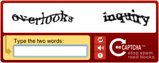

# Web Application Penetration Testing: Brute Force Attacks

This lab introduces users to brute force attacks and discusses techniques for discovering website passwords using tools such as **CeWL** and **Burp Suite**. 

Historically, usernames and passwords have been the most common way to login to websites used for everything from watching videos to managing medical history, financial affairs, and countless other aspects of our lives. Over the years, experts have discovered many weaknesses in this approach to securing access to private data. In this lab, you will use CeWL and Burp Suite to probe a website for vulnerabilities. We'll end the lab by exploring best practices and ways to harden websites against these attacks.

Please see the following CISA alerts referencing real-world events involving brute forcing passwords and password spraying attacks..

- <a href="https://www.cisa.gov/news-events/cybersecurity-advisories/aa24-290a" target="_blank">Iranian Cyber Actors' Brute Force and Credential Access Activity Compromises Critical Infrastructure Organizations</a>
- <a href="https://www.cisa.gov/news-events/alerts/2018/03/27/brute-force-attacks-conducted-cyber-actors" target="_blank">Brute Force Attacks Conducted by Cyber Actors</a>

| &#9201; LAB TIME                           |
| ------------------------------------------ |
| This lab is expected to take sixty (60) minutes. |

*Please consider filling out the lab feedback survey at the bottom of your screen. The survey is available to you at any time while conducting the lab.*

| &#9888; CAUTION                                              |
| ------------------------------------------------------------ |
| You must complete *all* phases of the lab to receive your completion certificate. |

## Learning Objectives

 - Understand brute force attacks and how they work.
 - Create custom word lists with CeWL.
 - Perform a brute force login attack on a website using Burp Suite.
 - Perform a password spraying attack on a website using Burp Suite.
 - Use Burp Suite to perform web parameter tampering and modify POST data.
 - Review best practices to mitigate brute force attacks.

## Learner Expectations

 - Learners should be comfortable with Linux, web browsers, and command-line operations.

## FOCAL and NICE Framework Mappings

This lab maps with <a href="https://www.cisa.gov/resources-tools/resources/federal-civilian-executive-branch-fceb-operational-cybersecurity-alignment-focal-plan" target="_blank">Federal Civilian Executive Branch (FCEB) Operational Cybersecurity Alignment (FOCAL)</a> area 3 (Defensible Architecture) by Enhancing ZT (Zero Trust) Capabilities Across the Federal Enterprise by implementing best practices such as MFA (Multi-Factor Authentication).

**NICE Work Roles**

- <a href="https://niccs.cisa.gov/workforce-development/nice-framework" target="_blank">Exploitation Analysis, Defensive Cybersecurity, Vulnerability Analysis</a>

**NICE Tasks**

- <a href="https://niccs.cisa.gov/workforce-development/nice-framework" target="_blank">T1118</a>: Identify vulnerabilities
- <a href="https://niccs.cisa.gov/workforce-development/nice-framework" target="_blank">T1359</a>: Perform penetration testing
- <a href="https://niccs.cisa.gov/workforce-development/nice-framework" target="_blank">T1563</a>: Implement system security measures
- <a href="https://niccs.cisa.gov/workforce-development/nice-framework" target="_blank">T1119</a>: Recommend vulnerability remediation strategies

<!-- cut -->

## Scenario

In this lab, you'll investigate common web authentication attacks. You'll start by creating a custom word list with CeWL and using Burp Suite to brute force a login. Then you'll explore password spraying and use Burp Suite to find vulnerable accounts. Finally, you'll perform web parameter tampering by modifying an HTTP POST request to gain admin access. The lab concludes with a discussion of best practices to defend against these attacks.

## System Tools and Credentials

| system | OS type/link |  username | password |
|--------|---------|-----------|----------|
| Kali | Kali Linux | user | tartans |

### What is CeWL? 

CeWL: *Custom Word List* generator. According to the <a href="https://github.com/digininja/CeWL" target="_blank">CeWL github page</a>, CeWL is a ruby app which crawls a given URL to a specified depth, optionally follows external links, and returns a list of words which can be used for password crackers such as John the Ripper.[1]

We will use CeWL to crawl the `http://market.skills.hub` lab website and create a word list that we will use with Burp Suite to brute force account passwords.

### What is Burp Suite? 

Burp Suite is a tool used for penetration testing and security assessment of web applications. Developed by PortSwigger Ltd, it is available in Community, Professional, and Enterprise editions. For this lab, we will use the free Community edition. Additional information can be found on the <a href="https://portswigger.net/burp" target="_blank">PortSwigger website.</a>

## Phase 1: Brute forcing passwords with Burp Suite

In this phase of the lab, you will gain authenticated access to the `http://market.skills.hub` website by creating a word list, then brute forcing the password for a known account using Burp Suite.

<details>
<summary>
<h3>What is a brute force password attack?</h3>
</summary>
<p>

A brute force attack tries many passwords until it finds the right one. This can include guessing numbers by starting at 0 and increasing one at a time or trying different combinations of letters and symbols. A *dictionary* attack is a type of brute force that uses a list of common passwords: things like names, pets, or favorite teams. Brute force attacks take time and resources, especially against strong passwords. The Kali machine in this lab has wordlists stored at <code>/usr/share/wordlists/</code>. For this lab, you'll use the custom wordlist you will create with CeWL.

Next, you'll use CeWL and Burp Suite to try and crack the password for `bcampbell@skills.hub`.

</p>
</details>

<details>
<summary>
<h3>Brute force password attack walk-through</h3>
</summary>
<p>

Start by creating a custom word list to use for the brute force password attack.

1. (**Kali**) Open the `Kali` console and login with the credentials: `user` | `tartans`.

2. (**Kali, Firefox**) Open Firefox and navigate to `http://market.skills.hub`. This lab **does not** use HTTPS. The web server has no SSL/TLS certificate, so all data between your browser and the server is sent in plain text. This setup is intentional.


3. (**Kali, Terminal**) Open a terminal window and run `cewl -h` to view all of the options. You will see the list of available options and arguments that can be used when crawling the website. Start by searching the site for email addresses and writing them to a file named `emails.txt`. In the terminal window, enter the following command:

```text
cewl -e --email_file /home/user/emails.txt http://market.skills.hub
```


4. (**Kali, Terminal**) Enter the following command to view the contents of the `emails.txt` file:

```text
cat /home/user/emails.txt
```


We are not using the `emails.txt` file in the first part of the lab. However, we were already using CeWL to scrape the website for useful information so this was a good time to gather email addresses to use in the password spraying attack later in the lab.

5. (**Kali, Terminal**) The next step is to use CeWL to save the words we scraped from the website to use as a potential password list. We use the `-m 8` option to limit the words added to the list to those that are *at least* eight characters in length. In the terminal, enter the following command:

```text
cewl -m 8 -w /home/user/wordlist.txt http://market.skills.hub
```


6. (**Kali, Terminal**) View the contents of  `wordlist.txt` file with this command:

```text
cat -n /home/user/wordlist.txt
```


Now that we have a custom password list, let's use it with Burp Suite to access the website. Remember: CeWL only scrapes visible content from `http://market.skills.hub`; it doesn't crack passwords or access the site's database. Using CeWL demonstrates another way to gather custom words and terminology to enhance existing word lists.

7. (**Kali, Burp Suite**) Open **Burp Suite**.


- If you see a message like the one below, click **OK**. You can ignore this warning.


- Accept the Terms and Conditions.


8. (**Kali, Burp Suite**) On the Welcome screen, select **Temporary project in memory** then click **Next**.


9. (**Kali, Burp Suite**) Select **Use Burp defaults** then click **Start Burp**.


- If you see a message like the one below, click **OK**. You can ignore this warning.


10. (**Kali, Burp Suite**) Select the **Proxy** tab.


11. Before you can intercept web traffic, you need a web browser configured to use Burp Suite as a proxy.

| &#129513; KEY POINT |
|---| 
| Burp Suite comes with its own browser, which is ready to use for a variety of manual and automated testing purposes. In this lab, we're using Firefox instead so you can learn how to set up a browser to work with Burp by changing the proxy settings. This helps you understand how Burp sees and changes web traffic. Later, you can use the built-in browser if you want something that's already set up and easier to use. |

### Configuring Firefox to work with Burp Suite

- (**Kali, Firefox**) In the upper right corner, click the **hamburger menu** (it's next to the puzzle piece).


 - Select **Settings**.
 - In the **Find in Settings** field, type `proxy`.
 - Click the **Settings** button.


 - In the **Connection Settings** box, select **Manual proxy configuration**.
 - Enter `127.0.0.1` in the **HTTP Proxy** field and `8080` in the **Port** field.
 - Click **OK**.


- Close the **Settings** tab.

12. (**Kali, Firefox**) In Firefox, navigate to `http://market.skills.hub`.

13. (**Kali, Burp Suite**) In Burp Suite, open the **Proxy** tab.

14. (**Kali, Burp Suite**) Select the **Intercept** sub tab.


15. (**Kali, Burp Suite**) If the **Intercept** button shows **Intercept is off**, click it. It should show as: **Intercept is on**.


16. (**Kali, Firefox**) In Firefox click the **Login** link on the Market website. Before being redirected to the Login page, you are instead taken to Burp Suite.


Here you see the `GET` request made by the browser as you navigated to the Login page. The request was captured by Burp Suite, but hasn't been delivered to the web server hosting the Market website.

17. (**Kali, Burp Suite**) Click **Forward** and return to Firefox. You're looking at the Login page.


The last few steps demonstrated how Burp Suite is behaving as a proxy between the client web browser and the Market website. All traffic traveling between them is captured and made visible to the user in Burp Suite.

18. (**Kali, Firefox**) Next, we capture the traffic generated during a login attempt. We will attempt to login with the `bcampbell@skills.hub` account. In the browser, navigate to the login page and try logging in with: username `bcampbell@skills.hub` and password `test`. Click the **Login** button.


19. (**Kali, Burp Suite**) In Burp Suite, find the `HTTP POST` that was captured during your login attempt.


20. (**Kali, Burp Suite**) Click the **Forward** button to send the login attempt to the server. The browser says INVALID PASSWORD.


21. (**Kali, Burp Suite**) In Burp Suite, under the **Proxy** tab, click **HTTP history**. Here you see your previous `HTTP GET` and `POST` requests. 


22. (**Kali, Burp Suite**) Right-click the `POST` request and select **Send to Intruder**, then select the **Intruder** tab.


23. (**Kali, Burp Suite**) Look at line 16 in the **Payload positions**. The line should look like this:

```text
email=bcampbell%40skills.hub&password=test&login=
```

Select and highlight the `test` value for the `password` form data, then click **Add** (right side of the screen). This will wrap the password value with delimiters that Burp Suite will use to replace the values when brute forcing the password. Line 16 should now look like this:

```text
email=bcampbell%40skills.hub&password=§test§&login=
```


24. (**Kali, Burp Suite**) The Positions tab is currently selected. Swap to the **Payloads** tab, then click **Load**. Select the `wordlist.txt` file you generated with CeWL from the `/home/user/` directory, then click **Open**.


25. (**Kali, Burp Suite**) Click the **Start Attack** button (top-right corner).


26. (**Kali, Burp Suite**) If you are greeted with this dialog box, click **OK** to continue.


You can now watch the progress of the brute force attack. The bottom of the screen shows the number of attempts out of the total number of words from the `wordlist.txt` file. Remember, the Community Edition of Burp Suite is time throttled so a short word list can take a significant amount of time to complete a brute force attack.


As you observe the results of the login attempts, note the various values for fields like **Status code** and **Length**. Scrolling through the results you see mostly 200 values for the Status Codes and roughly 1505 for the Length. However, where you see Status Code 302, which indicates a temporary redirect, and a length of 395. This could indicate that a user was logged in and redirected to a different page on the website.


27. (**Kali, Burp Suite, Firefox**) Note the value for the Payload field of this attempt. The value is `operating`. In the web browser, enter: **Email:** `bcampbell@skills.hub` and **Password:** `operating`. Click **Login**.


28. (**Kali, Burp Suite**) In Burp Suite, look at the **Intercept** sub tab under the **Proxy** tab. Click **Forward** twice then return to your web browser. You should be logged into the Market website and the token for completing the first part of the lab is displayed.


(**Kali, Firefox**) Success! You can see the token you've been rewarded with for discovering the password for the `bcampbell` account. Your token will be different from the one below because tokens are randomly generated for each lab.

```text
BCAMPBELL PASSWORD CRACKED TOKEN = B7D1BDD4
```

29. (**Kali, Burp Suite, Firefox**) Logout of the website and remember to click **Forward** in the **Intercept** tab to return to the `http://market.skills.hub` home page. You may close and discard the additional **Intruder** window that displays the results of the payload attack results.

**Knowledge Check Question 1**: *Which command line option is used with CeWL to scrape email addresses from a website?*

**Knowledge Check Question 2**: *What is the name of the feature in Burp Suite that is used to capture a web browser's interaction with a server?*

**Knowledge Check Question 3**: *What is the name of the feature in Burp Suite that we used to send the same HTTP request multiple times with different payloads (In this case, the payload is the admin's password)?*

Due to the time constraints required to run an exhaustive brute force password attack, this topic will not be covered in this lab. Additional information about using Burp Suite with brute force password attacks can be found <a href="https://portswigger.net/burp/documentation/desktop/testing-workflow/authentication-mechanisms/brute-forcing-passwords" target="_blank">here</a>.

#### Grading Check

**Grading Check 1**: *What is the token that is displayed on the website after logging in as `bcampbell@skills.hub`?*

Copy and submit the token or flag strings in the corresponding question submission field to receive credit.

In the next section, we will discuss password spraying attacks.

</p>
</details>

<details>
<summary>
<h3>What is a password spraying attack?</h3>
</summary>
<p>

This <a href="https://www.cisa.gov/news-events/alerts/2018/03/27/brute-force-attacks-conducted-cyber-actors" target="_blank">CISA alert</a> offers the following explanation: 

"In a traditional brute-force attack, a malicious actor attempts to gain unauthorized access to a single account by guessing the password. This can quickly result in a targeted account getting locked-out, as commonly used account-lockout policies allow three to five bad attempts during a set period of time. During a password-spray attack (also known as the “low-and-slow” method), the malicious actor attempts a single password against many accounts before moving on to attempt a second password, and so on. This technique allows the actor to remain undetected by avoiding rapid or frequent account lockouts.

Password spray campaigns typically target single sign-on (SSO) and cloud-based applications utilizing federated authentication protocols. An actor may target this specific protocol because federated authentication can help mask malicious traffic. Additionally, by targeting SSO applications, malicious actors hope to maximize access to intellectual property during a successful compromise." `[2]`

In the next section, you will use Burp Suite to perform a password spraying attack.

</p>
</details>

<details>
<summary>
<h3>Password spraying attack walk-through</h3>
</summary>
<p>

*Note: Steps 1-5 rehash the process taken in the previous section of the lab. If you still have Burp open at the Proxy tab, Intercept is turned on, and have the `http://market.skills.hub` home page open, you can skip to step 6*

1. (**Kali**) Open the `Kali` console and login with these credentials: `user` | `tartans`.

2. (**Kali, Firefox**) Open Firefox and navigate to: `http://market.skills.hub`.

3. (**Kali, Burp Suite**) Open **Burp Suite**. See the procedures above if you have questions about configuring your web browser for use with Burp Suite as a proxy.

4. (**Kali, Burp Suite**) Select the **Proxy** tab, then select the **Intercept** sub tab.


5. (**Kali, Burp Suite**) If the **Intercept** button shows **Intercept is off**, click it. It should show as **Intercept is on**.


6. (**Kali, Firefox**) In your browser, click the **Login** link on the Market website. Before being redirected to the login page, you are taken to Burp Suite.


7. (**Kali, Burp Suite**) Notice the `GET` request made by the browser as you navigated to the login page. The request was captured by Burp Suite, but hasn't been delivered to the web server hosting the Market website.

8. (**Kali, Burp Suite**) Click the **Forward** button in Burp Suite then return to Firefox. You are looking at the login page.


The last few steps demonstrated how Burp Suite is behaving as a proxy between the client web browser and the Market website. All traffic traveling between them is captured and made visible to the user in Burp Suite.

9. (**Kali, Firefox**) Next, you'll capture the traffic generated during a login attempt. We will try to login with the `bcampbell@skills.hub` account. In the browser, navigate to the login page and try logging in with username: `bcampbell@skills.hub` and password: `test`. Click the **Login** button.

10. (**Kali, Burp Suite**) In Burp Suite, find the `HTTP POST` that was captured during your login attempt.


11. (**Kali, Burp Suite**) Right-click anywhere in the text of the `POST` body and select **Send to Intruder**.


12. (**Kali, Burp Suite**) Click the **Intruder** tab.


13. (**Kali, Burp Suite**) On line 16 of the `POST` body, highlight the value of email address and click **Add** to wrap the value in delimeters. For the purposes of this lab, we will use the password `delicious`. Change the value of the `password` field on line 16 from `test` to `delicious`.


Line 16 should now look like this:

```text
email=§bcampbell%40skills.hub§&password=delicious&login=
```

14. (**Kali, Burp Suite**) Select the**Payloads** tab.


15. (**Kali, Burp Suite**) Click **Load** and select the `/home/user/emails.txt` file we generated with CeWL in the first phase of the lab, then click **Open**.


In this password spraying attack, we modified our procedure from the original brute force password attack to use a single password against a list of known logins.

16. (**Kali, Burp Suite**) Click the **Start Attack** button (right side of the screen).


17. (**Kali, Burp Suite**) Click **OK** on the dialog box that appears to inform you about the Community Edition of Burp Suite.

18. (**Kali, Burp Suite**) Analyze the results of the password spraying attack. Notice three results with a Status code of 302. Take note of the number of results with a 302 Status code because this is the answer to the question if you can confirm your results below.


19. (**Kali, Burp Suite**) To confirm our results, copy the email from a result with Status code 302, e.g., `bsudo@mushmarket%2ecom`. Replace `%2e` with a period (`.`) so it becomes `bsudo@mushmarket.com`, or the login won't work.

20. (**Kali, Burp Suite**) In Burp Suite, click the **Proxy** tab and make sure to turn off the **Intercept** feature. 


21. (**Kali, Firefox**) Browse to `http://market.skills.hub` and click the LOGIN link. Enter these credentials: **Email:** `bsudo@mushmarket.com` and **Password:** `delicious`. Click **Login**.

22. (**Kali, Firefox**) Welcome to the Mushroom Market! The login should succeed, confirming that the three results with Status code 302 were valid. This will be the answer for the grading check. It shows that three accounts used the same weak password, demonstrating how effective password spraying can be for finding valid logins.

23. (**Kali, Burp Suite, Firefox**) Logout of the website and remember to click **Forward** in the **Intercept** tab to return to the `http://market.skills.hub` home page. You may close and discard the additional **Intruder** window that displays the results of the payload attack results.

#### Grading Check

**Grading Check 2**: *How many accounts were found to be vulnerable to the password spraying attack when using the password 'delicious'?*

Copy and submit the token or flag strings in the corresponding question submission field to receive credit.

In the next section, we will discuss web parameter tampering.

</p>
</details>

<br />

## Phase 2: Web parameter tampering with Burp Suite

In this phase of the lab, you will create a new user with admin rights on the `http://market.skills.hub` website by tampering with web parameters.

<details>
<summary>
<h3>What is web parameter tampering?</h3>
</summary>
<p>

The OWASP Foundation describes a web parameter tampering attack in this way:  

The Web Parameter Tampering attack is based on the manipulation of parameters exchanged between client and server to modify application data, such as user credentials and permissions, price and quantity of products, etc. Usually, this information is stored in cookies, hidden form fields, or URL Query Strings, and is used to increase application functionality and control.

This attack can be performed by a malicious user who wants to exploit the application for their own benefit, or an attacker who wishes to attack a third person using a Man-in-the-middle attack. In both cases, tools likes Webscarab and Paros proxy are mostly used.

The attack success depends on integrity and logic validation mechanism errors, and its exploitation can result in other consequences including XSS, SQL Injection, file inclusion, and path disclosure attacks.`[3]`

In the next part of this lab, we will perform a web parameter tampering attack using Burp Suite’s Repeater to change a value in the query string and register a new user account with admin permissions.

</p>
</details>

<details>
<summary>
<h3>Web parameter tampering attack walk-through</h3>
</summary>
<p>

We will use Burp Suite Proxy and Intruder to capture the user registration process and change the <code>is_admin</code> parameter in the query string to true. This will create a new user account with administrative permissions on the <code>http://market.skills.hub</code> website.

If needed, follow the steps from the *Configuring Firefox to work with Burp Suite* section above to set up Firefox to route traffic through Burp Suite as a proxy, so you can capture and modify HTTP requests.

1. (**Kali, Burp Suite**) Make sure Burp Suite is running and that **Intercept is on** under the **Proxy** tab.

2. (**Kali, Firefox**) Open Firefox (if not already open) and browse to `http://market.skills.hub`. In Burp Suite, click **Forward** to let the `GET` request pass through.

3. (**Kali, Firefox, Burp Suite**) In Firefox, click the **REGISTER** link at the top of the page. Then click the **Forward** button again in Burp Suite.


4. (**Kali, Burp Suite**) In Firefox, complete the registration form:

```text
Username: jdoe
Password: password123
Email: jdoe@skills.hub
```


5. (**Kali, Firefox, Burp Suite**) Click the **Register** button. Then click the **Forward** button in Burp Suite to complete the `HTTP POST` request.


6. (**Kali, Firefox**) In Firefox, you should see a page confirming that the account registration was successful.


7. (**Kali, Burp Suite**) In Burp Suite, go to the **HTTP history** tab and find the `POST` request to `/register.php`. You’ll see that the request is posting to `/register.php?is_admin=0`.


8. It looks like the developers are passing a flag for admin permissions in the query string of the `POST` request. Let’s try tampering with that value to see what happens..

9. (**Kali, Burp Suite**) Right-click the `POST` request used to register the `jdoe` account and select **Send to Repeater**.


10. (**Kali, Burp Suite**) Click the **Repeater** tab at the top of the Burp Suite screen.


11. (**Kali, Burp Suite**) We are going to modify lines 1 and 16 of the captured request.


12. (**Kali, Burp Suite**) Change the `0` in the `is_admin` query string value on line 1 to a `1`. Before the change, line 1 should look like this:

```text
POST /register.php?is_admin=0 HTTP/1.1
```

After the change, line 1 should look like this:

```text
POST /register.php?is_admin=1 HTTP/1.1
```

13. (**Kali, Burp Suite**) We can’t use the same info to create a new account, so we need to change the `username` and `email` fields in the `POST` form data. Before making changes, line 16 should look like this:

```text
username=jdoe&password=password123&email=jdoe%40skills.hub&register=
```

14. (**Kali, Burp Suite**) Change the `username` to `jdoe2` and the `email` to `jdoe2@skills.hub`. Line 16 should now look like this:

```text
username=jdoe2&password=password123&email=jdoe2%40skills.hub&register=
```


15. (**Kali, Burp Suite**) Click the **Send** button to submit the modified `POST` request to the web server.


You should see the response appear in Burp Suite to the right of the request you just sent. Line 1 of the response should show a success with an `HTTP` status code of 200.

```text
HTTP/1.1 200 OK
```


16. Scroll to the bottom of the response. You’ll see HTML text confirming that the account registration was successful.

```text
<div class='alert alert-success'>Registration successful!</div>
```


17. (**Kali, Firefox**) Go back to Firefox and click the **LOGIN** link.

18. (**Kali, Burp Suite**) Return to Burp Suite and click the **Proxy** tab at the top of the page. Then click the **Intercept** sub-tab. Click the **Intercept is on** button to turn off traffic interception.


19. (**Kali, Firefox**) Go back to Firefox and then go to the **LOGIN** page (remember to forward as necessary on the **Proxy**->**Intruder** tab).

20. (**Kali, Firefox**) Enter the credentials used to create the `jdoe2` account:

```text
Email: jdoe2@skill.hub
Password: password123
```

21. (**Kali, Firefox**) Click the **Login** button (again forward the requests as needed in the **Proxy**->**Intruder** popup).

22. (**Kali, Firefox**) 🎉 Success! After logging in, you’ll see a message confirming your new administrator account. By changing the query string value to 1 when creating the account, you successfully elevated your privileges to administrator level.


**Knowledge Check Question 4**: *Which Burp Suite feature can we use to send the modified user registration POST when performing the web parameter tampering attack?*

#### Grading Check

**Grading Check 3**: *What is the token that is displayed on the website after registering an administrator account and logging in with that new account?*

Copy and submit the token or flag strings in the corresponding question submission field to receive credit.

</p>
</details>

## Phase 3: Mitigation Techniques

<details>
<summary>
<h3>Mitigation Techniques</h3>
</summary>
<p>

This lab covered several ways to bypass traditional username/password authentication. In Phase 3 of the lab, however, you will learn about seven proven ways to help prevent brute force, password spraying, and parameter tampering attacks. They are:

1. [Strong Passwords](#strong-passwords)
2. [Multifactor Authentication](#multifactor-authentication)
3. [Rate Limiting](rate-limiting)
4. [Password Lockout Policies](password-lockout-policies)
5. [CAPTCHAS](captchas)
6. [Account Monitoring](#account-monitoring)
7. [Check for Compromised Credentials](#check-for-compromised-credentials)

#### Strong Passwords

<a href="https://www.cisa.gov/secure-our-world/use-strong-passwords" target="_blank">CISA provides three simple tips</a> you can use to generate strong passwords `[4]`.

##### Tip #1: Make them long
At least 16 characters--longer is stronger!

##### Tip #2: Make them random

Two ways to do this are:

Use a random string of mixed-case letters, numbers and symbols. For example:

- `cXmnZK65rf*&DaaD`
- `Yuc8$RikA34%ZoPPao98t`

Another option is to create a memorable phrase of 4 - 7 unrelated words. This is called a "passphrase." For example:

- Good: `HorsePurpleHatRun`
- Great: `HorsePurpleHatRunBay`
- Amazing: `Horse Purple Hat Run Bay Lifting`

*You can use spaces before or between words if you prefer!*

##### Tip #3: Make them unique 

Use a different strong password for each account.

For example:

- Bank: `k8dfh8c@Pfv0gB2`
- Email account: `legal tiny facility freehand probable enamel`
- Social media account: `e246gs%mFs#3tv6`

You can find additional guidance for creating strong passwords here: <a href="https://www.cisa.gov/resources-tools/training/formulate-strong-passwords-and-pin-codes" target="_blank">Formulate Strong Passwords and PIN Codes</a>.

This poster from Hive Systems shows how long it would take to brute force passwords of various lengths and complexities.


#### Multifactor Authentication

Multifactor authentication (MFA or 2FA) is a method where users must provide two or more forms of verification. For example, instead of just entering a username and password, a user might receive a PIN via text or email to enter during login.

On their [MFA page](https://www.cisa.gov/MFA), CISA describes MFA like this:

MFA is a layered approach to securing your online accounts and the data they contain. When you enable MFA in your online services (like email), you must provide a combination of two or more authenticators to verify your identity before the service grants you access. Using MFA protects your account more than just using a username and password.

Users who enable MFA are significantly less likely to get hacked. Why? Because even if a malicious cyber actor compromises one factor (like your password), they will be unable to meet the second authentication requirement, which ultimately stops them from gaining access to your accounts.

Online services want to make sure you are who you say you are, and--more importantly--they want to prevent unauthorized individuals from accessing your account and data. So, they are taking a step to double check. Instead of asking you just for something you know (e.g., a password)--which can be reused, more easily cracked, or stolen--they can verify it's you by asking for another piece of information:

They'll ask for: 

- **Something you know**, like a PIN number or a password.
- **Something you have**, like an authentication application or a confirmation text on your phone.
- **Something you are**, like a fingerprint or face scan. `[5]`

Learn more about [MFA on the CISA web site](https://www.cisa.gov/MFA).

#### Rate Limiting

Rate limiting helps slow down brute force attacks by controlling how often login attempts can be made. It is usually implemented on the server side or a network device that handles the requests. Some examples of rate limiting include:

- Introducing a small constant or random amount of time before another login attempt is allowed.
- Dropping requests from IP addresses that send too many requests.

#### Password Lockout Policies

Password lockout policies are designed to prevent brute force attacks by locking an account after a set number of wrong password attempts. After that, even the correct password won’t work. While this can stop attackers, it might also prevent legitimate users from logging in. However, malicious users could also use this method to lock many accounts on purpose, creating a denial of service (DoS) attack. This is where CAPTCHAs may help by blocking automated login attempts.

#### CAPTCHAS

According to `www.captcha.net`, a CAPTCHA is:

...a program that protects websites against bots by generating and grading tests that humans can pass but current computer programs cannot. For example, humans can read distorted text as the one shown below, but current computer programs can't:



The term CAPTCHA (for Completely Automated Public Turing Test To Tell Computers and Humans Apart) was coined in 2000 by Luis von Ahn, Manuel Blum, Nicholas Hopper and John Langford of Carnegie Mellon University. `[13]`

#### Account Monitoring

System administrators should have policies to regularly identify and manage inactive accounts. Unused accounts should be locked, deactivated, or removed to reduce security risks. These policies can be implemented using automated tools that scan for unused accounts or by regularly scheduled manual reviews.

#### Check for Compromised Credentials

**Have I Been Pwned** (`haveibeenpwned.com`) is a website where you check if your email address is part of known data breaches. HIBP indicates whether additional information, such as passwords, were disclosed in those data breaches.

See: <a href="https://haveibeenpwned.com/" target="_blank">have i been pwned?</a>

And finally, additional information about preventing brute force attacks can be found on the <a href="https://owasp.org/www-community/controls/Blocking_Brute_Force_Attacks" target="_blank">OWASP Foundation's website</a>.

**Knowledge Check Question 5**: *What is the acronym for the security method that requires users to verify their identity using multiple authentication factors?*

**Knowledge Check Question 6**: *True or false, the following three pieces of information are common identifiers in multifactor authentication: Something you know, Something you don't have, Something you are.*

</p>
</details>

<details>
<summary>
<h3>Lab Wrap-up</h3>
</summary>
<p>

### Conclusion

This lab provided hands-on experience with common web authentication attacks and their defenses. You practiced brute forcing and password spraying using Burp Suite, and performed web parameter tampering to escalate privileges. These exercises reinforced how attackers exploit weak authentication and how proper mitigation techniques can reduce risk. 

During this lab, you:

- Learned about brute forcing passwords, password spraying, and web parameter tampering.
- Used Burp Suite to exploit the website using those attack methods.
- Learned about mitigation techniques you can use to protect websites from those attack methods.

Skills exercised:

- S0248: Skill in performing target system analysis
- S0440: Skill in identifying target vulnerabilities
- S0504: Skill in identifying vulnerabilities
- S0667: Skill in assessing security controls
- S0544: Skill in recognizing vulnerabilities

### Answer Key

**Knowledge Check Question 1**: Which command line option is used with CeWL to scrape email addresses from a website?

 - *-e* or *--email*

**Knowledge Check Question 2**: What is the name of the feature in Burp Suite that is used to capture a web browser's interaction with a server?

 - *Proxy*

**Knowledge Check Question 3**: What is the name of the feature in Burp Suite that we used to send the same HTTP request multiple times with different payloads (In this case, the payload is the admin's password)?
 - *Intruder*

**Knowledge Check Question 3**: What payload type must be selected in Burp Suite Intruder to perform a true brute force attack?

 - *Brute forcer*

**Knowledge Check Question 4**: Which Burp Suite feature can we use to send the modified user registration POST when performing the web parameter tampering attack?
 - *Repeater*

**Knowledge Check Question 5**: What is the acronym for the security method that requires users to verify their identity using multiple authentication factors?

 - *MFA*

**Knowledge Check Question 6**: True or false, the following three pieces of information are common identifiers in multifactor authentication: Something you know, Something you don't have, Something you are.
 - *False*

### References

- [1] <a href="https://github.com/digininja/CeWL" target="_blank">CeWL</a>

- [2] <a href="https://www.cisa.gov/news-events/alerts/2018/03/27/brute-force-attacks-conducted-cyber-actors" target="_blank">CISA Alert: Brute Force Attacks Conducted by Cyber Actors</a>

- [3] <a href="https://owasp.org/www-community/attacks/Web_Parameter_Tampering" target="_blank">OWASP: Web Parameter Tampering</a>

- [4] <a href="https://www.cisa.gov/secure-our-world/use-strong-passwords" target="_blank">An Easy Way to Protect Your Accounts</a>

- [5] <a href="https://www.cisa.gov/MFA" target="_blank">MFA on the CISA website</a>

- [6] <a href="https://www.cisa.gov/news-events/cybersecurity-advisories/aa24-290a" target="_blank">CISA Advisory: Iranian Cyber Actors’ Brute Force and Credential Access Activity Compromises Critical Infrastructure Organizations</a>

- [7] <a href="https://www.cisa.gov/news-events/alerts/2018/03/27/brute-force-attacks-conducted-cyber-actors" target="_blank">CISA Alert: Brute Force Attacks Conducted by Cyber Actors</a>

- [8] <a href="https://portswigger.net/burp" target="_blank">Burp Suite from PortSwigger</a>

- [9] <a href="https://www.cisa.gov/news-events/alerts/2024/10/16/cisa-fbi-nsa-and-international-partners-release-advisory-iranian-cyber-actors-targeting-critical" target="_blank">CISA Alert: CISA, FBI, NSA, and International Partners Release Advisory on Iranian Cyber Actors Targeting Critical Infrastructure Organizations Using Brute Force</a>

- [10] <a href="https://www.cisa.gov/news-events/alerts/2019/08/08/acsc-releases-advisory-password-spraying-attacks" target="_blank">ACSC Releases Advisory on Password Spraying Attacks</a>

- [11] <a href="https://portswigger.net/burp/documentation/desktop/testing-workflow/authentication-mechanisms/brute-forcing-passwords" target="_blank">Brute-forcing passwords with Burp Suite</a>

- [12] <a href="https://www.cisa.gov/MFA" target="_blank">CISA MFA</a>

- [13] <a href="http://www.captcha.net/" target="_blank">CAPTCHA website</a>

- [14] <a href="https://www.cisa.gov/resources-tools/resources/federal-civilian-executive-branch-fceb-operational-cybersecurity-alignment-focal-plan" target="_blank">Federal Civilian Executive Branch (FCEB) Operational Cybersecurity Alignment (FOCAL)</a>

- [15] <a href="https://niccs.cisa.gov/workforce-development/nice-framework" target="_blank">NICE Framework</a>

- [16] <a href="https://www.hivesystems.com/blog/are-your-passwords-in-the-green" target="_blank">Are Your Passwords in the Green?</a>

- [17] <a href="https://haveibeenpwned.com/" target="_blank">have i been pwned?</a>

</p>
</details>
