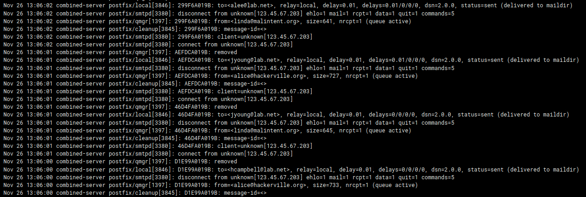
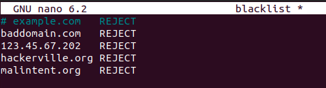
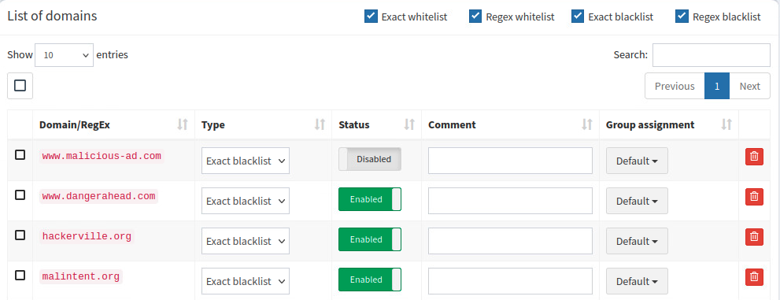
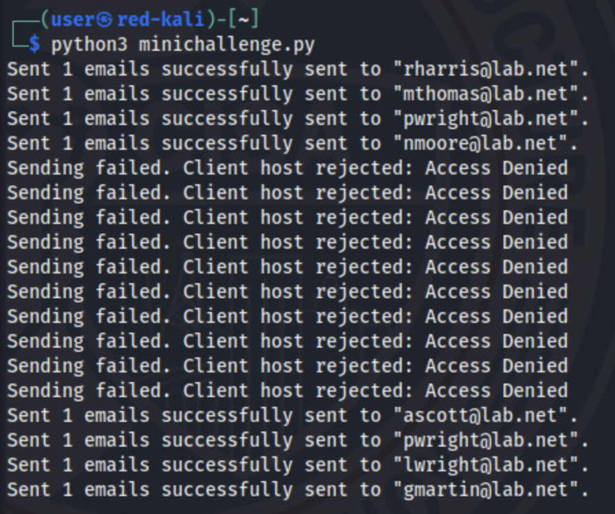
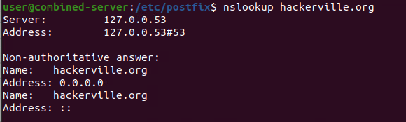

# Enhanced Security with DNS and Domain Name-based Solutions

## Mini-challenge Solution

### Review the mail logs in webmin

1. Open the console for the `Ubuntu-Desktop` and then open the Terminal.

2. (**Ubuntu-Desktop, Firefox, New Tab**) Browse to the WebMin webGUI at `http://10.3.3.11:10000`. Ignore and click through any certificate warnings. Use the username `user` and the password `tartans`.

3. (**Ubuntu-Desktop, Firefox, WebMin Landing Page**) Expand the `System` heading from the left side menu and click on `System Logs`.

4. (**Ubuntu-Desktop, Firefox, WebMin System Logs Page**) Filter for only the mail.log file by selecting it from the dropdown and change the last log count to 100 to be able to view more lines of the log file.

5. (**Ubuntu-Desktop, Firefox, WebMin System Logs Page**) Review the mail logs for evidence of senders from malicious seeming domains sending multiple emails to multiple users within your organization.



You should see two malicious sounding sender addresses that are sending messages to 5 different users in your organization. Note that these addresses and domains are dynamically generated for each lab instance. Your sender addresses will differ from the screenshot shown above.

Record the domains for these senders, i.e. just the part after the @ symbol in the sender address.

### Add the malicious domains to the postfix blacklist

1. (**Ubuntu-Desktop, Terminal**) Connect to the Mail Server via Secure Shell (SSH), type and enter "Yes" if asked if you are sure you want to connect, and use the password `tartans` when asked:

```
ssh user@10.3.3.11
```

2. (**Ubuntu-Desktop, Terminal, SSH Session to Combined-Server**) Change directories to the postfix directory with `cd /etc/postfix`.

3. (**Ubuntu-Desktop, Terminal, SSH Session to Combined-Server**) Open the blacklist file for editing with the following command, using the password of `tartans` if prompted.

```
sudo nano /etc/postfix/blacklist
```

4. (**Ubuntu-Desktop, Terminal, SSH Session to Combined-Server**) Add the domains of the malicious senders found in the mail logs. Use the structure already provided in the file and enter each item on its own line. Remember that your domains may differ.



5. (**Ubuntu-Desktop, Terminal, SSH Session to Combined-Server**) Press `CTRL+X` to save, type and enter `Y` to confirm, and then press `Enter` to confirm the same filename.

6. (**Ubuntu-Desktop, Terminal, SSH Session to Combined-Server**) Enter the following command to process your blacklist file, where `hash` is the selected conversion type and `blacklist` is the name of the file to process.

```
sudo postmap hash:blacklist
```

### Add the malicious domains to the the pi-hole blacklisted domains

1. (**Ubuntu-Desktop**) Open Firefox and browse to the Pi-hole administration webGUI at `http://10.3.3.10/admin`

2. (**Ubuntu-Desktop, Firefox**) Login with the password `tartans` at the Pi-hole login prompt. You do not need to specify a username.

3. (**Ubuntu-Desktop, Firefox, Pi-hole Admin Page**) Click on the Domains tab from the left-side menu.

4. (**Ubuntu-Desktop, Firefox, Pi-hole Admin Page**) Here, you can add the malicious domains that you identified in the mail logs and ensure that the blocking is enabled. Remember that your domains may differ.



### Verify your work before grading (optional)

1. (**Red-Kali, Terminal**) On Red-Kali, you can rerun the mail script and see if the emails from the malicious senders are indeed blocked.



2. (**Ubuntu-Desktop, Terminal**) You could perform nslookups of the malicious domains identified in the mail logs once they are blocked. If blocked, Pi-hole should respond with an IP address of 0.0.0.0 for these domain addresses.


