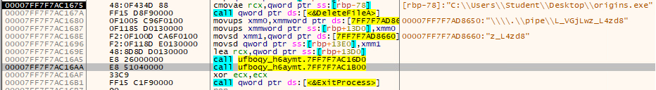
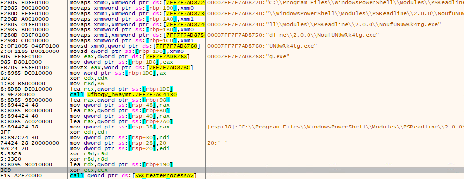
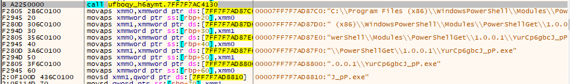

# Detect Connect

## Solution

Unlike the other reverse engineering challenges, this one will have a partial walkthrough in attempt to clarify what is
happening between the executables. The original version of this challenge pointed to several files that were already
scattered across the VM's filesystem from deployment, and this solution guide will cover the most relevant findings as
if you were working on the original VM.

The following executables were given scrambled names for the challenge and are provided here with their real names:

`encrypter.exe` is `NoufUNUwRk4tg.exe`

`evil_messenger.exe` is `YurCp6gbcJ_pP.exe`

### `origins.exe`

Start by opening the executable in IDA and checking the strings view. There are several important ones:

1. Directories
    - `C:\Windows\Registration\CRMLog\`
    - `C:\Windows\Microsoft.NET\Framework64\v4.0.30319\`
    - `C:\Program Files (x86)\Windows NT\Accessories\`
    - `C:\Program Files\Internet Explorer\`
2. Executables
    - `uFBOQY_h6aYMT.exe`
3. Pipes
    - `\\\\.\\pipe\\Uj3cVpHeW1_I_1`

If you step through `origins.exe` in your debugger, you will see that it copies itself into the file `uFBOQY_h6aYMT.exe`
and then moves the copy into one of the listed directories, chosen at random.

#### `uFBOQY_h6aYMT.exe`

Stepping through in a debugger, you will eventually see that the Windows API function `DeleteFileA` is called on
`origins.exe`, and following that call is the pipe name `\\\\.\\pipe\\L_VGjLwz_L4zd8` being passed to another function.

Following execution into the function the pipe name is passed into, there is a path to another executable file,
`NoufUNUwRk4tg.exe`, and this path is being passed to `CreateProcessA`.

Continuing on this path, we can see that it later launches `YurCp6gbcJ_pP.exe` as well.

#### `NoufUNUwRk4tg.exe`

This is also known as `encrypter.exe` in this solution.

This executable interacts with both other executables via pipes. In the strings view, we can find the following strings:

1. Pipes
    - `\\\\.\\pipe\\L_VGjLwz_L4zd8`
    - `\\\\.\\pipe\\aBMX38osA40M1W_FNZz0k`
    - `\\\\.\\pipe\\Uj3cVpHeW1_I_1`
    - `\\\\.\\pipe\\vfoPwk__OjY3XkC`
2. Text Documents
    - `C:\Users\Public\Downloads\JKQc8pNUAS.txt`
    - `C:\Windows\System32\WindowsPowerShell\v1.0\psmemchange.txt`

At this point, you could allow the executable to continue executing and monitor the two directories of the files above.
Doing so, you would find the `JKQc8pNUAS.txt` file in the Public user's Downloads directory. The contents are an
encoded string. This string is in base64, and contains a directory path and a password.

If you were to navigate to the given directory, there was an encrypted zip file on the system. If you entered the given
password, you would find the flag.

#### `YurCp6gbcJ_pP.exe`

Finally, we get to `evil_messenger.exe`. Analyzing this executable was not required, but it did provide an extra hint if
it was missed in the previous executable.

String analysis showed several of the same strings from the previous executable:

The PDFs were chaff with no real significance to the challenge.

The embedded "WRITE FROM WHERE" string was intended to be a hint leading to the function that communicates over IPC:

This function sends the message over a named pipe to one of the other executables.

Looking further, there is a call to the `MoveFileExA()` function. Breaking on this function will reveal that the file
names being passed are those seen above in the strings analysis. One of which is the text file mentioned in the previous
section.

## `JKQc8pNUAS.txt`

The contents of this file are contained in the `buffer_reveal()` function in `encryptdecrypt.h`:

`QzpcXFdpbmRvd3NcXFN5c3RlbUFwcHNcXE1pY3Jvc29mdC5XaW5kb3dzLkNsb3VkRXhwZXJpZW5jZUhvc3RfY3c1bjFoMnR4eWV3eVxcbGliXFxwYXNzd29yZDp1YUc9akRFbWpxaXd2dnZpUElyQkozMTlLeGBhTzZCRChzMmtMZD1uJllYb052JVQ=`

## License
Copyright 2020 Carnegie Mellon University. See the [LICENSE.md](../../../LICENSE.md) file for details.