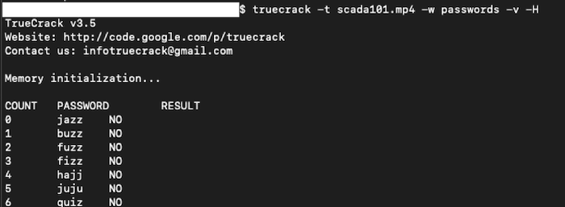
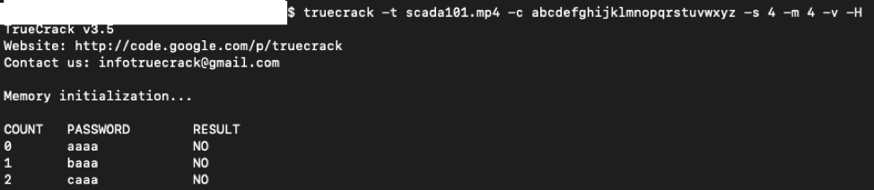
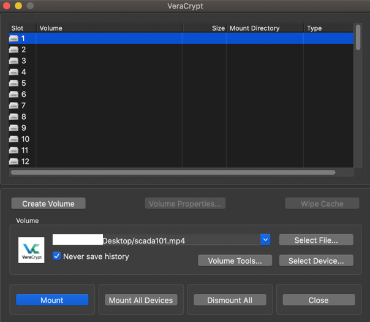
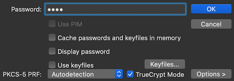

# Tomatormeter Rotten

## Solution

According to the intel report, there is encrypted data in one of the files, and that the threat actor likes to store data in the form of containers. What are some of the standard encryption software – TrueCrypt, VeraCrypt, BitLocker, DiskCryptor, etc.

Since we do not know which software may have been used, let’s start with TrueCrypt, and let’s verify if that is the case.

A total of four pictures, three videos, and a password file are available for analysis. It looks like that the `passwords` file might contain a password for the TrueCrypt container.

 You will need to go through each file until you find the one that contains the encrypted data. For the sake of time, the `scada101.mp4` file contains encrypted data.

The first step is to crack the password for the TrueCrypt container. We may use the `TrueCrack` application and run a dictionary attack using the `passwords` file against the file (`scada101.mp4`) containing encrypted data.

You’ll notice that the dictionary attack will fail. That means the password is not present in the `passwords` file. But viewing the password file, we may guess that the password might be four letters long, lower case alphabets only. Using this information, let’s try to brute force the password.

Although it may say “No password found”, but if you look closely at the output, you’ll notice that it does find the password. The password is `nuke`. It also confirms that it is indeed a TrueCrypt container.

The next step is to mount the TrueCrypt container. For this, we may use the `VeraCrypt` application.

Select the `scada101.mp4` file, and click Mount.

Enter the password `nuke` and select `TrueCrypt Mode`. Click OK.

Open the mounted volume, and view the file within it to get the flag.

  

Flag - `40°37'55"N 80°24'50"W`

## License
Copyright 2020 Carnegie Mellon University. See the [LICENSE.md](../../../LICENSE.md) file for details.